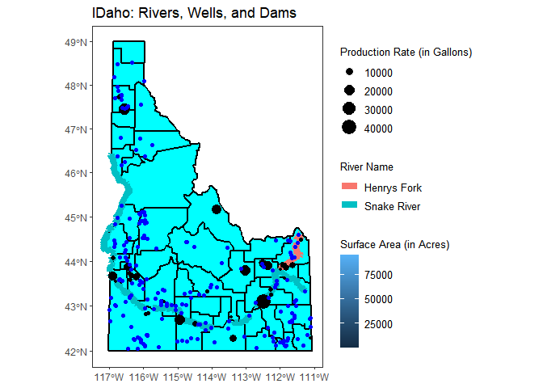

```r
r2<-st_read("C:/Users/exoni/Downloads/Wells-shp")
```

```
## Reading layer `Wells' from data source `C:\Users\exoni\Downloads\Wells-shp' using driver `ESRI Shapefile'
## Simple feature collection with 183069 features and 33 fields
## geometry type:  POINT
## dimension:      XY
## bbox:           xmin: 2234816 ymin: 1093702 xmax: 2743837 ymax: 1980550
## projected CRS:  NAD83 / Idaho Transverse Mercator
```


```r
k<-st_read("C:/Users/exoni/Downloads/Dams_of_Idaho-shp/Dams_of_Idaho.shp")
```

```
## Reading layer `Dams_of_Idaho' from data source `C:\Users\exoni\Downloads\Dams_of_Idaho-shp\Dams_of_Idaho.shp' using driver `ESRI Shapefile'
## Simple feature collection with 1164 features and 23 fields
## geometry type:  POINT
## dimension:      XY
## bbox:           xmin: 2253246 ymin: 1202396 xmax: 2740147 ymax: 1975125
## projected CRS:  NAD83 / Idaho Transverse Mercator
```

```r
k1 <-subset(k,SurfaceAre>50)
```

```r
"C:/Users/exoni/Downloads/hyd250"
```

```
## [1] "C:/Users/exoni/Downloads/hyd250"
```

```r
download.file("https://research.idwr.idaho.gov/gis/Spatial/Hydrography/streams_lakes/c_250k/hyd250.zip", 
              destfile = "water.zip" , mode='wb')
unzip("water.zip", exdir = ".")
r5<-st_read("./hyd250.shp" )
```

```
## Reading layer `hyd250' from data source `C:\Users\exoni\OneDrive\Desktop\M335_SP20_Niyonkuru_Exod\Case_Study_11\Class_Task_22\hyd250.shp' using driver `ESRI Shapefile'
## Simple feature collection with 30050 features and 26 fields
## geometry type:  LINESTRING
## dimension:      XY
## bbox:           xmin: 2241685 ymin: 1198722 xmax: 2743850 ymax: 1981814
## projected CRS:  NAD83 / Idaho Transverse Mercator
```


```r
ID_counties <- USAboundaries::us_counties(states = "ID")
st_crs(ID_counties)
```

```
## Coordinate Reference System:
##   User input: EPSG:4326 
##   wkt:
## GEOGCRS["WGS 84",
##     DATUM["World Geodetic System 1984",
##         ELLIPSOID["WGS 84",6378137,298.257223563,
##             LENGTHUNIT["metre",1]]],
##     PRIMEM["Greenwich",0,
##         ANGLEUNIT["degree",0.0174532925199433]],
##     CS[ellipsoidal,2],
##         AXIS["geodetic latitude (Lat)",north,
##             ORDER[1],
##             ANGLEUNIT["degree",0.0174532925199433]],
##         AXIS["geodetic longitude (Lon)",east,
##             ORDER[2],
##             ANGLEUNIT["degree",0.0174532925199433]],
##     USAGE[
##         SCOPE["unknown"],
##         AREA["World"],
##         BBOX[-90,-180,90,180]],
##     ID["EPSG",4326]]
```

```r
my_proj <- "+proj=moll +lat_0=45 +lon_0=-115 +x_0=0 +y_0=0 +ellps=WGS84 +datum=WGS84 +units=m +no_defs"
idaho_tr <- ID_counties %>% st_transform( crs = my_proj)
```


```r
r6 <- subset(r5, FEAT_NAME=="Snake River"|FEAT_NAME=="Henrys Fork")
r7<-subset(r2,Production>=5000)
ggplot() + 
  geom_sf(data = idaho_tr, size = 1, color = "black", fill = "cyan1") + 
  ggtitle("IDaho: Rivers, Wells, and Dams") + 
  coord_sf() + geom_sf(data=r6,aes(label=FEAT_NAME,geometry=geometry,color=FEAT_NAME),size=3)+geom_sf(data=r7,aes(size=Production,geometry=geometry))+theme_bw() +
  theme(panel.grid = element_line(colour = "transparent"),
    legend.text = element_text(size = 10),
    legend.title = element_text(size = 10))+geom_sf(data=k1,aes(fill=SurfaceAre,geometry=geometry),color="blue")+labs(size="Production Rate (in Gallons)",fill="Surface Area (in Acres)",color="River Name")
```

```
## Warning: Ignoring unknown aesthetics: label
```

```
## Coordinate system already present. Adding new coordinate system, which will replace the existing one.
```

<!-- -->

```r
ggsave('~/saved_image.png', width = 45, height = 40, dpi = 200)
```

