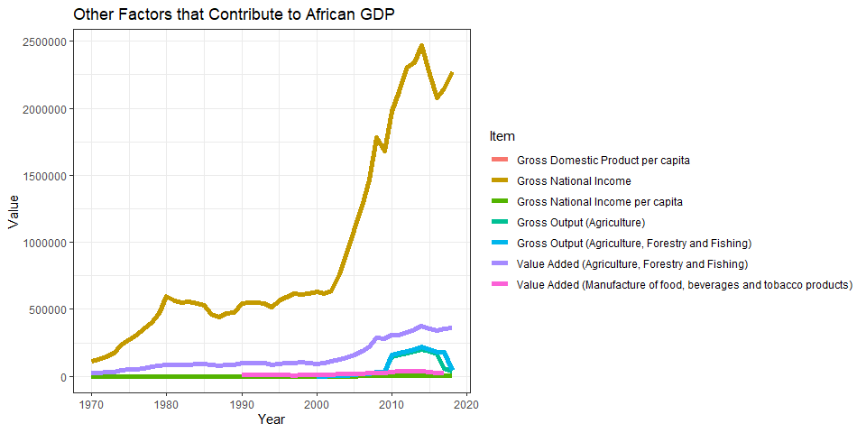

# Question :  How Has the Growth of the African Economy Been Over the Past 50 Years?

### A Look at the Gross Domestic Product(GDP), Real GDP (RGDP), and Real GDP per Capita, and GDP Per Capita

## Background 

The Gross Domestic Product (GDP) of an economy is a measure of total production. More precisely, it is the monetary value of all goods and services produced within a country or region in a specific time period (DataWorld.com)

Real gross domestic product is a macroeconomic statistic that measures the value of the goods and services produced by an economy in a specific period, adjusted for inflation. Essentially, it measures a country's total economic output, adjusted for price changes. Governments use both nominal and real GDP as metrics for analyzing economic growth and purchasing power over time. As such, real GDP provides a better basis for judging long-term national economic performance than nominal GDP(Gross Domestic Product). (Investopedia.com). 

## Objectives

A look at how the African Economy compares to that of the other continents. Developing insights on what should be done to boost the growth of the African economy.

## Graphs


```r
world <- read.csv("C:/Users/exoni/Downloads/FAOSTAT_data_7-18-2020 (1).csv")
growth_rate <- function(x)(x/lag(x)-1)*100 
world$growth_rate <- growth_rate(world$Value) 
w1 <- mutate(world,growth=growth_rate(Value),Value=Value/1000)
k1<-ggplot(w1,aes(x=Year,y=Value))+theme_bw()+geom_line(aes(y=Value),color="blue")+labs(title="World GDP per Year (1970-2018)",x="Periods",y="GDP in Thousands of Billion US Dollars")
ggplotly(k1,tooltip=c("Year","Value"))
```

<!--html_preserve--><div id="htmlwidget-728b6fd60a302de3cd0c" style="width:672px;height:480px;" class="plotly html-widget"></div>
<script type="application/json" data-for="htmlwidget-728b6fd60a302de3cd0c">{"x":{"data":[{"x":[1970,1971,1972,1973,1974,1975,1976,1977,1978,1979,1980,1981,1982,1983,1984,1985,1986,1987,1988,1989,1990,1991,1992,1993,1994,1995,1996,1997,1998,1999,2000,2001,2002,2003,2004,2005,2006,2007,2008,2009,2010,2011,2012,2013,2014,2015,2016,2017,2018],"y":[3412.990040386,3755.649710043,4321.657973881,5257.227743968,5953.825719037,6658.231591279,7193.14582086,8097.791454045,9590.384551529,11036.71270809,12330.124783322,12576.295355966,12477.690019182,12795.246235016,13154.110131064,13503.620506104,15560.880480003,17584.728354272,19663.705796825,20538.084554252,23763.600422126,23980.16333618,25617.494011534,26077.968639925,27810.505036638,30854.955840084,31503.511479341,31351.806866977,31181.811898774,32369.310192278,33289.96332759,33148.878411643,34477.50789868,38709.655542112,43586.897226841,47234.031426081,51211.717089312,57762.902873687,63433.557541035,60178.611867799,65861.060155543,73168.140978932,74727.52973269,76842.207009562,78701.0975055,74348.133021769,75475.891834958,80198.464652789,85085.189338679],"text":["Value:  3412.990<br />Year: 1970<br />Value:  3412.990","Value:  3755.650<br />Year: 1971<br />Value:  3755.650","Value:  4321.658<br />Year: 1972<br />Value:  4321.658","Value:  5257.228<br />Year: 1973<br />Value:  5257.228","Value:  5953.826<br />Year: 1974<br />Value:  5953.826","Value:  6658.232<br />Year: 1975<br />Value:  6658.232","Value:  7193.146<br />Year: 1976<br />Value:  7193.146","Value:  8097.791<br />Year: 1977<br />Value:  8097.791","Value:  9590.385<br />Year: 1978<br />Value:  9590.385","Value: 11036.713<br />Year: 1979<br />Value: 11036.713","Value: 12330.125<br />Year: 1980<br />Value: 12330.125","Value: 12576.295<br />Year: 1981<br />Value: 12576.295","Value: 12477.690<br />Year: 1982<br />Value: 12477.690","Value: 12795.246<br />Year: 1983<br />Value: 12795.246","Value: 13154.110<br />Year: 1984<br />Value: 13154.110","Value: 13503.621<br />Year: 1985<br />Value: 13503.621","Value: 15560.880<br />Year: 1986<br />Value: 15560.880","Value: 17584.728<br />Year: 1987<br />Value: 17584.728","Value: 19663.706<br />Year: 1988<br />Value: 19663.706","Value: 20538.085<br />Year: 1989<br />Value: 20538.085","Value: 23763.600<br />Year: 1990<br />Value: 23763.600","Value: 23980.163<br />Year: 1991<br />Value: 23980.163","Value: 25617.494<br />Year: 1992<br />Value: 25617.494","Value: 26077.969<br />Year: 1993<br />Value: 26077.969","Value: 27810.505<br />Year: 1994<br />Value: 27810.505","Value: 30854.956<br />Year: 1995<br />Value: 30854.956","Value: 31503.511<br />Year: 1996<br />Value: 31503.511","Value: 31351.807<br />Year: 1997<br />Value: 31351.807","Value: 31181.812<br />Year: 1998<br />Value: 31181.812","Value: 32369.310<br />Year: 1999<br />Value: 32369.310","Value: 33289.963<br />Year: 2000<br />Value: 33289.963","Value: 33148.878<br />Year: 2001<br />Value: 33148.878","Value: 34477.508<br />Year: 2002<br />Value: 34477.508","Value: 38709.656<br />Year: 2003<br />Value: 38709.656","Value: 43586.897<br />Year: 2004<br />Value: 43586.897","Value: 47234.031<br />Year: 2005<br />Value: 47234.031","Value: 51211.717<br />Year: 2006<br />Value: 51211.717","Value: 57762.903<br />Year: 2007<br />Value: 57762.903","Value: 63433.558<br />Year: 2008<br />Value: 63433.558","Value: 60178.612<br />Year: 2009<br />Value: 60178.612","Value: 65861.060<br />Year: 2010<br />Value: 65861.060","Value: 73168.141<br />Year: 2011<br />Value: 73168.141","Value: 74727.530<br />Year: 2012<br />Value: 74727.530","Value: 76842.207<br />Year: 2013<br />Value: 76842.207","Value: 78701.098<br />Year: 2014<br />Value: 78701.098","Value: 74348.133<br />Year: 2015<br />Value: 74348.133","Value: 75475.892<br />Year: 2016<br />Value: 75475.892","Value: 80198.465<br />Year: 2017<br />Value: 80198.465","Value: 85085.189<br />Year: 2018<br />Value: 85085.189"],"type":"scatter","mode":"lines","line":{"width":1.88976377952756,"color":"rgba(0,0,255,1)","dash":"solid"},"hoveron":"points","showlegend":false,"xaxis":"x","yaxis":"y","hoverinfo":"text","frame":null}],"layout":{"margin":{"t":43.7625570776256,"r":7.30593607305936,"b":40.1826484018265,"l":54.7945205479452},"plot_bgcolor":"rgba(255,255,255,1)","paper_bgcolor":"rgba(255,255,255,1)","font":{"color":"rgba(0,0,0,1)","family":"","size":14.6118721461187},"title":{"text":"World GDP per Year (1970-2018)","font":{"color":"rgba(0,0,0,1)","family":"","size":17.5342465753425},"x":0,"xref":"paper"},"xaxis":{"domain":[0,1],"automargin":true,"type":"linear","autorange":false,"range":[1967.6,2020.4],"tickmode":"array","ticktext":["1970","1980","1990","2000","2010","2020"],"tickvals":[1970,1980,1990,2000,2010,2020],"categoryorder":"array","categoryarray":["1970","1980","1990","2000","2010","2020"],"nticks":null,"ticks":"outside","tickcolor":"rgba(51,51,51,1)","ticklen":3.65296803652968,"tickwidth":0.66417600664176,"showticklabels":true,"tickfont":{"color":"rgba(77,77,77,1)","family":"","size":11.689497716895},"tickangle":-0,"showline":false,"linecolor":null,"linewidth":0,"showgrid":true,"gridcolor":"rgba(235,235,235,1)","gridwidth":0.66417600664176,"zeroline":false,"anchor":"y","title":{"text":"Periods","font":{"color":"rgba(0,0,0,1)","family":"","size":14.6118721461187}},"hoverformat":".2f"},"yaxis":{"domain":[0,1],"automargin":true,"type":"linear","autorange":false,"range":[-670.619924528651,89168.7993035937],"tickmode":"array","ticktext":["0","20000","40000","60000","80000"],"tickvals":[0,20000,40000,60000,80000],"categoryorder":"array","categoryarray":["0","20000","40000","60000","80000"],"nticks":null,"ticks":"outside","tickcolor":"rgba(51,51,51,1)","ticklen":3.65296803652968,"tickwidth":0.66417600664176,"showticklabels":true,"tickfont":{"color":"rgba(77,77,77,1)","family":"","size":11.689497716895},"tickangle":-0,"showline":false,"linecolor":null,"linewidth":0,"showgrid":true,"gridcolor":"rgba(235,235,235,1)","gridwidth":0.66417600664176,"zeroline":false,"anchor":"x","title":{"text":"GDP in Thousands of Billion US Dollars","font":{"color":"rgba(0,0,0,1)","family":"","size":14.6118721461187}},"hoverformat":".2f"},"shapes":[{"type":"rect","fillcolor":"transparent","line":{"color":"rgba(51,51,51,1)","width":0.66417600664176,"linetype":"solid"},"yref":"paper","xref":"paper","x0":0,"x1":1,"y0":0,"y1":1}],"showlegend":false,"legend":{"bgcolor":"rgba(255,255,255,1)","bordercolor":"transparent","borderwidth":1.88976377952756,"font":{"color":"rgba(0,0,0,1)","family":"","size":11.689497716895}},"hovermode":"closest","barmode":"relative"},"config":{"doubleClick":"reset","showSendToCloud":false},"source":"A","attrs":{"35a84986d35":{"y":{},"x":{},"y.1":{},"type":"scatter"}},"cur_data":"35a84986d35","visdat":{"35a84986d35":["function (y) ","x"]},"highlight":{"on":"plotly_click","persistent":false,"dynamic":false,"selectize":false,"opacityDim":0.2,"selected":{"opacity":1},"debounce":0},"shinyEvents":["plotly_hover","plotly_click","plotly_selected","plotly_relayout","plotly_brushed","plotly_brushing","plotly_clickannotation","plotly_doubleclick","plotly_deselect","plotly_afterplot","plotly_sunburstclick"],"base_url":"https://plot.ly"},"evals":[],"jsHooks":[]}</script><!--/html_preserve-->

```r
k<-ggplot(w1,aes(x=Year,y=growth))+geom_line(aes(y=growth),color="blue")+theme_bw(base_size=10)+labs(title="World GDP Growth  (1970-2018)",x="Periods",y="Growth in Percentages")
ggplotly(k,tooltip=c("Year","growth"))
```

<!--html_preserve--><div id="htmlwidget-fcdec9e994abb504bb86" style="width:672px;height:480px;" class="plotly html-widget"></div>
<script type="application/json" data-for="htmlwidget-fcdec9e994abb504bb86">{"x":{"data":[{"x":[1970,1971,1972,1973,1974,1975,1976,1977,1978,1979,1980,1981,1982,1983,1984,1985,1986,1987,1988,1989,1990,1991,1992,1993,1994,1995,1996,1997,1998,1999,2000,2001,2002,2003,2004,2005,2006,2007,2008,2009,2010,2011,2012,2013,2014,2015,2016,2017,2018],"y":[null,10.0398672601531,15.0708481231472,21.6483991963581,13.2502910087595,11.8311469882248,8.03387839920791,12.5764951206959,18.4321009741295,15.0810235897205,11.7191786127034,1.99649701012738,-0.784057101022384,2.54499202453193,2.8046658067894,2.65704309571362,15.2348769944258,13.0059984515003,11.8226304135539,4.44666313899071,15.7050471739645,0.911321980706092,6.82785455795325,1.79750067740301,6.6436785036259,10.9471251940056,2.10194965962147,-0.481548263162612,-0.542217451530846,3.80830433253525,2.84421611039345,-0.423806162111551,4.00806769549809,12.2750973065371,12.5995481396704,8.36750131641415,8.42122838795982,12.7923572118269,9.8171220372153,-5.13126773810594,9.44263769364979,11.0946905593867,2.13124009014665,2.82985037032064,2.419100866932,-5.53100861576523,1.51686231698487,6.25706129866974,6.09328957486477],"text":["growth:         NA<br />Year: 1970<br />growth:         NA","growth: 10.0398673<br />Year: 1971<br />growth: 10.0398673","growth: 15.0708481<br />Year: 1972<br />growth: 15.0708481","growth: 21.6483992<br />Year: 1973<br />growth: 21.6483992","growth: 13.2502910<br />Year: 1974<br />growth: 13.2502910","growth: 11.8311470<br />Year: 1975<br />growth: 11.8311470","growth:  8.0338784<br />Year: 1976<br />growth:  8.0338784","growth: 12.5764951<br />Year: 1977<br />growth: 12.5764951","growth: 18.4321010<br />Year: 1978<br />growth: 18.4321010","growth: 15.0810236<br />Year: 1979<br />growth: 15.0810236","growth: 11.7191786<br />Year: 1980<br />growth: 11.7191786","growth:  1.9964970<br />Year: 1981<br />growth:  1.9964970","growth: -0.7840571<br />Year: 1982<br />growth: -0.7840571","growth:  2.5449920<br />Year: 1983<br />growth:  2.5449920","growth:  2.8046658<br />Year: 1984<br />growth:  2.8046658","growth:  2.6570431<br />Year: 1985<br />growth:  2.6570431","growth: 15.2348770<br />Year: 1986<br />growth: 15.2348770","growth: 13.0059985<br />Year: 1987<br />growth: 13.0059985","growth: 11.8226304<br />Year: 1988<br />growth: 11.8226304","growth:  4.4466631<br />Year: 1989<br />growth:  4.4466631","growth: 15.7050472<br />Year: 1990<br />growth: 15.7050472","growth:  0.9113220<br />Year: 1991<br />growth:  0.9113220","growth:  6.8278546<br />Year: 1992<br />growth:  6.8278546","growth:  1.7975007<br />Year: 1993<br />growth:  1.7975007","growth:  6.6436785<br />Year: 1994<br />growth:  6.6436785","growth: 10.9471252<br />Year: 1995<br />growth: 10.9471252","growth:  2.1019497<br />Year: 1996<br />growth:  2.1019497","growth: -0.4815483<br />Year: 1997<br />growth: -0.4815483","growth: -0.5422175<br />Year: 1998<br />growth: -0.5422175","growth:  3.8083043<br />Year: 1999<br />growth:  3.8083043","growth:  2.8442161<br />Year: 2000<br />growth:  2.8442161","growth: -0.4238062<br />Year: 2001<br />growth: -0.4238062","growth:  4.0080677<br />Year: 2002<br />growth:  4.0080677","growth: 12.2750973<br />Year: 2003<br />growth: 12.2750973","growth: 12.5995481<br />Year: 2004<br />growth: 12.5995481","growth:  8.3675013<br />Year: 2005<br />growth:  8.3675013","growth:  8.4212284<br />Year: 2006<br />growth:  8.4212284","growth: 12.7923572<br />Year: 2007<br />growth: 12.7923572","growth:  9.8171220<br />Year: 2008<br />growth:  9.8171220","growth: -5.1312677<br />Year: 2009<br />growth: -5.1312677","growth:  9.4426377<br />Year: 2010<br />growth:  9.4426377","growth: 11.0946906<br />Year: 2011<br />growth: 11.0946906","growth:  2.1312401<br />Year: 2012<br />growth:  2.1312401","growth:  2.8298504<br />Year: 2013<br />growth:  2.8298504","growth:  2.4191009<br />Year: 2014<br />growth:  2.4191009","growth: -5.5310086<br />Year: 2015<br />growth: -5.5310086","growth:  1.5168623<br />Year: 2016<br />growth:  1.5168623","growth:  6.2570613<br />Year: 2017<br />growth:  6.2570613","growth:  6.0932896<br />Year: 2018<br />growth:  6.0932896"],"type":"scatter","mode":"lines","line":{"width":1.88976377952756,"color":"rgba(0,0,255,1)","dash":"solid"},"hoveron":"points","showlegend":false,"xaxis":"x","yaxis":"y","hoverinfo":"text","frame":null}],"layout":{"margin":{"t":41.2386882523869,"r":6.6417600664176,"b":36.5296803652968,"l":33.8729763387298},"plot_bgcolor":"rgba(255,255,255,1)","paper_bgcolor":"rgba(255,255,255,1)","font":{"color":"rgba(0,0,0,1)","family":"","size":13.2835201328352},"title":{"text":"World GDP Growth  (1970-2018)","font":{"color":"rgba(0,0,0,1)","family":"","size":15.9402241594022},"x":0,"xref":"paper"},"xaxis":{"domain":[0,1],"automargin":true,"type":"linear","autorange":false,"range":[1967.6,2020.4],"tickmode":"array","ticktext":["1970","1980","1990","2000","2010","2020"],"tickvals":[1970,1980,1990,2000,2010,2020],"categoryorder":"array","categoryarray":["1970","1980","1990","2000","2010","2020"],"nticks":null,"ticks":"outside","tickcolor":"rgba(51,51,51,1)","ticklen":3.3208800332088,"tickwidth":0.603796369674327,"showticklabels":true,"tickfont":{"color":"rgba(77,77,77,1)","family":"","size":10.6268161062682},"tickangle":-0,"showline":false,"linecolor":null,"linewidth":0,"showgrid":true,"gridcolor":"rgba(235,235,235,1)","gridwidth":0.603796369674327,"zeroline":false,"anchor":"y","title":{"text":"Periods","font":{"color":"rgba(0,0,0,1)","family":"","size":13.2835201328352}},"hoverformat":".2f"},"yaxis":{"domain":[0,1],"automargin":true,"type":"linear","autorange":false,"range":[-6.8899790063714,23.0073695869643],"tickmode":"array","ticktext":["0","10","20"],"tickvals":[0,10,20],"categoryorder":"array","categoryarray":["0","10","20"],"nticks":null,"ticks":"outside","tickcolor":"rgba(51,51,51,1)","ticklen":3.3208800332088,"tickwidth":0.603796369674327,"showticklabels":true,"tickfont":{"color":"rgba(77,77,77,1)","family":"","size":10.6268161062682},"tickangle":-0,"showline":false,"linecolor":null,"linewidth":0,"showgrid":true,"gridcolor":"rgba(235,235,235,1)","gridwidth":0.603796369674327,"zeroline":false,"anchor":"x","title":{"text":"Growth in Percentages","font":{"color":"rgba(0,0,0,1)","family":"","size":13.2835201328352}},"hoverformat":".2f"},"shapes":[{"type":"rect","fillcolor":"transparent","line":{"color":"rgba(51,51,51,1)","width":0.603796369674327,"linetype":"solid"},"yref":"paper","xref":"paper","x0":0,"x1":1,"y0":0,"y1":1}],"showlegend":false,"legend":{"bgcolor":"rgba(255,255,255,1)","bordercolor":"transparent","borderwidth":1.71796707229778,"font":{"color":"rgba(0,0,0,1)","family":"","size":10.6268161062682}},"hovermode":"closest","barmode":"relative"},"config":{"doubleClick":"reset","showSendToCloud":false},"source":"A","attrs":{"35a84ff127ec":{"y":{},"x":{},"y.1":{},"type":"scatter"}},"cur_data":"35a84ff127ec","visdat":{"35a84ff127ec":["function (y) ","x"]},"highlight":{"on":"plotly_click","persistent":false,"dynamic":false,"selectize":false,"opacityDim":0.2,"selected":{"opacity":1},"debounce":0},"shinyEvents":["plotly_hover","plotly_click","plotly_selected","plotly_relayout","plotly_brushed","plotly_brushing","plotly_clickannotation","plotly_doubleclick","plotly_deselect","plotly_afterplot","plotly_sunburstclick"],"base_url":"https://plot.ly"},"evals":[],"jsHooks":[]}</script><!--/html_preserve-->

```r
#Africa

af <- read.csv("C:/Users/exoni/Downloads/FAOSTAT_data_7-19-2020.csv")
growth_rate <- function(x)(x/lag(x)-1)*100 
af$growth_rate <- growth_rate(af$Value) 
af1 <- mutate(af,growth=growth_rate(Value),Value=Value/1000)
p1<-ggplot(af1,aes(x=Year,y=Value))+theme_bw()+geom_line(aes(y=Value),color="blue")+labs(title="Africa GDP per Year (1970-2018)",x="Periods",y="GDP in Thousands of Billions US Dollars ")
ggplotly(p1,tooltip=c("Year","Value"))
```

<!--html_preserve--><div id="htmlwidget-0953375894a2bdfff876" style="width:672px;height:480px;" class="plotly html-widget"></div>
<script type="application/json" data-for="htmlwidget-0953375894a2bdfff876">{"x":{"data":[{"x":[1970,1971,1972,1973,1974,1975,1976,1977,1978,1979,1980,1981,1982,1983,1984,1985,1986,1987,1988,1989,1990,1991,1992,1993,1994,1995,1996,1997,1998,1999,2000,2001,2002,2003,2004,2005,2006,2007,2008,2009,2010,2011,2012,2013,2014,2015,2016,2017,2018],"y":[116.328919913,129.314017248,148.023403666,179.421022132,242.631440585,278.155882705,311.676388113,359.449398215,411.711462849,481.84970134,610.333699315,578.807634992,567.895861307,573.748645183,559.035392302,551.05212972,484.171145615,463.097123784,493.876216489,496.573882847,565.98309472,569.40643458,584.573497579,574.566484907,542.104828117,584.72433249,613.750103771,634.452893084,626.886735959,635.734252523,652.575373377,640.01790552,659.845849104,784.417419068,953.57205996,1127.603669933,1308.554849567,1523.592300867,1859.573620565,1747.395325783,2038.11999566,2197.563879719,2386.221345474,2444.737831135,2547.107167307,2306.278760977,2152.313179484,2234.232975469,2365.243324351],"text":["Value:  116.3289<br />Year: 1970<br />Value:  116.3289","Value:  129.3140<br />Year: 1971<br />Value:  129.3140","Value:  148.0234<br />Year: 1972<br />Value:  148.0234","Value:  179.4210<br />Year: 1973<br />Value:  179.4210","Value:  242.6314<br />Year: 1974<br />Value:  242.6314","Value:  278.1559<br />Year: 1975<br />Value:  278.1559","Value:  311.6764<br />Year: 1976<br />Value:  311.6764","Value:  359.4494<br />Year: 1977<br />Value:  359.4494","Value:  411.7115<br />Year: 1978<br />Value:  411.7115","Value:  481.8497<br />Year: 1979<br />Value:  481.8497","Value:  610.3337<br />Year: 1980<br />Value:  610.3337","Value:  578.8076<br />Year: 1981<br />Value:  578.8076","Value:  567.8959<br />Year: 1982<br />Value:  567.8959","Value:  573.7486<br />Year: 1983<br />Value:  573.7486","Value:  559.0354<br />Year: 1984<br />Value:  559.0354","Value:  551.0521<br />Year: 1985<br />Value:  551.0521","Value:  484.1711<br />Year: 1986<br />Value:  484.1711","Value:  463.0971<br />Year: 1987<br />Value:  463.0971","Value:  493.8762<br />Year: 1988<br />Value:  493.8762","Value:  496.5739<br />Year: 1989<br />Value:  496.5739","Value:  565.9831<br />Year: 1990<br />Value:  565.9831","Value:  569.4064<br />Year: 1991<br />Value:  569.4064","Value:  584.5735<br />Year: 1992<br />Value:  584.5735","Value:  574.5665<br />Year: 1993<br />Value:  574.5665","Value:  542.1048<br />Year: 1994<br />Value:  542.1048","Value:  584.7243<br />Year: 1995<br />Value:  584.7243","Value:  613.7501<br />Year: 1996<br />Value:  613.7501","Value:  634.4529<br />Year: 1997<br />Value:  634.4529","Value:  626.8867<br />Year: 1998<br />Value:  626.8867","Value:  635.7343<br />Year: 1999<br />Value:  635.7343","Value:  652.5754<br />Year: 2000<br />Value:  652.5754","Value:  640.0179<br />Year: 2001<br />Value:  640.0179","Value:  659.8458<br />Year: 2002<br />Value:  659.8458","Value:  784.4174<br />Year: 2003<br />Value:  784.4174","Value:  953.5721<br />Year: 2004<br />Value:  953.5721","Value: 1127.6037<br />Year: 2005<br />Value: 1127.6037","Value: 1308.5548<br />Year: 2006<br />Value: 1308.5548","Value: 1523.5923<br />Year: 2007<br />Value: 1523.5923","Value: 1859.5736<br />Year: 2008<br />Value: 1859.5736","Value: 1747.3953<br />Year: 2009<br />Value: 1747.3953","Value: 2038.1200<br />Year: 2010<br />Value: 2038.1200","Value: 2197.5639<br />Year: 2011<br />Value: 2197.5639","Value: 2386.2213<br />Year: 2012<br />Value: 2386.2213","Value: 2444.7378<br />Year: 2013<br />Value: 2444.7378","Value: 2547.1072<br />Year: 2014<br />Value: 2547.1072","Value: 2306.2788<br />Year: 2015<br />Value: 2306.2788","Value: 2152.3132<br />Year: 2016<br />Value: 2152.3132","Value: 2234.2330<br />Year: 2017<br />Value: 2234.2330","Value: 2365.2433<br />Year: 2018<br />Value: 2365.2433"],"type":"scatter","mode":"lines","line":{"width":1.88976377952756,"color":"rgba(0,0,255,1)","dash":"solid"},"hoveron":"points","showlegend":false,"xaxis":"x","yaxis":"y","hoverinfo":"text","frame":null}],"layout":{"margin":{"t":43.7625570776256,"r":7.30593607305936,"b":40.1826484018265,"l":48.9497716894977},"plot_bgcolor":"rgba(255,255,255,1)","paper_bgcolor":"rgba(255,255,255,1)","font":{"color":"rgba(0,0,0,1)","family":"","size":14.6118721461187},"title":{"text":"Africa GDP per Year (1970-2018)","font":{"color":"rgba(0,0,0,1)","family":"","size":17.5342465753425},"x":0,"xref":"paper"},"xaxis":{"domain":[0,1],"automargin":true,"type":"linear","autorange":false,"range":[1967.6,2020.4],"tickmode":"array","ticktext":["1970","1980","1990","2000","2010","2020"],"tickvals":[1970,1980,1990,2000,2010,2020],"categoryorder":"array","categoryarray":["1970","1980","1990","2000","2010","2020"],"nticks":null,"ticks":"outside","tickcolor":"rgba(51,51,51,1)","ticklen":3.65296803652968,"tickwidth":0.66417600664176,"showticklabels":true,"tickfont":{"color":"rgba(77,77,77,1)","family":"","size":11.689497716895},"tickangle":-0,"showline":false,"linecolor":null,"linewidth":0,"showgrid":true,"gridcolor":"rgba(235,235,235,1)","gridwidth":0.66417600664176,"zeroline":false,"anchor":"y","title":{"text":"Periods","font":{"color":"rgba(0,0,0,1)","family":"","size":14.6118721461187}},"hoverformat":".2f"},"yaxis":{"domain":[0,1],"automargin":true,"type":"linear","autorange":false,"range":[-5.20999245670001,2668.6460796767],"tickmode":"array","ticktext":["0","500","1000","1500","2000","2500"],"tickvals":[0,500,1000,1500,2000,2500],"categoryorder":"array","categoryarray":["0","500","1000","1500","2000","2500"],"nticks":null,"ticks":"outside","tickcolor":"rgba(51,51,51,1)","ticklen":3.65296803652968,"tickwidth":0.66417600664176,"showticklabels":true,"tickfont":{"color":"rgba(77,77,77,1)","family":"","size":11.689497716895},"tickangle":-0,"showline":false,"linecolor":null,"linewidth":0,"showgrid":true,"gridcolor":"rgba(235,235,235,1)","gridwidth":0.66417600664176,"zeroline":false,"anchor":"x","title":{"text":"GDP in Thousands of Billions US Dollars ","font":{"color":"rgba(0,0,0,1)","family":"","size":14.6118721461187}},"hoverformat":".2f"},"shapes":[{"type":"rect","fillcolor":"transparent","line":{"color":"rgba(51,51,51,1)","width":0.66417600664176,"linetype":"solid"},"yref":"paper","xref":"paper","x0":0,"x1":1,"y0":0,"y1":1}],"showlegend":false,"legend":{"bgcolor":"rgba(255,255,255,1)","bordercolor":"transparent","borderwidth":1.88976377952756,"font":{"color":"rgba(0,0,0,1)","family":"","size":11.689497716895}},"hovermode":"closest","barmode":"relative"},"config":{"doubleClick":"reset","showSendToCloud":false},"source":"A","attrs":{"35a871be721d":{"y":{},"x":{},"y.1":{},"type":"scatter"}},"cur_data":"35a871be721d","visdat":{"35a871be721d":["function (y) ","x"]},"highlight":{"on":"plotly_click","persistent":false,"dynamic":false,"selectize":false,"opacityDim":0.2,"selected":{"opacity":1},"debounce":0},"shinyEvents":["plotly_hover","plotly_click","plotly_selected","plotly_relayout","plotly_brushed","plotly_brushing","plotly_clickannotation","plotly_doubleclick","plotly_deselect","plotly_afterplot","plotly_sunburstclick"],"base_url":"https://plot.ly"},"evals":[],"jsHooks":[]}</script><!--/html_preserve-->

```r
p<-ggplot(af1,aes(x=Year,y=growth))+geom_line(aes(y=growth),color="blue")+theme_bw()+labs(title="Africa GDP Growth per Year (1970-2018)",x="Periods",y="GDP Growth in Percentages")
ggplotly(p,tooltip=c("Year","growth"))
```

<!--html_preserve--><div id="htmlwidget-7f4c795d9c867e4eeec4" style="width:672px;height:480px;" class="plotly html-widget"></div>
<script type="application/json" data-for="htmlwidget-7f4c795d9c867e4eeec4">{"x":{"data":[{"x":[1970,1971,1972,1973,1974,1975,1976,1977,1978,1979,1980,1981,1982,1983,1984,1985,1986,1987,1988,1989,1990,1991,1992,1993,1994,1995,1996,1997,1998,1999,2000,2001,2002,2003,2004,2005,2006,2007,2008,2009,2010,2011,2012,2013,2014,2015,2016,2017,2018],"y":[null,11.1623982623678,14.4681812661646,21.2112528751505,35.2302186788882,14.6413185506166,12.0509784233291,15.3277604348648,14.5394775713994,17.0357750074897,26.6647457947348,-5.16538155412078,-1.88521592068334,1.0306086511231,-2.56440742902446,-1.42804242663894,-12.1369613686065,-4.35259763450618,6.64635799365407,0.54622317656392,13.9776203039631,0.604848429561944,2.66366203082817,-1.71184850381412,-5.64976510860257,7.86185663039354,4.96400947732007,3.37316265786318,-1.19254828963296,1.4113421223477,2.64908187456687,-1.92429386233448,3.09802951026663,18.8788896881226,21.564365703783,18.2504938305659,16.0474096048971,16.4332012044551,22.0519176624094,-6.03247397905744,16.6376014395442,7.82308619701106,8.58484558724744,2.45226561953231,4.18733390829371,-9.45497737280614,-6.6759311189154,3.80612806564888,5.86377295118468],"text":["growth:          NA<br />Year: 1970<br />growth:          NA","growth:  11.1623983<br />Year: 1971<br />growth:  11.1623983","growth:  14.4681813<br />Year: 1972<br />growth:  14.4681813","growth:  21.2112529<br />Year: 1973<br />growth:  21.2112529","growth:  35.2302187<br />Year: 1974<br />growth:  35.2302187","growth:  14.6413186<br />Year: 1975<br />growth:  14.6413186","growth:  12.0509784<br />Year: 1976<br />growth:  12.0509784","growth:  15.3277604<br />Year: 1977<br />growth:  15.3277604","growth:  14.5394776<br />Year: 1978<br />growth:  14.5394776","growth:  17.0357750<br />Year: 1979<br />growth:  17.0357750","growth:  26.6647458<br />Year: 1980<br />growth:  26.6647458","growth:  -5.1653816<br />Year: 1981<br />growth:  -5.1653816","growth:  -1.8852159<br />Year: 1982<br />growth:  -1.8852159","growth:   1.0306087<br />Year: 1983<br />growth:   1.0306087","growth:  -2.5644074<br />Year: 1984<br />growth:  -2.5644074","growth:  -1.4280424<br />Year: 1985<br />growth:  -1.4280424","growth: -12.1369614<br />Year: 1986<br />growth: -12.1369614","growth:  -4.3525976<br />Year: 1987<br />growth:  -4.3525976","growth:   6.6463580<br />Year: 1988<br />growth:   6.6463580","growth:   0.5462232<br />Year: 1989<br />growth:   0.5462232","growth:  13.9776203<br />Year: 1990<br />growth:  13.9776203","growth:   0.6048484<br />Year: 1991<br />growth:   0.6048484","growth:   2.6636620<br />Year: 1992<br />growth:   2.6636620","growth:  -1.7118485<br />Year: 1993<br />growth:  -1.7118485","growth:  -5.6497651<br />Year: 1994<br />growth:  -5.6497651","growth:   7.8618566<br />Year: 1995<br />growth:   7.8618566","growth:   4.9640095<br />Year: 1996<br />growth:   4.9640095","growth:   3.3731627<br />Year: 1997<br />growth:   3.3731627","growth:  -1.1925483<br />Year: 1998<br />growth:  -1.1925483","growth:   1.4113421<br />Year: 1999<br />growth:   1.4113421","growth:   2.6490819<br />Year: 2000<br />growth:   2.6490819","growth:  -1.9242939<br />Year: 2001<br />growth:  -1.9242939","growth:   3.0980295<br />Year: 2002<br />growth:   3.0980295","growth:  18.8788897<br />Year: 2003<br />growth:  18.8788897","growth:  21.5643657<br />Year: 2004<br />growth:  21.5643657","growth:  18.2504938<br />Year: 2005<br />growth:  18.2504938","growth:  16.0474096<br />Year: 2006<br />growth:  16.0474096","growth:  16.4332012<br />Year: 2007<br />growth:  16.4332012","growth:  22.0519177<br />Year: 2008<br />growth:  22.0519177","growth:  -6.0324740<br />Year: 2009<br />growth:  -6.0324740","growth:  16.6376014<br />Year: 2010<br />growth:  16.6376014","growth:   7.8230862<br />Year: 2011<br />growth:   7.8230862","growth:   8.5848456<br />Year: 2012<br />growth:   8.5848456","growth:   2.4522656<br />Year: 2013<br />growth:   2.4522656","growth:   4.1873339<br />Year: 2014<br />growth:   4.1873339","growth:  -9.4549774<br />Year: 2015<br />growth:  -9.4549774","growth:  -6.6759311<br />Year: 2016<br />growth:  -6.6759311","growth:   3.8061281<br />Year: 2017<br />growth:   3.8061281","growth:   5.8637730<br />Year: 2018<br />growth:   5.8637730"],"type":"scatter","mode":"lines","line":{"width":1.88976377952756,"color":"rgba(0,0,255,1)","dash":"solid"},"hoveron":"points","showlegend":false,"xaxis":"x","yaxis":"y","hoverinfo":"text","frame":null}],"layout":{"margin":{"t":43.7625570776256,"r":7.30593607305936,"b":40.1826484018265,"l":43.1050228310502},"plot_bgcolor":"rgba(255,255,255,1)","paper_bgcolor":"rgba(255,255,255,1)","font":{"color":"rgba(0,0,0,1)","family":"","size":14.6118721461187},"title":{"text":"Africa GDP Growth per Year (1970-2018)","font":{"color":"rgba(0,0,0,1)","family":"","size":17.5342465753425},"x":0,"xref":"paper"},"xaxis":{"domain":[0,1],"automargin":true,"type":"linear","autorange":false,"range":[1967.6,2020.4],"tickmode":"array","ticktext":["1970","1980","1990","2000","2010","2020"],"tickvals":[1970,1980,1990,2000,2010,2020],"categoryorder":"array","categoryarray":["1970","1980","1990","2000","2010","2020"],"nticks":null,"ticks":"outside","tickcolor":"rgba(51,51,51,1)","ticklen":3.65296803652968,"tickwidth":0.66417600664176,"showticklabels":true,"tickfont":{"color":"rgba(77,77,77,1)","family":"","size":11.689497716895},"tickangle":-0,"showline":false,"linecolor":null,"linewidth":0,"showgrid":true,"gridcolor":"rgba(235,235,235,1)","gridwidth":0.66417600664176,"zeroline":false,"anchor":"y","title":{"text":"Periods","font":{"color":"rgba(0,0,0,1)","family":"","size":14.6118721461187}},"hoverformat":".2f"},"yaxis":{"domain":[0,1],"automargin":true,"type":"linear","autorange":false,"range":[-14.5053203709813,37.5985776812629],"tickmode":"array","ticktext":["-10","0","10","20","30"],"tickvals":[-10,-1.77635683940025e-15,10,20,30],"categoryorder":"array","categoryarray":["-10","0","10","20","30"],"nticks":null,"ticks":"outside","tickcolor":"rgba(51,51,51,1)","ticklen":3.65296803652968,"tickwidth":0.66417600664176,"showticklabels":true,"tickfont":{"color":"rgba(77,77,77,1)","family":"","size":11.689497716895},"tickangle":-0,"showline":false,"linecolor":null,"linewidth":0,"showgrid":true,"gridcolor":"rgba(235,235,235,1)","gridwidth":0.66417600664176,"zeroline":false,"anchor":"x","title":{"text":"GDP Growth in Percentages","font":{"color":"rgba(0,0,0,1)","family":"","size":14.6118721461187}},"hoverformat":".2f"},"shapes":[{"type":"rect","fillcolor":"transparent","line":{"color":"rgba(51,51,51,1)","width":0.66417600664176,"linetype":"solid"},"yref":"paper","xref":"paper","x0":0,"x1":1,"y0":0,"y1":1}],"showlegend":false,"legend":{"bgcolor":"rgba(255,255,255,1)","bordercolor":"transparent","borderwidth":1.88976377952756,"font":{"color":"rgba(0,0,0,1)","family":"","size":11.689497716895}},"hovermode":"closest","barmode":"relative"},"config":{"doubleClick":"reset","showSendToCloud":false},"source":"A","attrs":{"35a813645698":{"y":{},"x":{},"y.1":{},"type":"scatter"}},"cur_data":"35a813645698","visdat":{"35a813645698":["function (y) ","x"]},"highlight":{"on":"plotly_click","persistent":false,"dynamic":false,"selectize":false,"opacityDim":0.2,"selected":{"opacity":1},"debounce":0},"shinyEvents":["plotly_hover","plotly_click","plotly_selected","plotly_relayout","plotly_brushed","plotly_brushing","plotly_clickannotation","plotly_doubleclick","plotly_deselect","plotly_afterplot","plotly_sunburstclick"],"base_url":"https://plot.ly"},"evals":[],"jsHooks":[]}</script><!--/html_preserve-->

## Africa GDP and GDP Growth Compared to Other Continents'

```r
## Americas
am<- read.csv("C:/Users/exoni/Downloads/FAOSTAT_data_7-19-2020 (1).csv")
growth_rate <- function(x)(x/lag(x)-1)*100 
am$growth_rate <- growth_rate(am$Value) 
am1 <- mutate(am,growth=growth_rate(Value),Value=Value/1000)
as <-read.csv("C:/Users/exoni/Downloads/FAOSTAT_data_7-19-2020 (2).csv")
as1 <- mutate(as,growth=growth_rate(Value),Value=Value/1000)
eur <- read.csv("C:/Users/exoni/Downloads/FAOSTAT_data_7-19-2020 (3).csv")
eur1 <- mutate(eur,growth=growth_rate(Value),Value=Value/1000)
oc <- read.csv("C:/Users/exoni/Downloads/FAOSTAT_data_7-19-2020 (4).csv")
oc1 <- mutate(oc,growth=growth_rate(Value),Value=Value/1000)
com <- bind_rows(af1,am1,as1,eur1,oc1)
o<-ggplot(com,aes(x=Year,y=Value,color=Area))+geom_line()+theme_bw()+labs(title="GDP Per Continent (1970-2018)",x="Periods",y="GDP in Thousands (Billions US Dollars)")
ggplotly(o,tooltip=c("Year","Value","Area"))
```

<!--html_preserve--><div id="htmlwidget-8e6a3639fbf6a622499c" style="width:672px;height:480px;" class="plotly html-widget"></div>
<script type="application/json" data-for="htmlwidget-8e6a3639fbf6a622499c">{"x":{"data":[{"x":[1970,1971,1972,1973,1974,1975,1976,1977,1978,1979,1980,1981,1982,1983,1984,1985,1986,1987,1988,1989,1990,1991,1992,1993,1994,1995,1996,1997,1998,1999,2000,2001,2002,2003,2004,2005,2006,2007,2008,2009,2010,2011,2012,2013,2014,2015,2016,2017,2018],"y":[116.328919913,129.314017248,148.023403666,179.421022132,242.631440585,278.155882705,311.676388113,359.449398215,411.711462849,481.84970134,610.333699315,578.807634992,567.895861307,573.748645183,559.035392302,551.05212972,484.171145615,463.097123784,493.876216489,496.573882847,565.98309472,569.40643458,584.573497579,574.566484907,542.104828117,584.72433249,613.750103771,634.452893084,626.886735959,635.734252523,652.575373377,640.01790552,659.845849104,784.417419068,953.57205996,1127.603669933,1308.554849567,1523.592300867,1859.573620565,1747.395325783,2038.11999566,2197.563879719,2386.221345474,2444.737831135,2547.107167307,2306.278760977,2152.313179484,2234.232975469,2365.243324351],"text":["Year: 1970<br />Value:   116.32892<br />Area: Africa","Year: 1971<br />Value:   129.31402<br />Area: Africa","Year: 1972<br />Value:   148.02340<br />Area: Africa","Year: 1973<br />Value:   179.42102<br />Area: Africa","Year: 1974<br />Value:   242.63144<br />Area: Africa","Year: 1975<br />Value:   278.15588<br />Area: Africa","Year: 1976<br />Value:   311.67639<br />Area: Africa","Year: 1977<br />Value:   359.44940<br />Area: Africa","Year: 1978<br />Value:   411.71146<br />Area: Africa","Year: 1979<br />Value:   481.84970<br />Area: Africa","Year: 1980<br />Value:   610.33370<br />Area: Africa","Year: 1981<br />Value:   578.80763<br />Area: Africa","Year: 1982<br />Value:   567.89586<br />Area: Africa","Year: 1983<br />Value:   573.74865<br />Area: Africa","Year: 1984<br />Value:   559.03539<br />Area: Africa","Year: 1985<br />Value:   551.05213<br />Area: Africa","Year: 1986<br />Value:   484.17115<br />Area: Africa","Year: 1987<br />Value:   463.09712<br />Area: Africa","Year: 1988<br />Value:   493.87622<br />Area: Africa","Year: 1989<br />Value:   496.57388<br />Area: Africa","Year: 1990<br />Value:   565.98309<br />Area: Africa","Year: 1991<br />Value:   569.40643<br />Area: Africa","Year: 1992<br />Value:   584.57350<br />Area: Africa","Year: 1993<br />Value:   574.56648<br />Area: Africa","Year: 1994<br />Value:   542.10483<br />Area: Africa","Year: 1995<br />Value:   584.72433<br />Area: Africa","Year: 1996<br />Value:   613.75010<br />Area: Africa","Year: 1997<br />Value:   634.45289<br />Area: Africa","Year: 1998<br />Value:   626.88674<br />Area: Africa","Year: 1999<br />Value:   635.73425<br />Area: Africa","Year: 2000<br />Value:   652.57537<br />Area: Africa","Year: 2001<br />Value:   640.01791<br />Area: Africa","Year: 2002<br />Value:   659.84585<br />Area: Africa","Year: 2003<br />Value:   784.41742<br />Area: Africa","Year: 2004<br />Value:   953.57206<br />Area: Africa","Year: 2005<br />Value:  1127.60367<br />Area: Africa","Year: 2006<br />Value:  1308.55485<br />Area: Africa","Year: 2007<br />Value:  1523.59230<br />Area: Africa","Year: 2008<br />Value:  1859.57362<br />Area: Africa","Year: 2009<br />Value:  1747.39533<br />Area: Africa","Year: 2010<br />Value:  2038.12000<br />Area: Africa","Year: 2011<br />Value:  2197.56388<br />Area: Africa","Year: 2012<br />Value:  2386.22135<br />Area: Africa","Year: 2013<br />Value:  2444.73783<br />Area: Africa","Year: 2014<br />Value:  2547.10717<br />Area: Africa","Year: 2015<br />Value:  2306.27876<br />Area: Africa","Year: 2016<br />Value:  2152.31318<br />Area: Africa","Year: 2017<br />Value:  2234.23298<br />Area: Africa","Year: 2018<br />Value:  2365.24332<br />Area: Africa"],"type":"scatter","mode":"lines","line":{"width":1.88976377952756,"color":"rgba(248,118,109,1)","dash":"solid"},"hoveron":"points","name":"Africa","legendgroup":"Africa","showlegend":true,"xaxis":"x","yaxis":"y","hoverinfo":"text","frame":null},{"x":[1970,1970,1971,1971,1972,1972,1973,1973,1974,1974,1975,1975,1976,1976,1977,1977,1978,1978,1979,1979,1980,1980,1981,1981,1982,1982,1983,1983,1984,1984,1985,1985,1986,1986,1987,1987,1988,1988,1989,1989,1990,1990,1991,1991,1992,1992,1993,1993,1994,1994,1995,1995,1996,1996,1997,1997,1998,1998,1999,1999,2000,2000,2001,2001,2002,2002,2003,2003,2004,2004,2005,2005,2006,2006,2007,2007,2008,2008,2009,2009,2010,2010,2011,2011,2012,2012,2013,2013,2014,2014,2015,2015,2016,2016,2017,2017,2018,2018],"y":[1348.331071234,1348.331071234,1475.31650255,1475.31650255,1628.49997361,1628.49997361,1850.971456187,1850.971456187,2073.76283956,2073.76283956,2269.040351683,2269.040351683,2532.301049556,2532.301049556,2788.721541808,2788.721541808,3133.704700437,3133.704700437,3541.166110551,3541.166110551,3931.3006253,3931.3006253,4449.463557012,4449.463557012,4513.072837705,4513.072837705,4728.498302365,4728.498302365,5173.555835592,5173.555835592,5491.293020545,5491.293020545,5745.890544346,5745.890544346,6124.285230663,6124.285230663,6692.01264308,6692.01264308,7244.245613607,7244.245613607,7755.04288172,7755.04288172,8071.43061062,8071.43061062,8528.886760156,8528.886760156,9014.014161165,9014.014161165,9729.798188726,9729.798188726,10217.194184282,10217.194184282,10825.866323866,10825.866323866,11556.025450705,11556.025450705,12031.716322441,12031.716322441,12421.755533426,12421.755533426,13307.851799007,13307.851799007,13587.761388806,13587.761388806,13727.898444283,13727.898444283,14425.60138578,14425.60138578,15612.345322358,15612.345322358,17079.625474264,17079.625474264,18495.054096363,18495.054096363,19880.070402116,19880.070402116,20867.221488952,20867.221488952,20148.124919085,20148.124919085,21966.966890775,21966.966890775,23423.272682984,23423.272682984,24211.655768151,24211.655768151,24992.504614011,24992.504614011,25673.484655569,25673.484655569,25283.8417964,25283.8417964,25522.275870424,25522.275870424,26950.282380124,26950.282380124,27867.704457793,27867.704457793],"text":["Year: 1970<br />Value:  1348.33107<br />Area: Americas","Year: 1970<br />Value:  1348.33107<br />Area: Americas","Year: 1971<br />Value:  1475.31650<br />Area: Americas","Year: 1971<br />Value:  1475.31650<br />Area: Americas","Year: 1972<br />Value:  1628.49997<br />Area: Americas","Year: 1972<br />Value:  1628.49997<br />Area: Americas","Year: 1973<br />Value:  1850.97146<br />Area: Americas","Year: 1973<br />Value:  1850.97146<br />Area: Americas","Year: 1974<br />Value:  2073.76284<br />Area: Americas","Year: 1974<br />Value:  2073.76284<br />Area: Americas","Year: 1975<br />Value:  2269.04035<br />Area: Americas","Year: 1975<br />Value:  2269.04035<br />Area: Americas","Year: 1976<br />Value:  2532.30105<br />Area: Americas","Year: 1976<br />Value:  2532.30105<br />Area: Americas","Year: 1977<br />Value:  2788.72154<br />Area: Americas","Year: 1977<br />Value:  2788.72154<br />Area: Americas","Year: 1978<br />Value:  3133.70470<br />Area: Americas","Year: 1978<br />Value:  3133.70470<br />Area: Americas","Year: 1979<br />Value:  3541.16611<br />Area: Americas","Year: 1979<br />Value:  3541.16611<br />Area: Americas","Year: 1980<br />Value:  3931.30063<br />Area: Americas","Year: 1980<br />Value:  3931.30063<br />Area: Americas","Year: 1981<br />Value:  4449.46356<br />Area: Americas","Year: 1981<br />Value:  4449.46356<br />Area: Americas","Year: 1982<br />Value:  4513.07284<br />Area: Americas","Year: 1982<br />Value:  4513.07284<br />Area: Americas","Year: 1983<br />Value:  4728.49830<br />Area: Americas","Year: 1983<br />Value:  4728.49830<br />Area: Americas","Year: 1984<br />Value:  5173.55584<br />Area: Americas","Year: 1984<br />Value:  5173.55584<br />Area: Americas","Year: 1985<br />Value:  5491.29302<br />Area: Americas","Year: 1985<br />Value:  5491.29302<br />Area: Americas","Year: 1986<br />Value:  5745.89054<br />Area: Americas","Year: 1986<br />Value:  5745.89054<br />Area: Americas","Year: 1987<br />Value:  6124.28523<br />Area: Americas","Year: 1987<br />Value:  6124.28523<br />Area: Americas","Year: 1988<br />Value:  6692.01264<br />Area: Americas","Year: 1988<br />Value:  6692.01264<br />Area: Americas","Year: 1989<br />Value:  7244.24561<br />Area: Americas","Year: 1989<br />Value:  7244.24561<br />Area: Americas","Year: 1990<br />Value:  7755.04288<br />Area: Americas","Year: 1990<br />Value:  7755.04288<br />Area: Americas","Year: 1991<br />Value:  8071.43061<br />Area: Americas","Year: 1991<br />Value:  8071.43061<br />Area: Americas","Year: 1992<br />Value:  8528.88676<br />Area: Americas","Year: 1992<br />Value:  8528.88676<br />Area: Americas","Year: 1993<br />Value:  9014.01416<br />Area: Americas","Year: 1993<br />Value:  9014.01416<br />Area: Americas","Year: 1994<br />Value:  9729.79819<br />Area: Americas","Year: 1994<br />Value:  9729.79819<br />Area: Americas","Year: 1995<br />Value: 10217.19418<br />Area: Americas","Year: 1995<br />Value: 10217.19418<br />Area: Americas","Year: 1996<br />Value: 10825.86632<br />Area: Americas","Year: 1996<br />Value: 10825.86632<br />Area: Americas","Year: 1997<br />Value: 11556.02545<br />Area: Americas","Year: 1997<br />Value: 11556.02545<br />Area: Americas","Year: 1998<br />Value: 12031.71632<br />Area: Americas","Year: 1998<br />Value: 12031.71632<br />Area: Americas","Year: 1999<br />Value: 12421.75553<br />Area: Americas","Year: 1999<br />Value: 12421.75553<br />Area: Americas","Year: 2000<br />Value: 13307.85180<br />Area: Americas","Year: 2000<br />Value: 13307.85180<br />Area: Americas","Year: 2001<br />Value: 13587.76139<br />Area: Americas","Year: 2001<br />Value: 13587.76139<br />Area: Americas","Year: 2002<br />Value: 13727.89844<br />Area: Americas","Year: 2002<br />Value: 13727.89844<br />Area: Americas","Year: 2003<br />Value: 14425.60139<br />Area: Americas","Year: 2003<br />Value: 14425.60139<br />Area: Americas","Year: 2004<br />Value: 15612.34532<br />Area: Americas","Year: 2004<br />Value: 15612.34532<br />Area: Americas","Year: 2005<br />Value: 17079.62547<br />Area: Americas","Year: 2005<br />Value: 17079.62547<br />Area: Americas","Year: 2006<br />Value: 18495.05410<br />Area: Americas","Year: 2006<br />Value: 18495.05410<br />Area: Americas","Year: 2007<br />Value: 19880.07040<br />Area: Americas","Year: 2007<br />Value: 19880.07040<br />Area: Americas","Year: 2008<br />Value: 20867.22149<br />Area: Americas","Year: 2008<br />Value: 20867.22149<br />Area: Americas","Year: 2009<br />Value: 20148.12492<br />Area: Americas","Year: 2009<br />Value: 20148.12492<br />Area: Americas","Year: 2010<br />Value: 21966.96689<br />Area: Americas","Year: 2010<br />Value: 21966.96689<br />Area: Americas","Year: 2011<br />Value: 23423.27268<br />Area: Americas","Year: 2011<br />Value: 23423.27268<br />Area: Americas","Year: 2012<br />Value: 24211.65577<br />Area: Americas","Year: 2012<br />Value: 24211.65577<br />Area: Americas","Year: 2013<br />Value: 24992.50461<br />Area: Americas","Year: 2013<br />Value: 24992.50461<br />Area: Americas","Year: 2014<br />Value: 25673.48466<br />Area: Americas","Year: 2014<br />Value: 25673.48466<br />Area: Americas","Year: 2015<br />Value: 25283.84180<br />Area: Americas","Year: 2015<br />Value: 25283.84180<br />Area: Americas","Year: 2016<br />Value: 25522.27587<br />Area: Americas","Year: 2016<br />Value: 25522.27587<br />Area: Americas","Year: 2017<br />Value: 26950.28238<br />Area: Americas","Year: 2017<br />Value: 26950.28238<br />Area: Americas","Year: 2018<br />Value: 27867.70446<br />Area: Americas","Year: 2018<br />Value: 27867.70446<br />Area: Americas"],"type":"scatter","mode":"lines","line":{"width":1.88976377952756,"color":"rgba(163,165,0,1)","dash":"solid"},"hoveron":"points","name":"Americas","legendgroup":"Americas","showlegend":true,"xaxis":"x","yaxis":"y","hoverinfo":"text","frame":null},{"x":[1970,1971,1972,1973,1974,1975,1976,1977,1978,1979,1980,1981,1982,1983,1984,1985,1986,1987,1988,1989,1990,1991,1992,1993,1994,1995,1996,1997,1998,1999,2000,2001,2002,2003,2004,2005,2006,2007,2008,2009,2010,2011,2012,2013,2014,2015,2016,2017,2018],"y":[510.181369054,560.96354028,678.831555766,886.924126521,1076.170502304,1183.143536979,1321.905469155,1576.076557212,1992.126107747,2246.952019582,2485.851089491,2681.32094377,2594.325559357,2747.748219534,2855.459903324,2831.65584047,3528.397545107,4146.477640618,4930.986895884,5097.571500465,5415.441413625,5962.765638098,6515.34907603,7326.898531533,7872.779366744,8944.790044845,8705.991835461,8385.924215898,7626.063648055,8479.00523768,9159.964487047,8594.123255032,8805.932999876,9743.838191291,11003.965467597,12016.548924957,13043.66082657,14914.612631706,17265.532299011,17560.043078579,20513.361967149,23801.842147953,25243.206287902,25661.772936627,26465.169845906,26124.76160815,27096.777808707,28991.122499553,31231.747276548],"text":["Year: 1970<br />Value:   510.18137<br />Area: Asia","Year: 1971<br />Value:   560.96354<br />Area: Asia","Year: 1972<br />Value:   678.83156<br />Area: Asia","Year: 1973<br />Value:   886.92413<br />Area: Asia","Year: 1974<br />Value:  1076.17050<br />Area: Asia","Year: 1975<br />Value:  1183.14354<br />Area: Asia","Year: 1976<br />Value:  1321.90547<br />Area: Asia","Year: 1977<br />Value:  1576.07656<br />Area: Asia","Year: 1978<br />Value:  1992.12611<br />Area: Asia","Year: 1979<br />Value:  2246.95202<br />Area: Asia","Year: 1980<br />Value:  2485.85109<br />Area: Asia","Year: 1981<br />Value:  2681.32094<br />Area: Asia","Year: 1982<br />Value:  2594.32556<br />Area: Asia","Year: 1983<br />Value:  2747.74822<br />Area: Asia","Year: 1984<br />Value:  2855.45990<br />Area: Asia","Year: 1985<br />Value:  2831.65584<br />Area: Asia","Year: 1986<br />Value:  3528.39755<br />Area: Asia","Year: 1987<br />Value:  4146.47764<br />Area: Asia","Year: 1988<br />Value:  4930.98690<br />Area: Asia","Year: 1989<br />Value:  5097.57150<br />Area: Asia","Year: 1990<br />Value:  5415.44141<br />Area: Asia","Year: 1991<br />Value:  5962.76564<br />Area: Asia","Year: 1992<br />Value:  6515.34908<br />Area: Asia","Year: 1993<br />Value:  7326.89853<br />Area: Asia","Year: 1994<br />Value:  7872.77937<br />Area: Asia","Year: 1995<br />Value:  8944.79004<br />Area: Asia","Year: 1996<br />Value:  8705.99184<br />Area: Asia","Year: 1997<br />Value:  8385.92422<br />Area: Asia","Year: 1998<br />Value:  7626.06365<br />Area: Asia","Year: 1999<br />Value:  8479.00524<br />Area: Asia","Year: 2000<br />Value:  9159.96449<br />Area: Asia","Year: 2001<br />Value:  8594.12326<br />Area: Asia","Year: 2002<br />Value:  8805.93300<br />Area: Asia","Year: 2003<br />Value:  9743.83819<br />Area: Asia","Year: 2004<br />Value: 11003.96547<br />Area: Asia","Year: 2005<br />Value: 12016.54892<br />Area: Asia","Year: 2006<br />Value: 13043.66083<br />Area: Asia","Year: 2007<br />Value: 14914.61263<br />Area: Asia","Year: 2008<br />Value: 17265.53230<br />Area: Asia","Year: 2009<br />Value: 17560.04308<br />Area: Asia","Year: 2010<br />Value: 20513.36197<br />Area: Asia","Year: 2011<br />Value: 23801.84215<br />Area: Asia","Year: 2012<br />Value: 25243.20629<br />Area: Asia","Year: 2013<br />Value: 25661.77294<br />Area: Asia","Year: 2014<br />Value: 26465.16985<br />Area: Asia","Year: 2015<br />Value: 26124.76161<br />Area: Asia","Year: 2016<br />Value: 27096.77781<br />Area: Asia","Year: 2017<br />Value: 28991.12250<br />Area: Asia","Year: 2018<br />Value: 31231.74728<br />Area: Asia"],"type":"scatter","mode":"lines","line":{"width":1.88976377952756,"color":"rgba(0,191,125,1)","dash":"solid"},"hoveron":"points","name":"Asia","legendgroup":"Asia","showlegend":true,"xaxis":"x","yaxis":"y","hoverinfo":"text","frame":null},{"x":[1970,1971,1972,1973,1974,1975,1976,1977,1978,1979,1980,1981,1982,1983,1984,1985,1986,1987,1988,1989,1990,1991,1992,1993,1994,1995,1996,1997,1998,1999,2000,2001,2002,2003,2004,2005,2006,2007,2008,2009,2010,2011,2012,2013,2014,2015,2016,2017,2018],"y":[1384.26782303,1529.207035273,1794.352497907,2237.409233024,2439.986350489,2799.985947981,2890.574279179,3236.220050344,3891.816709828,4587.382876039,5096.926814854,4630.880575108,4576.957216971,4519.681085215,4327.322006388,4415.160102805,5570.523769528,6573.168274128,7199.099713918,7322.152064455,9644.360872579,8988.350384684,9604.182004166,8782.391907209,9231.305347107,10634.971676302,10834.316429624,10250.661216201,10433.540340508,10329.592990497,9690.486072143,9867.75911417,10770.289193617,13093.710138952,15213.50067905,16109.893761963,17407.754737877,20290.719220746,22216.293147493,19553.917431719,19860.114545824,21987.886845592,21074.575625289,21963.158489357,22301.086530831,19160.795715891,19159.108832334,20353.839994347,21908.724538089],"text":["Year: 1970<br />Value:  1384.26782<br />Area: Europe","Year: 1971<br />Value:  1529.20704<br />Area: Europe","Year: 1972<br />Value:  1794.35250<br />Area: Europe","Year: 1973<br />Value:  2237.40923<br />Area: Europe","Year: 1974<br />Value:  2439.98635<br />Area: Europe","Year: 1975<br />Value:  2799.98595<br />Area: Europe","Year: 1976<br />Value:  2890.57428<br />Area: Europe","Year: 1977<br />Value:  3236.22005<br />Area: Europe","Year: 1978<br />Value:  3891.81671<br />Area: Europe","Year: 1979<br />Value:  4587.38288<br />Area: Europe","Year: 1980<br />Value:  5096.92681<br />Area: Europe","Year: 1981<br />Value:  4630.88058<br />Area: Europe","Year: 1982<br />Value:  4576.95722<br />Area: Europe","Year: 1983<br />Value:  4519.68109<br />Area: Europe","Year: 1984<br />Value:  4327.32201<br />Area: Europe","Year: 1985<br />Value:  4415.16010<br />Area: Europe","Year: 1986<br />Value:  5570.52377<br />Area: Europe","Year: 1987<br />Value:  6573.16827<br />Area: Europe","Year: 1988<br />Value:  7199.09971<br />Area: Europe","Year: 1989<br />Value:  7322.15206<br />Area: Europe","Year: 1990<br />Value:  9644.36087<br />Area: Europe","Year: 1991<br />Value:  8988.35038<br />Area: Europe","Year: 1992<br />Value:  9604.18200<br />Area: Europe","Year: 1993<br />Value:  8782.39191<br />Area: Europe","Year: 1994<br />Value:  9231.30535<br />Area: Europe","Year: 1995<br />Value: 10634.97168<br />Area: Europe","Year: 1996<br />Value: 10834.31643<br />Area: Europe","Year: 1997<br />Value: 10250.66122<br />Area: Europe","Year: 1998<br />Value: 10433.54034<br />Area: Europe","Year: 1999<br />Value: 10329.59299<br />Area: Europe","Year: 2000<br />Value:  9690.48607<br />Area: Europe","Year: 2001<br />Value:  9867.75911<br />Area: Europe","Year: 2002<br />Value: 10770.28919<br />Area: Europe","Year: 2003<br />Value: 13093.71014<br />Area: Europe","Year: 2004<br />Value: 15213.50068<br />Area: Europe","Year: 2005<br />Value: 16109.89376<br />Area: Europe","Year: 2006<br />Value: 17407.75474<br />Area: Europe","Year: 2007<br />Value: 20290.71922<br />Area: Europe","Year: 2008<br />Value: 22216.29315<br />Area: Europe","Year: 2009<br />Value: 19553.91743<br />Area: Europe","Year: 2010<br />Value: 19860.11455<br />Area: Europe","Year: 2011<br />Value: 21987.88685<br />Area: Europe","Year: 2012<br />Value: 21074.57563<br />Area: Europe","Year: 2013<br />Value: 21963.15849<br />Area: Europe","Year: 2014<br />Value: 22301.08653<br />Area: Europe","Year: 2015<br />Value: 19160.79572<br />Area: Europe","Year: 2016<br />Value: 19159.10883<br />Area: Europe","Year: 2017<br />Value: 20353.83999<br />Area: Europe","Year: 2018<br />Value: 21908.72454<br />Area: Europe"],"type":"scatter","mode":"lines","line":{"width":1.88976377952756,"color":"rgba(0,176,246,1)","dash":"solid"},"hoveron":"points","name":"Europe","legendgroup":"Europe","showlegend":true,"xaxis":"x","yaxis":"y","hoverinfo":"text","frame":null},{"x":[1970,1971,1972,1973,1974,1975,1976,1977,1978,1979,1980,1981,1982,1983,1984,1985,1986,1987,1988,1989,1990,1991,1992,1993,1994,1995,1996,1997,1998,1999,2000,2001,2002,2003,2004,2005,2006,2007,2008,2009,2010,2011,2012,2013,2014,2015,2016,2017,2018],"y":[53.880857156,60.848614692,71.950542932,102.501906104,121.274586098,127.905871931,136.688634856,137.323906466,161.025570669,179.362000578,205.712554362,235.822645084,225.438543842,225.56998272,238.736993459,214.459412565,231.897475408,277.70008508,347.730327454,377.541492878,382.772159483,388.210268198,384.502673604,380.097555111,434.517305944,473.275602165,523.586786619,524.743091089,463.604851812,503.222178153,479.085596015,459.216748116,513.5414118,662.088407022,803.513697877,900.359594965,956.692578935,1153.908318252,1224.936985014,1169.131112633,1482.496756136,1757.575422683,1811.870705874,1780.033138432,1714.249305887,1472.455140351,1545.41614401,1668.986803296,1711.769741898],"text":["Year: 1970<br />Value:    53.88086<br />Area: Oceania","Year: 1971<br />Value:    60.84861<br />Area: Oceania","Year: 1972<br />Value:    71.95054<br />Area: Oceania","Year: 1973<br />Value:   102.50191<br />Area: Oceania","Year: 1974<br />Value:   121.27459<br />Area: Oceania","Year: 1975<br />Value:   127.90587<br />Area: Oceania","Year: 1976<br />Value:   136.68863<br />Area: Oceania","Year: 1977<br />Value:   137.32391<br />Area: Oceania","Year: 1978<br />Value:   161.02557<br />Area: Oceania","Year: 1979<br />Value:   179.36200<br />Area: Oceania","Year: 1980<br />Value:   205.71255<br />Area: Oceania","Year: 1981<br />Value:   235.82265<br />Area: Oceania","Year: 1982<br />Value:   225.43854<br />Area: Oceania","Year: 1983<br />Value:   225.56998<br />Area: Oceania","Year: 1984<br />Value:   238.73699<br />Area: Oceania","Year: 1985<br />Value:   214.45941<br />Area: Oceania","Year: 1986<br />Value:   231.89748<br />Area: Oceania","Year: 1987<br />Value:   277.70009<br />Area: Oceania","Year: 1988<br />Value:   347.73033<br />Area: Oceania","Year: 1989<br />Value:   377.54149<br />Area: Oceania","Year: 1990<br />Value:   382.77216<br />Area: Oceania","Year: 1991<br />Value:   388.21027<br />Area: Oceania","Year: 1992<br />Value:   384.50267<br />Area: Oceania","Year: 1993<br />Value:   380.09756<br />Area: Oceania","Year: 1994<br />Value:   434.51731<br />Area: Oceania","Year: 1995<br />Value:   473.27560<br />Area: Oceania","Year: 1996<br />Value:   523.58679<br />Area: Oceania","Year: 1997<br />Value:   524.74309<br />Area: Oceania","Year: 1998<br />Value:   463.60485<br />Area: Oceania","Year: 1999<br />Value:   503.22218<br />Area: Oceania","Year: 2000<br />Value:   479.08560<br />Area: Oceania","Year: 2001<br />Value:   459.21675<br />Area: Oceania","Year: 2002<br />Value:   513.54141<br />Area: Oceania","Year: 2003<br />Value:   662.08841<br />Area: Oceania","Year: 2004<br />Value:   803.51370<br />Area: Oceania","Year: 2005<br />Value:   900.35959<br />Area: Oceania","Year: 2006<br />Value:   956.69258<br />Area: Oceania","Year: 2007<br />Value:  1153.90832<br />Area: Oceania","Year: 2008<br />Value:  1224.93699<br />Area: Oceania","Year: 2009<br />Value:  1169.13111<br />Area: Oceania","Year: 2010<br />Value:  1482.49676<br />Area: Oceania","Year: 2011<br />Value:  1757.57542<br />Area: Oceania","Year: 2012<br />Value:  1811.87071<br />Area: Oceania","Year: 2013<br />Value:  1780.03314<br />Area: Oceania","Year: 2014<br />Value:  1714.24931<br />Area: Oceania","Year: 2015<br />Value:  1472.45514<br />Area: Oceania","Year: 2016<br />Value:  1545.41614<br />Area: Oceania","Year: 2017<br />Value:  1668.98680<br />Area: Oceania","Year: 2018<br />Value:  1711.76974<br />Area: Oceania"],"type":"scatter","mode":"lines","line":{"width":1.88976377952756,"color":"rgba(231,107,243,1)","dash":"solid"},"hoveron":"points","name":"Oceania","legendgroup":"Oceania","showlegend":true,"xaxis":"x","yaxis":"y","hoverinfo":"text","frame":null}],"layout":{"margin":{"t":43.7625570776256,"r":7.30593607305936,"b":40.1826484018265,"l":54.7945205479452},"plot_bgcolor":"rgba(255,255,255,1)","paper_bgcolor":"rgba(255,255,255,1)","font":{"color":"rgba(0,0,0,1)","family":"","size":14.6118721461187},"title":{"text":"GDP Per Continent (1970-2018)","font":{"color":"rgba(0,0,0,1)","family":"","size":17.5342465753425},"x":0,"xref":"paper"},"xaxis":{"domain":[0,1],"automargin":true,"type":"linear","autorange":false,"range":[1967.6,2020.4],"tickmode":"array","ticktext":["1970","1980","1990","2000","2010","2020"],"tickvals":[1970,1980,1990,2000,2010,2020],"categoryorder":"array","categoryarray":["1970","1980","1990","2000","2010","2020"],"nticks":null,"ticks":"outside","tickcolor":"rgba(51,51,51,1)","ticklen":3.65296803652968,"tickwidth":0.66417600664176,"showticklabels":true,"tickfont":{"color":"rgba(77,77,77,1)","family":"","size":11.689497716895},"tickangle":-0,"showline":false,"linecolor":null,"linewidth":0,"showgrid":true,"gridcolor":"rgba(235,235,235,1)","gridwidth":0.66417600664176,"zeroline":false,"anchor":"y","title":{"text":"Periods","font":{"color":"rgba(0,0,0,1)","family":"","size":14.6118721461187}},"hoverformat":".2f"},"yaxis":{"domain":[0,1],"automargin":true,"type":"linear","autorange":false,"range":[-1505.0124638136,32790.6405975176],"tickmode":"array","ticktext":["0","10000","20000","30000"],"tickvals":[0,10000,20000,30000],"categoryorder":"array","categoryarray":["0","10000","20000","30000"],"nticks":null,"ticks":"outside","tickcolor":"rgba(51,51,51,1)","ticklen":3.65296803652968,"tickwidth":0.66417600664176,"showticklabels":true,"tickfont":{"color":"rgba(77,77,77,1)","family":"","size":11.689497716895},"tickangle":-0,"showline":false,"linecolor":null,"linewidth":0,"showgrid":true,"gridcolor":"rgba(235,235,235,1)","gridwidth":0.66417600664176,"zeroline":false,"anchor":"x","title":{"text":"GDP in Thousands (Billions US Dollars)","font":{"color":"rgba(0,0,0,1)","family":"","size":14.6118721461187}},"hoverformat":".2f"},"shapes":[{"type":"rect","fillcolor":"transparent","line":{"color":"rgba(51,51,51,1)","width":0.66417600664176,"linetype":"solid"},"yref":"paper","xref":"paper","x0":0,"x1":1,"y0":0,"y1":1}],"showlegend":true,"legend":{"bgcolor":"rgba(255,255,255,1)","bordercolor":"transparent","borderwidth":1.88976377952756,"font":{"color":"rgba(0,0,0,1)","family":"","size":11.689497716895},"y":0.93503937007874},"annotations":[{"text":"Area","x":1.02,"y":1,"showarrow":false,"ax":0,"ay":0,"font":{"color":"rgba(0,0,0,1)","family":"","size":14.6118721461187},"xref":"paper","yref":"paper","textangle":-0,"xanchor":"left","yanchor":"bottom","legendTitle":true}],"hovermode":"closest","barmode":"relative"},"config":{"doubleClick":"reset","showSendToCloud":false},"source":"A","attrs":{"35a86a66514d":{"x":{},"y":{},"colour":{},"type":"scatter"}},"cur_data":"35a86a66514d","visdat":{"35a86a66514d":["function (y) ","x"]},"highlight":{"on":"plotly_click","persistent":false,"dynamic":false,"selectize":false,"opacityDim":0.2,"selected":{"opacity":1},"debounce":0},"shinyEvents":["plotly_hover","plotly_click","plotly_selected","plotly_relayout","plotly_brushed","plotly_brushing","plotly_clickannotation","plotly_doubleclick","plotly_deselect","plotly_afterplot","plotly_sunburstclick"],"base_url":"https://plot.ly"},"evals":[],"jsHooks":[]}</script><!--/html_preserve-->

```r
o1<-ggplot(com,aes(x=Year,y=growth,color=Area))+geom_line()+theme_bw()+facet_wrap(~Area)+labs(title="GDP GroWth per Continent",x="Periods",y="GDP Growth in Percentages")
ggplotly(o1,tooltip=c("Year","growth","Area"))
```

```
## Warning: `group_by_()` is deprecated as of dplyr 0.7.0.
## Please use `group_by()` instead.
## See vignette('programming') for more help
## This warning is displayed once every 8 hours.
## Call `lifecycle::last_warnings()` to see where this warning was generated.
```

<!--html_preserve--><div id="htmlwidget-90e0b75fdaad6e032dec" style="width:672px;height:480px;" class="plotly html-widget"></div>
<script type="application/json" data-for="htmlwidget-90e0b75fdaad6e032dec">{"x":{"data":[{"x":[1970,1971,1972,1973,1974,1975,1976,1977,1978,1979,1980,1981,1982,1983,1984,1985,1986,1987,1988,1989,1990,1991,1992,1993,1994,1995,1996,1997,1998,1999,2000,2001,2002,2003,2004,2005,2006,2007,2008,2009,2010,2011,2012,2013,2014,2015,2016,2017,2018],"y":[null,11.1623982623678,14.4681812661646,21.2112528751505,35.2302186788882,14.6413185506166,12.0509784233291,15.3277604348648,14.5394775713994,17.0357750074897,26.6647457947348,-5.16538155412078,-1.88521592068334,1.0306086511231,-2.56440742902446,-1.42804242663894,-12.1369613686065,-4.35259763450618,6.64635799365407,0.54622317656392,13.9776203039631,0.604848429561944,2.66366203082817,-1.71184850381412,-5.64976510860257,7.86185663039354,4.96400947732007,3.37316265786318,-1.19254828963296,1.4113421223477,2.64908187456687,-1.92429386233448,3.09802951026663,18.8788896881226,21.564365703783,18.2504938305659,16.0474096048971,16.4332012044551,22.0519176624094,-6.03247397905744,16.6376014395442,7.82308619701106,8.58484558724744,2.45226561953231,4.18733390829371,-9.45497737280614,-6.6759311189154,3.80612806564888,5.86377295118468],"text":["Year: 1970<br />growth:            NA<br />Area: Africa","Year: 1971<br />growth:  11.162398262<br />Area: Africa","Year: 1972<br />growth:  14.468181266<br />Area: Africa","Year: 1973<br />growth:  21.211252875<br />Area: Africa","Year: 1974<br />growth:  35.230218679<br />Area: Africa","Year: 1975<br />growth:  14.641318551<br />Area: Africa","Year: 1976<br />growth:  12.050978423<br />Area: Africa","Year: 1977<br />growth:  15.327760435<br />Area: Africa","Year: 1978<br />growth:  14.539477571<br />Area: Africa","Year: 1979<br />growth:  17.035775007<br />Area: Africa","Year: 1980<br />growth:  26.664745795<br />Area: Africa","Year: 1981<br />growth:  -5.165381554<br />Area: Africa","Year: 1982<br />growth:  -1.885215921<br />Area: Africa","Year: 1983<br />growth:   1.030608651<br />Area: Africa","Year: 1984<br />growth:  -2.564407429<br />Area: Africa","Year: 1985<br />growth:  -1.428042427<br />Area: Africa","Year: 1986<br />growth: -12.136961369<br />Area: Africa","Year: 1987<br />growth:  -4.352597635<br />Area: Africa","Year: 1988<br />growth:   6.646357994<br />Area: Africa","Year: 1989<br />growth:   0.546223177<br />Area: Africa","Year: 1990<br />growth:  13.977620304<br />Area: Africa","Year: 1991<br />growth:   0.604848430<br />Area: Africa","Year: 1992<br />growth:   2.663662031<br />Area: Africa","Year: 1993<br />growth:  -1.711848504<br />Area: Africa","Year: 1994<br />growth:  -5.649765109<br />Area: Africa","Year: 1995<br />growth:   7.861856630<br />Area: Africa","Year: 1996<br />growth:   4.964009477<br />Area: Africa","Year: 1997<br />growth:   3.373162658<br />Area: Africa","Year: 1998<br />growth:  -1.192548290<br />Area: Africa","Year: 1999<br />growth:   1.411342122<br />Area: Africa","Year: 2000<br />growth:   2.649081875<br />Area: Africa","Year: 2001<br />growth:  -1.924293862<br />Area: Africa","Year: 2002<br />growth:   3.098029510<br />Area: Africa","Year: 2003<br />growth:  18.878889688<br />Area: Africa","Year: 2004<br />growth:  21.564365704<br />Area: Africa","Year: 2005<br />growth:  18.250493831<br />Area: Africa","Year: 2006<br />growth:  16.047409605<br />Area: Africa","Year: 2007<br />growth:  16.433201204<br />Area: Africa","Year: 2008<br />growth:  22.051917662<br />Area: Africa","Year: 2009<br />growth:  -6.032473979<br />Area: Africa","Year: 2010<br />growth:  16.637601440<br />Area: Africa","Year: 2011<br />growth:   7.823086197<br />Area: Africa","Year: 2012<br />growth:   8.584845587<br />Area: Africa","Year: 2013<br />growth:   2.452265620<br />Area: Africa","Year: 2014<br />growth:   4.187333908<br />Area: Africa","Year: 2015<br />growth:  -9.454977373<br />Area: Africa","Year: 2016<br />growth:  -6.675931119<br />Area: Africa","Year: 2017<br />growth:   3.806128066<br />Area: Africa","Year: 2018<br />growth:   5.863772951<br />Area: Africa"],"type":"scatter","mode":"lines","line":{"width":1.88976377952756,"color":"rgba(248,118,109,1)","dash":"solid"},"hoveron":"points","name":"Africa","legendgroup":"Africa","showlegend":true,"xaxis":"x","yaxis":"y","hoverinfo":"text","frame":null},{"x":[1970,1970,1971,1971,1972,1972,1973,1973,1974,1974,1975,1975,1976,1976,1977,1977,1978,1978,1979,1979,1980,1980,1981,1981,1982,1982,1983,1983,1984,1984,1985,1985,1986,1986,1987,1987,1988,1988,1989,1989,1990,1990,1991,1991,1992,1992,1993,1993,1994,1994,1995,1995,1996,1996,1997,1997,1998,1998,1999,1999,2000,2000,2001,2001,2002,2002,2003,2003,2004,2004,2005,2005,2006,2006,2007,2007,2008,2008,2009,2009,2010,2010,2011,2011,2012,2012,2013,2013,2014,2014,2015,2015,2016,2016,2017,2017,2018,2018],"y":[null,null,9.41797115153495,9.41797115153495,10.3830920887302,10.3830920887302,13.661129025617,13.661129025617,12.0364569982051,12.0364569982051,9.416578810161,9.416578810161,11.6022924703712,11.6022924703712,10.1259876781617,10.1259876781617,12.3706563547875,12.3706563547875,13.0025464766089,13.0025464766089,11.0171198573991,11.0171198573991,13.1804453817993,13.1804453817993,1.42959437419725,1.42959437419725,4.77336556282013,4.77336556282013,9.41223840567733,9.41223840567733,6.14156288344461,6.14156288344461,4.63638569000879,4.63638569000879,6.5854837191311,6.5854837191311,9.27010077150734,9.27010077150734,8.25212084884577,8.25212084884577,7.05107605895583,7.05107605895583,4.07976762637614,4.07976762637614,5.66759688095566,5.66759688095566,5.68805067591409,5.68805067591409,7.94079102565433,7.94079102565433,5.00931248626255,5.00931248626255,5.95733161771923,5.95733161771923,6.74457918651128,6.74457918651128,4.1163882319676,4.1163882319676,3.24175870285037,3.24175870285037,7.13342218977489,7.13342218977489,2.10334165142931,2.10334165142931,1.03134763311672,1.03134763311672,5.08237254470336,5.08237254470336,8.22665138763525,8.22665138763525,9.39820457215195,9.39820457215195,8.2872345428874,8.2872345428874,7.48857666777714,7.48857666777714,4.96553114183604,4.96553114183604,-3.44605806886039,-3.44605806886039,9.02735107606529,9.02735107606529,6.62952604904492,6.62952604904492,3.36581098566866,3.36581098566866,3.22509477805792,3.22509477805792,2.72473708447867,2.72473708447867,-1.51768590978739,-1.51768590978739,0.943029449179478,0.943029449179478,5.59513781980086,5.59513781980086,3.4041278853004,3.4041278853004],"text":["Year: 1970<br />growth:            NA<br />Area: Americas","Year: 1970<br />growth:            NA<br />Area: Americas","Year: 1971<br />growth:   9.417971152<br />Area: Americas","Year: 1971<br />growth:   9.417971152<br />Area: Americas","Year: 1972<br />growth:  10.383092089<br />Area: Americas","Year: 1972<br />growth:  10.383092089<br />Area: Americas","Year: 1973<br />growth:  13.661129026<br />Area: Americas","Year: 1973<br />growth:  13.661129026<br />Area: Americas","Year: 1974<br />growth:  12.036456998<br />Area: Americas","Year: 1974<br />growth:  12.036456998<br />Area: Americas","Year: 1975<br />growth:   9.416578810<br />Area: Americas","Year: 1975<br />growth:   9.416578810<br />Area: Americas","Year: 1976<br />growth:  11.602292470<br />Area: Americas","Year: 1976<br />growth:  11.602292470<br />Area: Americas","Year: 1977<br />growth:  10.125987678<br />Area: Americas","Year: 1977<br />growth:  10.125987678<br />Area: Americas","Year: 1978<br />growth:  12.370656355<br />Area: Americas","Year: 1978<br />growth:  12.370656355<br />Area: Americas","Year: 1979<br />growth:  13.002546477<br />Area: Americas","Year: 1979<br />growth:  13.002546477<br />Area: Americas","Year: 1980<br />growth:  11.017119857<br />Area: Americas","Year: 1980<br />growth:  11.017119857<br />Area: Americas","Year: 1981<br />growth:  13.180445382<br />Area: Americas","Year: 1981<br />growth:  13.180445382<br />Area: Americas","Year: 1982<br />growth:   1.429594374<br />Area: Americas","Year: 1982<br />growth:   1.429594374<br />Area: Americas","Year: 1983<br />growth:   4.773365563<br />Area: Americas","Year: 1983<br />growth:   4.773365563<br />Area: Americas","Year: 1984<br />growth:   9.412238406<br />Area: Americas","Year: 1984<br />growth:   9.412238406<br />Area: Americas","Year: 1985<br />growth:   6.141562883<br />Area: Americas","Year: 1985<br />growth:   6.141562883<br />Area: Americas","Year: 1986<br />growth:   4.636385690<br />Area: Americas","Year: 1986<br />growth:   4.636385690<br />Area: Americas","Year: 1987<br />growth:   6.585483719<br />Area: Americas","Year: 1987<br />growth:   6.585483719<br />Area: Americas","Year: 1988<br />growth:   9.270100772<br />Area: Americas","Year: 1988<br />growth:   9.270100772<br />Area: Americas","Year: 1989<br />growth:   8.252120849<br />Area: Americas","Year: 1989<br />growth:   8.252120849<br />Area: Americas","Year: 1990<br />growth:   7.051076059<br />Area: Americas","Year: 1990<br />growth:   7.051076059<br />Area: Americas","Year: 1991<br />growth:   4.079767626<br />Area: Americas","Year: 1991<br />growth:   4.079767626<br />Area: Americas","Year: 1992<br />growth:   5.667596881<br />Area: Americas","Year: 1992<br />growth:   5.667596881<br />Area: Americas","Year: 1993<br />growth:   5.688050676<br />Area: Americas","Year: 1993<br />growth:   5.688050676<br />Area: Americas","Year: 1994<br />growth:   7.940791026<br />Area: Americas","Year: 1994<br />growth:   7.940791026<br />Area: Americas","Year: 1995<br />growth:   5.009312486<br />Area: Americas","Year: 1995<br />growth:   5.009312486<br />Area: Americas","Year: 1996<br />growth:   5.957331618<br />Area: Americas","Year: 1996<br />growth:   5.957331618<br />Area: Americas","Year: 1997<br />growth:   6.744579187<br />Area: Americas","Year: 1997<br />growth:   6.744579187<br />Area: Americas","Year: 1998<br />growth:   4.116388232<br />Area: Americas","Year: 1998<br />growth:   4.116388232<br />Area: Americas","Year: 1999<br />growth:   3.241758703<br />Area: Americas","Year: 1999<br />growth:   3.241758703<br />Area: Americas","Year: 2000<br />growth:   7.133422190<br />Area: Americas","Year: 2000<br />growth:   7.133422190<br />Area: Americas","Year: 2001<br />growth:   2.103341651<br />Area: Americas","Year: 2001<br />growth:   2.103341651<br />Area: Americas","Year: 2002<br />growth:   1.031347633<br />Area: Americas","Year: 2002<br />growth:   1.031347633<br />Area: Americas","Year: 2003<br />growth:   5.082372545<br />Area: Americas","Year: 2003<br />growth:   5.082372545<br />Area: Americas","Year: 2004<br />growth:   8.226651388<br />Area: Americas","Year: 2004<br />growth:   8.226651388<br />Area: Americas","Year: 2005<br />growth:   9.398204572<br />Area: Americas","Year: 2005<br />growth:   9.398204572<br />Area: Americas","Year: 2006<br />growth:   8.287234543<br />Area: Americas","Year: 2006<br />growth:   8.287234543<br />Area: Americas","Year: 2007<br />growth:   7.488576668<br />Area: Americas","Year: 2007<br />growth:   7.488576668<br />Area: Americas","Year: 2008<br />growth:   4.965531142<br />Area: Americas","Year: 2008<br />growth:   4.965531142<br />Area: Americas","Year: 2009<br />growth:  -3.446058069<br />Area: Americas","Year: 2009<br />growth:  -3.446058069<br />Area: Americas","Year: 2010<br />growth:   9.027351076<br />Area: Americas","Year: 2010<br />growth:   9.027351076<br />Area: Americas","Year: 2011<br />growth:   6.629526049<br />Area: Americas","Year: 2011<br />growth:   6.629526049<br />Area: Americas","Year: 2012<br />growth:   3.365810986<br />Area: Americas","Year: 2012<br />growth:   3.365810986<br />Area: Americas","Year: 2013<br />growth:   3.225094778<br />Area: Americas","Year: 2013<br />growth:   3.225094778<br />Area: Americas","Year: 2014<br />growth:   2.724737084<br />Area: Americas","Year: 2014<br />growth:   2.724737084<br />Area: Americas","Year: 2015<br />growth:  -1.517685910<br />Area: Americas","Year: 2015<br />growth:  -1.517685910<br />Area: Americas","Year: 2016<br />growth:   0.943029449<br />Area: Americas","Year: 2016<br />growth:   0.943029449<br />Area: Americas","Year: 2017<br />growth:   5.595137820<br />Area: Americas","Year: 2017<br />growth:   5.595137820<br />Area: Americas","Year: 2018<br />growth:   3.404127885<br />Area: Americas","Year: 2018<br />growth:   3.404127885<br />Area: Americas"],"type":"scatter","mode":"lines","line":{"width":1.88976377952756,"color":"rgba(163,165,0,1)","dash":"solid"},"hoveron":"points","name":"Americas","legendgroup":"Americas","showlegend":true,"xaxis":"x2","yaxis":"y","hoverinfo":"text","frame":null},{"x":[1970,1971,1972,1973,1974,1975,1976,1977,1978,1979,1980,1981,1982,1983,1984,1985,1986,1987,1988,1989,1990,1991,1992,1993,1994,1995,1996,1997,1998,1999,2000,2001,2002,2003,2004,2005,2006,2007,2008,2009,2010,2011,2012,2013,2014,2015,2016,2017,2018],"y":[-98.1692737920818,9.95374866788303,21.0117070045528,30.6545223166867,21.3373805181428,9.94015673594275,11.7282415733183,19.2276296594395,26.3978008321481,12.7916556509164,10.6321393526437,7.8632970054141,-3.24449725480017,5.91377823124966,3.91999831077199,-0.833633238074538,24.6054515057647,17.5173031839375,18.9198959517137,3.37832178625443,6.23571269438798,10.1067333698036,9.26723388894191,12.455962773947,7.45036706679745,13.6166737077551,-2.66969049230644,-3.67640615351039,-9.06114279452298,11.1845590200724,8.03112193327673,-6.17732997562546,2.46458816750135,10.6508326991383,12.9325554423953,9.20198686865856,8.54747821547839,14.3437630739743,15.7625258218731,1.70577294964067,16.818403436451,16.030917730942,6.05568313153846,1.65813583247387,3.13071474548166,-1.28624996453086,3.72067012567021,6.99103304540252,7.7286582367742],"text":["Year: 1970<br />growth: -98.169273792<br />Area: Asia","Year: 1971<br />growth:   9.953748668<br />Area: Asia","Year: 1972<br />growth:  21.011707005<br />Area: Asia","Year: 1973<br />growth:  30.654522317<br />Area: Asia","Year: 1974<br />growth:  21.337380518<br />Area: Asia","Year: 1975<br />growth:   9.940156736<br />Area: Asia","Year: 1976<br />growth:  11.728241573<br />Area: Asia","Year: 1977<br />growth:  19.227629659<br />Area: Asia","Year: 1978<br />growth:  26.397800832<br />Area: Asia","Year: 1979<br />growth:  12.791655651<br />Area: Asia","Year: 1980<br />growth:  10.632139353<br />Area: Asia","Year: 1981<br />growth:   7.863297005<br />Area: Asia","Year: 1982<br />growth:  -3.244497255<br />Area: Asia","Year: 1983<br />growth:   5.913778231<br />Area: Asia","Year: 1984<br />growth:   3.919998311<br />Area: Asia","Year: 1985<br />growth:  -0.833633238<br />Area: Asia","Year: 1986<br />growth:  24.605451506<br />Area: Asia","Year: 1987<br />growth:  17.517303184<br />Area: Asia","Year: 1988<br />growth:  18.919895952<br />Area: Asia","Year: 1989<br />growth:   3.378321786<br />Area: Asia","Year: 1990<br />growth:   6.235712694<br />Area: Asia","Year: 1991<br />growth:  10.106733370<br />Area: Asia","Year: 1992<br />growth:   9.267233889<br />Area: Asia","Year: 1993<br />growth:  12.455962774<br />Area: Asia","Year: 1994<br />growth:   7.450367067<br />Area: Asia","Year: 1995<br />growth:  13.616673708<br />Area: Asia","Year: 1996<br />growth:  -2.669690492<br />Area: Asia","Year: 1997<br />growth:  -3.676406154<br />Area: Asia","Year: 1998<br />growth:  -9.061142795<br />Area: Asia","Year: 1999<br />growth:  11.184559020<br />Area: Asia","Year: 2000<br />growth:   8.031121933<br />Area: Asia","Year: 2001<br />growth:  -6.177329976<br />Area: Asia","Year: 2002<br />growth:   2.464588168<br />Area: Asia","Year: 2003<br />growth:  10.650832699<br />Area: Asia","Year: 2004<br />growth:  12.932555442<br />Area: Asia","Year: 2005<br />growth:   9.201986869<br />Area: Asia","Year: 2006<br />growth:   8.547478215<br />Area: Asia","Year: 2007<br />growth:  14.343763074<br />Area: Asia","Year: 2008<br />growth:  15.762525822<br />Area: Asia","Year: 2009<br />growth:   1.705772950<br />Area: Asia","Year: 2010<br />growth:  16.818403436<br />Area: Asia","Year: 2011<br />growth:  16.030917731<br />Area: Asia","Year: 2012<br />growth:   6.055683132<br />Area: Asia","Year: 2013<br />growth:   1.658135832<br />Area: Asia","Year: 2014<br />growth:   3.130714745<br />Area: Asia","Year: 2015<br />growth:  -1.286249965<br />Area: Asia","Year: 2016<br />growth:   3.720670126<br />Area: Asia","Year: 2017<br />growth:   6.991033045<br />Area: Asia","Year: 2018<br />growth:   7.728658237<br />Area: Asia"],"type":"scatter","mode":"lines","line":{"width":1.88976377952756,"color":"rgba(0,191,125,1)","dash":"solid"},"hoveron":"points","name":"Asia","legendgroup":"Asia","showlegend":true,"xaxis":"x3","yaxis":"y","hoverinfo":"text","frame":null},{"x":[1970,1971,1972,1973,1974,1975,1976,1977,1978,1979,1980,1981,1982,1983,1984,1985,1986,1987,1988,1989,1990,1991,1992,1993,1994,1995,1996,1997,1998,1999,2000,2001,2002,2003,2004,2005,2006,2007,2008,2009,2010,2011,2012,2013,2014,2015,2016,2017,2018],"y":[null,10.4704602557145,17.3387550879705,24.6917334043226,9.05409321079826,14.754164400135,3.23531377946096,11.9576851442535,20.2580989328681,17.8725314698014,11.1075084113094,-9.14367140583221,-1.16442990188195,-1.25140194764382,-4.25603212262596,2.02984886004167,26.1681035301299,17.9991064769293,9.52252268139349,1.70927415130955,31.7148399498153,-6.80201100479535,6.85144206807253,-8.55658604346037,5.11151682412978,15.2055021084845,1.87442674404297,-5.38709772060124,1.78407149011972,-0.996280712189579,-6.1871452141625,1.82935139380265,9.14625163631097,21.5725028693934,16.1893803788425,5.89208954483036,8.05629754665653,16.5613804093646,9.48992446151551,-11.9838881225531,1.5659118699576,10.71379671481,-4.15370165726542,4.21637370007926,1.5386131354366,-14.0813355017415,-0.00880382830656945,6.23583890288624,7.63926877765497],"text":["Year: 1970<br />growth:            NA<br />Area: Europe","Year: 1971<br />growth:  10.470460256<br />Area: Europe","Year: 1972<br />growth:  17.338755088<br />Area: Europe","Year: 1973<br />growth:  24.691733404<br />Area: Europe","Year: 1974<br />growth:   9.054093211<br />Area: Europe","Year: 1975<br />growth:  14.754164400<br />Area: Europe","Year: 1976<br />growth:   3.235313779<br />Area: Europe","Year: 1977<br />growth:  11.957685144<br />Area: Europe","Year: 1978<br />growth:  20.258098933<br />Area: Europe","Year: 1979<br />growth:  17.872531470<br />Area: Europe","Year: 1980<br />growth:  11.107508411<br />Area: Europe","Year: 1981<br />growth:  -9.143671406<br />Area: Europe","Year: 1982<br />growth:  -1.164429902<br />Area: Europe","Year: 1983<br />growth:  -1.251401948<br />Area: Europe","Year: 1984<br />growth:  -4.256032123<br />Area: Europe","Year: 1985<br />growth:   2.029848860<br />Area: Europe","Year: 1986<br />growth:  26.168103530<br />Area: Europe","Year: 1987<br />growth:  17.999106477<br />Area: Europe","Year: 1988<br />growth:   9.522522681<br />Area: Europe","Year: 1989<br />growth:   1.709274151<br />Area: Europe","Year: 1990<br />growth:  31.714839950<br />Area: Europe","Year: 1991<br />growth:  -6.802011005<br />Area: Europe","Year: 1992<br />growth:   6.851442068<br />Area: Europe","Year: 1993<br />growth:  -8.556586043<br />Area: Europe","Year: 1994<br />growth:   5.111516824<br />Area: Europe","Year: 1995<br />growth:  15.205502108<br />Area: Europe","Year: 1996<br />growth:   1.874426744<br />Area: Europe","Year: 1997<br />growth:  -5.387097721<br />Area: Europe","Year: 1998<br />growth:   1.784071490<br />Area: Europe","Year: 1999<br />growth:  -0.996280712<br />Area: Europe","Year: 2000<br />growth:  -6.187145214<br />Area: Europe","Year: 2001<br />growth:   1.829351394<br />Area: Europe","Year: 2002<br />growth:   9.146251636<br />Area: Europe","Year: 2003<br />growth:  21.572502869<br />Area: Europe","Year: 2004<br />growth:  16.189380379<br />Area: Europe","Year: 2005<br />growth:   5.892089545<br />Area: Europe","Year: 2006<br />growth:   8.056297547<br />Area: Europe","Year: 2007<br />growth:  16.561380409<br />Area: Europe","Year: 2008<br />growth:   9.489924462<br />Area: Europe","Year: 2009<br />growth: -11.983888123<br />Area: Europe","Year: 2010<br />growth:   1.565911870<br />Area: Europe","Year: 2011<br />growth:  10.713796715<br />Area: Europe","Year: 2012<br />growth:  -4.153701657<br />Area: Europe","Year: 2013<br />growth:   4.216373700<br />Area: Europe","Year: 2014<br />growth:   1.538613135<br />Area: Europe","Year: 2015<br />growth: -14.081335502<br />Area: Europe","Year: 2016<br />growth:  -0.008803828<br />Area: Europe","Year: 2017<br />growth:   6.235838903<br />Area: Europe","Year: 2018<br />growth:   7.639268778<br />Area: Europe"],"type":"scatter","mode":"lines","line":{"width":1.88976377952756,"color":"rgba(0,176,246,1)","dash":"solid"},"hoveron":"points","name":"Europe","legendgroup":"Europe","showlegend":true,"xaxis":"x","yaxis":"y2","hoverinfo":"text","frame":null},{"x":[1970,1971,1972,1973,1974,1975,1976,1977,1978,1979,1980,1981,1982,1983,1984,1985,1986,1987,1988,1989,1990,1991,1992,1993,1994,1995,1996,1997,1998,1999,2000,2001,2002,2003,2004,2005,2006,2007,2008,2009,2010,2011,2012,2013,2014,2015,2016,2017,2018],"y":[null,12.9317867305385,18.2451618597976,42.4616158920078,18.3144691718737,5.46799296238485,6.86658305236989,0.464758178812197,17.2596780946283,11.3872783265534,14.6912688858758,14.6369728456214,-4.40335203529804,0.0583036404334214,5.83721760325895,-10.1691742625423,8.1311715976629,19.7512325614649,25.2179405540426,8.57307029912242,1.38545476554817,1.42071688869563,-0.955048049401153,-1.14566654419075,14.3173114641866,8.91985099115824,10.6304200393706,0.220842943242827,-11.6510803696567,8.54549433340821,-4.79640667400424,-4.14724384624955,11.8298524404596,28.9260012549586,21.3604843937859,12.0527997648181,6.25672056865121,20.6143272833309,6.1554861541858,-4.55581577368751,26.8032934986453,18.5550939931882,3.08921497707997,-1.75716552725225,-3.69565212718163,-14.1049592206712,4.95505782550412,7.99594722528021,2.56340784226154],"text":["Year: 1970<br />growth:            NA<br />Area: Oceania","Year: 1971<br />growth:  12.931786731<br />Area: Oceania","Year: 1972<br />growth:  18.245161860<br />Area: Oceania","Year: 1973<br />growth:  42.461615892<br />Area: Oceania","Year: 1974<br />growth:  18.314469172<br />Area: Oceania","Year: 1975<br />growth:   5.467992962<br />Area: Oceania","Year: 1976<br />growth:   6.866583052<br />Area: Oceania","Year: 1977<br />growth:   0.464758179<br />Area: Oceania","Year: 1978<br />growth:  17.259678095<br />Area: Oceania","Year: 1979<br />growth:  11.387278327<br />Area: Oceania","Year: 1980<br />growth:  14.691268886<br />Area: Oceania","Year: 1981<br />growth:  14.636972846<br />Area: Oceania","Year: 1982<br />growth:  -4.403352035<br />Area: Oceania","Year: 1983<br />growth:   0.058303640<br />Area: Oceania","Year: 1984<br />growth:   5.837217603<br />Area: Oceania","Year: 1985<br />growth: -10.169174263<br />Area: Oceania","Year: 1986<br />growth:   8.131171598<br />Area: Oceania","Year: 1987<br />growth:  19.751232561<br />Area: Oceania","Year: 1988<br />growth:  25.217940554<br />Area: Oceania","Year: 1989<br />growth:   8.573070299<br />Area: Oceania","Year: 1990<br />growth:   1.385454766<br />Area: Oceania","Year: 1991<br />growth:   1.420716889<br />Area: Oceania","Year: 1992<br />growth:  -0.955048049<br />Area: Oceania","Year: 1993<br />growth:  -1.145666544<br />Area: Oceania","Year: 1994<br />growth:  14.317311464<br />Area: Oceania","Year: 1995<br />growth:   8.919850991<br />Area: Oceania","Year: 1996<br />growth:  10.630420039<br />Area: Oceania","Year: 1997<br />growth:   0.220842943<br />Area: Oceania","Year: 1998<br />growth: -11.651080370<br />Area: Oceania","Year: 1999<br />growth:   8.545494333<br />Area: Oceania","Year: 2000<br />growth:  -4.796406674<br />Area: Oceania","Year: 2001<br />growth:  -4.147243846<br />Area: Oceania","Year: 2002<br />growth:  11.829852440<br />Area: Oceania","Year: 2003<br />growth:  28.926001255<br />Area: Oceania","Year: 2004<br />growth:  21.360484394<br />Area: Oceania","Year: 2005<br />growth:  12.052799765<br />Area: Oceania","Year: 2006<br />growth:   6.256720569<br />Area: Oceania","Year: 2007<br />growth:  20.614327283<br />Area: Oceania","Year: 2008<br />growth:   6.155486154<br />Area: Oceania","Year: 2009<br />growth:  -4.555815774<br />Area: Oceania","Year: 2010<br />growth:  26.803293499<br />Area: Oceania","Year: 2011<br />growth:  18.555093993<br />Area: Oceania","Year: 2012<br />growth:   3.089214977<br />Area: Oceania","Year: 2013<br />growth:  -1.757165527<br />Area: Oceania","Year: 2014<br />growth:  -3.695652127<br />Area: Oceania","Year: 2015<br />growth: -14.104959221<br />Area: Oceania","Year: 2016<br />growth:   4.955057826<br />Area: Oceania","Year: 2017<br />growth:   7.995947225<br />Area: Oceania","Year: 2018<br />growth:   2.563407842<br />Area: Oceania"],"type":"scatter","mode":"lines","line":{"width":1.88976377952756,"color":"rgba(231,107,243,1)","dash":"solid"},"hoveron":"points","name":"Oceania","legendgroup":"Oceania","showlegend":true,"xaxis":"x2","yaxis":"y2","hoverinfo":"text","frame":null}],"layout":{"margin":{"t":55.4520547945205,"r":7.30593607305936,"b":40.1826484018265,"l":48.9497716894977},"plot_bgcolor":"rgba(255,255,255,1)","paper_bgcolor":"rgba(255,255,255,1)","font":{"color":"rgba(0,0,0,1)","family":"","size":14.6118721461187},"title":{"text":"GDP GroWth per Continent","font":{"color":"rgba(0,0,0,1)","family":"","size":17.5342465753425},"x":0,"xref":"paper"},"xaxis":{"domain":[0,0.325179386823222],"automargin":true,"type":"linear","autorange":false,"range":[1967.6,2020.4],"tickmode":"array","ticktext":["1970","1980","1990","2000","2010","2020"],"tickvals":[1970,1980,1990,2000,2010,2020],"categoryorder":"array","categoryarray":["1970","1980","1990","2000","2010","2020"],"nticks":null,"ticks":"outside","tickcolor":"rgba(51,51,51,1)","ticklen":3.65296803652968,"tickwidth":0.66417600664176,"showticklabels":true,"tickfont":{"color":"rgba(77,77,77,1)","family":"","size":11.689497716895},"tickangle":-0,"showline":false,"linecolor":null,"linewidth":0,"showgrid":true,"gridcolor":"rgba(235,235,235,1)","gridwidth":0.66417600664176,"zeroline":false,"anchor":"y2","title":"","hoverformat":".2f"},"annotations":[{"text":"Periods","x":0.5,"y":-0.0353881278538813,"showarrow":false,"ax":0,"ay":0,"font":{"color":"rgba(0,0,0,1)","family":"","size":14.6118721461187},"xref":"paper","yref":"paper","textangle":-0,"xanchor":"center","yanchor":"top","annotationType":"axis"},{"text":"GDP Growth in Percentages","x":-0.0383235485975212,"y":0.5,"showarrow":false,"ax":0,"ay":0,"font":{"color":"rgba(0,0,0,1)","family":"","size":14.6118721461187},"xref":"paper","yref":"paper","textangle":-90,"xanchor":"right","yanchor":"center","annotationType":"axis"},{"text":"Africa","x":0.162589693411611,"y":1,"showarrow":false,"ax":0,"ay":0,"font":{"color":"rgba(26,26,26,1)","family":"","size":11.689497716895},"xref":"paper","yref":"paper","textangle":-0,"xanchor":"center","yanchor":"bottom"},{"text":"Americas","x":0.5,"y":1,"showarrow":false,"ax":0,"ay":0,"font":{"color":"rgba(26,26,26,1)","family":"","size":11.689497716895},"xref":"paper","yref":"paper","textangle":-0,"xanchor":"center","yanchor":"bottom"},{"text":"Asia","x":0.837410306588389,"y":1,"showarrow":false,"ax":0,"ay":0,"font":{"color":"rgba(26,26,26,1)","family":"","size":11.689497716895},"xref":"paper","yref":"paper","textangle":-0,"xanchor":"center","yanchor":"bottom"},{"text":"Europe","x":0.162589693411611,"y":0.470319634703196,"showarrow":false,"ax":0,"ay":0,"font":{"color":"rgba(26,26,26,1)","family":"","size":11.689497716895},"xref":"paper","yref":"paper","textangle":-0,"xanchor":"center","yanchor":"bottom"},{"text":"Oceania","x":0.5,"y":0.470319634703196,"showarrow":false,"ax":0,"ay":0,"font":{"color":"rgba(26,26,26,1)","family":"","size":11.689497716895},"xref":"paper","yref":"paper","textangle":-0,"xanchor":"center","yanchor":"bottom"},{"text":"Area","x":1.02,"y":1,"showarrow":false,"ax":0,"ay":0,"font":{"color":"rgba(0,0,0,1)","family":"","size":14.6118721461187},"xref":"paper","yref":"paper","textangle":-0,"xanchor":"left","yanchor":"bottom","legendTitle":true}],"yaxis":{"domain":[0.529680365296804,1],"automargin":true,"type":"linear","autorange":false,"range":[-105.200818276286,49.4931603762123],"tickmode":"array","ticktext":["-100","-50","0"],"tickvals":[-100,-50,-1.4210854715202e-14],"categoryorder":"array","categoryarray":["-100","-50","0"],"nticks":null,"ticks":"outside","tickcolor":"rgba(51,51,51,1)","ticklen":3.65296803652968,"tickwidth":0.66417600664176,"showticklabels":true,"tickfont":{"color":"rgba(77,77,77,1)","family":"","size":11.689497716895},"tickangle":-0,"showline":false,"linecolor":null,"linewidth":0,"showgrid":true,"gridcolor":"rgba(235,235,235,1)","gridwidth":0.66417600664176,"zeroline":false,"anchor":"x","title":"","hoverformat":".2f"},"shapes":[{"type":"rect","fillcolor":"transparent","line":{"color":"rgba(51,51,51,1)","width":0.66417600664176,"linetype":"solid"},"yref":"paper","xref":"paper","x0":0,"x1":0.325179386823222,"y0":0.529680365296804,"y1":1},{"type":"rect","fillcolor":"rgba(217,217,217,1)","line":{"color":"rgba(51,51,51,1)","width":0.66417600664176,"linetype":"solid"},"yref":"paper","xref":"paper","x0":0,"x1":0.325179386823222,"y0":0,"y1":23.37899543379,"yanchor":1,"ysizemode":"pixel"},{"type":"rect","fillcolor":"transparent","line":{"color":"rgba(51,51,51,1)","width":0.66417600664176,"linetype":"solid"},"yref":"paper","xref":"paper","x0":0.341487279843444,"x1":0.658512720156556,"y0":0.529680365296804,"y1":1},{"type":"rect","fillcolor":"rgba(217,217,217,1)","line":{"color":"rgba(51,51,51,1)","width":0.66417600664176,"linetype":"solid"},"yref":"paper","xref":"paper","x0":0.341487279843444,"x1":0.658512720156556,"y0":0,"y1":23.37899543379,"yanchor":1,"ysizemode":"pixel"},{"type":"rect","fillcolor":"transparent","line":{"color":"rgba(51,51,51,1)","width":0.66417600664176,"linetype":"solid"},"yref":"paper","xref":"paper","x0":0.674820613176778,"x1":1,"y0":0.529680365296804,"y1":1},{"type":"rect","fillcolor":"rgba(217,217,217,1)","line":{"color":"rgba(51,51,51,1)","width":0.66417600664176,"linetype":"solid"},"yref":"paper","xref":"paper","x0":0.674820613176778,"x1":1,"y0":0,"y1":23.37899543379,"yanchor":1,"ysizemode":"pixel"},{"type":"rect","fillcolor":"transparent","line":{"color":"rgba(51,51,51,1)","width":0.66417600664176,"linetype":"solid"},"yref":"paper","xref":"paper","x0":0,"x1":0.325179386823222,"y0":0,"y1":0.470319634703196},{"type":"rect","fillcolor":"rgba(217,217,217,1)","line":{"color":"rgba(51,51,51,1)","width":0.66417600664176,"linetype":"solid"},"yref":"paper","xref":"paper","x0":0,"x1":0.325179386823222,"y0":0,"y1":23.37899543379,"yanchor":0.470319634703196,"ysizemode":"pixel"},{"type":"rect","fillcolor":"transparent","line":{"color":"rgba(51,51,51,1)","width":0.66417600664176,"linetype":"solid"},"yref":"paper","xref":"paper","x0":0.341487279843444,"x1":0.658512720156556,"y0":0,"y1":0.470319634703196},{"type":"rect","fillcolor":"rgba(217,217,217,1)","line":{"color":"rgba(51,51,51,1)","width":0.66417600664176,"linetype":"solid"},"yref":"paper","xref":"paper","x0":0.341487279843444,"x1":0.658512720156556,"y0":0,"y1":23.37899543379,"yanchor":0.470319634703196,"ysizemode":"pixel"}],"xaxis2":{"type":"linear","autorange":false,"range":[1967.6,2020.4],"tickmode":"array","ticktext":["1970","1980","1990","2000","2010","2020"],"tickvals":[1970,1980,1990,2000,2010,2020],"categoryorder":"array","categoryarray":["1970","1980","1990","2000","2010","2020"],"nticks":null,"ticks":"outside","tickcolor":"rgba(51,51,51,1)","ticklen":3.65296803652968,"tickwidth":0.66417600664176,"showticklabels":true,"tickfont":{"color":"rgba(77,77,77,1)","family":"","size":11.689497716895},"tickangle":-0,"showline":false,"linecolor":null,"linewidth":0,"showgrid":true,"domain":[0.341487279843444,0.658512720156556],"gridcolor":"rgba(235,235,235,1)","gridwidth":0.66417600664176,"zeroline":false,"anchor":"y2","title":"","hoverformat":".2f"},"xaxis3":{"type":"linear","autorange":false,"range":[1967.6,2020.4],"tickmode":"array","ticktext":["1970","1980","1990","2000","2010","2020"],"tickvals":[1970,1980,1990,2000,2010,2020],"categoryorder":"array","categoryarray":["1970","1980","1990","2000","2010","2020"],"nticks":null,"ticks":"outside","tickcolor":"rgba(51,51,51,1)","ticklen":3.65296803652968,"tickwidth":0.66417600664176,"showticklabels":true,"tickfont":{"color":"rgba(77,77,77,1)","family":"","size":11.689497716895},"tickangle":-0,"showline":false,"linecolor":null,"linewidth":0,"showgrid":true,"domain":[0.674820613176778,1],"gridcolor":"rgba(235,235,235,1)","gridwidth":0.66417600664176,"zeroline":false,"anchor":"y","title":"","hoverformat":".2f"},"yaxis2":{"type":"linear","autorange":false,"range":[-105.200818276286,49.4931603762123],"tickmode":"array","ticktext":["-100","-50","0"],"tickvals":[-100,-50,-1.4210854715202e-14],"categoryorder":"array","categoryarray":["-100","-50","0"],"nticks":null,"ticks":"outside","tickcolor":"rgba(51,51,51,1)","ticklen":3.65296803652968,"tickwidth":0.66417600664176,"showticklabels":true,"tickfont":{"color":"rgba(77,77,77,1)","family":"","size":11.689497716895},"tickangle":-0,"showline":false,"linecolor":null,"linewidth":0,"showgrid":true,"domain":[0,0.470319634703196],"gridcolor":"rgba(235,235,235,1)","gridwidth":0.66417600664176,"zeroline":false,"anchor":"x","title":"","hoverformat":".2f"},"showlegend":true,"legend":{"bgcolor":"rgba(255,255,255,1)","bordercolor":"transparent","borderwidth":1.88976377952756,"font":{"color":"rgba(0,0,0,1)","family":"","size":11.689497716895},"y":0.93503937007874},"hovermode":"closest","barmode":"relative"},"config":{"doubleClick":"reset","showSendToCloud":false},"source":"A","attrs":{"35a84cf510b5":{"x":{},"y":{},"colour":{},"type":"scatter"}},"cur_data":"35a84cf510b5","visdat":{"35a84cf510b5":["function (y) ","x"]},"highlight":{"on":"plotly_click","persistent":false,"dynamic":false,"selectize":false,"opacityDim":0.2,"selected":{"opacity":1},"debounce":0},"shinyEvents":["plotly_hover","plotly_click","plotly_selected","plotly_relayout","plotly_brushed","plotly_brushing","plotly_clickannotation","plotly_doubleclick","plotly_deselect","plotly_afterplot","plotly_sunburstclick"],"base_url":"https://plot.ly"},"evals":[],"jsHooks":[]}</script><!--/html_preserve-->

# Per capita

```r
af2 <- read.csv("C:/Users/exoni/Downloads/FAOSTAT_data_7-19-2020 (5).csv")
ame <-read.csv("C:/Users/exoni/Downloads/FAOSTAT_data_7-19-2020 (6).csv")
res <- read.csv("C:/Users/exoni/Downloads/FAOSTAT_data_7-19-2020 (8).csv")
af3 <- mutate(af2,growth=growth_rate(Value),Value=Value/1000)
res1 <- mutate(res,growth=growth_rate(Value),Value=Value/1000)
ame1 <- mutate(ame,growth=growth_rate(Value),Value=Value/1000)
com1 <- bind_rows(af3,ame1)
com2 <- bind_rows(af3,res1)
n<-ggplot(com1,aes(x=Year,y=Value,color=Area))+geom_line()+theme_bw()+labs(title="GDP per Capita: Africa vs Regions in the American continent",x="Periods",y="GDP per Capita (In thousands of Billions USD)")
ggplotly(n,tooltip=c("Year","Value","Area"))
```

<!--html_preserve--><div id="htmlwidget-50df21b3e1df29ab7335" style="width:672px;height:480px;" class="plotly html-widget"></div>
<script type="application/json" data-for="htmlwidget-50df21b3e1df29ab7335">{"x":{"data":[{"x":[1970,1971,1972,1973,1974,1975,1976,1977,1978,1979,1980,1981,1982,1983,1984,1985,1986,1987,1988,1989,1990,1991,1992,1993,1994,1995,1996,1997,1998,1999,2000,2001,2002,2003,2004,2005,2006,2007,2008,2009,2010,2011,2012,2013,2014,2015,2016,2017,2018],"y":[0.283705172,0.307203262,0.34247612,0.404232821,0.532262868,0.594103847,0.648134938,0.727720303,0.811347473,0.923985499,1.138353654,1.049587162,1.000899897,0.982668693,0.930445836,0.891393859,0.761339001,0.707996671,0.734256938,0.718099762,0.796312748,0.779626442,0.779108056,0.745636551,0.740004321,0.778152065,0.796547132,0.80324154,0.774358891,0.766242336,0.767455006,0.734391351,0.738702358,0.856705741,1.015900406,1.171698172,1.326071919,1.505615133,1.791707522,1.641246587,1.86576815,2.043504514,2.161980021,2.158115291,2.191021783,1.933603269,1.759257558,1.780858833,1.838930274],"text":["Year: 1970<br />Value:  0.2837052<br />Area: Africa","Year: 1971<br />Value:  0.3072033<br />Area: Africa","Year: 1972<br />Value:  0.3424761<br />Area: Africa","Year: 1973<br />Value:  0.4042328<br />Area: Africa","Year: 1974<br />Value:  0.5322629<br />Area: Africa","Year: 1975<br />Value:  0.5941038<br />Area: Africa","Year: 1976<br />Value:  0.6481349<br />Area: Africa","Year: 1977<br />Value:  0.7277203<br />Area: Africa","Year: 1978<br />Value:  0.8113475<br />Area: Africa","Year: 1979<br />Value:  0.9239855<br />Area: Africa","Year: 1980<br />Value:  1.1383537<br />Area: Africa","Year: 1981<br />Value:  1.0495872<br />Area: Africa","Year: 1982<br />Value:  1.0008999<br />Area: Africa","Year: 1983<br />Value:  0.9826687<br />Area: Africa","Year: 1984<br />Value:  0.9304458<br />Area: Africa","Year: 1985<br />Value:  0.8913939<br />Area: Africa","Year: 1986<br />Value:  0.7613390<br />Area: Africa","Year: 1987<br />Value:  0.7079967<br />Area: Africa","Year: 1988<br />Value:  0.7342569<br />Area: Africa","Year: 1989<br />Value:  0.7180998<br />Area: Africa","Year: 1990<br />Value:  0.7963127<br />Area: Africa","Year: 1991<br />Value:  0.7796264<br />Area: Africa","Year: 1992<br />Value:  0.7791081<br />Area: Africa","Year: 1993<br />Value:  0.7456366<br />Area: Africa","Year: 1994<br />Value:  0.7400043<br />Area: Africa","Year: 1995<br />Value:  0.7781521<br />Area: Africa","Year: 1996<br />Value:  0.7965471<br />Area: Africa","Year: 1997<br />Value:  0.8032415<br />Area: Africa","Year: 1998<br />Value:  0.7743589<br />Area: Africa","Year: 1999<br />Value:  0.7662423<br />Area: Africa","Year: 2000<br />Value:  0.7674550<br />Area: Africa","Year: 2001<br />Value:  0.7343914<br />Area: Africa","Year: 2002<br />Value:  0.7387024<br />Area: Africa","Year: 2003<br />Value:  0.8567057<br />Area: Africa","Year: 2004<br />Value:  1.0159004<br />Area: Africa","Year: 2005<br />Value:  1.1716982<br />Area: Africa","Year: 2006<br />Value:  1.3260719<br />Area: Africa","Year: 2007<br />Value:  1.5056151<br />Area: Africa","Year: 2008<br />Value:  1.7917075<br />Area: Africa","Year: 2009<br />Value:  1.6412466<br />Area: Africa","Year: 2010<br />Value:  1.8657682<br />Area: Africa","Year: 2011<br />Value:  2.0435045<br />Area: Africa","Year: 2012<br />Value:  2.1619800<br />Area: Africa","Year: 2013<br />Value:  2.1581153<br />Area: Africa","Year: 2014<br />Value:  2.1910218<br />Area: Africa","Year: 2015<br />Value:  1.9336033<br />Area: Africa","Year: 2016<br />Value:  1.7592576<br />Area: Africa","Year: 2017<br />Value:  1.7808588<br />Area: Africa","Year: 2018<br />Value:  1.8389303<br />Area: Africa"],"type":"scatter","mode":"lines","line":{"width":1.88976377952756,"color":"rgba(248,118,109,1)","dash":"solid"},"hoveron":"points","name":"Africa","legendgroup":"Africa","showlegend":true,"xaxis":"x","yaxis":"y","hoverinfo":"text","frame":null},{"x":[1970,1971,1972,1973,1974,1975,1976,1977,1978,1979,1980,1981,1982,1983,1984,1985,1986,1987,1988,1989,1990,1991,1992,1993,1994,1995,1996,1997,1998,1999,2000,2001,2002,2003,2004,2005,2006,2007,2008,2009,2010,2011,2012,2013,2014,2015,2016,2017,2018],"y":[2.599955067,2.793791606,3.028851795,3.381564435,3.721878962,4.001249538,4.388161273,4.749460586,5.245979223,5.827751904,6.36113955,7.079568906,7.062058683,7.277971624,7.834001879,8.182067814,8.426142653,8.840880651,9.511408987,10.13911032,10.689906192,10.95965514,11.409664872,11.882147193,12.639171188,13.080344098,13.659741773,14.372149744,14.753197414,15.024133323,15.886238642,16.019599597,15.993629898,16.614478688,17.778498931,19.229659081,20.586621902,21.876705028,22.70397754,21.679224624,23.382467466,24.673207298,25.245817825,25.808475066,26.256257681,25.613210108,25.614680549,26.801684727,27.466890832],"text":["Year: 1970<br />Value:  2.5999551<br />Area: Americas","Year: 1971<br />Value:  2.7937916<br />Area: Americas","Year: 1972<br />Value:  3.0288518<br />Area: Americas","Year: 1973<br />Value:  3.3815644<br />Area: Americas","Year: 1974<br />Value:  3.7218790<br />Area: Americas","Year: 1975<br />Value:  4.0012495<br />Area: Americas","Year: 1976<br />Value:  4.3881613<br />Area: Americas","Year: 1977<br />Value:  4.7494606<br />Area: Americas","Year: 1978<br />Value:  5.2459792<br />Area: Americas","Year: 1979<br />Value:  5.8277519<br />Area: Americas","Year: 1980<br />Value:  6.3611395<br />Area: Americas","Year: 1981<br />Value:  7.0795689<br />Area: Americas","Year: 1982<br />Value:  7.0620587<br />Area: Americas","Year: 1983<br />Value:  7.2779716<br />Area: Americas","Year: 1984<br />Value:  7.8340019<br />Area: Americas","Year: 1985<br />Value:  8.1820678<br />Area: Americas","Year: 1986<br />Value:  8.4261427<br />Area: Americas","Year: 1987<br />Value:  8.8408807<br />Area: Americas","Year: 1988<br />Value:  9.5114090<br />Area: Americas","Year: 1989<br />Value: 10.1391103<br />Area: Americas","Year: 1990<br />Value: 10.6899062<br />Area: Americas","Year: 1991<br />Value: 10.9596551<br />Area: Americas","Year: 1992<br />Value: 11.4096649<br />Area: Americas","Year: 1993<br />Value: 11.8821472<br />Area: Americas","Year: 1994<br />Value: 12.6391712<br />Area: Americas","Year: 1995<br />Value: 13.0803441<br />Area: Americas","Year: 1996<br />Value: 13.6597418<br />Area: Americas","Year: 1997<br />Value: 14.3721497<br />Area: Americas","Year: 1998<br />Value: 14.7531974<br />Area: Americas","Year: 1999<br />Value: 15.0241333<br />Area: Americas","Year: 2000<br />Value: 15.8862386<br />Area: Americas","Year: 2001<br />Value: 16.0195996<br />Area: Americas","Year: 2002<br />Value: 15.9936299<br />Area: Americas","Year: 2003<br />Value: 16.6144787<br />Area: Americas","Year: 2004<br />Value: 17.7784989<br />Area: Americas","Year: 2005<br />Value: 19.2296591<br />Area: Americas","Year: 2006<br />Value: 20.5866219<br />Area: Americas","Year: 2007<br />Value: 21.8767050<br />Area: Americas","Year: 2008<br />Value: 22.7039775<br />Area: Americas","Year: 2009<br />Value: 21.6792246<br />Area: Americas","Year: 2010<br />Value: 23.3824675<br />Area: Americas","Year: 2011<br />Value: 24.6732073<br />Area: Americas","Year: 2012<br />Value: 25.2458178<br />Area: Americas","Year: 2013<br />Value: 25.8084751<br />Area: Americas","Year: 2014<br />Value: 26.2562577<br />Area: Americas","Year: 2015<br />Value: 25.6132101<br />Area: Americas","Year: 2016<br />Value: 25.6146805<br />Area: Americas","Year: 2017<br />Value: 26.8016847<br />Area: Americas","Year: 2018<br />Value: 27.4668908<br />Area: Americas"],"type":"scatter","mode":"lines","line":{"width":1.88976377952756,"color":"rgba(183,159,0,1)","dash":"solid"},"hoveron":"points","name":"Americas","legendgroup":"Americas","showlegend":true,"xaxis":"x","yaxis":"y","hoverinfo":"text","frame":null},{"x":[1970,1971,1972,1973,1974,1975,1976,1977,1978,1979,1980,1981,1982,1983,1984,1985,1986,1987,1988,1989,1990,1991,1992,1993,1994,1995,1996,1997,1998,1999,2000,2001,2002,2003,2004,2005,2006,2007,2008,2009,2010,2011,2012,2013,2014,2015,2016,2017,2018],"y":[0.698425526,0.783816275,0.891441687,1.016553487,1.175836156,1.314089683,1.389775814,1.495411574,1.661565239,1.844540239,2.045908051,2.159840408,2.285368129,2.36518303,2.497956814,2.231851929,2.31016794,2.392726759,2.519216353,2.672338939,2.853169161,2.745880989,2.736667783,2.841312121,3.141647118,3.370506333,3.376958103,3.568748716,3.822545614,4.05634501,4.294660277,4.549770805,4.668247062,4.691376699,4.997187089,5.739884074,6.240849808,6.743369948,7.155168026,6.908744487,7.191449376,7.563478222,7.736697153,7.825042669,7.962713541,8.125370589,8.210208794,8.431586106,8.600704763],"text":["Year: 1970<br />Value:  0.6984255<br />Area: Caribbean","Year: 1971<br />Value:  0.7838163<br />Area: Caribbean","Year: 1972<br />Value:  0.8914417<br />Area: Caribbean","Year: 1973<br />Value:  1.0165535<br />Area: Caribbean","Year: 1974<br />Value:  1.1758362<br />Area: Caribbean","Year: 1975<br />Value:  1.3140897<br />Area: Caribbean","Year: 1976<br />Value:  1.3897758<br />Area: Caribbean","Year: 1977<br />Value:  1.4954116<br />Area: Caribbean","Year: 1978<br />Value:  1.6615652<br />Area: Caribbean","Year: 1979<br />Value:  1.8445402<br />Area: Caribbean","Year: 1980<br />Value:  2.0459081<br />Area: Caribbean","Year: 1981<br />Value:  2.1598404<br />Area: Caribbean","Year: 1982<br />Value:  2.2853681<br />Area: Caribbean","Year: 1983<br />Value:  2.3651830<br />Area: Caribbean","Year: 1984<br />Value:  2.4979568<br />Area: Caribbean","Year: 1985<br />Value:  2.2318519<br />Area: Caribbean","Year: 1986<br />Value:  2.3101679<br />Area: Caribbean","Year: 1987<br />Value:  2.3927268<br />Area: Caribbean","Year: 1988<br />Value:  2.5192164<br />Area: Caribbean","Year: 1989<br />Value:  2.6723389<br />Area: Caribbean","Year: 1990<br />Value:  2.8531692<br />Area: Caribbean","Year: 1991<br />Value:  2.7458810<br />Area: Caribbean","Year: 1992<br />Value:  2.7366678<br />Area: Caribbean","Year: 1993<br />Value:  2.8413121<br />Area: Caribbean","Year: 1994<br />Value:  3.1416471<br />Area: Caribbean","Year: 1995<br />Value:  3.3705063<br />Area: Caribbean","Year: 1996<br />Value:  3.3769581<br />Area: Caribbean","Year: 1997<br />Value:  3.5687487<br />Area: Caribbean","Year: 1998<br />Value:  3.8225456<br />Area: Caribbean","Year: 1999<br />Value:  4.0563450<br />Area: Caribbean","Year: 2000<br />Value:  4.2946603<br />Area: Caribbean","Year: 2001<br />Value:  4.5497708<br />Area: Caribbean","Year: 2002<br />Value:  4.6682471<br />Area: Caribbean","Year: 2003<br />Value:  4.6913767<br />Area: Caribbean","Year: 2004<br />Value:  4.9971871<br />Area: Caribbean","Year: 2005<br />Value:  5.7398841<br />Area: Caribbean","Year: 2006<br />Value:  6.2408498<br />Area: Caribbean","Year: 2007<br />Value:  6.7433699<br />Area: Caribbean","Year: 2008<br />Value:  7.1551680<br />Area: Caribbean","Year: 2009<br />Value:  6.9087445<br />Area: Caribbean","Year: 2010<br />Value:  7.1914494<br />Area: Caribbean","Year: 2011<br />Value:  7.5634782<br />Area: Caribbean","Year: 2012<br />Value:  7.7366972<br />Area: Caribbean","Year: 2013<br />Value:  7.8250427<br />Area: Caribbean","Year: 2014<br />Value:  7.9627135<br />Area: Caribbean","Year: 2015<br />Value:  8.1253706<br />Area: Caribbean","Year: 2016<br />Value:  8.2102088<br />Area: Caribbean","Year: 2017<br />Value:  8.4315861<br />Area: Caribbean","Year: 2018<br />Value:  8.6007048<br />Area: Caribbean"],"type":"scatter","mode":"lines","line":{"width":1.88976377952756,"color":"rgba(0,186,56,1)","dash":"solid"},"hoveron":"points","name":"Caribbean","legendgroup":"Caribbean","showlegend":true,"xaxis":"x","yaxis":"y","hoverinfo":"text","frame":null},{"x":[1970,1971,1972,1973,1974,1975,1976,1977,1978,1979,1980,1981,1982,1983,1984,1985,1986,1987,1988,1989,1990,1991,1992,1993,1994,1995,1996,1997,1998,1999,2000,2001,2002,2003,2004,2005,2006,2007,2008,2009,2010,2011,2012,2013,2014,2015,2016,2017,2018],"y":[0.738957638,0.787740154,0.874476127,1.035267644,1.296524328,1.526453434,1.523253893,1.416656066,1.699997126,2.121850686,2.822448422,3.454686174,2.426957579,2.087884623,2.382533171,2.464907507,1.775944184,1.863108016,2.182402328,2.567530621,2.899458515,3.367896005,3.805997119,4.462196178,4.620351656,3.249797354,3.603647572,4.259096548,4.42044782,4.899418379,5.629013097,5.923268803,5.974869536,5.620861848,5.947458476,6.559621135,7.178151976,7.667540653,8.016905664,6.563227953,7.537969574,8.307266125,8.40260392,8.796357004,8.984248587,8.121759152,7.557869429,7.997098226,8.306929088],"text":["Year: 1970<br />Value:  0.7389576<br />Area: Central America","Year: 1971<br />Value:  0.7877402<br />Area: Central America","Year: 1972<br />Value:  0.8744761<br />Area: Central America","Year: 1973<br />Value:  1.0352676<br />Area: Central America","Year: 1974<br />Value:  1.2965243<br />Area: Central America","Year: 1975<br />Value:  1.5264534<br />Area: Central America","Year: 1976<br />Value:  1.5232539<br />Area: Central America","Year: 1977<br />Value:  1.4166561<br />Area: Central America","Year: 1978<br />Value:  1.6999971<br />Area: Central America","Year: 1979<br />Value:  2.1218507<br />Area: Central America","Year: 1980<br />Value:  2.8224484<br />Area: Central America","Year: 1981<br />Value:  3.4546862<br />Area: Central America","Year: 1982<br />Value:  2.4269576<br />Area: Central America","Year: 1983<br />Value:  2.0878846<br />Area: Central America","Year: 1984<br />Value:  2.3825332<br />Area: Central America","Year: 1985<br />Value:  2.4649075<br />Area: Central America","Year: 1986<br />Value:  1.7759442<br />Area: Central America","Year: 1987<br />Value:  1.8631080<br />Area: Central America","Year: 1988<br />Value:  2.1824023<br />Area: Central America","Year: 1989<br />Value:  2.5675306<br />Area: Central America","Year: 1990<br />Value:  2.8994585<br />Area: Central America","Year: 1991<br />Value:  3.3678960<br />Area: Central America","Year: 1992<br />Value:  3.8059971<br />Area: Central America","Year: 1993<br />Value:  4.4621962<br />Area: Central America","Year: 1994<br />Value:  4.6203517<br />Area: Central America","Year: 1995<br />Value:  3.2497974<br />Area: Central America","Year: 1996<br />Value:  3.6036476<br />Area: Central America","Year: 1997<br />Value:  4.2590965<br />Area: Central America","Year: 1998<br />Value:  4.4204478<br />Area: Central America","Year: 1999<br />Value:  4.8994184<br />Area: Central America","Year: 2000<br />Value:  5.6290131<br />Area: Central America","Year: 2001<br />Value:  5.9232688<br />Area: Central America","Year: 2002<br />Value:  5.9748695<br />Area: Central America","Year: 2003<br />Value:  5.6208618<br />Area: Central America","Year: 2004<br />Value:  5.9474585<br />Area: Central America","Year: 2005<br />Value:  6.5596211<br />Area: Central America","Year: 2006<br />Value:  7.1781520<br />Area: Central America","Year: 2007<br />Value:  7.6675407<br />Area: Central America","Year: 2008<br />Value:  8.0169057<br />Area: Central America","Year: 2009<br />Value:  6.5632280<br />Area: Central America","Year: 2010<br />Value:  7.5379696<br />Area: Central America","Year: 2011<br />Value:  8.3072661<br />Area: Central America","Year: 2012<br />Value:  8.4026039<br />Area: Central America","Year: 2013<br />Value:  8.7963570<br />Area: Central America","Year: 2014<br />Value:  8.9842486<br />Area: Central America","Year: 2015<br />Value:  8.1217592<br />Area: Central America","Year: 2016<br />Value:  7.5578694<br />Area: Central America","Year: 2017<br />Value:  7.9970982<br />Area: Central America","Year: 2018<br />Value:  8.3069291<br />Area: Central America"],"type":"scatter","mode":"lines","line":{"width":1.88976377952756,"color":"rgba(0,191,196,1)","dash":"solid"},"hoveron":"points","name":"Central America","legendgroup":"Central America","showlegend":true,"xaxis":"x","yaxis":"y","hoverinfo":"text","frame":null},{"x":[1970,1971,1972,1973,1974,1975,1976,1977,1978,1979,1980,1981,1982,1983,1984,1985,1986,1987,1988,1989,1990,1991,1992,1993,1994,1995,1996,1997,1998,1999,2000,2001,2002,2003,2004,2005,2006,2007,2008,2009,2010,2011,2012,2013,2014,2015,2016,2017,2018],"y":[5.031048728,5.425080552,5.918016799,6.553797191,7.110815626,7.673931484,8.509577303,9.292068012,10.312123039,11.405603245,12.321825421,13.688575521,14.115743734,15.196043974,16.635503757,17.641919815,18.413162817,19.44578954,20.919187442,22.380299714,23.408676522,23.924367521,24.89184246,25.760548714,26.964764976,27.954397049,29.16734185,30.568812236,31.719891149,33.33038494,35.167510014,35.841039261,36.690123635,38.410328821,40.807998299,43.403911644,45.80015347,47.728702918,48.306477346,46.566530306,48.457825974,50.168350975,51.768542502,53.119939348,54.71699506,55.588342098,56.48304187,58.63405224,61.297003121],"text":["Year: 1970<br />Value:  5.0310487<br />Area: Northern America","Year: 1971<br />Value:  5.4250806<br />Area: Northern America","Year: 1972<br />Value:  5.9180168<br />Area: Northern America","Year: 1973<br />Value:  6.5537972<br />Area: Northern America","Year: 1974<br />Value:  7.1108156<br />Area: Northern America","Year: 1975<br />Value:  7.6739315<br />Area: Northern America","Year: 1976<br />Value:  8.5095773<br />Area: Northern America","Year: 1977<br />Value:  9.2920680<br />Area: Northern America","Year: 1978<br />Value: 10.3121230<br />Area: Northern America","Year: 1979<br />Value: 11.4056032<br />Area: Northern America","Year: 1980<br />Value: 12.3218254<br />Area: Northern America","Year: 1981<br />Value: 13.6885755<br />Area: Northern America","Year: 1982<br />Value: 14.1157437<br />Area: Northern America","Year: 1983<br />Value: 15.1960440<br />Area: Northern America","Year: 1984<br />Value: 16.6355038<br />Area: Northern America","Year: 1985<br />Value: 17.6419198<br />Area: Northern America","Year: 1986<br />Value: 18.4131628<br />Area: Northern America","Year: 1987<br />Value: 19.4457895<br />Area: Northern America","Year: 1988<br />Value: 20.9191874<br />Area: Northern America","Year: 1989<br />Value: 22.3802997<br />Area: Northern America","Year: 1990<br />Value: 23.4086765<br />Area: Northern America","Year: 1991<br />Value: 23.9243675<br />Area: Northern America","Year: 1992<br />Value: 24.8918425<br />Area: Northern America","Year: 1993<br />Value: 25.7605487<br />Area: Northern America","Year: 1994<br />Value: 26.9647650<br />Area: Northern America","Year: 1995<br />Value: 27.9543970<br />Area: Northern America","Year: 1996<br />Value: 29.1673418<br />Area: Northern America","Year: 1997<br />Value: 30.5688122<br />Area: Northern America","Year: 1998<br />Value: 31.7198911<br />Area: Northern America","Year: 1999<br />Value: 33.3303849<br />Area: Northern America","Year: 2000<br />Value: 35.1675100<br />Area: Northern America","Year: 2001<br />Value: 35.8410393<br />Area: Northern America","Year: 2002<br />Value: 36.6901236<br />Area: Northern America","Year: 2003<br />Value: 38.4103288<br />Area: Northern America","Year: 2004<br />Value: 40.8079983<br />Area: Northern America","Year: 2005<br />Value: 43.4039116<br />Area: Northern America","Year: 2006<br />Value: 45.8001535<br />Area: Northern America","Year: 2007<br />Value: 47.7287029<br />Area: Northern America","Year: 2008<br />Value: 48.3064773<br />Area: Northern America","Year: 2009<br />Value: 46.5665303<br />Area: Northern America","Year: 2010<br />Value: 48.4578260<br />Area: Northern America","Year: 2011<br />Value: 50.1683510<br />Area: Northern America","Year: 2012<br />Value: 51.7685425<br />Area: Northern America","Year: 2013<br />Value: 53.1199393<br />Area: Northern America","Year: 2014<br />Value: 54.7169951<br />Area: Northern America","Year: 2015<br />Value: 55.5883421<br />Area: Northern America","Year: 2016<br />Value: 56.4830419<br />Area: Northern America","Year: 2017<br />Value: 58.6340522<br />Area: Northern America","Year: 2018<br />Value: 61.2970031<br />Area: Northern America"],"type":"scatter","mode":"lines","line":{"width":1.88976377952756,"color":"rgba(97,156,255,1)","dash":"solid"},"hoveron":"points","name":"Northern America","legendgroup":"Northern America","showlegend":true,"xaxis":"x","yaxis":"y","hoverinfo":"text","frame":null},{"x":[1970,1971,1972,1973,1974,1975,1976,1977,1978,1979,1980,1981,1982,1983,1984,1985,1986,1987,1988,1989,1990,1991,1992,1993,1994,1995,1996,1997,1998,1999,2000,2001,2002,2003,2004,2005,2006,2007,2008,2009,2010,2011,2012,2013,2014,2015,2016,2017,2018],"y":[0.604311845,0.672414578,0.723904241,0.900089654,1.098816106,1.149948571,1.282103303,1.452630928,1.570124735,1.78547381,1.965924627,2.192803694,2.172318635,1.826464346,1.738674201,1.703625536,1.90502889,1.979347169,2.17055394,2.248988478,2.574808216,2.679481415,2.801522093,2.970993105,3.687417753,4.436738977,4.656656208,4.878880512,4.713839423,3.751368584,3.916328956,3.556930745,2.780109169,2.955559982,3.533676038,4.462965557,5.364527761,6.566592083,7.913497886,7.673396098,9.732243891,11.051116381,11.063909852,11.1528033,10.847334702,9.006978605,8.557209596,9.411961125,8.650561829],"text":["Year: 1970<br />Value:  0.6043118<br />Area: South America","Year: 1971<br />Value:  0.6724146<br />Area: South America","Year: 1972<br />Value:  0.7239042<br />Area: South America","Year: 1973<br />Value:  0.9000897<br />Area: South America","Year: 1974<br />Value:  1.0988161<br />Area: South America","Year: 1975<br />Value:  1.1499486<br />Area: South America","Year: 1976<br />Value:  1.2821033<br />Area: South America","Year: 1977<br />Value:  1.4526309<br />Area: South America","Year: 1978<br />Value:  1.5701247<br />Area: South America","Year: 1979<br />Value:  1.7854738<br />Area: South America","Year: 1980<br />Value:  1.9659246<br />Area: South America","Year: 1981<br />Value:  2.1928037<br />Area: South America","Year: 1982<br />Value:  2.1723186<br />Area: South America","Year: 1983<br />Value:  1.8264643<br />Area: South America","Year: 1984<br />Value:  1.7386742<br />Area: South America","Year: 1985<br />Value:  1.7036255<br />Area: South America","Year: 1986<br />Value:  1.9050289<br />Area: South America","Year: 1987<br />Value:  1.9793472<br />Area: South America","Year: 1988<br />Value:  2.1705539<br />Area: South America","Year: 1989<br />Value:  2.2489885<br />Area: South America","Year: 1990<br />Value:  2.5748082<br />Area: South America","Year: 1991<br />Value:  2.6794814<br />Area: South America","Year: 1992<br />Value:  2.8015221<br />Area: South America","Year: 1993<br />Value:  2.9709931<br />Area: South America","Year: 1994<br />Value:  3.6874178<br />Area: South America","Year: 1995<br />Value:  4.4367390<br />Area: South America","Year: 1996<br />Value:  4.6566562<br />Area: South America","Year: 1997<br />Value:  4.8788805<br />Area: South America","Year: 1998<br />Value:  4.7138394<br />Area: South America","Year: 1999<br />Value:  3.7513686<br />Area: South America","Year: 2000<br />Value:  3.9163290<br />Area: South America","Year: 2001<br />Value:  3.5569307<br />Area: South America","Year: 2002<br />Value:  2.7801092<br />Area: South America","Year: 2003<br />Value:  2.9555600<br />Area: South America","Year: 2004<br />Value:  3.5336760<br />Area: South America","Year: 2005<br />Value:  4.4629656<br />Area: South America","Year: 2006<br />Value:  5.3645278<br />Area: South America","Year: 2007<br />Value:  6.5665921<br />Area: South America","Year: 2008<br />Value:  7.9134979<br />Area: South America","Year: 2009<br />Value:  7.6733961<br />Area: South America","Year: 2010<br />Value:  9.7322439<br />Area: South America","Year: 2011<br />Value: 11.0511164<br />Area: South America","Year: 2012<br />Value: 11.0639099<br />Area: South America","Year: 2013<br />Value: 11.1528033<br />Area: South America","Year: 2014<br />Value: 10.8473347<br />Area: South America","Year: 2015<br />Value:  9.0069786<br />Area: South America","Year: 2016<br />Value:  8.5572096<br />Area: South America","Year: 2017<br />Value:  9.4119611<br />Area: South America","Year: 2018<br />Value:  8.6505618<br />Area: South America"],"type":"scatter","mode":"lines","line":{"width":1.88976377952756,"color":"rgba(245,100,227,1)","dash":"solid"},"hoveron":"points","name":"South America","legendgroup":"South America","showlegend":true,"xaxis":"x","yaxis":"y","hoverinfo":"text","frame":null}],"layout":{"margin":{"t":43.7625570776256,"r":7.30593607305936,"b":40.1826484018265,"l":37.2602739726027},"plot_bgcolor":"rgba(255,255,255,1)","paper_bgcolor":"rgba(255,255,255,1)","font":{"color":"rgba(0,0,0,1)","family":"","size":14.6118721461187},"title":{"text":"GDP per Capita: Africa vs Regions in the American continent","font":{"color":"rgba(0,0,0,1)","family":"","size":17.5342465753425},"x":0,"xref":"paper"},"xaxis":{"domain":[0,1],"automargin":true,"type":"linear","autorange":false,"range":[1967.6,2020.4],"tickmode":"array","ticktext":["1970","1980","1990","2000","2010","2020"],"tickvals":[1970,1980,1990,2000,2010,2020],"categoryorder":"array","categoryarray":["1970","1980","1990","2000","2010","2020"],"nticks":null,"ticks":"outside","tickcolor":"rgba(51,51,51,1)","ticklen":3.65296803652968,"tickwidth":0.66417600664176,"showticklabels":true,"tickfont":{"color":"rgba(77,77,77,1)","family":"","size":11.689497716895},"tickangle":-0,"showline":false,"linecolor":null,"linewidth":0,"showgrid":true,"gridcolor":"rgba(235,235,235,1)","gridwidth":0.66417600664176,"zeroline":false,"anchor":"y","title":{"text":"Periods","font":{"color":"rgba(0,0,0,1)","family":"","size":14.6118721461187}},"hoverformat":".2f"},"yaxis":{"domain":[0,1],"automargin":true,"type":"linear","autorange":false,"range":[-2.76695972545,64.34766801845],"tickmode":"array","ticktext":["0","20","40","60"],"tickvals":[0,20,40,60],"categoryorder":"array","categoryarray":["0","20","40","60"],"nticks":null,"ticks":"outside","tickcolor":"rgba(51,51,51,1)","ticklen":3.65296803652968,"tickwidth":0.66417600664176,"showticklabels":true,"tickfont":{"color":"rgba(77,77,77,1)","family":"","size":11.689497716895},"tickangle":-0,"showline":false,"linecolor":null,"linewidth":0,"showgrid":true,"gridcolor":"rgba(235,235,235,1)","gridwidth":0.66417600664176,"zeroline":false,"anchor":"x","title":{"text":"GDP per Capita (In thousands of Billions USD)","font":{"color":"rgba(0,0,0,1)","family":"","size":14.6118721461187}},"hoverformat":".2f"},"shapes":[{"type":"rect","fillcolor":"transparent","line":{"color":"rgba(51,51,51,1)","width":0.66417600664176,"linetype":"solid"},"yref":"paper","xref":"paper","x0":0,"x1":1,"y0":0,"y1":1}],"showlegend":true,"legend":{"bgcolor":"rgba(255,255,255,1)","bordercolor":"transparent","borderwidth":1.88976377952756,"font":{"color":"rgba(0,0,0,1)","family":"","size":11.689497716895},"y":0.93503937007874},"annotations":[{"text":"Area","x":1.02,"y":1,"showarrow":false,"ax":0,"ay":0,"font":{"color":"rgba(0,0,0,1)","family":"","size":14.6118721461187},"xref":"paper","yref":"paper","textangle":-0,"xanchor":"left","yanchor":"bottom","legendTitle":true}],"hovermode":"closest","barmode":"relative"},"config":{"doubleClick":"reset","showSendToCloud":false},"source":"A","attrs":{"35a86b592cad":{"x":{},"y":{},"colour":{},"type":"scatter"}},"cur_data":"35a86b592cad","visdat":{"35a86b592cad":["function (y) ","x"]},"highlight":{"on":"plotly_click","persistent":false,"dynamic":false,"selectize":false,"opacityDim":0.2,"selected":{"opacity":1},"debounce":0},"shinyEvents":["plotly_hover","plotly_click","plotly_selected","plotly_relayout","plotly_brushed","plotly_brushing","plotly_clickannotation","plotly_doubleclick","plotly_deselect","plotly_afterplot","plotly_sunburstclick"],"base_url":"https://plot.ly"},"evals":[],"jsHooks":[]}</script><!--/html_preserve-->

```r
n1<-ggplot(com1,aes(x=Year,y=growth,color=Area))+geom_line()+theme_bw()+facet_wrap(~Area)+labs(title="GDP per Capita Growth: Africa vs Regions in the American continent",x="Periods",y="Growth of GDP per Capita in Percentages")
ggplotly(n1,tooltip=c("Year","growth","Area"))
```

<!--html_preserve--><div id="htmlwidget-e04207de0efee5950abc" style="width:1440px;height:480px;" class="plotly html-widget"></div>
<script type="application/json" data-for="htmlwidget-e04207de0efee5950abc">{"x":{"data":[{"x":[1970,1971,1972,1973,1974,1975,1976,1977,1978,1979,1980,1981,1982,1983,1984,1985,1986,1987,1988,1989,1990,1991,1992,1993,1994,1995,1996,1997,1998,1999,2000,2001,2002,2003,2004,2005,2006,2007,2008,2009,2010,2011,2012,2013,2014,2015,2016,2017,2018],"y":[null,8.28257371353103,11.4819282094732,18.0324108437108,31.6723532451612,11.6185033219338,9.09455329616811,12.2791351513286,11.4916637141014,13.8828343895021,23.2003808752414,-7.79779567519181,-4.63870622304735,-1.82148125448354,-5.31439104267871,-4.19712523706753,-14.5900554156723,-7.00638348093769,3.70909469996645,-2.20047985436944,10.8916602036139,-2.09544629819238,-0.0664915877750527,-4.29613129298717,-0.755358625116553,5.15507043910897,2.36394245127398,0.840428360239187,-3.59576136961244,-1.04816450025108,0.158261941819937,-4.30822064375198,0.587017670364687,15.9744153679823,18.5821872530209,15.3359291009084,13.1752144612888,13.5394778689979,19.0016945718358,-8.39762813698785,13.6799408923919,9.52617633653998,5.79766309241438,-0.17875882119448,1.52477915045734,-11.7487884418719,-9.01662268548843,1.22786313475085,3.26086716835237],"text":["Year: 1970<br />growth:            NA<br />Area: Africa","Year: 1971<br />growth:   8.282573714<br />Area: Africa","Year: 1972<br />growth:  11.481928209<br />Area: Africa","Year: 1973<br />growth:  18.032410844<br />Area: Africa","Year: 1974<br />growth:  31.672353245<br />Area: Africa","Year: 1975<br />growth:  11.618503322<br />Area: Africa","Year: 1976<br />growth:   9.094553296<br />Area: Africa","Year: 1977<br />growth:  12.279135151<br />Area: Africa","Year: 1978<br />growth:  11.491663714<br />Area: Africa","Year: 1979<br />growth:  13.882834390<br />Area: Africa","Year: 1980<br />growth:  23.200380875<br />Area: Africa","Year: 1981<br />growth:  -7.797795675<br />Area: Africa","Year: 1982<br />growth:  -4.638706223<br />Area: Africa","Year: 1983<br />growth:  -1.821481254<br />Area: Africa","Year: 1984<br />growth:  -5.314391043<br />Area: Africa","Year: 1985<br />growth:  -4.197125237<br />Area: Africa","Year: 1986<br />growth: -14.590055416<br />Area: Africa","Year: 1987<br />growth:  -7.006383481<br />Area: Africa","Year: 1988<br />growth:   3.709094700<br />Area: Africa","Year: 1989<br />growth:  -2.200479854<br />Area: Africa","Year: 1990<br />growth:  10.891660204<br />Area: Africa","Year: 1991<br />growth:  -2.095446298<br />Area: Africa","Year: 1992<br />growth:  -0.066491588<br />Area: Africa","Year: 1993<br />growth:  -4.296131293<br />Area: Africa","Year: 1994<br />growth:  -0.755358625<br />Area: Africa","Year: 1995<br />growth:   5.155070439<br />Area: Africa","Year: 1996<br />growth:   2.363942451<br />Area: Africa","Year: 1997<br />growth:   0.840428360<br />Area: Africa","Year: 1998<br />growth:  -3.595761370<br />Area: Africa","Year: 1999<br />growth:  -1.048164500<br />Area: Africa","Year: 2000<br />growth:   0.158261942<br />Area: Africa","Year: 2001<br />growth:  -4.308220644<br />Area: Africa","Year: 2002<br />growth:   0.587017670<br />Area: Africa","Year: 2003<br />growth:  15.974415368<br />Area: Africa","Year: 2004<br />growth:  18.582187253<br />Area: Africa","Year: 2005<br />growth:  15.335929101<br />Area: Africa","Year: 2006<br />growth:  13.175214461<br />Area: Africa","Year: 2007<br />growth:  13.539477869<br />Area: Africa","Year: 2008<br />growth:  19.001694572<br />Area: Africa","Year: 2009<br />growth:  -8.397628137<br />Area: Africa","Year: 2010<br />growth:  13.679940892<br />Area: Africa","Year: 2011<br />growth:   9.526176337<br />Area: Africa","Year: 2012<br />growth:   5.797663092<br />Area: Africa","Year: 2013<br />growth:  -0.178758821<br />Area: Africa","Year: 2014<br />growth:   1.524779150<br />Area: Africa","Year: 2015<br />growth: -11.748788442<br />Area: Africa","Year: 2016<br />growth:  -9.016622685<br />Area: Africa","Year: 2017<br />growth:   1.227863135<br />Area: Africa","Year: 2018<br />growth:   3.260867168<br />Area: Africa"],"type":"scatter","mode":"lines","line":{"width":1.88976377952756,"color":"rgba(248,118,109,1)","dash":"solid"},"hoveron":"points","name":"Africa","legendgroup":"Africa","showlegend":true,"xaxis":"x","yaxis":"y","hoverinfo":"text","frame":null},{"x":[1970,1971,1972,1973,1974,1975,1976,1977,1978,1979,1980,1981,1982,1983,1984,1985,1986,1987,1988,1989,1990,1991,1992,1993,1994,1995,1996,1997,1998,1999,2000,2001,2002,2003,2004,2005,2006,2007,2008,2009,2010,2011,2012,2013,2014,2015,2016,2017,2018],"y":[null,7.45538034330959,8.41366222502711,11.6450940446229,10.0638190855588,7.50617037395211,9.66977268789377,8.23350124397308,10.4542111258611,11.0898777190982,9.15254552332432,11.2940354531288,-0.247334593850201,3.0573654325438,7.63990688238496,4.44301572013956,2.98304590659069,4.92203864899365,7.58440660460853,6.5994568613118,5.43238858850883,2.52339864499347,4.10605741012393,4.14107098061662,6.37110433580537,3.49052088493635,4.42952930487961,5.21538388381657,2.65129209469221,1.83645552484031,5.7381367727896,0.839474705154064,-0.162112035589612,3.88185042394682,7.00605938265597,8.16244473525065,7.05661403191882,6.26660912189128,3.78152245020982,-4.51353915495462,7.85656715837717,5.52011815637867,2.32077864901825,2.22871465246344,1.73502159215098,-2.44912119926874,0.00574094771330635,4.63407761704973,2.48195630899977],"text":["Year: 1970<br />growth:            NA<br />Area: Americas","Year: 1971<br />growth:   7.455380343<br />Area: Americas","Year: 1972<br />growth:   8.413662225<br />Area: Americas","Year: 1973<br />growth:  11.645094045<br />Area: Americas","Year: 1974<br />growth:  10.063819086<br />Area: Americas","Year: 1975<br />growth:   7.506170374<br />Area: Americas","Year: 1976<br />growth:   9.669772688<br />Area: Americas","Year: 1977<br />growth:   8.233501244<br />Area: Americas","Year: 1978<br />growth:  10.454211126<br />Area: Americas","Year: 1979<br />growth:  11.089877719<br />Area: Americas","Year: 1980<br />growth:   9.152545523<br />Area: Americas","Year: 1981<br />growth:  11.294035453<br />Area: Americas","Year: 1982<br />growth:  -0.247334594<br />Area: Americas","Year: 1983<br />growth:   3.057365433<br />Area: Americas","Year: 1984<br />growth:   7.639906882<br />Area: Americas","Year: 1985<br />growth:   4.443015720<br />Area: Americas","Year: 1986<br />growth:   2.983045907<br />Area: Americas","Year: 1987<br />growth:   4.922038649<br />Area: Americas","Year: 1988<br />growth:   7.584406605<br />Area: Americas","Year: 1989<br />growth:   6.599456861<br />Area: Americas","Year: 1990<br />growth:   5.432388589<br />Area: Americas","Year: 1991<br />growth:   2.523398645<br />Area: Americas","Year: 1992<br />growth:   4.106057410<br />Area: Americas","Year: 1993<br />growth:   4.141070981<br />Area: Americas","Year: 1994<br />growth:   6.371104336<br />Area: Americas","Year: 1995<br />growth:   3.490520885<br />Area: Americas","Year: 1996<br />growth:   4.429529305<br />Area: Americas","Year: 1997<br />growth:   5.215383884<br />Area: Americas","Year: 1998<br />growth:   2.651292095<br />Area: Americas","Year: 1999<br />growth:   1.836455525<br />Area: Americas","Year: 2000<br />growth:   5.738136773<br />Area: Americas","Year: 2001<br />growth:   0.839474705<br />Area: Americas","Year: 2002<br />growth:  -0.162112036<br />Area: Americas","Year: 2003<br />growth:   3.881850424<br />Area: Americas","Year: 2004<br />growth:   7.006059383<br />Area: Americas","Year: 2005<br />growth:   8.162444735<br />Area: Americas","Year: 2006<br />growth:   7.056614032<br />Area: Americas","Year: 2007<br />growth:   6.266609122<br />Area: Americas","Year: 2008<br />growth:   3.781522450<br />Area: Americas","Year: 2009<br />growth:  -4.513539155<br />Area: Americas","Year: 2010<br />growth:   7.856567158<br />Area: Americas","Year: 2011<br />growth:   5.520118156<br />Area: Americas","Year: 2012<br />growth:   2.320778649<br />Area: Americas","Year: 2013<br />growth:   2.228714652<br />Area: Americas","Year: 2014<br />growth:   1.735021592<br />Area: Americas","Year: 2015<br />growth:  -2.449121199<br />Area: Americas","Year: 2016<br />growth:   0.005740948<br />Area: Americas","Year: 2017<br />growth:   4.634077617<br />Area: Americas","Year: 2018<br />growth:   2.481956309<br />Area: Americas"],"type":"scatter","mode":"lines","line":{"width":1.88976377952756,"color":"rgba(183,159,0,1)","dash":"solid"},"hoveron":"points","name":"Americas","legendgroup":"Americas","showlegend":true,"xaxis":"x2","yaxis":"y","hoverinfo":"text","frame":null},{"x":[1970,1971,1972,1973,1974,1975,1976,1977,1978,1979,1980,1981,1982,1983,1984,1985,1986,1987,1988,1989,1990,1991,1992,1993,1994,1995,1996,1997,1998,1999,2000,2001,2002,2003,2004,2005,2006,2007,2008,2009,2010,2011,2012,2013,2014,2015,2016,2017,2018],"y":[-91.5922536643664,12.226178142292,13.7309488757426,14.0347710707857,15.6688920983456,11.7578904420081,5.75958642542667,7.6009208777323,11.110898690958,11.0122067858209,10.9169649835977,5.56879166413722,5.81189797797319,3.49243082491593,5.61367903946106,-10.652901743881,3.50901464305877,3.57371503476065,5.28642033714137,6.07818323414957,6.76673977843796,-3.76031584339698,-0.335528234359339,3.82378667407288,10.5702923230517,7.28468877643056,0.191418420930778,5.67938976884605,7.1116494378586,6.1163271706612,5.87512320605095,5.94017946812329,2.6040049505307,0.495467285531603,6.518563944464,14.8623009659745,8.72780229602945,8.05211077753916,6.10671046042988,-3.44399374137074,4.09198646052054,5.173210941894,2.29020201970247,1.14190221295845,1.75936257249307,2.04273388917584,1.0441149000004,2.69636640863242,2.00577512788078],"text":["Year: 1970<br />growth: -91.592253664<br />Area: Caribbean","Year: 1971<br />growth:  12.226178142<br />Area: Caribbean","Year: 1972<br />growth:  13.730948876<br />Area: Caribbean","Year: 1973<br />growth:  14.034771071<br />Area: Caribbean","Year: 1974<br />growth:  15.668892098<br />Area: Caribbean","Year: 1975<br />growth:  11.757890442<br />Area: Caribbean","Year: 1976<br />growth:   5.759586425<br />Area: Caribbean","Year: 1977<br />growth:   7.600920878<br />Area: Caribbean","Year: 1978<br />growth:  11.110898691<br />Area: Caribbean","Year: 1979<br />growth:  11.012206786<br />Area: Caribbean","Year: 1980<br />growth:  10.916964984<br />Area: Caribbean","Year: 1981<br />growth:   5.568791664<br />Area: Caribbean","Year: 1982<br />growth:   5.811897978<br />Area: Caribbean","Year: 1983<br />growth:   3.492430825<br />Area: Caribbean","Year: 1984<br />growth:   5.613679039<br />Area: Caribbean","Year: 1985<br />growth: -10.652901744<br />Area: Caribbean","Year: 1986<br />growth:   3.509014643<br />Area: Caribbean","Year: 1987<br />growth:   3.573715035<br />Area: Caribbean","Year: 1988<br />growth:   5.286420337<br />Area: Caribbean","Year: 1989<br />growth:   6.078183234<br />Area: Caribbean","Year: 1990<br />growth:   6.766739778<br />Area: Caribbean","Year: 1991<br />growth:  -3.760315843<br />Area: Caribbean","Year: 1992<br />growth:  -0.335528234<br />Area: Caribbean","Year: 1993<br />growth:   3.823786674<br />Area: Caribbean","Year: 1994<br />growth:  10.570292323<br />Area: Caribbean","Year: 1995<br />growth:   7.284688776<br />Area: Caribbean","Year: 1996<br />growth:   0.191418421<br />Area: Caribbean","Year: 1997<br />growth:   5.679389769<br />Area: Caribbean","Year: 1998<br />growth:   7.111649438<br />Area: Caribbean","Year: 1999<br />growth:   6.116327171<br />Area: Caribbean","Year: 2000<br />growth:   5.875123206<br />Area: Caribbean","Year: 2001<br />growth:   5.940179468<br />Area: Caribbean","Year: 2002<br />growth:   2.604004951<br />Area: Caribbean","Year: 2003<br />growth:   0.495467286<br />Area: Caribbean","Year: 2004<br />growth:   6.518563944<br />Area: Caribbean","Year: 2005<br />growth:  14.862300966<br />Area: Caribbean","Year: 2006<br />growth:   8.727802296<br />Area: Caribbean","Year: 2007<br />growth:   8.052110778<br />Area: Caribbean","Year: 2008<br />growth:   6.106710460<br />Area: Caribbean","Year: 2009<br />growth:  -3.443993741<br />Area: Caribbean","Year: 2010<br />growth:   4.091986461<br />Area: Caribbean","Year: 2011<br />growth:   5.173210942<br />Area: Caribbean","Year: 2012<br />growth:   2.290202020<br />Area: Caribbean","Year: 2013<br />growth:   1.141902213<br />Area: Caribbean","Year: 2014<br />growth:   1.759362572<br />Area: Caribbean","Year: 2015<br />growth:   2.042733889<br />Area: Caribbean","Year: 2016<br />growth:   1.044114900<br />Area: Caribbean","Year: 2017<br />growth:   2.696366409<br />Area: Caribbean","Year: 2018<br />growth:   2.005775128<br />Area: Caribbean"],"type":"scatter","mode":"lines","line":{"width":1.88976377952756,"color":"rgba(0,186,56,1)","dash":"solid"},"hoveron":"points","name":"Caribbean","legendgroup":"Caribbean","showlegend":true,"xaxis":"x3","yaxis":"y","hoverinfo":"text","frame":null},{"x":[1970,1971,1972,1973,1974,1975,1976,1977,1978,1979,1980,1981,1982,1983,1984,1985,1986,1987,1988,1989,1990,1991,1992,1993,1994,1995,1996,1997,1998,1999,2000,2001,2002,2003,2004,2005,2006,2007,2008,2009,2010,2011,2012,2013,2014,2015,2016,2017,2018],"y":[-98.7944636762399,6.60153079032115,11.0107340040457,18.3871819979369,25.2356659182908,17.734268538924,-0.209606197525181,-6.9980341090781,20.0006950734364,24.8149572459924,33.0182392485274,22.4003296950239,-29.7488264703953,-13.97111177113,14.1123003040576,3.45742661645401,-27.9508793349624,4.90802767256338,17.1377241286047,17.6469887361667,12.9279040057065,16.1560335344201,13.0081544486407,17.2411864350652,3.54434165803277,-29.6634196711022,10.8883779342261,18.1884871620848,3.78839197894605,10.8353401850584,14.8914557108902,5.22748305838592,0.871152985221024,-5.92494423295807,5.81043684815361,10.2928446069911,9.42936837769062,6.81775307399817,4.55641550284194,-18.1326533194441,14.8515582268395,10.2056202727782,1.14764344328742,4.68608407285249,2.13601588606009,-9.60001748224112,-6.94295056584066,5.81154254021183,3.87429106463497],"text":["Year: 1970<br />growth: -98.794463676<br />Area: Central America","Year: 1971<br />growth:   6.601530790<br />Area: Central America","Year: 1972<br />growth:  11.010734004<br />Area: Central America","Year: 1973<br />growth:  18.387181998<br />Area: Central America","Year: 1974<br />growth:  25.235665918<br />Area: Central America","Year: 1975<br />growth:  17.734268539<br />Area: Central America","Year: 1976<br />growth:  -0.209606198<br />Area: Central America","Year: 1977<br />growth:  -6.998034109<br />Area: Central America","Year: 1978<br />growth:  20.000695073<br />Area: Central America","Year: 1979<br />growth:  24.814957246<br />Area: Central America","Year: 1980<br />growth:  33.018239249<br />Area: Central America","Year: 1981<br />growth:  22.400329695<br />Area: Central America","Year: 1982<br />growth: -29.748826470<br />Area: Central America","Year: 1983<br />growth: -13.971111771<br />Area: Central America","Year: 1984<br />growth:  14.112300304<br />Area: Central America","Year: 1985<br />growth:   3.457426616<br />Area: Central America","Year: 1986<br />growth: -27.950879335<br />Area: Central America","Year: 1987<br />growth:   4.908027673<br />Area: Central America","Year: 1988<br />growth:  17.137724129<br />Area: Central America","Year: 1989<br />growth:  17.646988736<br />Area: Central America","Year: 1990<br />growth:  12.927904006<br />Area: Central America","Year: 1991<br />growth:  16.156033534<br />Area: Central America","Year: 1992<br />growth:  13.008154449<br />Area: Central America","Year: 1993<br />growth:  17.241186435<br />Area: Central America","Year: 1994<br />growth:   3.544341658<br />Area: Central America","Year: 1995<br />growth: -29.663419671<br />Area: Central America","Year: 1996<br />growth:  10.888377934<br />Area: Central America","Year: 1997<br />growth:  18.188487162<br />Area: Central America","Year: 1998<br />growth:   3.788391979<br />Area: Central America","Year: 1999<br />growth:  10.835340185<br />Area: Central America","Year: 2000<br />growth:  14.891455711<br />Area: Central America","Year: 2001<br />growth:   5.227483058<br />Area: Central America","Year: 2002<br />growth:   0.871152985<br />Area: Central America","Year: 2003<br />growth:  -5.924944233<br />Area: Central America","Year: 2004<br />growth:   5.810436848<br />Area: Central America","Year: 2005<br />growth:  10.292844607<br />Area: Central America","Year: 2006<br />growth:   9.429368378<br />Area: Central America","Year: 2007<br />growth:   6.817753074<br />Area: Central America","Year: 2008<br />growth:   4.556415503<br />Area: Central America","Year: 2009<br />growth: -18.132653319<br />Area: Central America","Year: 2010<br />growth:  14.851558227<br />Area: Central America","Year: 2011<br />growth:  10.205620273<br />Area: Central America","Year: 2012<br />growth:   1.147643443<br />Area: Central America","Year: 2013<br />growth:   4.686084073<br />Area: Central America","Year: 2014<br />growth:   2.136015886<br />Area: Central America","Year: 2015<br />growth:  -9.600017482<br />Area: Central America","Year: 2016<br />growth:  -6.942950566<br />Area: Central America","Year: 2017<br />growth:   5.811542540<br />Area: Central America","Year: 2018<br />growth:   3.874291065<br />Area: Central America"],"type":"scatter","mode":"lines","line":{"width":1.88976377952756,"color":"rgba(0,191,196,1)","dash":"solid"},"hoveron":"points","name":"Central America","legendgroup":"Central America","showlegend":true,"xaxis":"x","yaxis":"y2","hoverinfo":"text","frame":null},{"x":[1970,1971,1972,1973,1974,1975,1976,1977,1978,1979,1980,1981,1982,1983,1984,1985,1986,1987,1988,1989,1990,1991,1992,1993,1994,1995,1996,1997,1998,1999,2000,2001,2002,2003,2004,2005,2006,2007,2008,2009,2010,2011,2012,2013,2014,2015,2016,2017,2018],"y":[-81.6832245092021,7.83200174164564,9.08624751789675,10.7431325998843,8.49917107238114,7.91914581417386,10.8894094342946,9.19541219425948,10.9776965222669,10.6038320321093,8.03308826652069,11.0921073242172,3.12061844816993,7.65315848996271,9.47259553514634,6.04980812544684,4.37165008166658,5.60808989342465,7.57695077882652,6.98455557153472,4.59500909791972,2.20299083767226,4.04388930303292,3.4899234775247,4.67465299504877,3.6700934492877,4.339012567053,4.80493009341543,3.76553365604571,5.07723618418148,5.51186275618212,1.91520311427187,2.36902833039199,4.68846930883338,6.24225189316558,6.36128566262857,5.52079694027128,4.21079254518928,1.21053871711669,-3.60189178676279,4.06149149522594,3.52992518054314,3.18964346226449,2.61045951979002,3.00650891473604,1.59246142271614,1.60950972493958,3.80824102028836,4.54164564662878],"text":["Year: 1970<br />growth: -81.683224509<br />Area: Northern America","Year: 1971<br />growth:   7.832001742<br />Area: Northern America","Year: 1972<br />growth:   9.086247518<br />Area: Northern America","Year: 1973<br />growth:  10.743132600<br />Area: Northern America","Year: 1974<br />growth:   8.499171072<br />Area: Northern America","Year: 1975<br />growth:   7.919145814<br />Area: Northern America","Year: 1976<br />growth:  10.889409434<br />Area: Northern America","Year: 1977<br />growth:   9.195412194<br />Area: Northern America","Year: 1978<br />growth:  10.977696522<br />Area: Northern America","Year: 1979<br />growth:  10.603832032<br />Area: Northern America","Year: 1980<br />growth:   8.033088267<br />Area: Northern America","Year: 1981<br />growth:  11.092107324<br />Area: Northern America","Year: 1982<br />growth:   3.120618448<br />Area: Northern America","Year: 1983<br />growth:   7.653158490<br />Area: Northern America","Year: 1984<br />growth:   9.472595535<br />Area: Northern America","Year: 1985<br />growth:   6.049808125<br />Area: Northern America","Year: 1986<br />growth:   4.371650082<br />Area: Northern America","Year: 1987<br />growth:   5.608089893<br />Area: Northern America","Year: 1988<br />growth:   7.576950779<br />Area: Northern America","Year: 1989<br />growth:   6.984555572<br />Area: Northern America","Year: 1990<br />growth:   4.595009098<br />Area: Northern America","Year: 1991<br />growth:   2.202990838<br />Area: Northern America","Year: 1992<br />growth:   4.043889303<br />Area: Northern America","Year: 1993<br />growth:   3.489923478<br />Area: Northern America","Year: 1994<br />growth:   4.674652995<br />Area: Northern America","Year: 1995<br />growth:   3.670093449<br />Area: Northern America","Year: 1996<br />growth:   4.339012567<br />Area: Northern America","Year: 1997<br />growth:   4.804930093<br />Area: Northern America","Year: 1998<br />growth:   3.765533656<br />Area: Northern America","Year: 1999<br />growth:   5.077236184<br />Area: Northern America","Year: 2000<br />growth:   5.511862756<br />Area: Northern America","Year: 2001<br />growth:   1.915203114<br />Area: Northern America","Year: 2002<br />growth:   2.369028330<br />Area: Northern America","Year: 2003<br />growth:   4.688469309<br />Area: Northern America","Year: 2004<br />growth:   6.242251893<br />Area: Northern America","Year: 2005<br />growth:   6.361285663<br />Area: Northern America","Year: 2006<br />growth:   5.520796940<br />Area: Northern America","Year: 2007<br />growth:   4.210792545<br />Area: Northern America","Year: 2008<br />growth:   1.210538717<br />Area: Northern America","Year: 2009<br />growth:  -3.601891787<br />Area: Northern America","Year: 2010<br />growth:   4.061491495<br />Area: Northern America","Year: 2011<br />growth:   3.529925181<br />Area: Northern America","Year: 2012<br />growth:   3.189643462<br />Area: Northern America","Year: 2013<br />growth:   2.610459520<br />Area: Northern America","Year: 2014<br />growth:   3.006508915<br />Area: Northern America","Year: 2015<br />growth:   1.592461423<br />Area: Northern America","Year: 2016<br />growth:   1.609509725<br />Area: Northern America","Year: 2017<br />growth:   3.808241020<br />Area: Northern America","Year: 2018<br />growth:   4.541645647<br />Area: Northern America"],"type":"scatter","mode":"lines","line":{"width":1.88976377952756,"color":"rgba(97,156,255,1)","dash":"solid"},"hoveron":"points","name":"Northern America","legendgroup":"Northern America","showlegend":true,"xaxis":"x2","yaxis":"y2","hoverinfo":"text","frame":null},{"x":[1970,1971,1972,1973,1974,1975,1976,1977,1978,1979,1980,1981,1982,1983,1984,1985,1986,1987,1988,1989,1990,1991,1992,1993,1994,1995,1996,1997,1998,1999,2000,2001,2002,2003,2004,2005,2006,2007,2008,2009,2010,2011,2012,2013,2014,2015,2016,2017,2018],"y":[-92.9736938814627,11.2694684976761,7.65742812316004,24.3382208614523,22.0785175250998,4.65341422652936,11.4922297685955,13.3006150597211,8.08834541074841,13.7154119159838,10.1066067723502,11.540578101726,-0.934194841793257,-15.9209741806593,-4.80656220814069,-2.01582705833225,11.8220436207408,3.90116283223401,9.66009268079036,3.61357239525688,14.4873902728816,4.06528138094151,4.55463797273623,6.04924774369788,24.1139788171942,20.3210288118391,4.95673133217998,4.772186179822,-3.38276554619584,-20.4179810263342,4.39733841946575,-9.17691580655871,-21.8396598553959,6.31093249705406,19.5602883893696,26.2980960621948,20.2009671032736,22.4076447276307,20.5114888510732,-3.0340791323742,26.8309854815995,13.551576643282,0.115766322233268,0.803454196474052,-2.73894006540938,-16.9659750303517,-4.99356142303171,9.98867118318039,-8.08969869178035],"text":["Year: 1970<br />growth: -92.973693881<br />Area: South America","Year: 1971<br />growth:  11.269468498<br />Area: South America","Year: 1972<br />growth:   7.657428123<br />Area: South America","Year: 1973<br />growth:  24.338220861<br />Area: South America","Year: 1974<br />growth:  22.078517525<br />Area: South America","Year: 1975<br />growth:   4.653414227<br />Area: South America","Year: 1976<br />growth:  11.492229769<br />Area: South America","Year: 1977<br />growth:  13.300615060<br />Area: South America","Year: 1978<br />growth:   8.088345411<br />Area: South America","Year: 1979<br />growth:  13.715411916<br />Area: South America","Year: 1980<br />growth:  10.106606772<br />Area: South America","Year: 1981<br />growth:  11.540578102<br />Area: South America","Year: 1982<br />growth:  -0.934194842<br />Area: South America","Year: 1983<br />growth: -15.920974181<br />Area: South America","Year: 1984<br />growth:  -4.806562208<br />Area: South America","Year: 1985<br />growth:  -2.015827058<br />Area: South America","Year: 1986<br />growth:  11.822043621<br />Area: South America","Year: 1987<br />growth:   3.901162832<br />Area: South America","Year: 1988<br />growth:   9.660092681<br />Area: South America","Year: 1989<br />growth:   3.613572395<br />Area: South America","Year: 1990<br />growth:  14.487390273<br />Area: South America","Year: 1991<br />growth:   4.065281381<br />Area: South America","Year: 1992<br />growth:   4.554637973<br />Area: South America","Year: 1993<br />growth:   6.049247744<br />Area: South America","Year: 1994<br />growth:  24.113978817<br />Area: South America","Year: 1995<br />growth:  20.321028812<br />Area: South America","Year: 1996<br />growth:   4.956731332<br />Area: South America","Year: 1997<br />growth:   4.772186180<br />Area: South America","Year: 1998<br />growth:  -3.382765546<br />Area: South America","Year: 1999<br />growth: -20.417981026<br />Area: South America","Year: 2000<br />growth:   4.397338419<br />Area: South America","Year: 2001<br />growth:  -9.176915807<br />Area: South America","Year: 2002<br />growth: -21.839659855<br />Area: South America","Year: 2003<br />growth:   6.310932497<br />Area: South America","Year: 2004<br />growth:  19.560288389<br />Area: South America","Year: 2005<br />growth:  26.298096062<br />Area: South America","Year: 2006<br />growth:  20.200967103<br />Area: South America","Year: 2007<br />growth:  22.407644728<br />Area: South America","Year: 2008<br />growth:  20.511488851<br />Area: South America","Year: 2009<br />growth:  -3.034079132<br />Area: South America","Year: 2010<br />growth:  26.830985482<br />Area: South America","Year: 2011<br />growth:  13.551576643<br />Area: South America","Year: 2012<br />growth:   0.115766322<br />Area: South America","Year: 2013<br />growth:   0.803454196<br />Area: South America","Year: 2014<br />growth:  -2.738940065<br />Area: South America","Year: 2015<br />growth: -16.965975030<br />Area: South America","Year: 2016<br />growth:  -4.993561423<br />Area: South America","Year: 2017<br />growth:   9.988671183<br />Area: South America","Year: 2018<br />growth:  -8.089698692<br />Area: South America"],"type":"scatter","mode":"lines","line":{"width":1.88976377952756,"color":"rgba(245,100,227,1)","dash":"solid"},"hoveron":"points","name":"South America","legendgroup":"South America","showlegend":true,"xaxis":"x3","yaxis":"y2","hoverinfo":"text","frame":null}],"layout":{"margin":{"t":67.1415525114155,"r":7.30593607305936,"b":51.8721461187215,"l":48.9497716894977},"plot_bgcolor":"rgba(255,255,255,1)","paper_bgcolor":"rgba(255,255,255,1)","font":{"color":"rgba(0,0,0,1)","family":"","size":14.6118721461187},"title":{"text":"GDP per Capita Growth: Africa vs Regions in the American continent","font":{"color":"rgba(0,0,0,1)","family":"","size":17.5342465753425},"x":0,"xref":"paper"},"xaxis":{"domain":[0,0.329528158295282],"automargin":true,"type":"linear","autorange":false,"range":[1967.6,2020.4],"tickmode":"array","ticktext":["1970","1980","1990","2000","2010","2020"],"tickvals":[1970,1980,1990,2000,2010,2020],"categoryorder":"array","categoryarray":["1970","1980","1990","2000","2010","2020"],"nticks":null,"ticks":"outside","tickcolor":"rgba(51,51,51,1)","ticklen":3.65296803652968,"tickwidth":0.66417600664176,"showticklabels":true,"tickfont":{"color":"rgba(77,77,77,1)","family":"","size":11.689497716895},"tickangle":-0,"showline":false,"linecolor":null,"linewidth":0,"showgrid":true,"gridcolor":"rgba(235,235,235,1)","gridwidth":0.66417600664176,"zeroline":false,"anchor":"y2","title":"","hoverformat":".2f"},"annotations":[{"text":"Periods","x":0.5,"y":-0.0353881278538813,"showarrow":false,"ax":0,"ay":0,"font":{"color":"rgba(0,0,0,1)","family":"","size":14.6118721461187},"xref":"paper","yref":"paper","textangle":-0,"xanchor":"center","yanchor":"top","annotationType":"axis"},{"text":"Growth of GDP per Capita in Percentages","x":-0.0178843226788432,"y":0.5,"showarrow":false,"ax":0,"ay":0,"font":{"color":"rgba(0,0,0,1)","family":"","size":14.6118721461187},"xref":"paper","yref":"paper","textangle":-90,"xanchor":"right","yanchor":"center","annotationType":"axis"},{"text":"Africa","x":0.164764079147641,"y":1,"showarrow":false,"ax":0,"ay":0,"font":{"color":"rgba(26,26,26,1)","family":"","size":11.689497716895},"xref":"paper","yref":"paper","textangle":-0,"xanchor":"center","yanchor":"bottom"},{"text":"Americas","x":0.5,"y":1,"showarrow":false,"ax":0,"ay":0,"font":{"color":"rgba(26,26,26,1)","family":"","size":11.689497716895},"xref":"paper","yref":"paper","textangle":-0,"xanchor":"center","yanchor":"bottom"},{"text":"Caribbean","x":0.835235920852359,"y":1,"showarrow":false,"ax":0,"ay":0,"font":{"color":"rgba(26,26,26,1)","family":"","size":11.689497716895},"xref":"paper","yref":"paper","textangle":-0,"xanchor":"center","yanchor":"bottom"},{"text":"Central America","x":0.164764079147641,"y":0.470319634703196,"showarrow":false,"ax":0,"ay":0,"font":{"color":"rgba(26,26,26,1)","family":"","size":11.689497716895},"xref":"paper","yref":"paper","textangle":-0,"xanchor":"center","yanchor":"bottom"},{"text":"Northern America","x":0.5,"y":0.470319634703196,"showarrow":false,"ax":0,"ay":0,"font":{"color":"rgba(26,26,26,1)","family":"","size":11.689497716895},"xref":"paper","yref":"paper","textangle":-0,"xanchor":"center","yanchor":"bottom"},{"text":"South America","x":0.835235920852359,"y":0.470319634703196,"showarrow":false,"ax":0,"ay":0,"font":{"color":"rgba(26,26,26,1)","family":"","size":11.689497716895},"xref":"paper","yref":"paper","textangle":-0,"xanchor":"center","yanchor":"bottom"},{"text":"Area","x":1.02,"y":1,"showarrow":false,"ax":0,"ay":0,"font":{"color":"rgba(0,0,0,1)","family":"","size":14.6118721461187},"xref":"paper","yref":"paper","textangle":-0,"xanchor":"left","yanchor":"bottom","legendTitle":true}],"yaxis":{"domain":[0.529680365296804,1],"automargin":true,"type":"linear","autorange":false,"range":[-105.385098822478,39.6088743947657],"tickmode":"array","ticktext":["-100","-50","0"],"tickvals":[-100,-50,0],"categoryorder":"array","categoryarray":["-100","-50","0"],"nticks":null,"ticks":"outside","tickcolor":"rgba(51,51,51,1)","ticklen":3.65296803652968,"tickwidth":0.66417600664176,"showticklabels":true,"tickfont":{"color":"rgba(77,77,77,1)","family":"","size":11.689497716895},"tickangle":-0,"showline":false,"linecolor":null,"linewidth":0,"showgrid":true,"gridcolor":"rgba(235,235,235,1)","gridwidth":0.66417600664176,"zeroline":false,"anchor":"x","title":"","hoverformat":".2f"},"shapes":[{"type":"rect","fillcolor":"transparent","line":{"color":"rgba(51,51,51,1)","width":0.66417600664176,"linetype":"solid"},"yref":"paper","xref":"paper","x0":0,"x1":0.329528158295282,"y0":0.529680365296804,"y1":1},{"type":"rect","fillcolor":"rgba(217,217,217,1)","line":{"color":"rgba(51,51,51,1)","width":0.66417600664176,"linetype":"solid"},"yref":"paper","xref":"paper","x0":0,"x1":0.329528158295282,"y0":0,"y1":23.37899543379,"yanchor":1,"ysizemode":"pixel"},{"type":"rect","fillcolor":"transparent","line":{"color":"rgba(51,51,51,1)","width":0.66417600664176,"linetype":"solid"},"yref":"paper","xref":"paper","x0":0.337138508371385,"x1":0.662861491628615,"y0":0.529680365296804,"y1":1},{"type":"rect","fillcolor":"rgba(217,217,217,1)","line":{"color":"rgba(51,51,51,1)","width":0.66417600664176,"linetype":"solid"},"yref":"paper","xref":"paper","x0":0.337138508371385,"x1":0.662861491628615,"y0":0,"y1":23.37899543379,"yanchor":1,"ysizemode":"pixel"},{"type":"rect","fillcolor":"transparent","line":{"color":"rgba(51,51,51,1)","width":0.66417600664176,"linetype":"solid"},"yref":"paper","xref":"paper","x0":0.670471841704718,"x1":1,"y0":0.529680365296804,"y1":1},{"type":"rect","fillcolor":"rgba(217,217,217,1)","line":{"color":"rgba(51,51,51,1)","width":0.66417600664176,"linetype":"solid"},"yref":"paper","xref":"paper","x0":0.670471841704718,"x1":1,"y0":0,"y1":23.37899543379,"yanchor":1,"ysizemode":"pixel"},{"type":"rect","fillcolor":"transparent","line":{"color":"rgba(51,51,51,1)","width":0.66417600664176,"linetype":"solid"},"yref":"paper","xref":"paper","x0":0,"x1":0.329528158295282,"y0":0,"y1":0.470319634703196},{"type":"rect","fillcolor":"rgba(217,217,217,1)","line":{"color":"rgba(51,51,51,1)","width":0.66417600664176,"linetype":"solid"},"yref":"paper","xref":"paper","x0":0,"x1":0.329528158295282,"y0":0,"y1":23.37899543379,"yanchor":0.470319634703196,"ysizemode":"pixel"},{"type":"rect","fillcolor":"transparent","line":{"color":"rgba(51,51,51,1)","width":0.66417600664176,"linetype":"solid"},"yref":"paper","xref":"paper","x0":0.337138508371385,"x1":0.662861491628615,"y0":0,"y1":0.470319634703196},{"type":"rect","fillcolor":"rgba(217,217,217,1)","line":{"color":"rgba(51,51,51,1)","width":0.66417600664176,"linetype":"solid"},"yref":"paper","xref":"paper","x0":0.337138508371385,"x1":0.662861491628615,"y0":0,"y1":23.37899543379,"yanchor":0.470319634703196,"ysizemode":"pixel"},{"type":"rect","fillcolor":"transparent","line":{"color":"rgba(51,51,51,1)","width":0.66417600664176,"linetype":"solid"},"yref":"paper","xref":"paper","x0":0.670471841704718,"x1":1,"y0":0,"y1":0.470319634703196},{"type":"rect","fillcolor":"rgba(217,217,217,1)","line":{"color":"rgba(51,51,51,1)","width":0.66417600664176,"linetype":"solid"},"yref":"paper","xref":"paper","x0":0.670471841704718,"x1":1,"y0":0,"y1":23.37899543379,"yanchor":0.470319634703196,"ysizemode":"pixel"}],"xaxis2":{"type":"linear","autorange":false,"range":[1967.6,2020.4],"tickmode":"array","ticktext":["1970","1980","1990","2000","2010","2020"],"tickvals":[1970,1980,1990,2000,2010,2020],"categoryorder":"array","categoryarray":["1970","1980","1990","2000","2010","2020"],"nticks":null,"ticks":"outside","tickcolor":"rgba(51,51,51,1)","ticklen":3.65296803652968,"tickwidth":0.66417600664176,"showticklabels":true,"tickfont":{"color":"rgba(77,77,77,1)","family":"","size":11.689497716895},"tickangle":-0,"showline":false,"linecolor":null,"linewidth":0,"showgrid":true,"domain":[0.337138508371385,0.662861491628615],"gridcolor":"rgba(235,235,235,1)","gridwidth":0.66417600664176,"zeroline":false,"anchor":"y2","title":"","hoverformat":".2f"},"xaxis3":{"type":"linear","autorange":false,"range":[1967.6,2020.4],"tickmode":"array","ticktext":["1970","1980","1990","2000","2010","2020"],"tickvals":[1970,1980,1990,2000,2010,2020],"categoryorder":"array","categoryarray":["1970","1980","1990","2000","2010","2020"],"nticks":null,"ticks":"outside","tickcolor":"rgba(51,51,51,1)","ticklen":3.65296803652968,"tickwidth":0.66417600664176,"showticklabels":true,"tickfont":{"color":"rgba(77,77,77,1)","family":"","size":11.689497716895},"tickangle":-0,"showline":false,"linecolor":null,"linewidth":0,"showgrid":true,"domain":[0.670471841704718,1],"gridcolor":"rgba(235,235,235,1)","gridwidth":0.66417600664176,"zeroline":false,"anchor":"y2","title":"","hoverformat":".2f"},"yaxis2":{"type":"linear","autorange":false,"range":[-105.385098822478,39.6088743947657],"tickmode":"array","ticktext":["-100","-50","0"],"tickvals":[-100,-50,0],"categoryorder":"array","categoryarray":["-100","-50","0"],"nticks":null,"ticks":"outside","tickcolor":"rgba(51,51,51,1)","ticklen":3.65296803652968,"tickwidth":0.66417600664176,"showticklabels":true,"tickfont":{"color":"rgba(77,77,77,1)","family":"","size":11.689497716895},"tickangle":-0,"showline":false,"linecolor":null,"linewidth":0,"showgrid":true,"domain":[0,0.470319634703196],"gridcolor":"rgba(235,235,235,1)","gridwidth":0.66417600664176,"zeroline":false,"anchor":"x","title":"","hoverformat":".2f"},"showlegend":true,"legend":{"bgcolor":"rgba(255,255,255,1)","bordercolor":"transparent","borderwidth":1.88976377952756,"font":{"color":"rgba(0,0,0,1)","family":"","size":11.689497716895},"y":0.93503937007874},"hovermode":"closest","barmode":"relative"},"config":{"doubleClick":"reset","showSendToCloud":false},"source":"A","attrs":{"35a820351dc9":{"x":{},"y":{},"colour":{},"type":"scatter"}},"cur_data":"35a820351dc9","visdat":{"35a820351dc9":["function (y) ","x"]},"highlight":{"on":"plotly_click","persistent":false,"dynamic":false,"selectize":false,"opacityDim":0.2,"selected":{"opacity":1},"debounce":0},"shinyEvents":["plotly_hover","plotly_click","plotly_selected","plotly_relayout","plotly_brushed","plotly_brushing","plotly_clickannotation","plotly_doubleclick","plotly_deselect","plotly_afterplot","plotly_sunburstclick"],"base_url":"https://plot.ly"},"evals":[],"jsHooks":[]}</script><!--/html_preserve-->

```r
l1<-ggplot(com2,aes(x=Year,y=growth,color=Area))+geom_line()+theme_bw()+facet_wrap(~Area)+labs(title="Growth of GDP per Capita: Africa vs the Rest of the World",x="Periods",y="Growth of GDP per Capita")
ggplotly(l1,tooltip=c("Year","growth","Area"))
```

<!--html_preserve--><div id="htmlwidget-5b8f386fa5b529a00483" style="width:1440px;height:480px;" class="plotly html-widget"></div>
<script type="application/json" data-for="htmlwidget-5b8f386fa5b529a00483">{"x":{"data":[{"x":[1970,1971,1972,1973,1974,1975,1976,1977,1978,1979,1980,1981,1982,1983,1984,1985,1986,1987,1988,1989,1990,1991,1992,1993,1994,1995,1996,1997,1998,1999,2000,2001,2002,2003,2004,2005,2006,2007,2008,2009,2010,2011,2012,2013,2014,2015,2016,2017,2018],"y":[null,8.28257371353103,11.4819282094732,18.0324108437108,31.6723532451612,11.6185033219338,9.09455329616811,12.2791351513286,11.4916637141014,13.8828343895021,23.2003808752414,-7.79779567519181,-4.63870622304735,-1.82148125448354,-5.31439104267871,-4.19712523706753,-14.5900554156723,-7.00638348093769,3.70909469996645,-2.20047985436944,10.8916602036139,-2.09544629819238,-0.0664915877750527,-4.29613129298717,-0.755358625116553,5.15507043910897,2.36394245127398,0.840428360239187,-3.59576136961244,-1.04816450025108,0.158261941819937,-4.30822064375198,0.587017670364687,15.9744153679823,18.5821872530209,15.3359291009084,13.1752144612888,13.5394778689979,19.0016945718358,-8.39762813698785,13.6799408923919,9.52617633653998,5.79766309241438,-0.17875882119448,1.52477915045734,-11.7487884418719,-9.01662268548843,1.22786313475085,3.26086716835237],"text":["Year: 1970<br />growth:           NA<br />Area: Africa","Year: 1971<br />growth:   8.28257371<br />Area: Africa","Year: 1972<br />growth:  11.48192821<br />Area: Africa","Year: 1973<br />growth:  18.03241084<br />Area: Africa","Year: 1974<br />growth:  31.67235325<br />Area: Africa","Year: 1975<br />growth:  11.61850332<br />Area: Africa","Year: 1976<br />growth:   9.09455330<br />Area: Africa","Year: 1977<br />growth:  12.27913515<br />Area: Africa","Year: 1978<br />growth:  11.49166371<br />Area: Africa","Year: 1979<br />growth:  13.88283439<br />Area: Africa","Year: 1980<br />growth:  23.20038088<br />Area: Africa","Year: 1981<br />growth:  -7.79779568<br />Area: Africa","Year: 1982<br />growth:  -4.63870622<br />Area: Africa","Year: 1983<br />growth:  -1.82148125<br />Area: Africa","Year: 1984<br />growth:  -5.31439104<br />Area: Africa","Year: 1985<br />growth:  -4.19712524<br />Area: Africa","Year: 1986<br />growth: -14.59005542<br />Area: Africa","Year: 1987<br />growth:  -7.00638348<br />Area: Africa","Year: 1988<br />growth:   3.70909470<br />Area: Africa","Year: 1989<br />growth:  -2.20047985<br />Area: Africa","Year: 1990<br />growth:  10.89166020<br />Area: Africa","Year: 1991<br />growth:  -2.09544630<br />Area: Africa","Year: 1992<br />growth:  -0.06649159<br />Area: Africa","Year: 1993<br />growth:  -4.29613129<br />Area: Africa","Year: 1994<br />growth:  -0.75535863<br />Area: Africa","Year: 1995<br />growth:   5.15507044<br />Area: Africa","Year: 1996<br />growth:   2.36394245<br />Area: Africa","Year: 1997<br />growth:   0.84042836<br />Area: Africa","Year: 1998<br />growth:  -3.59576137<br />Area: Africa","Year: 1999<br />growth:  -1.04816450<br />Area: Africa","Year: 2000<br />growth:   0.15826194<br />Area: Africa","Year: 2001<br />growth:  -4.30822064<br />Area: Africa","Year: 2002<br />growth:   0.58701767<br />Area: Africa","Year: 2003<br />growth:  15.97441537<br />Area: Africa","Year: 2004<br />growth:  18.58218725<br />Area: Africa","Year: 2005<br />growth:  15.33592910<br />Area: Africa","Year: 2006<br />growth:  13.17521446<br />Area: Africa","Year: 2007<br />growth:  13.53947787<br />Area: Africa","Year: 2008<br />growth:  19.00169457<br />Area: Africa","Year: 2009<br />growth:  -8.39762814<br />Area: Africa","Year: 2010<br />growth:  13.67994089<br />Area: Africa","Year: 2011<br />growth:   9.52617634<br />Area: Africa","Year: 2012<br />growth:   5.79766309<br />Area: Africa","Year: 2013<br />growth:  -0.17875882<br />Area: Africa","Year: 2014<br />growth:   1.52477915<br />Area: Africa","Year: 2015<br />growth: -11.74878844<br />Area: Africa","Year: 2016<br />growth:  -9.01662269<br />Area: Africa","Year: 2017<br />growth:   1.22786313<br />Area: Africa","Year: 2018<br />growth:   3.26086717<br />Area: Africa"],"type":"scatter","mode":"lines","line":{"width":1.88976377952756,"color":"rgba(248,118,109,1)","dash":"solid"},"hoveron":"points","name":"Africa","legendgroup":"Africa","showlegend":true,"xaxis":"x","yaxis":"y","hoverinfo":"text","frame":null},{"x":[1970,1971,1972,1973,1974,1975,1976,1977,1978,1979,1980,1981,1982,1983,1984,1985,1986,1987,1988,1989,1990,1991,1992,1993,1994,1995,1996,1997,1998,1999,2000,2001,2002,2003,2004,2005,2006,2007,2008,2009,2010,2011,2012,2013,2014,2015,2016,2017,2018],"y":[null,7.36638656299076,18.2199690983223,27.7144901396138,18.6936974866296,7.61717103054953,9.44916518975529,16.8733385237876,23.9551465519611,10.6260401653079,8.49868321727156,5.7753451846239,-5.11986466901938,3.84765190825251,1.86885627703404,-2.81645710529559,22.0766576698647,15.1134951800254,16.4689618459516,1.33315703754127,4.22248184801868,8.57601454408261,7.45679463962108,10.6851921720356,5.82961880810493,11.9605496882253,-4.04454109077355,-4.98933191471087,-10.2635244869069,9.77411315997863,6.66033698046233,-7.3486989964495,1.20499210906753,9.31073291037312,11.5853785443078,7.91850909971181,7.29168577630241,13.0405110566871,14.4609822292252,0.576025151039761,15.5357478092084,14.7711421876682,4.91964727825442,0.58933939976149,2.07349487379369,-2.26780301940855,2.7228842345091,5.99574356292956,6.76041073892604],"text":["Year: 1970<br />growth:           NA<br />Area: Asia","Year: 1971<br />growth:   7.36638656<br />Area: Asia","Year: 1972<br />growth:  18.21996910<br />Area: Asia","Year: 1973<br />growth:  27.71449014<br />Area: Asia","Year: 1974<br />growth:  18.69369749<br />Area: Asia","Year: 1975<br />growth:   7.61717103<br />Area: Asia","Year: 1976<br />growth:   9.44916519<br />Area: Asia","Year: 1977<br />growth:  16.87333852<br />Area: Asia","Year: 1978<br />growth:  23.95514655<br />Area: Asia","Year: 1979<br />growth:  10.62604017<br />Area: Asia","Year: 1980<br />growth:   8.49868322<br />Area: Asia","Year: 1981<br />growth:   5.77534518<br />Area: Asia","Year: 1982<br />growth:  -5.11986467<br />Area: Asia","Year: 1983<br />growth:   3.84765191<br />Area: Asia","Year: 1984<br />growth:   1.86885628<br />Area: Asia","Year: 1985<br />growth:  -2.81645711<br />Area: Asia","Year: 1986<br />growth:  22.07665767<br />Area: Asia","Year: 1987<br />growth:  15.11349518<br />Area: Asia","Year: 1988<br />growth:  16.46896185<br />Area: Asia","Year: 1989<br />growth:   1.33315704<br />Area: Asia","Year: 1990<br />growth:   4.22248185<br />Area: Asia","Year: 1991<br />growth:   8.57601454<br />Area: Asia","Year: 1992<br />growth:   7.45679464<br />Area: Asia","Year: 1993<br />growth:  10.68519217<br />Area: Asia","Year: 1994<br />growth:   5.82961881<br />Area: Asia","Year: 1995<br />growth:  11.96054969<br />Area: Asia","Year: 1996<br />growth:  -4.04454109<br />Area: Asia","Year: 1997<br />growth:  -4.98933191<br />Area: Asia","Year: 1998<br />growth: -10.26352449<br />Area: Asia","Year: 1999<br />growth:   9.77411316<br />Area: Asia","Year: 2000<br />growth:   6.66033698<br />Area: Asia","Year: 2001<br />growth:  -7.34869900<br />Area: Asia","Year: 2002<br />growth:   1.20499211<br />Area: Asia","Year: 2003<br />growth:   9.31073291<br />Area: Asia","Year: 2004<br />growth:  11.58537854<br />Area: Asia","Year: 2005<br />growth:   7.91850910<br />Area: Asia","Year: 2006<br />growth:   7.29168578<br />Area: Asia","Year: 2007<br />growth:  13.04051106<br />Area: Asia","Year: 2008<br />growth:  14.46098223<br />Area: Asia","Year: 2009<br />growth:   0.57602515<br />Area: Asia","Year: 2010<br />growth:  15.53574781<br />Area: Asia","Year: 2011<br />growth:  14.77114219<br />Area: Asia","Year: 2012<br />growth:   4.91964728<br />Area: Asia","Year: 2013<br />growth:   0.58933940<br />Area: Asia","Year: 2014<br />growth:   2.07349487<br />Area: Asia","Year: 2015<br />growth:  -2.26780302<br />Area: Asia","Year: 2016<br />growth:   2.72288423<br />Area: Asia","Year: 2017<br />growth:   5.99574356<br />Area: Asia","Year: 2018<br />growth:   6.76041074<br />Area: Asia"],"type":"scatter","mode":"lines","line":{"width":1.88976377952756,"color":"rgba(231,133,30,1)","dash":"solid"},"hoveron":"points","name":"Asia","legendgroup":"Asia","showlegend":true,"xaxis":"x2","yaxis":"y","hoverinfo":"text","frame":null},{"x":[1970,1971,1972,1973,1974,1975,1976,1977,1978,1979,1980,1981,1982,1983,1984,1985,1986,1987,1988,1989,1990,1991,1992,1993,1994,1995,1996,1997,1998,1999,2000,2001,2002,2003,2004,2005,2006,2007,2008,2009,2010,2011,2012,2013,2014,2015,2016,2017,2018],"y":[-92.0972516679019,10.8568849478488,16.2512250957805,40.5027924913519,16.669355035113,4.16863065346369,5.76708947221973,-0.821746256959988,16.1293027340173,9.99400706889846,13.6099026050065,14.131959412181,-5.62022391464905,-1.19483952723323,4.54318616902138,-11.7561565678378,6.01673683939159,18.2837501858939,23.8481361672204,7.28071637019709,-0.159739012727145,-0.231884879273159,-2.68938016444559,-2.62035432263259,13.2955587872035,7.92253726442476,9.76397860666836,-0.6980648878397,-12.5702225048311,7.77365526692737,-5.79111436523493,-5.14301601641753,10.7856837926429,27.5352664562451,19.9870488214627,10.5623193883525,4.53566185093959,18.6994725963017,4.21767490890159,-6.163833459754,25.2186917399966,16.810356135507,1.53957291967528,-3.20510487463402,-5.25178030939892,-15.4633418373277,3.79891729059261,6.73641734305137,1.21476682161894],"text":["Year: 1970<br />growth: -92.09725167<br />Area: Australia and New Zealand","Year: 1971<br />growth:  10.85688495<br />Area: Australia and New Zealand","Year: 1972<br />growth:  16.25122510<br />Area: Australia and New Zealand","Year: 1973<br />growth:  40.50279249<br />Area: Australia and New Zealand","Year: 1974<br />growth:  16.66935504<br />Area: Australia and New Zealand","Year: 1975<br />growth:   4.16863065<br />Area: Australia and New Zealand","Year: 1976<br />growth:   5.76708947<br />Area: Australia and New Zealand","Year: 1977<br />growth:  -0.82174626<br />Area: Australia and New Zealand","Year: 1978<br />growth:  16.12930273<br />Area: Australia and New Zealand","Year: 1979<br />growth:   9.99400707<br />Area: Australia and New Zealand","Year: 1980<br />growth:  13.60990261<br />Area: Australia and New Zealand","Year: 1981<br />growth:  14.13195941<br />Area: Australia and New Zealand","Year: 1982<br />growth:  -5.62022391<br />Area: Australia and New Zealand","Year: 1983<br />growth:  -1.19483953<br />Area: Australia and New Zealand","Year: 1984<br />growth:   4.54318617<br />Area: Australia and New Zealand","Year: 1985<br />growth: -11.75615657<br />Area: Australia and New Zealand","Year: 1986<br />growth:   6.01673684<br />Area: Australia and New Zealand","Year: 1987<br />growth:  18.28375019<br />Area: Australia and New Zealand","Year: 1988<br />growth:  23.84813617<br />Area: Australia and New Zealand","Year: 1989<br />growth:   7.28071637<br />Area: Australia and New Zealand","Year: 1990<br />growth:  -0.15973901<br />Area: Australia and New Zealand","Year: 1991<br />growth:  -0.23188488<br />Area: Australia and New Zealand","Year: 1992<br />growth:  -2.68938016<br />Area: Australia and New Zealand","Year: 1993<br />growth:  -2.62035432<br />Area: Australia and New Zealand","Year: 1994<br />growth:  13.29555879<br />Area: Australia and New Zealand","Year: 1995<br />growth:   7.92253726<br />Area: Australia and New Zealand","Year: 1996<br />growth:   9.76397861<br />Area: Australia and New Zealand","Year: 1997<br />growth:  -0.69806489<br />Area: Australia and New Zealand","Year: 1998<br />growth: -12.57022250<br />Area: Australia and New Zealand","Year: 1999<br />growth:   7.77365527<br />Area: Australia and New Zealand","Year: 2000<br />growth:  -5.79111437<br />Area: Australia and New Zealand","Year: 2001<br />growth:  -5.14301602<br />Area: Australia and New Zealand","Year: 2002<br />growth:  10.78568379<br />Area: Australia and New Zealand","Year: 2003<br />growth:  27.53526646<br />Area: Australia and New Zealand","Year: 2004<br />growth:  19.98704882<br />Area: Australia and New Zealand","Year: 2005<br />growth:  10.56231939<br />Area: Australia and New Zealand","Year: 2006<br />growth:   4.53566185<br />Area: Australia and New Zealand","Year: 2007<br />growth:  18.69947260<br />Area: Australia and New Zealand","Year: 2008<br />growth:   4.21767491<br />Area: Australia and New Zealand","Year: 2009<br />growth:  -6.16383346<br />Area: Australia and New Zealand","Year: 2010<br />growth:  25.21869174<br />Area: Australia and New Zealand","Year: 2011<br />growth:  16.81035614<br />Area: Australia and New Zealand","Year: 2012<br />growth:   1.53957292<br />Area: Australia and New Zealand","Year: 2013<br />growth:  -3.20510487<br />Area: Australia and New Zealand","Year: 2014<br />growth:  -5.25178031<br />Area: Australia and New Zealand","Year: 2015<br />growth: -15.46334184<br />Area: Australia and New Zealand","Year: 2016<br />growth:   3.79891729<br />Area: Australia and New Zealand","Year: 2017<br />growth:   6.73641734<br />Area: Australia and New Zealand","Year: 2018<br />growth:   1.21476682<br />Area: Australia and New Zealand"],"type":"scatter","mode":"lines","line":{"width":1.88976377952756,"color":"rgba(208,148,0,1)","dash":"solid"},"hoveron":"points","name":"Australia and New Zealand","legendgroup":"Australia and New Zealand","showlegend":true,"xaxis":"x3","yaxis":"y","hoverinfo":"text","frame":null},{"x":[1990,1991,1992,1993,1994,1995,1996,1997,1998,1999,2000,2001,2002,2003,2004,2005,2006,2007,2008,2009,2010,2011,2012,2013,2014,2015,2016,2017,2018],"y":[-83.9373865863198,-5.23957554806486,-8.60121981805636,-5.82655129786108,-9.92684639792277,-4.4157072216373,2.47432526539124,6.49366279565096,-1.21106526273775,-5.88678410039146,-4.43843666055875,0.514741871651703,11.2784332956476,19.0443580705351,26.7428709131331,24.3976599695836,30.8308948203915,25.6929111184048,25.5975904578249,-8.97117963533988,21.0505578830596,25.7138814445201,8.43195364820906,10.2990153563797,-2.32615593610562,-13.0113880972252,-16.4134190744923,2.08556604505339,1.21892656698026],"text":["Year: 1990<br />growth: -83.93738659<br />Area: Central Asia","Year: 1991<br />growth:  -5.23957555<br />Area: Central Asia","Year: 1992<br />growth:  -8.60121982<br />Area: Central Asia","Year: 1993<br />growth:  -5.82655130<br />Area: Central Asia","Year: 1994<br />growth:  -9.92684640<br />Area: Central Asia","Year: 1995<br />growth:  -4.41570722<br />Area: Central Asia","Year: 1996<br />growth:   2.47432527<br />Area: Central Asia","Year: 1997<br />growth:   6.49366280<br />Area: Central Asia","Year: 1998<br />growth:  -1.21106526<br />Area: Central Asia","Year: 1999<br />growth:  -5.88678410<br />Area: Central Asia","Year: 2000<br />growth:  -4.43843666<br />Area: Central Asia","Year: 2001<br />growth:   0.51474187<br />Area: Central Asia","Year: 2002<br />growth:  11.27843330<br />Area: Central Asia","Year: 2003<br />growth:  19.04435807<br />Area: Central Asia","Year: 2004<br />growth:  26.74287091<br />Area: Central Asia","Year: 2005<br />growth:  24.39765997<br />Area: Central Asia","Year: 2006<br />growth:  30.83089482<br />Area: Central Asia","Year: 2007<br />growth:  25.69291112<br />Area: Central Asia","Year: 2008<br />growth:  25.59759046<br />Area: Central Asia","Year: 2009<br />growth:  -8.97117964<br />Area: Central Asia","Year: 2010<br />growth:  21.05055788<br />Area: Central Asia","Year: 2011<br />growth:  25.71388144<br />Area: Central Asia","Year: 2012<br />growth:   8.43195365<br />Area: Central Asia","Year: 2013<br />growth:  10.29901536<br />Area: Central Asia","Year: 2014<br />growth:  -2.32615594<br />Area: Central Asia","Year: 2015<br />growth: -13.01138810<br />Area: Central Asia","Year: 2016<br />growth: -16.41341907<br />Area: Central Asia","Year: 2017<br />growth:   2.08556605<br />Area: Central Asia","Year: 2018<br />growth:   1.21892657<br />Area: Central Asia"],"type":"scatter","mode":"lines","line":{"width":1.88976377952756,"color":"rgba(178,161,0,1)","dash":"solid"},"hoveron":"points","name":"Central Asia","legendgroup":"Central Asia","showlegend":true,"xaxis":"x4","yaxis":"y","hoverinfo":"text","frame":null},{"x":[1970,1971,1972,1973,1974,1975,1976,1977,1978,1979,1980,1981,1982,1983,1984,1985,1986,1987,1988,1989,1990,1991,1992,1993,1994,1995,1996,1997,1998,1999,2000,2001,2002,2003,2004,2005,2006,2007,2008,2009,2010,2011,2012,2013,2014,2015,2016,2017,2018],"y":[-91.7112396626666,8.80759562376248,23.4405932529513,29.0960025717563,8.01628340445648,7.83645946284024,7.36700211299417,19.400408608015,34.7771759587834,6.64315415547625,5.46630046450751,5.63105723928736,-6.22527151039507,7.36752118466741,4.2541005948985,3.03864012954898,35.0038323812383,18.3775193293296,19.9179246422275,0.693769980387349,0.0551264177961253,12.0331480938507,8.73851055009533,13.6467401075737,7.62088967502317,12.5410057211414,-6.8320026802313,-5.9806073476031,-8.91344454170357,11.8390087238799,7.69545595703709,-7.60843241456252,-0.249405145733439,8.65087527204798,10.3521608328798,4.96713400085416,4.0416016139301,10.2352777293753,14.7113107598708,4.85320234064301,13.9772858585014,15.0349618726446,6.48803741912343,0.146051638278677,3.73617636363472,0.157847185817794,3.65791329275766,5.66298823337501,8.54293230191379],"text":["Year: 1970<br />growth: -91.71123966<br />Area: Eastern Asia","Year: 1971<br />growth:   8.80759562<br />Area: Eastern Asia","Year: 1972<br />growth:  23.44059325<br />Area: Eastern Asia","Year: 1973<br />growth:  29.09600257<br />Area: Eastern Asia","Year: 1974<br />growth:   8.01628340<br />Area: Eastern Asia","Year: 1975<br />growth:   7.83645946<br />Area: Eastern Asia","Year: 1976<br />growth:   7.36700211<br />Area: Eastern Asia","Year: 1977<br />growth:  19.40040861<br />Area: Eastern Asia","Year: 1978<br />growth:  34.77717596<br />Area: Eastern Asia","Year: 1979<br />growth:   6.64315416<br />Area: Eastern Asia","Year: 1980<br />growth:   5.46630046<br />Area: Eastern Asia","Year: 1981<br />growth:   5.63105724<br />Area: Eastern Asia","Year: 1982<br />growth:  -6.22527151<br />Area: Eastern Asia","Year: 1983<br />growth:   7.36752118<br />Area: Eastern Asia","Year: 1984<br />growth:   4.25410059<br />Area: Eastern Asia","Year: 1985<br />growth:   3.03864013<br />Area: Eastern Asia","Year: 1986<br />growth:  35.00383238<br />Area: Eastern Asia","Year: 1987<br />growth:  18.37751933<br />Area: Eastern Asia","Year: 1988<br />growth:  19.91792464<br />Area: Eastern Asia","Year: 1989<br />growth:   0.69376998<br />Area: Eastern Asia","Year: 1990<br />growth:   0.05512642<br />Area: Eastern Asia","Year: 1991<br />growth:  12.03314809<br />Area: Eastern Asia","Year: 1992<br />growth:   8.73851055<br />Area: Eastern Asia","Year: 1993<br />growth:  13.64674011<br />Area: Eastern Asia","Year: 1994<br />growth:   7.62088968<br />Area: Eastern Asia","Year: 1995<br />growth:  12.54100572<br />Area: Eastern Asia","Year: 1996<br />growth:  -6.83200268<br />Area: Eastern Asia","Year: 1997<br />growth:  -5.98060735<br />Area: Eastern Asia","Year: 1998<br />growth:  -8.91344454<br />Area: Eastern Asia","Year: 1999<br />growth:  11.83900872<br />Area: Eastern Asia","Year: 2000<br />growth:   7.69545596<br />Area: Eastern Asia","Year: 2001<br />growth:  -7.60843241<br />Area: Eastern Asia","Year: 2002<br />growth:  -0.24940515<br />Area: Eastern Asia","Year: 2003<br />growth:   8.65087527<br />Area: Eastern Asia","Year: 2004<br />growth:  10.35216083<br />Area: Eastern Asia","Year: 2005<br />growth:   4.96713400<br />Area: Eastern Asia","Year: 2006<br />growth:   4.04160161<br />Area: Eastern Asia","Year: 2007<br />growth:  10.23527773<br />Area: Eastern Asia","Year: 2008<br />growth:  14.71131076<br />Area: Eastern Asia","Year: 2009<br />growth:   4.85320234<br />Area: Eastern Asia","Year: 2010<br />growth:  13.97728586<br />Area: Eastern Asia","Year: 2011<br />growth:  15.03496187<br />Area: Eastern Asia","Year: 2012<br />growth:   6.48803742<br />Area: Eastern Asia","Year: 2013<br />growth:   0.14605164<br />Area: Eastern Asia","Year: 2014<br />growth:   3.73617636<br />Area: Eastern Asia","Year: 2015<br />growth:   0.15784719<br />Area: Eastern Asia","Year: 2016<br />growth:   3.65791329<br />Area: Eastern Asia","Year: 2017<br />growth:   5.66298823<br />Area: Eastern Asia","Year: 2018<br />growth:   8.54293230<br />Area: Eastern Asia"],"type":"scatter","mode":"lines","line":{"width":1.88976377952756,"color":"rgba(137,172,0,1)","dash":"solid"},"hoveron":"points","name":"Eastern Asia","legendgroup":"Eastern Asia","showlegend":true,"xaxis":"x5","yaxis":"y","hoverinfo":"text","frame":null},{"x":[1970,1971,1972,1973,1974,1975,1976,1977,1978,1979,1980,1981,1982,1983,1984,1985,1986,1987,1988,1989,1990,1991,1992,1993,1994,1995,1996,1997,1998,1999,2000,2001,2002,2003,2004,2005,2006,2007,2008,2009,2010,2011,2012,2013,2014,2015,2016,2017,2018],"y":[-96.7726925360421,4.88176772036235,12.4173263121925,18.6721312435903,0.402839311167003,9.60128549994481,0.887851045559529,7.88744399030679,12.8465382146252,6.46398158248713,1.89487807209712,-2.78741452385095,6.02958398395155,2.51859542031176,-6.12604615667554,-2.3011818072346,-4.47081443619326,-4.69741761106422,-1.14156560721691,-0.109815991458162,67.5814625619129,-0.709412806185583,-8.07441618572231,-2.85758426320983,-4.7725015505882,6.81135273351656,1.34742909912311,1.72493362797255,-13.2444694597862,-14.5975421600631,10.5379995815363,14.5456009670573,13.0157810864529,21.8897773210942,28.8207122348649,24.3011288038736,22.1599521111907,29.7758261528806,25.9761610924099,-22.2776269163361,14.4870717628794,23.0941230834212,2.73291834441969,4.60859301499221,-6.34910753452136,-25.6482747319754,-2.41056494888514,17.6381229441644,8.65842250939364],"text":["Year: 1970<br />growth: -96.77269254<br />Area: Eastern Europe","Year: 1971<br />growth:   4.88176772<br />Area: Eastern Europe","Year: 1972<br />growth:  12.41732631<br />Area: Eastern Europe","Year: 1973<br />growth:  18.67213124<br />Area: Eastern Europe","Year: 1974<br />growth:   0.40283931<br />Area: Eastern Europe","Year: 1975<br />growth:   9.60128550<br />Area: Eastern Europe","Year: 1976<br />growth:   0.88785105<br />Area: Eastern Europe","Year: 1977<br />growth:   7.88744399<br />Area: Eastern Europe","Year: 1978<br />growth:  12.84653821<br />Area: Eastern Europe","Year: 1979<br />growth:   6.46398158<br />Area: Eastern Europe","Year: 1980<br />growth:   1.89487807<br />Area: Eastern Europe","Year: 1981<br />growth:  -2.78741452<br />Area: Eastern Europe","Year: 1982<br />growth:   6.02958398<br />Area: Eastern Europe","Year: 1983<br />growth:   2.51859542<br />Area: Eastern Europe","Year: 1984<br />growth:  -6.12604616<br />Area: Eastern Europe","Year: 1985<br />growth:  -2.30118181<br />Area: Eastern Europe","Year: 1986<br />growth:  -4.47081444<br />Area: Eastern Europe","Year: 1987<br />growth:  -4.69741761<br />Area: Eastern Europe","Year: 1988<br />growth:  -1.14156561<br />Area: Eastern Europe","Year: 1989<br />growth:  -0.10981599<br />Area: Eastern Europe","Year: 1990<br />growth:  67.58146256<br />Area: Eastern Europe","Year: 1991<br />growth:  -0.70941281<br />Area: Eastern Europe","Year: 1992<br />growth:  -8.07441619<br />Area: Eastern Europe","Year: 1993<br />growth:  -2.85758426<br />Area: Eastern Europe","Year: 1994<br />growth:  -4.77250155<br />Area: Eastern Europe","Year: 1995<br />growth:   6.81135273<br />Area: Eastern Europe","Year: 1996<br />growth:   1.34742910<br />Area: Eastern Europe","Year: 1997<br />growth:   1.72493363<br />Area: Eastern Europe","Year: 1998<br />growth: -13.24446946<br />Area: Eastern Europe","Year: 1999<br />growth: -14.59754216<br />Area: Eastern Europe","Year: 2000<br />growth:  10.53799958<br />Area: Eastern Europe","Year: 2001<br />growth:  14.54560097<br />Area: Eastern Europe","Year: 2002<br />growth:  13.01578109<br />Area: Eastern Europe","Year: 2003<br />growth:  21.88977732<br />Area: Eastern Europe","Year: 2004<br />growth:  28.82071223<br />Area: Eastern Europe","Year: 2005<br />growth:  24.30112880<br />Area: Eastern Europe","Year: 2006<br />growth:  22.15995211<br />Area: Eastern Europe","Year: 2007<br />growth:  29.77582615<br />Area: Eastern Europe","Year: 2008<br />growth:  25.97616109<br />Area: Eastern Europe","Year: 2009<br />growth: -22.27762692<br />Area: Eastern Europe","Year: 2010<br />growth:  14.48707176<br />Area: Eastern Europe","Year: 2011<br />growth:  23.09412308<br />Area: Eastern Europe","Year: 2012<br />growth:   2.73291834<br />Area: Eastern Europe","Year: 2013<br />growth:   4.60859301<br />Area: Eastern Europe","Year: 2014<br />growth:  -6.34910753<br />Area: Eastern Europe","Year: 2015<br />growth: -25.64827473<br />Area: Eastern Europe","Year: 2016<br />growth:  -2.41056495<br />Area: Eastern Europe","Year: 2017<br />growth:  17.63812294<br />Area: Eastern Europe","Year: 2018<br />growth:   8.65842251<br />Area: Eastern Europe"],"type":"scatter","mode":"lines","line":{"width":1.88976377952756,"color":"rgba(69,181,0,1)","dash":"solid"},"hoveron":"points","name":"Eastern Europe","legendgroup":"Eastern Europe","showlegend":true,"xaxis":"x","yaxis":"y2","hoverinfo":"text","frame":null},{"x":[1970,1971,1972,1973,1974,1975,1976,1977,1978,1979,1980,1981,1982,1983,1984,1985,1986,1987,1988,1989,1990,1991,1992,1993,1994,1995,1996,1997,1998,1999,2000,2001,2002,2003,2004,2005,2006,2007,2008,2009,2010,2011,2012,2013,2014,2015,2016,2017,2018],"y":[-87.7051476066316,9.69037177412209,16.514468414341,23.8268687064672,8.31752387399844,14.0071401112379,2.58830001641868,11.2783530982028,19.5491424341764,17.1936016878206,10.4794664778832,-9.64464050972414,-1.69475692694738,-1.77356837631799,-4.76363444218145,1.48334360508988,25.4807430354814,17.3558998857834,8.951240358817,1.23456532534696,30.99968561723,34.8253381458638,6.59278111461425,-8.73384965662352,4.96567444911256,15.1120815449924,1.85347785011785,-5.35793502301558,1.84335686930388,-0.669519622468318,-6.17602560205079,1.80379324449438,9.08215080621941,21.4608740572444,16.0491108777738,5.73847497564097,7.87003438821927,16.3307514335641,9.26238702306428,-12.1574656730386,1.39139194999798,10.5595681841572,-4.25910418301952,4.1235643394085,1.45576796056555,-14.1530217926051,-0.0962911432196289,6.14378872251451,7.55359989897246],"text":["Year: 1970<br />growth: -87.70514761<br />Area: Europe","Year: 1971<br />growth:   9.69037177<br />Area: Europe","Year: 1972<br />growth:  16.51446841<br />Area: Europe","Year: 1973<br />growth:  23.82686871<br />Area: Europe","Year: 1974<br />growth:   8.31752387<br />Area: Europe","Year: 1975<br />growth:  14.00714011<br />Area: Europe","Year: 1976<br />growth:   2.58830002<br />Area: Europe","Year: 1977<br />growth:  11.27835310<br />Area: Europe","Year: 1978<br />growth:  19.54914243<br />Area: Europe","Year: 1979<br />growth:  17.19360169<br />Area: Europe","Year: 1980<br />growth:  10.47946648<br />Area: Europe","Year: 1981<br />growth:  -9.64464051<br />Area: Europe","Year: 1982<br />growth:  -1.69475693<br />Area: Europe","Year: 1983<br />growth:  -1.77356838<br />Area: Europe","Year: 1984<br />growth:  -4.76363444<br />Area: Europe","Year: 1985<br />growth:   1.48334361<br />Area: Europe","Year: 1986<br />growth:  25.48074304<br />Area: Europe","Year: 1987<br />growth:  17.35589989<br />Area: Europe","Year: 1988<br />growth:   8.95124036<br />Area: Europe","Year: 1989<br />growth:   1.23456533<br />Area: Europe","Year: 1990<br />growth:  30.99968562<br />Area: Europe","Year: 1991<br />growth:  34.82533815<br />Area: Europe","Year: 1992<br />growth:   6.59278111<br />Area: Europe","Year: 1993<br />growth:  -8.73384966<br />Area: Europe","Year: 1994<br />growth:   4.96567445<br />Area: Europe","Year: 1995<br />growth:  15.11208154<br />Area: Europe","Year: 1996<br />growth:   1.85347785<br />Area: Europe","Year: 1997<br />growth:  -5.35793502<br />Area: Europe","Year: 1998<br />growth:   1.84335687<br />Area: Europe","Year: 1999<br />growth:  -0.66951962<br />Area: Europe","Year: 2000<br />growth:  -6.17602560<br />Area: Europe","Year: 2001<br />growth:   1.80379324<br />Area: Europe","Year: 2002<br />growth:   9.08215081<br />Area: Europe","Year: 2003<br />growth:  21.46087406<br />Area: Europe","Year: 2004<br />growth:  16.04911088<br />Area: Europe","Year: 2005<br />growth:   5.73847498<br />Area: Europe","Year: 2006<br />growth:   7.87003439<br />Area: Europe","Year: 2007<br />growth:  16.33075143<br />Area: Europe","Year: 2008<br />growth:   9.26238702<br />Area: Europe","Year: 2009<br />growth: -12.15746567<br />Area: Europe","Year: 2010<br />growth:   1.39139195<br />Area: Europe","Year: 2011<br />growth:  10.55956818<br />Area: Europe","Year: 2012<br />growth:  -4.25910418<br />Area: Europe","Year: 2013<br />growth:   4.12356434<br />Area: Europe","Year: 2014<br />growth:   1.45576796<br />Area: Europe","Year: 2015<br />growth: -14.15302179<br />Area: Europe","Year: 2016<br />growth:  -0.09629114<br />Area: Europe","Year: 2017<br />growth:   6.14378872<br />Area: Europe","Year: 2018<br />growth:   7.55359990<br />Area: Europe"],"type":"scatter","mode":"lines","line":{"width":1.88976377952756,"color":"rgba(0,188,81,1)","dash":"solid"},"hoveron":"points","name":"Europe","legendgroup":"Europe","showlegend":true,"xaxis":"x2","yaxis":"y2","hoverinfo":"text","frame":null},{"x":[1970,1971,1972,1973,1974,1975,1976,1977,1978,1979,1980,1981,1982,1983,1984,1985,1986,1987,1988,1989,1990,1991,1992,1993,1994,1995,1996,1997,1998,1999,2000,2001,2002,2003,2004,2005,2006,2007,2008,2009,2010,2011,2012,2013,2014,2015,2016,2017,2018],"y":[-99.0800771600795,9.48666108871188,17.0205500704886,34.9550468620255,13.5377994505631,0.299491320729239,1.6298234209416,5.12071198987882,13.5759681158317,15.2628700710376,9.14768339361867,-6.25854053883691,-7.5018997627887,-5.73310725760675,-1.5909633187411,-5.79707047089871,11.642786868161,11.2703250373188,14.8932674205293,-1.36144835087474,-2.43233896257248,9.24995848761205,9.44339527918319,5.51085255220916,5.32463330581832,-1.58366895506609,2.06501244768762,-5.06223022299975,-18.3170642298163,-3.0860244014664,-6.06677404929025,-9.4204500560521,2.8703500533378,22.9474904504763,13.7035581137086,8.43886214523433,8.5700866645716,15.9662548260275,9.04530521426468,-6.23501149397463,12.9640887690989,17.3841614117161,6.46724658478055,0.0289986972227929,5.73088203987939,-7.12039236783487,-4.19003877341888,2.1946733971943,3.31637124662432],"text":["Year: 1970<br />growth: -99.08007716<br />Area: Melanesia","Year: 1971<br />growth:   9.48666109<br />Area: Melanesia","Year: 1972<br />growth:  17.02055007<br />Area: Melanesia","Year: 1973<br />growth:  34.95504686<br />Area: Melanesia","Year: 1974<br />growth:  13.53779945<br />Area: Melanesia","Year: 1975<br />growth:   0.29949132<br />Area: Melanesia","Year: 1976<br />growth:   1.62982342<br />Area: Melanesia","Year: 1977<br />growth:   5.12071199<br />Area: Melanesia","Year: 1978<br />growth:  13.57596812<br />Area: Melanesia","Year: 1979<br />growth:  15.26287007<br />Area: Melanesia","Year: 1980<br />growth:   9.14768339<br />Area: Melanesia","Year: 1981<br />growth:  -6.25854054<br />Area: Melanesia","Year: 1982<br />growth:  -7.50189976<br />Area: Melanesia","Year: 1983<br />growth:  -5.73310726<br />Area: Melanesia","Year: 1984<br />growth:  -1.59096332<br />Area: Melanesia","Year: 1985<br />growth:  -5.79707047<br />Area: Melanesia","Year: 1986<br />growth:  11.64278687<br />Area: Melanesia","Year: 1987<br />growth:  11.27032504<br />Area: Melanesia","Year: 1988<br />growth:  14.89326742<br />Area: Melanesia","Year: 1989<br />growth:  -1.36144835<br />Area: Melanesia","Year: 1990<br />growth:  -2.43233896<br />Area: Melanesia","Year: 1991<br />growth:   9.24995849<br />Area: Melanesia","Year: 1992<br />growth:   9.44339528<br />Area: Melanesia","Year: 1993<br />growth:   5.51085255<br />Area: Melanesia","Year: 1994<br />growth:   5.32463331<br />Area: Melanesia","Year: 1995<br />growth:  -1.58366896<br />Area: Melanesia","Year: 1996<br />growth:   2.06501245<br />Area: Melanesia","Year: 1997<br />growth:  -5.06223022<br />Area: Melanesia","Year: 1998<br />growth: -18.31706423<br />Area: Melanesia","Year: 1999<br />growth:  -3.08602440<br />Area: Melanesia","Year: 2000<br />growth:  -6.06677405<br />Area: Melanesia","Year: 2001<br />growth:  -9.42045006<br />Area: Melanesia","Year: 2002<br />growth:   2.87035005<br />Area: Melanesia","Year: 2003<br />growth:  22.94749045<br />Area: Melanesia","Year: 2004<br />growth:  13.70355811<br />Area: Melanesia","Year: 2005<br />growth:   8.43886215<br />Area: Melanesia","Year: 2006<br />growth:   8.57008666<br />Area: Melanesia","Year: 2007<br />growth:  15.96625483<br />Area: Melanesia","Year: 2008<br />growth:   9.04530521<br />Area: Melanesia","Year: 2009<br />growth:  -6.23501149<br />Area: Melanesia","Year: 2010<br />growth:  12.96408877<br />Area: Melanesia","Year: 2011<br />growth:  17.38416141<br />Area: Melanesia","Year: 2012<br />growth:   6.46724658<br />Area: Melanesia","Year: 2013<br />growth:   0.02899870<br />Area: Melanesia","Year: 2014<br />growth:   5.73088204<br />Area: Melanesia","Year: 2015<br />growth:  -7.12039237<br />Area: Melanesia","Year: 2016<br />growth:  -4.19003877<br />Area: Melanesia","Year: 2017<br />growth:   2.19467340<br />Area: Melanesia","Year: 2018<br />growth:   3.31637125<br />Area: Melanesia"],"type":"scatter","mode":"lines","line":{"width":1.88976377952756,"color":"rgba(0,192,135,1)","dash":"solid"},"hoveron":"points","name":"Melanesia","legendgroup":"Melanesia","showlegend":true,"xaxis":"x3","yaxis":"y2","hoverinfo":"text","frame":null},{"x":[1970,1971,1972,1973,1974,1975,1976,1977,1978,1979,1980,1981,1982,1983,1984,1985,1986,1987,1988,1989,1990,1991,1992,1993,1994,1995,1996,1997,1998,1999,2000,2001,2002,2003,2004,2005,2006,2007,2008,2009,2010,2011,2012,2013,2014,2015,2016,2017,2018],"y":[-87.3363969279392,6.62734858349072,15.7224591585968,36.1974252246782,44.1043177723929,-1.59588171371915,-9.76949997015449,-1.57121541200503,10.0729727025136,2.82344380169106,-9.84294838594041,11.6912858990631,0.608717603493569,1.51927723803154,1.68147838359056,-1.04232836298165,7.81514085636441,6.49529670410274,11.0164108450126,2.47213278500387,5.60543700511753,5.89938424272425,3.76526365287377,0.602701426566776,4.25680937924946,6.30383094507321,2.31461301419242,-2.41742746054721,1.49808136098168,-0.631235737356728,3.52616754294761,1.01667555293594,3.33608957456675,3.88539243471147,3.79663236330519,4.93739536940163,0.982337695353874,4.48954619177835,4.32549820997685,0.126412981590884,6.55521791243581,8.97614954617185,8.09413385345057,-0.888917000604006,1.25145484800278,-1.6409897902066,6.6948038786306,2.96645992230362,-0.209091363765113],"text":["Year: 1970<br />growth: -87.33639693<br />Area: Micronesia","Year: 1971<br />growth:   6.62734858<br />Area: Micronesia","Year: 1972<br />growth:  15.72245916<br />Area: Micronesia","Year: 1973<br />growth:  36.19742522<br />Area: Micronesia","Year: 1974<br />growth:  44.10431777<br />Area: Micronesia","Year: 1975<br />growth:  -1.59588171<br />Area: Micronesia","Year: 1976<br />growth:  -9.76949997<br />Area: Micronesia","Year: 1977<br />growth:  -1.57121541<br />Area: Micronesia","Year: 1978<br />growth:  10.07297270<br />Area: Micronesia","Year: 1979<br />growth:   2.82344380<br />Area: Micronesia","Year: 1980<br />growth:  -9.84294839<br />Area: Micronesia","Year: 1981<br />growth:  11.69128590<br />Area: Micronesia","Year: 1982<br />growth:   0.60871760<br />Area: Micronesia","Year: 1983<br />growth:   1.51927724<br />Area: Micronesia","Year: 1984<br />growth:   1.68147838<br />Area: Micronesia","Year: 1985<br />growth:  -1.04232836<br />Area: Micronesia","Year: 1986<br />growth:   7.81514086<br />Area: Micronesia","Year: 1987<br />growth:   6.49529670<br />Area: Micronesia","Year: 1988<br />growth:  11.01641085<br />Area: Micronesia","Year: 1989<br />growth:   2.47213279<br />Area: Micronesia","Year: 1990<br />growth:   5.60543701<br />Area: Micronesia","Year: 1991<br />growth:   5.89938424<br />Area: Micronesia","Year: 1992<br />growth:   3.76526365<br />Area: Micronesia","Year: 1993<br />growth:   0.60270143<br />Area: Micronesia","Year: 1994<br />growth:   4.25680938<br />Area: Micronesia","Year: 1995<br />growth:   6.30383095<br />Area: Micronesia","Year: 1996<br />growth:   2.31461301<br />Area: Micronesia","Year: 1997<br />growth:  -2.41742746<br />Area: Micronesia","Year: 1998<br />growth:   1.49808136<br />Area: Micronesia","Year: 1999<br />growth:  -0.63123574<br />Area: Micronesia","Year: 2000<br />growth:   3.52616754<br />Area: Micronesia","Year: 2001<br />growth:   1.01667555<br />Area: Micronesia","Year: 2002<br />growth:   3.33608957<br />Area: Micronesia","Year: 2003<br />growth:   3.88539243<br />Area: Micronesia","Year: 2004<br />growth:   3.79663236<br />Area: Micronesia","Year: 2005<br />growth:   4.93739537<br />Area: Micronesia","Year: 2006<br />growth:   0.98233770<br />Area: Micronesia","Year: 2007<br />growth:   4.48954619<br />Area: Micronesia","Year: 2008<br />growth:   4.32549821<br />Area: Micronesia","Year: 2009<br />growth:   0.12641298<br />Area: Micronesia","Year: 2010<br />growth:   6.55521791<br />Area: Micronesia","Year: 2011<br />growth:   8.97614955<br />Area: Micronesia","Year: 2012<br />growth:   8.09413385<br />Area: Micronesia","Year: 2013<br />growth:  -0.88891700<br />Area: Micronesia","Year: 2014<br />growth:   1.25145485<br />Area: Micronesia","Year: 2015<br />growth:  -1.64098979<br />Area: Micronesia","Year: 2016<br />growth:   6.69480388<br />Area: Micronesia","Year: 2017<br />growth:   2.96645992<br />Area: Micronesia","Year: 2018<br />growth:  -0.20909136<br />Area: Micronesia"],"type":"scatter","mode":"lines","line":{"width":1.88976377952756,"color":"rgba(0,192,178,1)","dash":"solid"},"hoveron":"points","name":"Micronesia","legendgroup":"Micronesia","showlegend":true,"xaxis":"x4","yaxis":"y2","hoverinfo":"text","frame":null},{"x":[1970,1971,1972,1973,1974,1975,1976,1977,1978,1979,1980,1981,1982,1983,1984,1985,1986,1987,1988,1989,1990,1991,1992,1993,1994,1995,1996,1997,1998,1999,2000,2001,2002,2003,2004,2005,2006,2007,2008,2009,2010,2011,2012,2013,2014,2015,2016,2017,2018],"y":[-77.966117381737,11.9114139960095,15.9735170660809,17.9919977959887,9.94543042808018,18.8447222277811,1.36063242211166,11.076621031019,20.9507052329638,24.9214775325463,22.4305311333844,-5.45115669097939,-5.01655225717163,-4.79477106786628,-3.18540871311805,5.47613585592404,25.94060016241,22.8238633686626,17.4101207327551,2.10242729965111,20.1116961390376,2.49453309560779,2.64603392052378,-12.5182178663959,7.57903248528182,18.1229920256605,5.2544169186588,4.46695702953173,4.19827380854068,1.92491747204702,-2.15271220906093,-1.09729651813557,9.23583063237485,17.4482181460948,16.5680359228176,5.31573118390019,6.89067109668167,14.245540079859,-1.08423880807769,-16.9139333057632,2.79223998544946,8.86325500009439,-0.839768158746246,3.31737510790793,5.39873568000402,-8.17522038429605,-4.86243664306723,1.78943406984708,6.9552388586785],"text":["Year: 1970<br />growth: -77.96611738<br />Area: Northern Europe","Year: 1971<br />growth:  11.91141400<br />Area: Northern Europe","Year: 1972<br />growth:  15.97351707<br />Area: Northern Europe","Year: 1973<br />growth:  17.99199780<br />Area: Northern Europe","Year: 1974<br />growth:   9.94543043<br />Area: Northern Europe","Year: 1975<br />growth:  18.84472223<br />Area: Northern Europe","Year: 1976<br />growth:   1.36063242<br />Area: Northern Europe","Year: 1977<br />growth:  11.07662103<br />Area: Northern Europe","Year: 1978<br />growth:  20.95070523<br />Area: Northern Europe","Year: 1979<br />growth:  24.92147753<br />Area: Northern Europe","Year: 1980<br />growth:  22.43053113<br />Area: Northern Europe","Year: 1981<br />growth:  -5.45115669<br />Area: Northern Europe","Year: 1982<br />growth:  -5.01655226<br />Area: Northern Europe","Year: 1983<br />growth:  -4.79477107<br />Area: Northern Europe","Year: 1984<br />growth:  -3.18540871<br />Area: Northern Europe","Year: 1985<br />growth:   5.47613586<br />Area: Northern Europe","Year: 1986<br />growth:  25.94060016<br />Area: Northern Europe","Year: 1987<br />growth:  22.82386337<br />Area: Northern Europe","Year: 1988<br />growth:  17.41012073<br />Area: Northern Europe","Year: 1989<br />growth:   2.10242730<br />Area: Northern Europe","Year: 1990<br />growth:  20.11169614<br />Area: Northern Europe","Year: 1991<br />growth:   2.49453310<br />Area: Northern Europe","Year: 1992<br />growth:   2.64603392<br />Area: Northern Europe","Year: 1993<br />growth: -12.51821787<br />Area: Northern Europe","Year: 1994<br />growth:   7.57903249<br />Area: Northern Europe","Year: 1995<br />growth:  18.12299203<br />Area: Northern Europe","Year: 1996<br />growth:   5.25441692<br />Area: Northern Europe","Year: 1997<br />growth:   4.46695703<br />Area: Northern Europe","Year: 1998<br />growth:   4.19827381<br />Area: Northern Europe","Year: 1999<br />growth:   1.92491747<br />Area: Northern Europe","Year: 2000<br />growth:  -2.15271221<br />Area: Northern Europe","Year: 2001<br />growth:  -1.09729652<br />Area: Northern Europe","Year: 2002<br />growth:   9.23583063<br />Area: Northern Europe","Year: 2003<br />growth:  17.44821815<br />Area: Northern Europe","Year: 2004<br />growth:  16.56803592<br />Area: Northern Europe","Year: 2005<br />growth:   5.31573118<br />Area: Northern Europe","Year: 2006<br />growth:   6.89067110<br />Area: Northern Europe","Year: 2007<br />growth:  14.24554008<br />Area: Northern Europe","Year: 2008<br />growth:  -1.08423881<br />Area: Northern Europe","Year: 2009<br />growth: -16.91393331<br />Area: Northern Europe","Year: 2010<br />growth:   2.79223999<br />Area: Northern Europe","Year: 2011<br />growth:   8.86325500<br />Area: Northern Europe","Year: 2012<br />growth:  -0.83976816<br />Area: Northern Europe","Year: 2013<br />growth:   3.31737511<br />Area: Northern Europe","Year: 2014<br />growth:   5.39873568<br />Area: Northern Europe","Year: 2015<br />growth:  -8.17522038<br />Area: Northern Europe","Year: 2016<br />growth:  -4.86243664<br />Area: Northern Europe","Year: 2017<br />growth:   1.78943407<br />Area: Northern Europe","Year: 2018<br />growth:   6.95523886<br />Area: Northern Europe"],"type":"scatter","mode":"lines","line":{"width":1.88976377952756,"color":"rgba(0,188,214,1)","dash":"solid"},"hoveron":"points","name":"Northern Europe","legendgroup":"Northern Europe","showlegend":true,"xaxis":"x5","yaxis":"y2","hoverinfo":"text","frame":null},{"x":[1970,1971,1972,1973,1974,1975,1976,1977,1978,1979,1980,1981,1982,1983,1984,1985,1986,1987,1988,1989,1990,1991,1992,1993,1994,1995,1996,1997,1998,1999,2000,2001,2002,2003,2004,2005,2006,2007,2008,2009,2010,2011,2012,2013,2014,2015,2016,2017,2018],"y":[-94.2706145530314,10.7094148988983,16.0751237584464,40.0267981897527,16.4264257687452,3.88816992832579,5.37429360632373,-0.84961364472903,15.7665963722504,9.93445185545323,13.1074046491102,12.9501523800904,-5.88324536985182,-1.54772156277518,4.10974550324499,-11.639496606785,6.35923120416768,17.7844180162978,23.1714483389833,6.82164155432738,-0.219111628548618,-0.152359695068249,-2.46060198979289,-2.61351578775582,12.6647329696731,7.38857248735549,9.11693903301685,-1.12041196172206,-12.8199292197868,7.10682018268043,-6.07472461691807,-5.44782244546913,10.2927104840659,27.096259589242,19.5443579217187,10.2699838804453,4.45658012157608,18.4720442376696,4.23348292651529,-6.25796095270195,24.6293326664481,16.6194918734785,1.47802012972413,-3.23778096137807,-5.11485455276037,-15.3554167185381,3.44453023515707,6.46701145528705,1.13920072133566],"text":["Year: 1970<br />growth: -94.27061455<br />Area: Oceania","Year: 1971<br />growth:  10.70941490<br />Area: Oceania","Year: 1972<br />growth:  16.07512376<br />Area: Oceania","Year: 1973<br />growth:  40.02679819<br />Area: Oceania","Year: 1974<br />growth:  16.42642577<br />Area: Oceania","Year: 1975<br />growth:   3.88816993<br />Area: Oceania","Year: 1976<br />growth:   5.37429361<br />Area: Oceania","Year: 1977<br />growth:  -0.84961364<br />Area: Oceania","Year: 1978<br />growth:  15.76659637<br />Area: Oceania","Year: 1979<br />growth:   9.93445186<br />Area: Oceania","Year: 1980<br />growth:  13.10740465<br />Area: Oceania","Year: 1981<br />growth:  12.95015238<br />Area: Oceania","Year: 1982<br />growth:  -5.88324537<br />Area: Oceania","Year: 1983<br />growth:  -1.54772156<br />Area: Oceania","Year: 1984<br />growth:   4.10974550<br />Area: Oceania","Year: 1985<br />growth: -11.63949661<br />Area: Oceania","Year: 1986<br />growth:   6.35923120<br />Area: Oceania","Year: 1987<br />growth:  17.78441802<br />Area: Oceania","Year: 1988<br />growth:  23.17144834<br />Area: Oceania","Year: 1989<br />growth:   6.82164155<br />Area: Oceania","Year: 1990<br />growth:  -0.21911163<br />Area: Oceania","Year: 1991<br />growth:  -0.15235970<br />Area: Oceania","Year: 1992<br />growth:  -2.46060199<br />Area: Oceania","Year: 1993<br />growth:  -2.61351579<br />Area: Oceania","Year: 1994<br />growth:  12.66473297<br />Area: Oceania","Year: 1995<br />growth:   7.38857249<br />Area: Oceania","Year: 1996<br />growth:   9.11693903<br />Area: Oceania","Year: 1997<br />growth:  -1.12041196<br />Area: Oceania","Year: 1998<br />growth: -12.81992922<br />Area: Oceania","Year: 1999<br />growth:   7.10682018<br />Area: Oceania","Year: 2000<br />growth:  -6.07472462<br />Area: Oceania","Year: 2001<br />growth:  -5.44782245<br />Area: Oceania","Year: 2002<br />growth:  10.29271048<br />Area: Oceania","Year: 2003<br />growth:  27.09625959<br />Area: Oceania","Year: 2004<br />growth:  19.54435792<br />Area: Oceania","Year: 2005<br />growth:  10.26998388<br />Area: Oceania","Year: 2006<br />growth:   4.45658012<br />Area: Oceania","Year: 2007<br />growth:  18.47204424<br />Area: Oceania","Year: 2008<br />growth:   4.23348293<br />Area: Oceania","Year: 2009<br />growth:  -6.25796095<br />Area: Oceania","Year: 2010<br />growth:  24.62933267<br />Area: Oceania","Year: 2011<br />growth:  16.61949187<br />Area: Oceania","Year: 2012<br />growth:   1.47802013<br />Area: Oceania","Year: 2013<br />growth:  -3.23778096<br />Area: Oceania","Year: 2014<br />growth:  -5.11485455<br />Area: Oceania","Year: 2015<br />growth: -15.35541672<br />Area: Oceania","Year: 2016<br />growth:   3.44453024<br />Area: Oceania","Year: 2017<br />growth:   6.46701146<br />Area: Oceania","Year: 2018<br />growth:   1.13920072<br />Area: Oceania"],"type":"scatter","mode":"lines","line":{"width":1.88976377952756,"color":"rgba(0,179,242,1)","dash":"solid"},"hoveron":"points","name":"Oceania","legendgroup":"Oceania","showlegend":true,"xaxis":"x","yaxis":"y3","hoverinfo":"text","frame":null},{"x":[1970,1971,1972,1973,1974,1975,1976,1977,1978,1979,1980,1981,1982,1983,1984,1985,1986,1987,1988,1989,1990,1991,1992,1993,1994,1995,1996,1997,1998,1999,2000,2001,2002,2003,2004,2005,2006,2007,2008,2009,2010,2011,2012,2013,2014,2015,2016,2017,2018],"y":[-76.0166396206146,14.0038342068034,9.1479225758077,30.7677177790638,24.6842457087467,16.9508185285464,8.08620912585856,7.14330614177736,22.9269810286517,20.8232392179395,12.3828999925807,-7.0538700476138,-0.613854340025199,1.44860027093421,1.38464118459392,5.39840318450162,46.9632926171317,9.68788234210243,2.44767681238369,-0.412659791034875,17.6725070773042,2.85650054416373,6.58005424742254,-5.26748024815458,4.47217781091924,10.3309118780409,-3.36746325219449,-4.78877544767742,1.4233993000506,-1.59003358954786,-10.405422795023,-2.75490838007435,5.8928810809117,23.5760523081055,12.3008068798327,2.61580142307496,2.49590247093991,13.4965672454693,6.06263874673343,-8.26165004612214,-4.81085603435487,3.33938138313601,-6.5897570951177,3.62619404809545,1.59034672886489,-12.0146838446693,1.71954690359548,4.43724188371182,5.2485833988569],"text":["Year: 1970<br />growth: -76.01663962<br />Area: Polynesia","Year: 1971<br />growth:  14.00383421<br />Area: Polynesia","Year: 1972<br />growth:   9.14792258<br />Area: Polynesia","Year: 1973<br />growth:  30.76771778<br />Area: Polynesia","Year: 1974<br />growth:  24.68424571<br />Area: Polynesia","Year: 1975<br />growth:  16.95081853<br />Area: Polynesia","Year: 1976<br />growth:   8.08620913<br />Area: Polynesia","Year: 1977<br />growth:   7.14330614<br />Area: Polynesia","Year: 1978<br />growth:  22.92698103<br />Area: Polynesia","Year: 1979<br />growth:  20.82323922<br />Area: Polynesia","Year: 1980<br />growth:  12.38289999<br />Area: Polynesia","Year: 1981<br />growth:  -7.05387005<br />Area: Polynesia","Year: 1982<br />growth:  -0.61385434<br />Area: Polynesia","Year: 1983<br />growth:   1.44860027<br />Area: Polynesia","Year: 1984<br />growth:   1.38464118<br />Area: Polynesia","Year: 1985<br />growth:   5.39840318<br />Area: Polynesia","Year: 1986<br />growth:  46.96329262<br />Area: Polynesia","Year: 1987<br />growth:   9.68788234<br />Area: Polynesia","Year: 1988<br />growth:   2.44767681<br />Area: Polynesia","Year: 1989<br />growth:  -0.41265979<br />Area: Polynesia","Year: 1990<br />growth:  17.67250708<br />Area: Polynesia","Year: 1991<br />growth:   2.85650054<br />Area: Polynesia","Year: 1992<br />growth:   6.58005425<br />Area: Polynesia","Year: 1993<br />growth:  -5.26748025<br />Area: Polynesia","Year: 1994<br />growth:   4.47217781<br />Area: Polynesia","Year: 1995<br />growth:  10.33091188<br />Area: Polynesia","Year: 1996<br />growth:  -3.36746325<br />Area: Polynesia","Year: 1997<br />growth:  -4.78877545<br />Area: Polynesia","Year: 1998<br />growth:   1.42339930<br />Area: Polynesia","Year: 1999<br />growth:  -1.59003359<br />Area: Polynesia","Year: 2000<br />growth: -10.40542280<br />Area: Polynesia","Year: 2001<br />growth:  -2.75490838<br />Area: Polynesia","Year: 2002<br />growth:   5.89288108<br />Area: Polynesia","Year: 2003<br />growth:  23.57605231<br />Area: Polynesia","Year: 2004<br />growth:  12.30080688<br />Area: Polynesia","Year: 2005<br />growth:   2.61580142<br />Area: Polynesia","Year: 2006<br />growth:   2.49590247<br />Area: Polynesia","Year: 2007<br />growth:  13.49656725<br />Area: Polynesia","Year: 2008<br />growth:   6.06263875<br />Area: Polynesia","Year: 2009<br />growth:  -8.26165005<br />Area: Polynesia","Year: 2010<br />growth:  -4.81085603<br />Area: Polynesia","Year: 2011<br />growth:   3.33938138<br />Area: Polynesia","Year: 2012<br />growth:  -6.58975710<br />Area: Polynesia","Year: 2013<br />growth:   3.62619405<br />Area: Polynesia","Year: 2014<br />growth:   1.59034673<br />Area: Polynesia","Year: 2015<br />growth: -12.01468384<br />Area: Polynesia","Year: 2016<br />growth:   1.71954690<br />Area: Polynesia","Year: 2017<br />growth:   4.43724188<br />Area: Polynesia","Year: 2018<br />growth:   5.24858340<br />Area: Polynesia"],"type":"scatter","mode":"lines","line":{"width":1.88976377952756,"color":"rgba(41,163,255,1)","dash":"solid"},"hoveron":"points","name":"Polynesia","legendgroup":"Polynesia","showlegend":true,"xaxis":"x2","yaxis":"y3","hoverinfo":"text","frame":null},{"x":[1970,1971,1972,1973,1974,1975,1976,1977,1978,1979,1980,1981,1982,1983,1984,1985,1986,1987,1988,1989,1990,1991,1992,1993,1994,1995,1996,1997,1998,1999,2000,2001,2002,2003,2004,2005,2006,2007,2008,2009,2010,2011,2012,2013,2014,2015,2016,2017,2018],"y":[-93.5826127545986,4.39731519768725,9.50240662958419,32.1790956423855,33.8314853864716,7.42110727296583,14.5666053899261,15.5000360800384,13.699850157237,9.3128575925016,20.7622323186442,12.2833128069615,1.85469655387815,-4.20832607052292,1.623158031048,-5.36539441598697,-6.72124159364125,4.07836362969249,13.7779754527232,11.9350696744191,11.2376557934805,9.71651555637638,11.3772955838333,10.1239381067443,12.3152372225486,14.3265898413235,9.39617282250618,-6.76762861724451,-33.868149457129,15.8139250752682,5.12961218420245,-4.81393026657663,10.5697942734008,10.6354631088522,11.2649412063796,10.8178098856915,18.3314461883978,17.8789463570384,14.784149568994,-1.42537337639201,23.097051460418,14.7775200460221,4.63812879345999,1.98419889670065,-0.399365520049622,-3.91855055241509,3.68382294827696,6.46735741463587,5.71574667154384],"text":["Year: 1970<br />growth: -93.58261275<br />Area: South-eastern Asia","Year: 1971<br />growth:   4.39731520<br />Area: South-eastern Asia","Year: 1972<br />growth:   9.50240663<br />Area: South-eastern Asia","Year: 1973<br />growth:  32.17909564<br />Area: South-eastern Asia","Year: 1974<br />growth:  33.83148539<br />Area: South-eastern Asia","Year: 1975<br />growth:   7.42110727<br />Area: South-eastern Asia","Year: 1976<br />growth:  14.56660539<br />Area: South-eastern Asia","Year: 1977<br />growth:  15.50003608<br />Area: South-eastern Asia","Year: 1978<br />growth:  13.69985016<br />Area: South-eastern Asia","Year: 1979<br />growth:   9.31285759<br />Area: South-eastern Asia","Year: 1980<br />growth:  20.76223232<br />Area: South-eastern Asia","Year: 1981<br />growth:  12.28331281<br />Area: South-eastern Asia","Year: 1982<br />growth:   1.85469655<br />Area: South-eastern Asia","Year: 1983<br />growth:  -4.20832607<br />Area: South-eastern Asia","Year: 1984<br />growth:   1.62315803<br />Area: South-eastern Asia","Year: 1985<br />growth:  -5.36539442<br />Area: South-eastern Asia","Year: 1986<br />growth:  -6.72124159<br />Area: South-eastern Asia","Year: 1987<br />growth:   4.07836363<br />Area: South-eastern Asia","Year: 1988<br />growth:  13.77797545<br />Area: South-eastern Asia","Year: 1989<br />growth:  11.93506967<br />Area: South-eastern Asia","Year: 1990<br />growth:  11.23765579<br />Area: South-eastern Asia","Year: 1991<br />growth:   9.71651556<br />Area: South-eastern Asia","Year: 1992<br />growth:  11.37729558<br />Area: South-eastern Asia","Year: 1993<br />growth:  10.12393811<br />Area: South-eastern Asia","Year: 1994<br />growth:  12.31523722<br />Area: South-eastern Asia","Year: 1995<br />growth:  14.32658984<br />Area: South-eastern Asia","Year: 1996<br />growth:   9.39617282<br />Area: South-eastern Asia","Year: 1997<br />growth:  -6.76762862<br />Area: South-eastern Asia","Year: 1998<br />growth: -33.86814946<br />Area: South-eastern Asia","Year: 1999<br />growth:  15.81392508<br />Area: South-eastern Asia","Year: 2000<br />growth:   5.12961218<br />Area: South-eastern Asia","Year: 2001<br />growth:  -4.81393027<br />Area: South-eastern Asia","Year: 2002<br />growth:  10.56979427<br />Area: South-eastern Asia","Year: 2003<br />growth:  10.63546311<br />Area: South-eastern Asia","Year: 2004<br />growth:  11.26494121<br />Area: South-eastern Asia","Year: 2005<br />growth:  10.81780989<br />Area: South-eastern Asia","Year: 2006<br />growth:  18.33144619<br />Area: South-eastern Asia","Year: 2007<br />growth:  17.87894636<br />Area: South-eastern Asia","Year: 2008<br />growth:  14.78414957<br />Area: South-eastern Asia","Year: 2009<br />growth:  -1.42537338<br />Area: South-eastern Asia","Year: 2010<br />growth:  23.09705146<br />Area: South-eastern Asia","Year: 2011<br />growth:  14.77752005<br />Area: South-eastern Asia","Year: 2012<br />growth:   4.63812879<br />Area: South-eastern Asia","Year: 2013<br />growth:   1.98419890<br />Area: South-eastern Asia","Year: 2014<br />growth:  -0.39936552<br />Area: South-eastern Asia","Year: 2015<br />growth:  -3.91855055<br />Area: South-eastern Asia","Year: 2016<br />growth:   3.68382295<br />Area: South-eastern Asia","Year: 2017<br />growth:   6.46735741<br />Area: South-eastern Asia","Year: 2018<br />growth:   5.71574667<br />Area: South-eastern Asia"],"type":"scatter","mode":"lines","line":{"width":1.88976377952756,"color":"rgba(156,141,255,1)","dash":"solid"},"hoveron":"points","name":"South-eastern Asia","legendgroup":"South-eastern Asia","showlegend":true,"xaxis":"x3","yaxis":"y3","hoverinfo":"text","frame":null},{"x":[1970,1971,1972,1973,1974,1975,1976,1977,1978,1979,1980,1981,1982,1983,1984,1985,1986,1987,1988,1989,1990,1991,1992,1993,1994,1995,1996,1997,1998,1999,2000,2001,2002,2003,2004,2005,2006,2007,2008,2009,2010,2011,2012,2013,2014,2015,2016,2017,2018],"y":[-98.9566007363039,5.3052930510848,1.83781785984476,20.3007768664415,23.5421558754924,5.42359265967542,8.30269794371472,13.1791837789803,6.33894061631632,9.91861960775859,13.688591232552,5.04403433498923,4.86440621203499,10.0759118203391,0.499211126329313,-19.561831370239,3.59960142095577,8.98797756187373,7.05495218374241,-2.85566292503937,5.039951624826,-6.3359393394207,1.02520682033322,-1.41289972633049,6.24765929467093,8.73059869628492,3.6936682777057,2.05579259078366,-1.54108530285234,3.74506624362909,-0.525848658690009,0.907605446739779,6.19376966796779,11.5007769450322,15.2141007586531,14.4527102551064,13.3828811254621,23.0592280962685,7.53961364334401,2.37919963288178,20.9815868797404,13.1257097414015,-1.26487547315012,-0.325270566496305,1.55868209873919,1.81385709429569,5.37664900671846,11.7249490819961,3.32491486053692],"text":["Year: 1970<br />growth: -98.95660074<br />Area: Southern Asia","Year: 1971<br />growth:   5.30529305<br />Area: Southern Asia","Year: 1972<br />growth:   1.83781786<br />Area: Southern Asia","Year: 1973<br />growth:  20.30077687<br />Area: Southern Asia","Year: 1974<br />growth:  23.54215588<br />Area: Southern Asia","Year: 1975<br />growth:   5.42359266<br />Area: Southern Asia","Year: 1976<br />growth:   8.30269794<br />Area: Southern Asia","Year: 1977<br />growth:  13.17918378<br />Area: Southern Asia","Year: 1978<br />growth:   6.33894062<br />Area: Southern Asia","Year: 1979<br />growth:   9.91861961<br />Area: Southern Asia","Year: 1980<br />growth:  13.68859123<br />Area: Southern Asia","Year: 1981<br />growth:   5.04403433<br />Area: Southern Asia","Year: 1982<br />growth:   4.86440621<br />Area: Southern Asia","Year: 1983<br />growth:  10.07591182<br />Area: Southern Asia","Year: 1984<br />growth:   0.49921113<br />Area: Southern Asia","Year: 1985<br />growth: -19.56183137<br />Area: Southern Asia","Year: 1986<br />growth:   3.59960142<br />Area: Southern Asia","Year: 1987<br />growth:   8.98797756<br />Area: Southern Asia","Year: 1988<br />growth:   7.05495218<br />Area: Southern Asia","Year: 1989<br />growth:  -2.85566293<br />Area: Southern Asia","Year: 1990<br />growth:   5.03995162<br />Area: Southern Asia","Year: 1991<br />growth:  -6.33593934<br />Area: Southern Asia","Year: 1992<br />growth:   1.02520682<br />Area: Southern Asia","Year: 1993<br />growth:  -1.41289973<br />Area: Southern Asia","Year: 1994<br />growth:   6.24765929<br />Area: Southern Asia","Year: 1995<br />growth:   8.73059870<br />Area: Southern Asia","Year: 1996<br />growth:   3.69366828<br />Area: Southern Asia","Year: 1997<br />growth:   2.05579259<br />Area: Southern Asia","Year: 1998<br />growth:  -1.54108530<br />Area: Southern Asia","Year: 1999<br />growth:   3.74506624<br />Area: Southern Asia","Year: 2000<br />growth:  -0.52584866<br />Area: Southern Asia","Year: 2001<br />growth:   0.90760545<br />Area: Southern Asia","Year: 2002<br />growth:   6.19376967<br />Area: Southern Asia","Year: 2003<br />growth:  11.50077695<br />Area: Southern Asia","Year: 2004<br />growth:  15.21410076<br />Area: Southern Asia","Year: 2005<br />growth:  14.45271026<br />Area: Southern Asia","Year: 2006<br />growth:  13.38288113<br />Area: Southern Asia","Year: 2007<br />growth:  23.05922810<br />Area: Southern Asia","Year: 2008<br />growth:   7.53961364<br />Area: Southern Asia","Year: 2009<br />growth:   2.37919963<br />Area: Southern Asia","Year: 2010<br />growth:  20.98158688<br />Area: Southern Asia","Year: 2011<br />growth:  13.12570974<br />Area: Southern Asia","Year: 2012<br />growth:  -1.26487547<br />Area: Southern Asia","Year: 2013<br />growth:  -0.32527057<br />Area: Southern Asia","Year: 2014<br />growth:   1.55868210<br />Area: Southern Asia","Year: 2015<br />growth:   1.81385709<br />Area: Southern Asia","Year: 2016<br />growth:   5.37664901<br />Area: Southern Asia","Year: 2017<br />growth:  11.72494908<br />Area: Southern Asia","Year: 2018<br />growth:   3.32491486<br />Area: Southern Asia"],"type":"scatter","mode":"lines","line":{"width":1.88976377952756,"color":"rgba(210,119,255,1)","dash":"solid"},"hoveron":"points","name":"Southern Asia","legendgroup":"Southern Asia","showlegend":true,"xaxis":"x4","yaxis":"y3","hoverinfo":"text","frame":null},{"x":[1970,1971,1972,1973,1974,1975,1976,1977,1978,1979,1980,1981,1982,1983,1984,1985,1986,1987,1988,1989,1990,1991,1992,1993,1994,1995,1996,1997,1998,1999,2000,2001,2002,2003,2004,2005,2006,2007,2008,2009,2010,2011,2012,2013,2014,2015,2016,2017,2018],"y":[-97.2773918217375,9.86558970272235,16.8753808040558,24.3807364889701,16.8192326873811,13.6098890192397,1.1761583529329,13.0852523223989,20.0994572240984,25.5716852164253,13.9306871039653,-10.0660480097412,-2.52331721350629,-2.60426939868091,-1.12347288273728,3.11521398154093,35.7424028996078,23.5293729860644,12.0652721221765,5.62905249476315,29.9022940476718,17.7668918871252,6.58690520423073,-17.5313528749133,3.08016620891693,11.4889106266139,8.45994607559888,-5.82107997249544,3.0341257978435,1.11683590400655,-8.23580029363802,2.79151408549541,9.88042696585481,24.9136577503881,15.1970044851318,4.11267057974232,6.26236115006504,14.6007728356119,9.26633190222976,-8.83442170488145,-3.93702294998709,5.33149811855098,-9.78570786359613,2.76537771558232,1.15327235744078,-13.979176900719,2.73851790359367,5.69731293901719,7.50033935006533],"text":["Year: 1970<br />growth: -97.27739182<br />Area: Southern Europe","Year: 1971<br />growth:   9.86558970<br />Area: Southern Europe","Year: 1972<br />growth:  16.87538080<br />Area: Southern Europe","Year: 1973<br />growth:  24.38073649<br />Area: Southern Europe","Year: 1974<br />growth:  16.81923269<br />Area: Southern Europe","Year: 1975<br />growth:  13.60988902<br />Area: Southern Europe","Year: 1976<br />growth:   1.17615835<br />Area: Southern Europe","Year: 1977<br />growth:  13.08525232<br />Area: Southern Europe","Year: 1978<br />growth:  20.09945722<br />Area: Southern Europe","Year: 1979<br />growth:  25.57168522<br />Area: Southern Europe","Year: 1980<br />growth:  13.93068710<br />Area: Southern Europe","Year: 1981<br />growth: -10.06604801<br />Area: Southern Europe","Year: 1982<br />growth:  -2.52331721<br />Area: Southern Europe","Year: 1983<br />growth:  -2.60426940<br />Area: Southern Europe","Year: 1984<br />growth:  -1.12347288<br />Area: Southern Europe","Year: 1985<br />growth:   3.11521398<br />Area: Southern Europe","Year: 1986<br />growth:  35.74240290<br />Area: Southern Europe","Year: 1987<br />growth:  23.52937299<br />Area: Southern Europe","Year: 1988<br />growth:  12.06527212<br />Area: Southern Europe","Year: 1989<br />growth:   5.62905249<br />Area: Southern Europe","Year: 1990<br />growth:  29.90229405<br />Area: Southern Europe","Year: 1991<br />growth:  17.76689189<br />Area: Southern Europe","Year: 1992<br />growth:   6.58690520<br />Area: Southern Europe","Year: 1993<br />growth: -17.53135287<br />Area: Southern Europe","Year: 1994<br />growth:   3.08016621<br />Area: Southern Europe","Year: 1995<br />growth:  11.48891063<br />Area: Southern Europe","Year: 1996<br />growth:   8.45994608<br />Area: Southern Europe","Year: 1997<br />growth:  -5.82107997<br />Area: Southern Europe","Year: 1998<br />growth:   3.03412580<br />Area: Southern Europe","Year: 1999<br />growth:   1.11683590<br />Area: Southern Europe","Year: 2000<br />growth:  -8.23580029<br />Area: Southern Europe","Year: 2001<br />growth:   2.79151409<br />Area: Southern Europe","Year: 2002<br />growth:   9.88042697<br />Area: Southern Europe","Year: 2003<br />growth:  24.91365775<br />Area: Southern Europe","Year: 2004<br />growth:  15.19700449<br />Area: Southern Europe","Year: 2005<br />growth:   4.11267058<br />Area: Southern Europe","Year: 2006<br />growth:   6.26236115<br />Area: Southern Europe","Year: 2007<br />growth:  14.60077284<br />Area: Southern Europe","Year: 2008<br />growth:   9.26633190<br />Area: Southern Europe","Year: 2009<br />growth:  -8.83442170<br />Area: Southern Europe","Year: 2010<br />growth:  -3.93702295<br />Area: Southern Europe","Year: 2011<br />growth:   5.33149812<br />Area: Southern Europe","Year: 2012<br />growth:  -9.78570786<br />Area: Southern Europe","Year: 2013<br />growth:   2.76537772<br />Area: Southern Europe","Year: 2014<br />growth:   1.15327236<br />Area: Southern Europe","Year: 2015<br />growth: -13.97917690<br />Area: Southern Europe","Year: 2016<br />growth:   2.73851790<br />Area: Southern Europe","Year: 2017<br />growth:   5.69731294<br />Area: Southern Europe","Year: 2018<br />growth:   7.50033935<br />Area: Southern Europe"],"type":"scatter","mode":"lines","line":{"width":1.88976377952756,"color":"rgba(241,102,232,1)","dash":"solid"},"hoveron":"points","name":"Southern Europe","legendgroup":"Southern Europe","showlegend":true,"xaxis":"x5","yaxis":"y3","hoverinfo":"text","frame":null},{"x":[1970,1971,1972,1973,1974,1975,1976,1977,1978,1979,1980,1981,1982,1983,1984,1985,1986,1987,1988,1989,1990,1991,1992,1993,1994,1995,1996,1997,1998,1999,2000,2001,2002,2003,2004,2005,2006,2007,2008,2009,2010,2011,2012,2013,2014,2015,2016,2017,2018],"y":[-87.9334882590633,4.28032324823433,22.142166015945,27.9345667763799,72.9855136462096,9.49061195833696,16.8171962716912,12.3566807189604,5.48510474336132,32.5475162480853,11.213439103809,4.34207506418365,-12.3610351748862,-9.82648731185376,-5.99919473248437,-7.44949139922819,-5.09247598679129,7.22471161238769,2.80976129217039,6.86571814644401,24.6291933827279,5.24948427742997,4.82208354575753,2.62474763336997,-10.4307269014947,13.602068808757,7.83007480600517,2.8667309716732,-2.89754634073109,1.1289391579248,11.2603517681826,-10.7494657583691,4.30001217894489,14.2614949534033,19.4105084932071,20.1397159171983,13.004752995133,15.6195605871577,19.4499399748987,-16.0791862858601,14.1759146656191,15.6039615032004,4.28404358250962,2.98930671798585,-1.84288261030496,-14.2646085180628,-2.329637060347,3.58361496308657,3.71908035595296],"text":["Year: 1970<br />growth: -87.93348826<br />Area: Western Asia","Year: 1971<br />growth:   4.28032325<br />Area: Western Asia","Year: 1972<br />growth:  22.14216602<br />Area: Western Asia","Year: 1973<br />growth:  27.93456678<br />Area: Western Asia","Year: 1974<br />growth:  72.98551365<br />Area: Western Asia","Year: 1975<br />growth:   9.49061196<br />Area: Western Asia","Year: 1976<br />growth:  16.81719627<br />Area: Western Asia","Year: 1977<br />growth:  12.35668072<br />Area: Western Asia","Year: 1978<br />growth:   5.48510474<br />Area: Western Asia","Year: 1979<br />growth:  32.54751625<br />Area: Western Asia","Year: 1980<br />growth:  11.21343910<br />Area: Western Asia","Year: 1981<br />growth:   4.34207506<br />Area: Western Asia","Year: 1982<br />growth: -12.36103517<br />Area: Western Asia","Year: 1983<br />growth:  -9.82648731<br />Area: Western Asia","Year: 1984<br />growth:  -5.99919473<br />Area: Western Asia","Year: 1985<br />growth:  -7.44949140<br />Area: Western Asia","Year: 1986<br />growth:  -5.09247599<br />Area: Western Asia","Year: 1987<br />growth:   7.22471161<br />Area: Western Asia","Year: 1988<br />growth:   2.80976129<br />Area: Western Asia","Year: 1989<br />growth:   6.86571815<br />Area: Western Asia","Year: 1990<br />growth:  24.62919338<br />Area: Western Asia","Year: 1991<br />growth:   5.24948428<br />Area: Western Asia","Year: 1992<br />growth:   4.82208355<br />Area: Western Asia","Year: 1993<br />growth:   2.62474763<br />Area: Western Asia","Year: 1994<br />growth: -10.43072690<br />Area: Western Asia","Year: 1995<br />growth:  13.60206881<br />Area: Western Asia","Year: 1996<br />growth:   7.83007481<br />Area: Western Asia","Year: 1997<br />growth:   2.86673097<br />Area: Western Asia","Year: 1998<br />growth:  -2.89754634<br />Area: Western Asia","Year: 1999<br />growth:   1.12893916<br />Area: Western Asia","Year: 2000<br />growth:  11.26035177<br />Area: Western Asia","Year: 2001<br />growth: -10.74946576<br />Area: Western Asia","Year: 2002<br />growth:   4.30001218<br />Area: Western Asia","Year: 2003<br />growth:  14.26149495<br />Area: Western Asia","Year: 2004<br />growth:  19.41050849<br />Area: Western Asia","Year: 2005<br />growth:  20.13971592<br />Area: Western Asia","Year: 2006<br />growth:  13.00475300<br />Area: Western Asia","Year: 2007<br />growth:  15.61956059<br />Area: Western Asia","Year: 2008<br />growth:  19.44993997<br />Area: Western Asia","Year: 2009<br />growth: -16.07918629<br />Area: Western Asia","Year: 2010<br />growth:  14.17591467<br />Area: Western Asia","Year: 2011<br />growth:  15.60396150<br />Area: Western Asia","Year: 2012<br />growth:   4.28404358<br />Area: Western Asia","Year: 2013<br />growth:   2.98930672<br />Area: Western Asia","Year: 2014<br />growth:  -1.84288261<br />Area: Western Asia","Year: 2015<br />growth: -14.26460852<br />Area: Western Asia","Year: 2016<br />growth:  -2.32963706<br />Area: Western Asia","Year: 2017<br />growth:   3.58361496<br />Area: Western Asia","Year: 2018<br />growth:   3.71908036<br />Area: Western Asia"],"type":"scatter","mode":"lines","line":{"width":1.88976377952756,"color":"rgba(255,97,199,1)","dash":"solid"},"hoveron":"points","name":"Western Asia","legendgroup":"Western Asia","showlegend":true,"xaxis":"x","yaxis":"y4","hoverinfo":"text","frame":null},{"x":[1970,1971,1972,1973,1974,1975,1976,1977,1978,1979,1980,1981,1982,1983,1984,1985,1986,1987,1988,1989,1990,1991,1992,1993,1994,1995,1996,1997,1998,1999,2000,2001,2002,2003,2004,2005,2006,2007,2008,2009,2010,2011,2012,2013,2014,2015,2016,2017,2018],"y":[-89.8530550016566,13.9647711207023,20.9200399064361,31.1913491365772,11.5336491565766,16.05717329073,5.23273378907103,13.5319711587623,23.8563348570788,18.5160139435288,9.91559737535173,-14.3315687219373,-3.87042928275793,-2.39269459795786,-5.72744334383248,1.87570456397252,40.8309780196351,22.5795414811512,7.74118591737438,-0.642544797630817,24.6952518429104,2.49792758539618,11.1844178280513,-4.24115530490371,6.05612287754544,16.2453494562543,-2.34938480362511,-10.7399276260241,2.20310212248926,-1.25969684754832,-9.85314010023341,0.524733623019835,7.31602866469929,21.2254505524459,13.2895503252711,2.58369972789667,5.34204138340815,14.2527134183531,9.8099092342212,-8.13756680592926,-0.701458479612349,9.48398388030047,-6.24740108245195,4.67072078652726,2.39201165583349,-13.4877764452252,1.81582525758082,4.83260237469136,7.15063370294455],"text":["Year: 1970<br />growth: -89.85305500<br />Area: Western Europe","Year: 1971<br />growth:  13.96477112<br />Area: Western Europe","Year: 1972<br />growth:  20.92003991<br />Area: Western Europe","Year: 1973<br />growth:  31.19134914<br />Area: Western Europe","Year: 1974<br />growth:  11.53364916<br />Area: Western Europe","Year: 1975<br />growth:  16.05717329<br />Area: Western Europe","Year: 1976<br />growth:   5.23273379<br />Area: Western Europe","Year: 1977<br />growth:  13.53197116<br />Area: Western Europe","Year: 1978<br />growth:  23.85633486<br />Area: Western Europe","Year: 1979<br />growth:  18.51601394<br />Area: Western Europe","Year: 1980<br />growth:   9.91559738<br />Area: Western Europe","Year: 1981<br />growth: -14.33156872<br />Area: Western Europe","Year: 1982<br />growth:  -3.87042928<br />Area: Western Europe","Year: 1983<br />growth:  -2.39269460<br />Area: Western Europe","Year: 1984<br />growth:  -5.72744334<br />Area: Western Europe","Year: 1985<br />growth:   1.87570456<br />Area: Western Europe","Year: 1986<br />growth:  40.83097802<br />Area: Western Europe","Year: 1987<br />growth:  22.57954148<br />Area: Western Europe","Year: 1988<br />growth:   7.74118592<br />Area: Western Europe","Year: 1989<br />growth:  -0.64254480<br />Area: Western Europe","Year: 1990<br />growth:  24.69525184<br />Area: Western Europe","Year: 1991<br />growth:   2.49792759<br />Area: Western Europe","Year: 1992<br />growth:  11.18441783<br />Area: Western Europe","Year: 1993<br />growth:  -4.24115530<br />Area: Western Europe","Year: 1994<br />growth:   6.05612288<br />Area: Western Europe","Year: 1995<br />growth:  16.24534946<br />Area: Western Europe","Year: 1996<br />growth:  -2.34938480<br />Area: Western Europe","Year: 1997<br />growth: -10.73992763<br />Area: Western Europe","Year: 1998<br />growth:   2.20310212<br />Area: Western Europe","Year: 1999<br />growth:  -1.25969685<br />Area: Western Europe","Year: 2000<br />growth:  -9.85314010<br />Area: Western Europe","Year: 2001<br />growth:   0.52473362<br />Area: Western Europe","Year: 2002<br />growth:   7.31602866<br />Area: Western Europe","Year: 2003<br />growth:  21.22545055<br />Area: Western Europe","Year: 2004<br />growth:  13.28955033<br />Area: Western Europe","Year: 2005<br />growth:   2.58369973<br />Area: Western Europe","Year: 2006<br />growth:   5.34204138<br />Area: Western Europe","Year: 2007<br />growth:  14.25271342<br />Area: Western Europe","Year: 2008<br />growth:   9.80990923<br />Area: Western Europe","Year: 2009<br />growth:  -8.13756681<br />Area: Western Europe","Year: 2010<br />growth:  -0.70145848<br />Area: Western Europe","Year: 2011<br />growth:   9.48398388<br />Area: Western Europe","Year: 2012<br />growth:  -6.24740108<br />Area: Western Europe","Year: 2013<br />growth:   4.67072079<br />Area: Western Europe","Year: 2014<br />growth:   2.39201166<br />Area: Western Europe","Year: 2015<br />growth: -13.48777645<br />Area: Western Europe","Year: 2016<br />growth:   1.81582526<br />Area: Western Europe","Year: 2017<br />growth:   4.83260237<br />Area: Western Europe","Year: 2018<br />growth:   7.15063370<br />Area: Western Europe"],"type":"scatter","mode":"lines","line":{"width":1.88976377952756,"color":"rgba(255,104,158,1)","dash":"solid"},"hoveron":"points","name":"Western Europe","legendgroup":"Western Europe","showlegend":true,"xaxis":"x2","yaxis":"y4","hoverinfo":"text","frame":null}],"layout":{"margin":{"t":67.1415525114155,"r":7.30593607305936,"b":51.8721461187215,"l":48.9497716894977},"plot_bgcolor":"rgba(255,255,255,1)","paper_bgcolor":"rgba(255,255,255,1)","font":{"color":"rgba(0,0,0,1)","family":"","size":14.6118721461187},"title":{"text":"Growth of GDP per Capita: Africa vs the Rest of the World","font":{"color":"rgba(0,0,0,1)","family":"","size":17.5342465753425},"x":0,"xref":"paper"},"xaxis":{"domain":[0,0.196194824961948],"automargin":true,"type":"linear","autorange":false,"range":[1967.6,2020.4],"tickmode":"array","ticktext":["1970","1980","1990","2000","2010","2020"],"tickvals":[1970,1980,1990,2000,2010,2020],"categoryorder":"array","categoryarray":["1970","1980","1990","2000","2010","2020"],"nticks":null,"ticks":"outside","tickcolor":"rgba(51,51,51,1)","ticklen":3.65296803652968,"tickwidth":0.66417600664176,"showticklabels":true,"tickfont":{"color":"rgba(77,77,77,1)","family":"","size":11.689497716895},"tickangle":-0,"showline":false,"linecolor":null,"linewidth":0,"showgrid":true,"gridcolor":"rgba(235,235,235,1)","gridwidth":0.66417600664176,"zeroline":false,"anchor":"y4","title":"","hoverformat":".2f"},"annotations":[{"text":"Periods","x":0.5,"y":-0.0353881278538813,"showarrow":false,"ax":0,"ay":0,"font":{"color":"rgba(0,0,0,1)","family":"","size":14.6118721461187},"xref":"paper","yref":"paper","textangle":-0,"xanchor":"center","yanchor":"top","annotationType":"axis"},{"text":"Growth of GDP per Capita","x":-0.0178843226788432,"y":0.5,"showarrow":false,"ax":0,"ay":0,"font":{"color":"rgba(0,0,0,1)","family":"","size":14.6118721461187},"xref":"paper","yref":"paper","textangle":-90,"xanchor":"right","yanchor":"center","annotationType":"axis"},{"text":"Africa","x":0.0980974124809741,"y":1,"showarrow":false,"ax":0,"ay":0,"font":{"color":"rgba(26,26,26,1)","family":"","size":11.689497716895},"xref":"paper","yref":"paper","textangle":-0,"xanchor":"center","yanchor":"bottom"},{"text":"Asia","x":0.3,"y":1,"showarrow":false,"ax":0,"ay":0,"font":{"color":"rgba(26,26,26,1)","family":"","size":11.689497716895},"xref":"paper","yref":"paper","textangle":-0,"xanchor":"center","yanchor":"bottom"},{"text":"Australia and New Zealand","x":0.5,"y":1,"showarrow":false,"ax":0,"ay":0,"font":{"color":"rgba(26,26,26,1)","family":"","size":11.689497716895},"xref":"paper","yref":"paper","textangle":-0,"xanchor":"center","yanchor":"bottom"},{"text":"Central Asia","x":0.7,"y":1,"showarrow":false,"ax":0,"ay":0,"font":{"color":"rgba(26,26,26,1)","family":"","size":11.689497716895},"xref":"paper","yref":"paper","textangle":-0,"xanchor":"center","yanchor":"bottom"},{"text":"Eastern Asia","x":0.901902587519026,"y":1,"showarrow":false,"ax":0,"ay":0,"font":{"color":"rgba(26,26,26,1)","family":"","size":11.689497716895},"xref":"paper","yref":"paper","textangle":-0,"xanchor":"center","yanchor":"bottom"},{"text":"Eastern Europe","x":0.0980974124809741,"y":0.720319634703196,"showarrow":false,"ax":0,"ay":0,"font":{"color":"rgba(26,26,26,1)","family":"","size":11.689497716895},"xref":"paper","yref":"paper","textangle":-0,"xanchor":"center","yanchor":"bottom"},{"text":"Europe","x":0.3,"y":0.720319634703196,"showarrow":false,"ax":0,"ay":0,"font":{"color":"rgba(26,26,26,1)","family":"","size":11.689497716895},"xref":"paper","yref":"paper","textangle":-0,"xanchor":"center","yanchor":"bottom"},{"text":"Melanesia","x":0.5,"y":0.720319634703196,"showarrow":false,"ax":0,"ay":0,"font":{"color":"rgba(26,26,26,1)","family":"","size":11.689497716895},"xref":"paper","yref":"paper","textangle":-0,"xanchor":"center","yanchor":"bottom"},{"text":"Micronesia","x":0.7,"y":0.720319634703196,"showarrow":false,"ax":0,"ay":0,"font":{"color":"rgba(26,26,26,1)","family":"","size":11.689497716895},"xref":"paper","yref":"paper","textangle":-0,"xanchor":"center","yanchor":"bottom"},{"text":"Northern Europe","x":0.901902587519026,"y":0.720319634703196,"showarrow":false,"ax":0,"ay":0,"font":{"color":"rgba(26,26,26,1)","family":"","size":11.689497716895},"xref":"paper","yref":"paper","textangle":-0,"xanchor":"center","yanchor":"bottom"},{"text":"Oceania","x":0.0980974124809741,"y":0.470319634703196,"showarrow":false,"ax":0,"ay":0,"font":{"color":"rgba(26,26,26,1)","family":"","size":11.689497716895},"xref":"paper","yref":"paper","textangle":-0,"xanchor":"center","yanchor":"bottom"},{"text":"Polynesia","x":0.3,"y":0.470319634703196,"showarrow":false,"ax":0,"ay":0,"font":{"color":"rgba(26,26,26,1)","family":"","size":11.689497716895},"xref":"paper","yref":"paper","textangle":-0,"xanchor":"center","yanchor":"bottom"},{"text":"South-eastern Asia","x":0.5,"y":0.470319634703196,"showarrow":false,"ax":0,"ay":0,"font":{"color":"rgba(26,26,26,1)","family":"","size":11.689497716895},"xref":"paper","yref":"paper","textangle":-0,"xanchor":"center","yanchor":"bottom"},{"text":"Southern Asia","x":0.7,"y":0.470319634703196,"showarrow":false,"ax":0,"ay":0,"font":{"color":"rgba(26,26,26,1)","family":"","size":11.689497716895},"xref":"paper","yref":"paper","textangle":-0,"xanchor":"center","yanchor":"bottom"},{"text":"Southern Europe","x":0.901902587519026,"y":0.470319634703196,"showarrow":false,"ax":0,"ay":0,"font":{"color":"rgba(26,26,26,1)","family":"","size":11.689497716895},"xref":"paper","yref":"paper","textangle":-0,"xanchor":"center","yanchor":"bottom"},{"text":"Western Asia","x":0.0980974124809741,"y":0.220319634703196,"showarrow":false,"ax":0,"ay":0,"font":{"color":"rgba(26,26,26,1)","family":"","size":11.689497716895},"xref":"paper","yref":"paper","textangle":-0,"xanchor":"center","yanchor":"bottom"},{"text":"Western Europe","x":0.3,"y":0.220319634703196,"showarrow":false,"ax":0,"ay":0,"font":{"color":"rgba(26,26,26,1)","family":"","size":11.689497716895},"xref":"paper","yref":"paper","textangle":-0,"xanchor":"center","yanchor":"bottom"},{"text":"Area","x":1.02,"y":1,"showarrow":false,"ax":0,"ay":0,"font":{"color":"rgba(0,0,0,1)","family":"","size":14.6118721461187},"xref":"paper","yref":"paper","textangle":-0,"xanchor":"left","yanchor":"bottom","legendTitle":true}],"yaxis":{"domain":[0.779680365296804,1],"automargin":true,"type":"linear","autorange":false,"range":[-107.683356700394,81.5887931865241],"tickmode":"array","ticktext":["-100","-50","0","50"],"tickvals":[-100,-50,0,50],"categoryorder":"array","categoryarray":["-100","-50","0","50"],"nticks":null,"ticks":"outside","tickcolor":"rgba(51,51,51,1)","ticklen":3.65296803652968,"tickwidth":0.66417600664176,"showticklabels":true,"tickfont":{"color":"rgba(77,77,77,1)","family":"","size":11.689497716895},"tickangle":-0,"showline":false,"linecolor":null,"linewidth":0,"showgrid":true,"gridcolor":"rgba(235,235,235,1)","gridwidth":0.66417600664176,"zeroline":false,"anchor":"x","title":"","hoverformat":".2f"},"shapes":[{"type":"rect","fillcolor":"transparent","line":{"color":"rgba(51,51,51,1)","width":0.66417600664176,"linetype":"solid"},"yref":"paper","xref":"paper","x0":0,"x1":0.196194824961948,"y0":0.779680365296804,"y1":1},{"type":"rect","fillcolor":"rgba(217,217,217,1)","line":{"color":"rgba(51,51,51,1)","width":0.66417600664176,"linetype":"solid"},"yref":"paper","xref":"paper","x0":0,"x1":0.196194824961948,"y0":0,"y1":23.37899543379,"yanchor":1,"ysizemode":"pixel"},{"type":"rect","fillcolor":"transparent","line":{"color":"rgba(51,51,51,1)","width":0.66417600664176,"linetype":"solid"},"yref":"paper","xref":"paper","x0":0.203805175038052,"x1":0.396194824961948,"y0":0.779680365296804,"y1":1},{"type":"rect","fillcolor":"rgba(217,217,217,1)","line":{"color":"rgba(51,51,51,1)","width":0.66417600664176,"linetype":"solid"},"yref":"paper","xref":"paper","x0":0.203805175038052,"x1":0.396194824961948,"y0":0,"y1":23.37899543379,"yanchor":1,"ysizemode":"pixel"},{"type":"rect","fillcolor":"transparent","line":{"color":"rgba(51,51,51,1)","width":0.66417600664176,"linetype":"solid"},"yref":"paper","xref":"paper","x0":0.403805175038052,"x1":0.596194824961948,"y0":0.779680365296804,"y1":1},{"type":"rect","fillcolor":"rgba(217,217,217,1)","line":{"color":"rgba(51,51,51,1)","width":0.66417600664176,"linetype":"solid"},"yref":"paper","xref":"paper","x0":0.403805175038052,"x1":0.596194824961948,"y0":0,"y1":23.37899543379,"yanchor":1,"ysizemode":"pixel"},{"type":"rect","fillcolor":"transparent","line":{"color":"rgba(51,51,51,1)","width":0.66417600664176,"linetype":"solid"},"yref":"paper","xref":"paper","x0":0.603805175038052,"x1":0.796194824961948,"y0":0.779680365296804,"y1":1},{"type":"rect","fillcolor":"rgba(217,217,217,1)","line":{"color":"rgba(51,51,51,1)","width":0.66417600664176,"linetype":"solid"},"yref":"paper","xref":"paper","x0":0.603805175038052,"x1":0.796194824961948,"y0":0,"y1":23.37899543379,"yanchor":1,"ysizemode":"pixel"},{"type":"rect","fillcolor":"transparent","line":{"color":"rgba(51,51,51,1)","width":0.66417600664176,"linetype":"solid"},"yref":"paper","xref":"paper","x0":0.803805175038052,"x1":1,"y0":0.779680365296804,"y1":1},{"type":"rect","fillcolor":"rgba(217,217,217,1)","line":{"color":"rgba(51,51,51,1)","width":0.66417600664176,"linetype":"solid"},"yref":"paper","xref":"paper","x0":0.803805175038052,"x1":1,"y0":0,"y1":23.37899543379,"yanchor":1,"ysizemode":"pixel"},{"type":"rect","fillcolor":"transparent","line":{"color":"rgba(51,51,51,1)","width":0.66417600664176,"linetype":"solid"},"yref":"paper","xref":"paper","x0":0,"x1":0.196194824961948,"y0":0.529680365296804,"y1":0.720319634703196},{"type":"rect","fillcolor":"rgba(217,217,217,1)","line":{"color":"rgba(51,51,51,1)","width":0.66417600664176,"linetype":"solid"},"yref":"paper","xref":"paper","x0":0,"x1":0.196194824961948,"y0":0,"y1":23.37899543379,"yanchor":0.720319634703196,"ysizemode":"pixel"},{"type":"rect","fillcolor":"transparent","line":{"color":"rgba(51,51,51,1)","width":0.66417600664176,"linetype":"solid"},"yref":"paper","xref":"paper","x0":0.203805175038052,"x1":0.396194824961948,"y0":0.529680365296804,"y1":0.720319634703196},{"type":"rect","fillcolor":"rgba(217,217,217,1)","line":{"color":"rgba(51,51,51,1)","width":0.66417600664176,"linetype":"solid"},"yref":"paper","xref":"paper","x0":0.203805175038052,"x1":0.396194824961948,"y0":0,"y1":23.37899543379,"yanchor":0.720319634703196,"ysizemode":"pixel"},{"type":"rect","fillcolor":"transparent","line":{"color":"rgba(51,51,51,1)","width":0.66417600664176,"linetype":"solid"},"yref":"paper","xref":"paper","x0":0.403805175038052,"x1":0.596194824961948,"y0":0.529680365296804,"y1":0.720319634703196},{"type":"rect","fillcolor":"rgba(217,217,217,1)","line":{"color":"rgba(51,51,51,1)","width":0.66417600664176,"linetype":"solid"},"yref":"paper","xref":"paper","x0":0.403805175038052,"x1":0.596194824961948,"y0":0,"y1":23.37899543379,"yanchor":0.720319634703196,"ysizemode":"pixel"},{"type":"rect","fillcolor":"transparent","line":{"color":"rgba(51,51,51,1)","width":0.66417600664176,"linetype":"solid"},"yref":"paper","xref":"paper","x0":0.603805175038052,"x1":0.796194824961948,"y0":0.529680365296804,"y1":0.720319634703196},{"type":"rect","fillcolor":"rgba(217,217,217,1)","line":{"color":"rgba(51,51,51,1)","width":0.66417600664176,"linetype":"solid"},"yref":"paper","xref":"paper","x0":0.603805175038052,"x1":0.796194824961948,"y0":0,"y1":23.37899543379,"yanchor":0.720319634703196,"ysizemode":"pixel"},{"type":"rect","fillcolor":"transparent","line":{"color":"rgba(51,51,51,1)","width":0.66417600664176,"linetype":"solid"},"yref":"paper","xref":"paper","x0":0.803805175038052,"x1":1,"y0":0.529680365296804,"y1":0.720319634703196},{"type":"rect","fillcolor":"rgba(217,217,217,1)","line":{"color":"rgba(51,51,51,1)","width":0.66417600664176,"linetype":"solid"},"yref":"paper","xref":"paper","x0":0.803805175038052,"x1":1,"y0":0,"y1":23.37899543379,"yanchor":0.720319634703196,"ysizemode":"pixel"},{"type":"rect","fillcolor":"transparent","line":{"color":"rgba(51,51,51,1)","width":0.66417600664176,"linetype":"solid"},"yref":"paper","xref":"paper","x0":0,"x1":0.196194824961948,"y0":0.279680365296804,"y1":0.470319634703196},{"type":"rect","fillcolor":"rgba(217,217,217,1)","line":{"color":"rgba(51,51,51,1)","width":0.66417600664176,"linetype":"solid"},"yref":"paper","xref":"paper","x0":0,"x1":0.196194824961948,"y0":0,"y1":23.37899543379,"yanchor":0.470319634703196,"ysizemode":"pixel"},{"type":"rect","fillcolor":"transparent","line":{"color":"rgba(51,51,51,1)","width":0.66417600664176,"linetype":"solid"},"yref":"paper","xref":"paper","x0":0.203805175038052,"x1":0.396194824961948,"y0":0.279680365296804,"y1":0.470319634703196},{"type":"rect","fillcolor":"rgba(217,217,217,1)","line":{"color":"rgba(51,51,51,1)","width":0.66417600664176,"linetype":"solid"},"yref":"paper","xref":"paper","x0":0.203805175038052,"x1":0.396194824961948,"y0":0,"y1":23.37899543379,"yanchor":0.470319634703196,"ysizemode":"pixel"},{"type":"rect","fillcolor":"transparent","line":{"color":"rgba(51,51,51,1)","width":0.66417600664176,"linetype":"solid"},"yref":"paper","xref":"paper","x0":0.403805175038052,"x1":0.596194824961948,"y0":0.279680365296804,"y1":0.470319634703196},{"type":"rect","fillcolor":"rgba(217,217,217,1)","line":{"color":"rgba(51,51,51,1)","width":0.66417600664176,"linetype":"solid"},"yref":"paper","xref":"paper","x0":0.403805175038052,"x1":0.596194824961948,"y0":0,"y1":23.37899543379,"yanchor":0.470319634703196,"ysizemode":"pixel"},{"type":"rect","fillcolor":"transparent","line":{"color":"rgba(51,51,51,1)","width":0.66417600664176,"linetype":"solid"},"yref":"paper","xref":"paper","x0":0.603805175038052,"x1":0.796194824961948,"y0":0.279680365296804,"y1":0.470319634703196},{"type":"rect","fillcolor":"rgba(217,217,217,1)","line":{"color":"rgba(51,51,51,1)","width":0.66417600664176,"linetype":"solid"},"yref":"paper","xref":"paper","x0":0.603805175038052,"x1":0.796194824961948,"y0":0,"y1":23.37899543379,"yanchor":0.470319634703196,"ysizemode":"pixel"},{"type":"rect","fillcolor":"transparent","line":{"color":"rgba(51,51,51,1)","width":0.66417600664176,"linetype":"solid"},"yref":"paper","xref":"paper","x0":0.803805175038052,"x1":1,"y0":0.279680365296804,"y1":0.470319634703196},{"type":"rect","fillcolor":"rgba(217,217,217,1)","line":{"color":"rgba(51,51,51,1)","width":0.66417600664176,"linetype":"solid"},"yref":"paper","xref":"paper","x0":0.803805175038052,"x1":1,"y0":0,"y1":23.37899543379,"yanchor":0.470319634703196,"ysizemode":"pixel"},{"type":"rect","fillcolor":"transparent","line":{"color":"rgba(51,51,51,1)","width":0.66417600664176,"linetype":"solid"},"yref":"paper","xref":"paper","x0":0,"x1":0.196194824961948,"y0":0,"y1":0.220319634703196},{"type":"rect","fillcolor":"rgba(217,217,217,1)","line":{"color":"rgba(51,51,51,1)","width":0.66417600664176,"linetype":"solid"},"yref":"paper","xref":"paper","x0":0,"x1":0.196194824961948,"y0":0,"y1":23.37899543379,"yanchor":0.220319634703196,"ysizemode":"pixel"},{"type":"rect","fillcolor":"transparent","line":{"color":"rgba(51,51,51,1)","width":0.66417600664176,"linetype":"solid"},"yref":"paper","xref":"paper","x0":0.203805175038052,"x1":0.396194824961948,"y0":0,"y1":0.220319634703196},{"type":"rect","fillcolor":"rgba(217,217,217,1)","line":{"color":"rgba(51,51,51,1)","width":0.66417600664176,"linetype":"solid"},"yref":"paper","xref":"paper","x0":0.203805175038052,"x1":0.396194824961948,"y0":0,"y1":23.37899543379,"yanchor":0.220319634703196,"ysizemode":"pixel"}],"xaxis2":{"type":"linear","autorange":false,"range":[1967.6,2020.4],"tickmode":"array","ticktext":["1970","1980","1990","2000","2010","2020"],"tickvals":[1970,1980,1990,2000,2010,2020],"categoryorder":"array","categoryarray":["1970","1980","1990","2000","2010","2020"],"nticks":null,"ticks":"outside","tickcolor":"rgba(51,51,51,1)","ticklen":3.65296803652968,"tickwidth":0.66417600664176,"showticklabels":true,"tickfont":{"color":"rgba(77,77,77,1)","family":"","size":11.689497716895},"tickangle":-0,"showline":false,"linecolor":null,"linewidth":0,"showgrid":true,"domain":[0.203805175038052,0.396194824961948],"gridcolor":"rgba(235,235,235,1)","gridwidth":0.66417600664176,"zeroline":false,"anchor":"y4","title":"","hoverformat":".2f"},"xaxis3":{"type":"linear","autorange":false,"range":[1967.6,2020.4],"tickmode":"array","ticktext":["1970","1980","1990","2000","2010","2020"],"tickvals":[1970,1980,1990,2000,2010,2020],"categoryorder":"array","categoryarray":["1970","1980","1990","2000","2010","2020"],"nticks":null,"ticks":"outside","tickcolor":"rgba(51,51,51,1)","ticklen":3.65296803652968,"tickwidth":0.66417600664176,"showticklabels":true,"tickfont":{"color":"rgba(77,77,77,1)","family":"","size":11.689497716895},"tickangle":-0,"showline":false,"linecolor":null,"linewidth":0,"showgrid":true,"domain":[0.403805175038052,0.596194824961948],"gridcolor":"rgba(235,235,235,1)","gridwidth":0.66417600664176,"zeroline":false,"anchor":"y3","title":"","hoverformat":".2f"},"xaxis4":{"type":"linear","autorange":false,"range":[1967.6,2020.4],"tickmode":"array","ticktext":["1970","1980","1990","2000","2010","2020"],"tickvals":[1970,1980,1990,2000,2010,2020],"categoryorder":"array","categoryarray":["1970","1980","1990","2000","2010","2020"],"nticks":null,"ticks":"outside","tickcolor":"rgba(51,51,51,1)","ticklen":3.65296803652968,"tickwidth":0.66417600664176,"showticklabels":true,"tickfont":{"color":"rgba(77,77,77,1)","family":"","size":11.689497716895},"tickangle":-0,"showline":false,"linecolor":null,"linewidth":0,"showgrid":true,"domain":[0.603805175038052,0.796194824961948],"gridcolor":"rgba(235,235,235,1)","gridwidth":0.66417600664176,"zeroline":false,"anchor":"y3","title":"","hoverformat":".2f"},"xaxis5":{"type":"linear","autorange":false,"range":[1967.6,2020.4],"tickmode":"array","ticktext":["1970","1980","1990","2000","2010","2020"],"tickvals":[1970,1980,1990,2000,2010,2020],"categoryorder":"array","categoryarray":["1970","1980","1990","2000","2010","2020"],"nticks":null,"ticks":"outside","tickcolor":"rgba(51,51,51,1)","ticklen":3.65296803652968,"tickwidth":0.66417600664176,"showticklabels":true,"tickfont":{"color":"rgba(77,77,77,1)","family":"","size":11.689497716895},"tickangle":-0,"showline":false,"linecolor":null,"linewidth":0,"showgrid":true,"domain":[0.803805175038052,1],"gridcolor":"rgba(235,235,235,1)","gridwidth":0.66417600664176,"zeroline":false,"anchor":"y3","title":"","hoverformat":".2f"},"yaxis2":{"type":"linear","autorange":false,"range":[-107.683356700394,81.5887931865241],"tickmode":"array","ticktext":["-100","-50","0","50"],"tickvals":[-100,-50,0,50],"categoryorder":"array","categoryarray":["-100","-50","0","50"],"nticks":null,"ticks":"outside","tickcolor":"rgba(51,51,51,1)","ticklen":3.65296803652968,"tickwidth":0.66417600664176,"showticklabels":true,"tickfont":{"color":"rgba(77,77,77,1)","family":"","size":11.689497716895},"tickangle":-0,"showline":false,"linecolor":null,"linewidth":0,"showgrid":true,"domain":[0.529680365296804,0.720319634703196],"gridcolor":"rgba(235,235,235,1)","gridwidth":0.66417600664176,"zeroline":false,"anchor":"x","title":"","hoverformat":".2f"},"yaxis3":{"type":"linear","autorange":false,"range":[-107.683356700394,81.5887931865241],"tickmode":"array","ticktext":["-100","-50","0","50"],"tickvals":[-100,-50,0,50],"categoryorder":"array","categoryarray":["-100","-50","0","50"],"nticks":null,"ticks":"outside","tickcolor":"rgba(51,51,51,1)","ticklen":3.65296803652968,"tickwidth":0.66417600664176,"showticklabels":true,"tickfont":{"color":"rgba(77,77,77,1)","family":"","size":11.689497716895},"tickangle":-0,"showline":false,"linecolor":null,"linewidth":0,"showgrid":true,"domain":[0.279680365296804,0.470319634703196],"gridcolor":"rgba(235,235,235,1)","gridwidth":0.66417600664176,"zeroline":false,"anchor":"x","title":"","hoverformat":".2f"},"yaxis4":{"type":"linear","autorange":false,"range":[-107.683356700394,81.5887931865241],"tickmode":"array","ticktext":["-100","-50","0","50"],"tickvals":[-100,-50,0,50],"categoryorder":"array","categoryarray":["-100","-50","0","50"],"nticks":null,"ticks":"outside","tickcolor":"rgba(51,51,51,1)","ticklen":3.65296803652968,"tickwidth":0.66417600664176,"showticklabels":true,"tickfont":{"color":"rgba(77,77,77,1)","family":"","size":11.689497716895},"tickangle":-0,"showline":false,"linecolor":null,"linewidth":0,"showgrid":true,"domain":[0,0.220319634703196],"gridcolor":"rgba(235,235,235,1)","gridwidth":0.66417600664176,"zeroline":false,"anchor":"x","title":"","hoverformat":".2f"},"showlegend":true,"legend":{"bgcolor":"rgba(255,255,255,1)","bordercolor":"transparent","borderwidth":1.88976377952756,"font":{"color":"rgba(0,0,0,1)","family":"","size":11.689497716895},"y":0.93503937007874},"hovermode":"closest","barmode":"relative"},"config":{"doubleClick":"reset","showSendToCloud":false},"source":"A","attrs":{"35a825584c43":{"x":{},"y":{},"colour":{},"type":"scatter"}},"cur_data":"35a825584c43","visdat":{"35a825584c43":["function (y) ","x"]},"highlight":{"on":"plotly_click","persistent":false,"dynamic":false,"selectize":false,"opacityDim":0.2,"selected":{"opacity":1},"debounce":0},"shinyEvents":["plotly_hover","plotly_click","plotly_selected","plotly_relayout","plotly_brushed","plotly_brushing","plotly_clickannotation","plotly_doubleclick","plotly_deselect","plotly_afterplot","plotly_sunburstclick"],"base_url":"https://plot.ly"},"evals":[],"jsHooks":[]}</script><!--/html_preserve-->

```r
ggplot(com2,aes(y=Value,x=as.character(Year)))+geom_bar(data = com2, aes(fill = Area,group=Year,width=.5), position = "dodge",stat="identity")+theme_bw(base_size=10)+theme(legend.position = "top")+facet_grid(rows=vars(Area))+theme(panel.grid.major.x = element_blank() ,panel.grid.major.y = element_line( size=.5, color="black",linetype="dotted" ))+labs(title="GDP per Capita (In Thousands): Africa Vs Other Regions of the World",x="Periods",y="GDP Per Capita (in Thousands)")
```

```
## Warning: Ignoring unknown aesthetics: width
```

<!-- -->


```r
afreg<-read.csv("C:/Users/exoni/Downloads/FAOSTAT_data_7-19-2020 (9).csv")
afreg1 <- mutate(afreg,growth=growth_rate(Value),Value=Value/1000)
com3 <- bind_rows(afreg1,ame1)
#s<-ggplot(com3,aes(x=Year,y=Value,color=Area))+geom_line()+theme_bw()+labs(title="GDP #per Capita: African Regions vs Regions on the American Continent")
ggplot(com3,aes(y=Value,x=as.character(Year)))+geom_bar(data = com3, aes(fill = Area,group=Year,width=.5), position = "dodge",stat="identity")+theme_bw(base_size=15)+theme(legend.position = "top")+facet_grid(rows=vars(Area))+theme(panel.grid.major.x = element_blank() ,panel.grid.major.y = element_line( size=.5, color="black",linetype="dotted" ))+labs(title="GDP per Capita: African Regions vs Regions on the American Continent",x="Periods",y="GPP per Capita in Thousands US Dollars")
```

```
## Warning: Ignoring unknown aesthetics: width
```

<!-- -->

```r
#ggplotly(s,tooltip=c("Year","Value","Area"))
```

```r
s1<-ggplot(com3,aes(x=Year,y=growth,color=Area))+geom_col()+theme_bw()+facet_wrap(~Area)+labs(title="Growth of GDP per Capita in Percentages: African Regions vs Regions on the AAmerican Continent",x="Periods",y="GDP per Capita Growth in Percentages")
ggplotly(s1,tooltip=c("Year","growth","Area"))
```

```
## Warning: Removed 2 rows containing missing values (position_stack).
```

<!--html_preserve--><div id="htmlwidget-3850f1fe0fe931eb5313" style="width:960px;height:480px;" class="plotly html-widget"></div>
<script type="application/json" data-for="htmlwidget-3850f1fe0fe931eb5313">{"x":{"data":[{"orientation":"v","width":[0.900000000000091,0.900000000000091,0.900000000000091,0.900000000000091,0.900000000000091,0.900000000000091,0.900000000000091,0.900000000000091,0.900000000000091,0.900000000000091,0.900000000000091,0.900000000000091,0.900000000000091,0.900000000000091,0.900000000000091,0.900000000000091,0.900000000000091,0.900000000000091,0.900000000000091,0.900000000000091,0.900000000000091,0.900000000000091,0.900000000000091,0.900000000000091,0.900000000000091,0.900000000000091,0.900000000000091,0.900000000000091,0.900000000000091,0.900000000000091,0.900000000000091,0.900000000000091,0.900000000000091,0.900000000000091,0.900000000000091,0.900000000000091,0.900000000000091,0.900000000000091,0.900000000000091,0.900000000000091,0.900000000000091,0.900000000000091,0.900000000000091,0.900000000000091,0.900000000000091,0.900000000000091,0.900000000000091,0.900000000000091],"base":[0,0,0,0,0,0,0,0,0,0,0,-0.247334593850201,0,0,0,0,0,0,0,0,0,0,0,0,0,0,0,0,0,0,0,-0.162112035589612,0,0,0,0,0,0,-4.51353915495462,0,0,0,0,0,-2.44912119926874,0,0,0],"x":[1971,1972,1973,1974,1975,1976,1977,1978,1979,1980,1981,1982,1983,1984,1985,1986,1987,1988,1989,1990,1991,1992,1993,1994,1995,1996,1997,1998,1999,2000,2001,2002,2003,2004,2005,2006,2007,2008,2009,2010,2011,2012,2013,2014,2015,2016,2017,2018],"y":[7.45538034330959,8.41366222502711,11.6450940446229,10.0638190855588,7.50617037395211,9.66977268789377,8.23350124397308,10.4542111258611,11.0898777190982,9.15254552332432,11.2940354531288,0.247334593850201,3.0573654325438,7.63990688238496,4.44301572013956,2.98304590659069,4.92203864899365,7.58440660460853,6.5994568613118,5.43238858850883,2.52339864499347,4.10605741012393,4.14107098061662,6.37110433580537,3.49052088493635,4.42952930487961,5.21538388381657,2.65129209469221,1.83645552484031,5.7381367727896,0.839474705154064,0.162112035589612,3.88185042394682,7.00605938265597,8.16244473525065,7.05661403191882,6.26660912189128,3.78152245020982,4.51353915495462,7.85656715837717,5.52011815637867,2.32077864901825,2.22871465246344,1.73502159215098,2.44912119926874,0.00574094771330635,4.63407761704973,2.48195630899977],"text":["Year: 1971<br />growth:   7.455380343<br />Area: Americas","Year: 1972<br />growth:   8.413662225<br />Area: Americas","Year: 1973<br />growth:  11.645094045<br />Area: Americas","Year: 1974<br />growth:  10.063819086<br />Area: Americas","Year: 1975<br />growth:   7.506170374<br />Area: Americas","Year: 1976<br />growth:   9.669772688<br />Area: Americas","Year: 1977<br />growth:   8.233501244<br />Area: Americas","Year: 1978<br />growth:  10.454211126<br />Area: Americas","Year: 1979<br />growth:  11.089877719<br />Area: Americas","Year: 1980<br />growth:   9.152545523<br />Area: Americas","Year: 1981<br />growth:  11.294035453<br />Area: Americas","Year: 1982<br />growth:  -0.247334594<br />Area: Americas","Year: 1983<br />growth:   3.057365433<br />Area: Americas","Year: 1984<br />growth:   7.639906882<br />Area: Americas","Year: 1985<br />growth:   4.443015720<br />Area: Americas","Year: 1986<br />growth:   2.983045907<br />Area: Americas","Year: 1987<br />growth:   4.922038649<br />Area: Americas","Year: 1988<br />growth:   7.584406605<br />Area: Americas","Year: 1989<br />growth:   6.599456861<br />Area: Americas","Year: 1990<br />growth:   5.432388589<br />Area: Americas","Year: 1991<br />growth:   2.523398645<br />Area: Americas","Year: 1992<br />growth:   4.106057410<br />Area: Americas","Year: 1993<br />growth:   4.141070981<br />Area: Americas","Year: 1994<br />growth:   6.371104336<br />Area: Americas","Year: 1995<br />growth:   3.490520885<br />Area: Americas","Year: 1996<br />growth:   4.429529305<br />Area: Americas","Year: 1997<br />growth:   5.215383884<br />Area: Americas","Year: 1998<br />growth:   2.651292095<br />Area: Americas","Year: 1999<br />growth:   1.836455525<br />Area: Americas","Year: 2000<br />growth:   5.738136773<br />Area: Americas","Year: 2001<br />growth:   0.839474705<br />Area: Americas","Year: 2002<br />growth:  -0.162112036<br />Area: Americas","Year: 2003<br />growth:   3.881850424<br />Area: Americas","Year: 2004<br />growth:   7.006059383<br />Area: Americas","Year: 2005<br />growth:   8.162444735<br />Area: Americas","Year: 2006<br />growth:   7.056614032<br />Area: Americas","Year: 2007<br />growth:   6.266609122<br />Area: Americas","Year: 2008<br />growth:   3.781522450<br />Area: Americas","Year: 2009<br />growth:  -4.513539155<br />Area: Americas","Year: 2010<br />growth:   7.856567158<br />Area: Americas","Year: 2011<br />growth:   5.520118156<br />Area: Americas","Year: 2012<br />growth:   2.320778649<br />Area: Americas","Year: 2013<br />growth:   2.228714652<br />Area: Americas","Year: 2014<br />growth:   1.735021592<br />Area: Americas","Year: 2015<br />growth:  -2.449121199<br />Area: Americas","Year: 2016<br />growth:   0.005740948<br />Area: Americas","Year: 2017<br />growth:   4.634077617<br />Area: Americas","Year: 2018<br />growth:   2.481956309<br />Area: Americas"],"type":"bar","marker":{"autocolorscale":false,"color":"rgba(89,89,89,1)","line":{"width":1.88976377952756,"color":"rgba(248,118,109,1)"}},"name":"Americas","legendgroup":"Americas","showlegend":true,"xaxis":"x","yaxis":"y","hoverinfo":"text","frame":null},{"orientation":"v","width":[0.900000000000091,0.900000000000091,0.900000000000091,0.900000000000091,0.900000000000091,0.900000000000091,0.900000000000091,0.900000000000091,0.900000000000091,0.900000000000091,0.900000000000091,0.900000000000091,0.900000000000091,0.900000000000091,0.900000000000091,0.900000000000091,0.900000000000091,0.900000000000091,0.900000000000091,0.900000000000091,0.900000000000091,0.900000000000091,0.900000000000091,0.900000000000091,0.900000000000091,0.900000000000091,0.900000000000091,0.900000000000091,0.900000000000091,0.900000000000091,0.900000000000091,0.900000000000091,0.900000000000091,0.900000000000091,0.900000000000091,0.900000000000091,0.900000000000091,0.900000000000091,0.900000000000091,0.900000000000091,0.900000000000091,0.900000000000091,0.900000000000091,0.900000000000091,0.900000000000091,0.900000000000091,0.900000000000091,0.900000000000091,0.900000000000091],"base":[-91.5922536643664,0,0,0,0,0,0,0,0,0,0,0,0,0,0,-10.652901743881,0,0,0,0,0,-3.76031584339698,-0.335528234359339,0,0,0,0,0,0,0,0,0,0,0,0,0,0,0,0,-3.44399374137074,0,0,0,0,0,0,0,0,0],"x":[1970,1971,1972,1973,1974,1975,1976,1977,1978,1979,1980,1981,1982,1983,1984,1985,1986,1987,1988,1989,1990,1991,1992,1993,1994,1995,1996,1997,1998,1999,2000,2001,2002,2003,2004,2005,2006,2007,2008,2009,2010,2011,2012,2013,2014,2015,2016,2017,2018],"y":[91.5922536643664,12.226178142292,13.7309488757426,14.0347710707857,15.6688920983456,11.7578904420081,5.75958642542667,7.6009208777323,11.110898690958,11.0122067858209,10.9169649835977,5.56879166413722,5.81189797797319,3.49243082491593,5.61367903946106,10.652901743881,3.50901464305877,3.57371503476065,5.28642033714137,6.07818323414957,6.76673977843796,3.76031584339698,0.335528234359339,3.82378667407288,10.5702923230517,7.28468877643056,0.191418420930778,5.67938976884605,7.1116494378586,6.1163271706612,5.87512320605095,5.94017946812329,2.6040049505307,0.495467285531603,6.518563944464,14.8623009659745,8.72780229602945,8.05211077753916,6.10671046042988,3.44399374137074,4.09198646052054,5.173210941894,2.29020201970247,1.14190221295845,1.75936257249307,2.04273388917584,1.0441149000004,2.69636640863242,2.00577512788078],"text":["Year: 1970<br />growth: -91.592253664<br />Area: Caribbean","Year: 1971<br />growth:  12.226178142<br />Area: Caribbean","Year: 1972<br />growth:  13.730948876<br />Area: Caribbean","Year: 1973<br />growth:  14.034771071<br />Area: Caribbean","Year: 1974<br />growth:  15.668892098<br />Area: Caribbean","Year: 1975<br />growth:  11.757890442<br />Area: Caribbean","Year: 1976<br />growth:   5.759586425<br />Area: Caribbean","Year: 1977<br />growth:   7.600920878<br />Area: Caribbean","Year: 1978<br />growth:  11.110898691<br />Area: Caribbean","Year: 1979<br />growth:  11.012206786<br />Area: Caribbean","Year: 1980<br />growth:  10.916964984<br />Area: Caribbean","Year: 1981<br />growth:   5.568791664<br />Area: Caribbean","Year: 1982<br />growth:   5.811897978<br />Area: Caribbean","Year: 1983<br />growth:   3.492430825<br />Area: Caribbean","Year: 1984<br />growth:   5.613679039<br />Area: Caribbean","Year: 1985<br />growth: -10.652901744<br />Area: Caribbean","Year: 1986<br />growth:   3.509014643<br />Area: Caribbean","Year: 1987<br />growth:   3.573715035<br />Area: Caribbean","Year: 1988<br />growth:   5.286420337<br />Area: Caribbean","Year: 1989<br />growth:   6.078183234<br />Area: Caribbean","Year: 1990<br />growth:   6.766739778<br />Area: Caribbean","Year: 1991<br />growth:  -3.760315843<br />Area: Caribbean","Year: 1992<br />growth:  -0.335528234<br />Area: Caribbean","Year: 1993<br />growth:   3.823786674<br />Area: Caribbean","Year: 1994<br />growth:  10.570292323<br />Area: Caribbean","Year: 1995<br />growth:   7.284688776<br />Area: Caribbean","Year: 1996<br />growth:   0.191418421<br />Area: Caribbean","Year: 1997<br />growth:   5.679389769<br />Area: Caribbean","Year: 1998<br />growth:   7.111649438<br />Area: Caribbean","Year: 1999<br />growth:   6.116327171<br />Area: Caribbean","Year: 2000<br />growth:   5.875123206<br />Area: Caribbean","Year: 2001<br />growth:   5.940179468<br />Area: Caribbean","Year: 2002<br />growth:   2.604004951<br />Area: Caribbean","Year: 2003<br />growth:   0.495467286<br />Area: Caribbean","Year: 2004<br />growth:   6.518563944<br />Area: Caribbean","Year: 2005<br />growth:  14.862300966<br />Area: Caribbean","Year: 2006<br />growth:   8.727802296<br />Area: Caribbean","Year: 2007<br />growth:   8.052110778<br />Area: Caribbean","Year: 2008<br />growth:   6.106710460<br />Area: Caribbean","Year: 2009<br />growth:  -3.443993741<br />Area: Caribbean","Year: 2010<br />growth:   4.091986461<br />Area: Caribbean","Year: 2011<br />growth:   5.173210942<br />Area: Caribbean","Year: 2012<br />growth:   2.290202020<br />Area: Caribbean","Year: 2013<br />growth:   1.141902213<br />Area: Caribbean","Year: 2014<br />growth:   1.759362572<br />Area: Caribbean","Year: 2015<br />growth:   2.042733889<br />Area: Caribbean","Year: 2016<br />growth:   1.044114900<br />Area: Caribbean","Year: 2017<br />growth:   2.696366409<br />Area: Caribbean","Year: 2018<br />growth:   2.005775128<br />Area: Caribbean"],"type":"bar","marker":{"autocolorscale":false,"color":"rgba(89,89,89,1)","line":{"width":1.88976377952756,"color":"rgba(216,144,0,1)"}},"name":"Caribbean","legendgroup":"Caribbean","showlegend":true,"xaxis":"x2","yaxis":"y","hoverinfo":"text","frame":null},{"orientation":"v","width":[0.900000000000091,0.900000000000091,0.900000000000091,0.900000000000091,0.900000000000091,0.900000000000091,0.900000000000091,0.900000000000091,0.900000000000091,0.900000000000091,0.900000000000091,0.900000000000091,0.900000000000091,0.900000000000091,0.900000000000091,0.900000000000091,0.900000000000091,0.900000000000091,0.900000000000091,0.900000000000091,0.900000000000091,0.900000000000091,0.900000000000091,0.900000000000091,0.900000000000091,0.900000000000091,0.900000000000091,0.900000000000091,0.900000000000091,0.900000000000091,0.900000000000091,0.900000000000091,0.900000000000091,0.900000000000091,0.900000000000091,0.900000000000091,0.900000000000091,0.900000000000091,0.900000000000091,0.900000000000091,0.900000000000091,0.900000000000091,0.900000000000091,0.900000000000091,0.900000000000091,0.900000000000091,0.900000000000091,0.900000000000091,0.900000000000091],"base":[-98.7944636762399,0,0,0,0,0,-0.209606197525181,-6.9980341090781,0,0,0,0,-29.7488264703953,-13.97111177113,0,0,-27.9508793349624,0,0,0,0,0,0,0,0,-29.6634196711022,0,0,0,0,0,0,0,-5.92494423295807,0,0,0,0,0,-18.1326533194441,0,0,0,0,0,-9.60001748224112,-6.94295056584066,0,0],"x":[1970,1971,1972,1973,1974,1975,1976,1977,1978,1979,1980,1981,1982,1983,1984,1985,1986,1987,1988,1989,1990,1991,1992,1993,1994,1995,1996,1997,1998,1999,2000,2001,2002,2003,2004,2005,2006,2007,2008,2009,2010,2011,2012,2013,2014,2015,2016,2017,2018],"y":[98.7944636762399,6.60153079032115,11.0107340040457,18.3871819979369,25.2356659182908,17.734268538924,0.209606197525181,6.9980341090781,20.0006950734364,24.8149572459924,33.0182392485274,22.4003296950239,29.7488264703953,13.97111177113,14.1123003040576,3.45742661645401,27.9508793349624,4.90802767256338,17.1377241286047,17.6469887361667,12.9279040057065,16.1560335344201,13.0081544486407,17.2411864350652,3.54434165803277,29.6634196711022,10.8883779342261,18.1884871620848,3.78839197894605,10.8353401850584,14.8914557108902,5.22748305838592,0.871152985221024,5.92494423295807,5.81043684815361,10.2928446069911,9.42936837769062,6.81775307399817,4.55641550284194,18.1326533194441,14.8515582268395,10.2056202727782,1.14764344328742,4.68608407285249,2.13601588606009,9.60001748224112,6.94295056584066,5.81154254021183,3.87429106463497],"text":["Year: 1970<br />growth: -98.794463676<br />Area: Central America","Year: 1971<br />growth:   6.601530790<br />Area: Central America","Year: 1972<br />growth:  11.010734004<br />Area: Central America","Year: 1973<br />growth:  18.387181998<br />Area: Central America","Year: 1974<br />growth:  25.235665918<br />Area: Central America","Year: 1975<br />growth:  17.734268539<br />Area: Central America","Year: 1976<br />growth:  -0.209606198<br />Area: Central America","Year: 1977<br />growth:  -6.998034109<br />Area: Central America","Year: 1978<br />growth:  20.000695073<br />Area: Central America","Year: 1979<br />growth:  24.814957246<br />Area: Central America","Year: 1980<br />growth:  33.018239249<br />Area: Central America","Year: 1981<br />growth:  22.400329695<br />Area: Central America","Year: 1982<br />growth: -29.748826470<br />Area: Central America","Year: 1983<br />growth: -13.971111771<br />Area: Central America","Year: 1984<br />growth:  14.112300304<br />Area: Central America","Year: 1985<br />growth:   3.457426616<br />Area: Central America","Year: 1986<br />growth: -27.950879335<br />Area: Central America","Year: 1987<br />growth:   4.908027673<br />Area: Central America","Year: 1988<br />growth:  17.137724129<br />Area: Central America","Year: 1989<br />growth:  17.646988736<br />Area: Central America","Year: 1990<br />growth:  12.927904006<br />Area: Central America","Year: 1991<br />growth:  16.156033534<br />Area: Central America","Year: 1992<br />growth:  13.008154449<br />Area: Central America","Year: 1993<br />growth:  17.241186435<br />Area: Central America","Year: 1994<br />growth:   3.544341658<br />Area: Central America","Year: 1995<br />growth: -29.663419671<br />Area: Central America","Year: 1996<br />growth:  10.888377934<br />Area: Central America","Year: 1997<br />growth:  18.188487162<br />Area: Central America","Year: 1998<br />growth:   3.788391979<br />Area: Central America","Year: 1999<br />growth:  10.835340185<br />Area: Central America","Year: 2000<br />growth:  14.891455711<br />Area: Central America","Year: 2001<br />growth:   5.227483058<br />Area: Central America","Year: 2002<br />growth:   0.871152985<br />Area: Central America","Year: 2003<br />growth:  -5.924944233<br />Area: Central America","Year: 2004<br />growth:   5.810436848<br />Area: Central America","Year: 2005<br />growth:  10.292844607<br />Area: Central America","Year: 2006<br />growth:   9.429368378<br />Area: Central America","Year: 2007<br />growth:   6.817753074<br />Area: Central America","Year: 2008<br />growth:   4.556415503<br />Area: Central America","Year: 2009<br />growth: -18.132653319<br />Area: Central America","Year: 2010<br />growth:  14.851558227<br />Area: Central America","Year: 2011<br />growth:  10.205620273<br />Area: Central America","Year: 2012<br />growth:   1.147643443<br />Area: Central America","Year: 2013<br />growth:   4.686084073<br />Area: Central America","Year: 2014<br />growth:   2.136015886<br />Area: Central America","Year: 2015<br />growth:  -9.600017482<br />Area: Central America","Year: 2016<br />growth:  -6.942950566<br />Area: Central America","Year: 2017<br />growth:   5.811542540<br />Area: Central America","Year: 2018<br />growth:   3.874291065<br />Area: Central America"],"type":"bar","marker":{"autocolorscale":false,"color":"rgba(89,89,89,1)","line":{"width":1.88976377952756,"color":"rgba(163,165,0,1)"}},"name":"Central America","legendgroup":"Central America","showlegend":true,"xaxis":"x3","yaxis":"y","hoverinfo":"text","frame":null},{"orientation":"v","width":[0.900000000000091,0.900000000000091,0.900000000000091,0.900000000000091,0.900000000000091,0.900000000000091,0.900000000000091,0.900000000000091,0.900000000000091,0.900000000000091,0.900000000000091,0.900000000000091,0.900000000000091,0.900000000000091,0.900000000000091,0.900000000000091,0.900000000000091,0.900000000000091,0.900000000000091,0.900000000000091,0.900000000000091,0.900000000000091,0.900000000000091,0.900000000000091,0.900000000000091,0.900000000000091,0.900000000000091,0.900000000000091,0.900000000000091,0.900000000000091,0.900000000000091,0.900000000000091,0.900000000000091,0.900000000000091,0.900000000000091,0.900000000000091,0.900000000000091,0.900000000000091,0.900000000000091,0.900000000000091,0.900000000000091,0.900000000000091,0.900000000000091,0.900000000000091,0.900000000000091,0.900000000000091,0.900000000000091,0.900000000000091],"base":[0,0,0,0,0,0,0,0,0,0,0,0,-4.54239743355307,-5.65003273106796,0,0,-11.4317709536162,0,-0.34498541847745,0,-2.50832632462247,-12.4408347522228,-14.0086072015617,0,0,0,0,-5.64067757350737,-5.40642544227502,-2.30576435261759,-1.62807827452457,-1.239900752598,0,0,0,0,0,0,-2.31115904578327,0,0,0,0,0,-4.16054927232986,-0.0512594931794896,0,0],"x":[1971,1972,1973,1974,1975,1976,1977,1978,1979,1980,1981,1982,1983,1984,1985,1986,1987,1988,1989,1990,1991,1992,1993,1994,1995,1996,1997,1998,1999,2000,2001,2002,2003,2004,2005,2006,2007,2008,2009,2010,2011,2012,2013,2014,2015,2016,2017,2018],"y":[6.79394696776801,10.7983959516947,15.3930809287402,13.4102990211976,5.12367217351795,0.357046192252142,7.01070364937324,8.07809231392751,9.19050012156124,10.1423963410327,1.40459978888754,0.344587861091483,4.54239743355307,5.65003273106796,5.72534402907188,2.36578476775997,11.4317709536162,5.15624943113357,0.34498541847745,15.315069345277,2.50832632462247,12.4408347522228,14.0086072015617,14.7849684386226,8.95926799531284,8.63556735143023,4.48735317790028,5.64067757350737,5.40642544227502,2.30576435261759,1.62807827452457,1.239900752598,6.61973099032001,7.18659782894784,10.8499795377702,12.0679760913365,14.4517211565044,27.3683564636381,2.31115904578327,5.35213434261228,9.82765005059807,7.53861481723468,7.0335869860858,5.9378461784549,4.16054927232986,0.0512594931794896,7.08405492672644,5.21683431254314],"text":["Year: 1971<br />growth:   6.793946968<br />Area: Eastern Africa","Year: 1972<br />growth:  10.798395952<br />Area: Eastern Africa","Year: 1973<br />growth:  15.393080929<br />Area: Eastern Africa","Year: 1974<br />growth:  13.410299021<br />Area: Eastern Africa","Year: 1975<br />growth:   5.123672174<br />Area: Eastern Africa","Year: 1976<br />growth:   0.357046192<br />Area: Eastern Africa","Year: 1977<br />growth:   7.010703649<br />Area: Eastern Africa","Year: 1978<br />growth:   8.078092314<br />Area: Eastern Africa","Year: 1979<br />growth:   9.190500122<br />Area: Eastern Africa","Year: 1980<br />growth:  10.142396341<br />Area: Eastern Africa","Year: 1981<br />growth:   1.404599789<br />Area: Eastern Africa","Year: 1982<br />growth:   0.344587861<br />Area: Eastern Africa","Year: 1983<br />growth:  -4.542397434<br />Area: Eastern Africa","Year: 1984<br />growth:  -5.650032731<br />Area: Eastern Africa","Year: 1985<br />growth:   5.725344029<br />Area: Eastern Africa","Year: 1986<br />growth:   2.365784768<br />Area: Eastern Africa","Year: 1987<br />growth: -11.431770954<br />Area: Eastern Africa","Year: 1988<br />growth:   5.156249431<br />Area: Eastern Africa","Year: 1989<br />growth:  -0.344985418<br />Area: Eastern Africa","Year: 1990<br />growth:  15.315069345<br />Area: Eastern Africa","Year: 1991<br />growth:  -2.508326325<br />Area: Eastern Africa","Year: 1992<br />growth: -12.440834752<br />Area: Eastern Africa","Year: 1993<br />growth: -14.008607202<br />Area: Eastern Africa","Year: 1994<br />growth:  14.784968439<br />Area: Eastern Africa","Year: 1995<br />growth:   8.959267995<br />Area: Eastern Africa","Year: 1996<br />growth:   8.635567351<br />Area: Eastern Africa","Year: 1997<br />growth:   4.487353178<br />Area: Eastern Africa","Year: 1998<br />growth:  -5.640677574<br />Area: Eastern Africa","Year: 1999<br />growth:  -5.406425442<br />Area: Eastern Africa","Year: 2000<br />growth:  -2.305764353<br />Area: Eastern Africa","Year: 2001<br />growth:  -1.628078275<br />Area: Eastern Africa","Year: 2002<br />growth:  -1.239900753<br />Area: Eastern Africa","Year: 2003<br />growth:   6.619730990<br />Area: Eastern Africa","Year: 2004<br />growth:   7.186597829<br />Area: Eastern Africa","Year: 2005<br />growth:  10.849979538<br />Area: Eastern Africa","Year: 2006<br />growth:  12.067976091<br />Area: Eastern Africa","Year: 2007<br />growth:  14.451721157<br />Area: Eastern Africa","Year: 2008<br />growth:  27.368356464<br />Area: Eastern Africa","Year: 2009<br />growth:  -2.311159046<br />Area: Eastern Africa","Year: 2010<br />growth:   5.352134343<br />Area: Eastern Africa","Year: 2011<br />growth:   9.827650051<br />Area: Eastern Africa","Year: 2012<br />growth:   7.538614817<br />Area: Eastern Africa","Year: 2013<br />growth:   7.033586986<br />Area: Eastern Africa","Year: 2014<br />growth:   5.937846178<br />Area: Eastern Africa","Year: 2015<br />growth:  -4.160549272<br />Area: Eastern Africa","Year: 2016<br />growth:  -0.051259493<br />Area: Eastern Africa","Year: 2017<br />growth:   7.084054927<br />Area: Eastern Africa","Year: 2018<br />growth:   5.216834313<br />Area: Eastern Africa"],"type":"bar","marker":{"autocolorscale":false,"color":"rgba(89,89,89,1)","line":{"width":1.88976377952756,"color":"rgba(57,182,0,1)"}},"name":"Eastern Africa","legendgroup":"Eastern Africa","showlegend":true,"xaxis":"x4","yaxis":"y","hoverinfo":"text","frame":null},{"orientation":"v","width":[0.900000000000091,0.900000000000091,0.900000000000091,0.900000000000091,0.900000000000091,0.900000000000091,0.900000000000091,0.900000000000091,0.900000000000091,0.900000000000091,0.900000000000091,0.900000000000091,0.900000000000091,0.900000000000091,0.900000000000091,0.900000000000091,0.900000000000091,0.900000000000091,0.900000000000091,0.900000000000091,0.900000000000091,0.900000000000091,0.900000000000091,0.900000000000091,0.900000000000091,0.900000000000091,0.900000000000091,0.900000000000091,0.900000000000091,0.900000000000091,0.900000000000091,0.900000000000091,0.900000000000091,0.900000000000091,0.900000000000091,0.900000000000091,0.900000000000091,0.900000000000091,0.900000000000091,0.900000000000091,0.900000000000091,0.900000000000091,0.900000000000091,0.900000000000091,0.900000000000091,0.900000000000091,0.900000000000091,0.900000000000091,0.900000000000091],"base":[-69.8800434562928,0,0,0,0,0,0,0,0,0,0,-9.88626290475022,-3.3840439870625,-7.29360458797274,-13.3401152181886,0,0,0,0,0,0,-0.86810100809247,-0.396733417505879,-5.51344210451165,-31.0383023393589,-12.0827276402934,0,-0.62986328887451,-6.2923879790416,-3.83000728257709,0,-2.25071996983702,0,0,0,0,0,0,0,-18.6063310145396,0,0,0,0,0,-21.2199623224614,-9.30923372178032,0,-1.28963457493729],"x":[1970,1971,1972,1973,1974,1975,1976,1977,1978,1979,1980,1981,1982,1983,1984,1985,1986,1987,1988,1989,1990,1991,1992,1993,1994,1995,1996,1997,1998,1999,2000,2001,2002,2003,2004,2005,2006,2007,2008,2009,2010,2011,2012,2013,2014,2015,2016,2017,2018],"y":[69.8800434562928,6.95485702088108,7.44624210042677,24.9402756459233,17.9597638354162,3.23991713255736,0.634922919644376,11.7563167223662,22.3303183128967,7.23474092864589,11.3724934279959,9.88626290475022,3.3840439870625,7.29360458797274,13.3401152181886,3.76489961676352,4.72666311120262,1.69246102328664,1.55724391284104,13.5484629737276,7.90652203182034,0.86810100809247,0.396733417505879,5.51344210451165,31.0383023393589,12.0827276402934,9.30046290257205,0.62986328887451,6.2923879790416,3.83000728257709,8.53269520920767,2.25071996983702,11.20233630074,14.9144899985923,22.7031574390649,27.4363953803205,20.459182835621,16.5447721013406,26.2594783271617,18.6063310145396,12.1901592255554,22.1455686249619,5.75444036089139,2.31120769566302,2.99831564238497,21.2199623224614,9.30923372178032,7.47710430199231,1.28963457493729],"text":["Year: 1970<br />growth: -69.880043456<br />Area: Middle Africa","Year: 1971<br />growth:   6.954857021<br />Area: Middle Africa","Year: 1972<br />growth:   7.446242100<br />Area: Middle Africa","Year: 1973<br />growth:  24.940275646<br />Area: Middle Africa","Year: 1974<br />growth:  17.959763835<br />Area: Middle Africa","Year: 1975<br />growth:   3.239917133<br />Area: Middle Africa","Year: 1976<br />growth:   0.634922920<br />Area: Middle Africa","Year: 1977<br />growth:  11.756316722<br />Area: Middle Africa","Year: 1978<br />growth:  22.330318313<br />Area: Middle Africa","Year: 1979<br />growth:   7.234740929<br />Area: Middle Africa","Year: 1980<br />growth:  11.372493428<br />Area: Middle Africa","Year: 1981<br />growth:  -9.886262905<br />Area: Middle Africa","Year: 1982<br />growth:  -3.384043987<br />Area: Middle Africa","Year: 1983<br />growth:  -7.293604588<br />Area: Middle Africa","Year: 1984<br />growth: -13.340115218<br />Area: Middle Africa","Year: 1985<br />growth:   3.764899617<br />Area: Middle Africa","Year: 1986<br />growth:   4.726663111<br />Area: Middle Africa","Year: 1987<br />growth:   1.692461023<br />Area: Middle Africa","Year: 1988<br />growth:   1.557243913<br />Area: Middle Africa","Year: 1989<br />growth:  13.548462974<br />Area: Middle Africa","Year: 1990<br />growth:   7.906522032<br />Area: Middle Africa","Year: 1991<br />growth:  -0.868101008<br />Area: Middle Africa","Year: 1992<br />growth:  -0.396733418<br />Area: Middle Africa","Year: 1993<br />growth:  -5.513442105<br />Area: Middle Africa","Year: 1994<br />growth: -31.038302339<br />Area: Middle Africa","Year: 1995<br />growth: -12.082727640<br />Area: Middle Africa","Year: 1996<br />growth:   9.300462903<br />Area: Middle Africa","Year: 1997<br />growth:  -0.629863289<br />Area: Middle Africa","Year: 1998<br />growth:  -6.292387979<br />Area: Middle Africa","Year: 1999<br />growth:  -3.830007283<br />Area: Middle Africa","Year: 2000<br />growth:   8.532695209<br />Area: Middle Africa","Year: 2001<br />growth:  -2.250719970<br />Area: Middle Africa","Year: 2002<br />growth:  11.202336301<br />Area: Middle Africa","Year: 2003<br />growth:  14.914489999<br />Area: Middle Africa","Year: 2004<br />growth:  22.703157439<br />Area: Middle Africa","Year: 2005<br />growth:  27.436395380<br />Area: Middle Africa","Year: 2006<br />growth:  20.459182836<br />Area: Middle Africa","Year: 2007<br />growth:  16.544772101<br />Area: Middle Africa","Year: 2008<br />growth:  26.259478327<br />Area: Middle Africa","Year: 2009<br />growth: -18.606331015<br />Area: Middle Africa","Year: 2010<br />growth:  12.190159226<br />Area: Middle Africa","Year: 2011<br />growth:  22.145568625<br />Area: Middle Africa","Year: 2012<br />growth:   5.754440361<br />Area: Middle Africa","Year: 2013<br />growth:   2.311207696<br />Area: Middle Africa","Year: 2014<br />growth:   2.998315642<br />Area: Middle Africa","Year: 2015<br />growth: -21.219962322<br />Area: Middle Africa","Year: 2016<br />growth:  -9.309233722<br />Area: Middle Africa","Year: 2017<br />growth:   7.477104302<br />Area: Middle Africa","Year: 2018<br />growth:  -1.289634575<br />Area: Middle Africa"],"type":"bar","marker":{"autocolorscale":false,"color":"rgba(89,89,89,1)","line":{"width":1.88976377952756,"color":"rgba(0,191,125,1)"}},"name":"Middle Africa","legendgroup":"Middle Africa","showlegend":true,"xaxis":"x","yaxis":"y2","hoverinfo":"text","frame":null},{"orientation":"v","width":[0.900000000000091,0.900000000000091,0.900000000000091,0.900000000000091,0.900000000000091,0.900000000000091,0.900000000000091,0.900000000000091,0.900000000000091,0.900000000000091,0.900000000000091,0.900000000000091,0.900000000000091,0.900000000000091,0.900000000000091,0.900000000000091,0.900000000000091,0.900000000000091,0.900000000000091,0.900000000000091,0.900000000000091,0.900000000000091,0.900000000000091,0.900000000000091,0.900000000000091,0.900000000000091,0.900000000000091,0.900000000000091,0.900000000000091,0.900000000000091,0.900000000000091,0.900000000000091,0.900000000000091,0.900000000000091,0.900000000000091,0.900000000000091,0.900000000000091,0.900000000000091,0.900000000000091,0.900000000000091,0.900000000000091,0.900000000000091,0.900000000000091,0.900000000000091,0.900000000000091,0.900000000000091,0.900000000000091,0.900000000000091,0.900000000000091],"base":[-82.827926634611,0,0,0,0,0,0,0,0,0,0,-11.6496009058283,-2.5027975929177,-0.266562365316203,0,0,0,0,-0.117468414736288,-1.41916041115712,0,-6.03929975516809,0,-2.002845645942,-2.29604836507398,0,0,0,0,0,0,-3.73399861260505,-5.01749725404781,0,0,0,0,0,0,-7.8220440894189,0,0,0,-5.55018195732852,0,-8.7469493182604,-8.48045763177703,-4.57483699703641,-1.01012361550866],"x":[1970,1971,1972,1973,1974,1975,1976,1977,1978,1979,1980,1981,1982,1983,1984,1985,1986,1987,1988,1989,1990,1991,1992,1993,1994,1995,1996,1997,1998,1999,2000,2001,2002,2003,2004,2005,2006,2007,2008,2009,2010,2011,2012,2013,2014,2015,2016,2017,2018],"y":[82.827926634611,6.49174859415416,16.5785787247278,18.4186082530753,34.2529076751446,8.7451972095921,13.8887215952904,16.0118764364275,12.6022423723545,9.01765336800453,23.187010944001,11.6496009058283,2.5027975929177,0.266562365316203,0.388775102230499,3.23273381441507,2.92521566968582,2.37928768927786,0.117468414736288,1.41916041115712,9.89750824775739,6.03929975516809,6.05061606634856,2.002845645942,2.29604836507398,4.47556892345218,6.30359849556565,1.60176727163051,1.02651812824652,2.08630496350184,3.19863736618835,3.73399861260505,5.01749725404781,6.1474209079198,14.9632255621849,16.1029514381216,12.7682054817366,16.2670360144791,31.8584714640109,7.8220440894189,10.1818213020179,14.3495590323518,13.0763223521016,5.55018195732852,0.747202937400715,8.7469493182604,8.48045763177703,4.57483699703641,1.01012361550866],"text":["Year: 1970<br />growth: -82.827926635<br />Area: Northern Africa","Year: 1971<br />growth:   6.491748594<br />Area: Northern Africa","Year: 1972<br />growth:  16.578578725<br />Area: Northern Africa","Year: 1973<br />growth:  18.418608253<br />Area: Northern Africa","Year: 1974<br />growth:  34.252907675<br />Area: Northern Africa","Year: 1975<br />growth:   8.745197210<br />Area: Northern Africa","Year: 1976<br />growth:  13.888721595<br />Area: Northern Africa","Year: 1977<br />growth:  16.011876436<br />Area: Northern Africa","Year: 1978<br />growth:  12.602242372<br />Area: Northern Africa","Year: 1979<br />growth:   9.017653368<br />Area: Northern Africa","Year: 1980<br />growth:  23.187010944<br />Area: Northern Africa","Year: 1981<br />growth: -11.649600906<br />Area: Northern Africa","Year: 1982<br />growth:  -2.502797593<br />Area: Northern Africa","Year: 1983<br />growth:  -0.266562365<br />Area: Northern Africa","Year: 1984<br />growth:   0.388775102<br />Area: Northern Africa","Year: 1985<br />growth:   3.232733814<br />Area: Northern Africa","Year: 1986<br />growth:   2.925215670<br />Area: Northern Africa","Year: 1987<br />growth:   2.379287689<br />Area: Northern Africa","Year: 1988<br />growth:  -0.117468415<br />Area: Northern Africa","Year: 1989<br />growth:  -1.419160411<br />Area: Northern Africa","Year: 1990<br />growth:   9.897508248<br />Area: Northern Africa","Year: 1991<br />growth:  -6.039299755<br />Area: Northern Africa","Year: 1992<br />growth:   6.050616066<br />Area: Northern Africa","Year: 1993<br />growth:  -2.002845646<br />Area: Northern Africa","Year: 1994<br />growth:  -2.296048365<br />Area: Northern Africa","Year: 1995<br />growth:   4.475568923<br />Area: Northern Africa","Year: 1996<br />growth:   6.303598496<br />Area: Northern Africa","Year: 1997<br />growth:   1.601767272<br />Area: Northern Africa","Year: 1998<br />growth:   1.026518128<br />Area: Northern Africa","Year: 1999<br />growth:   2.086304964<br />Area: Northern Africa","Year: 2000<br />growth:   3.198637366<br />Area: Northern Africa","Year: 2001<br />growth:  -3.733998613<br />Area: Northern Africa","Year: 2002<br />growth:  -5.017497254<br />Area: Northern Africa","Year: 2003<br />growth:   6.147420908<br />Area: Northern Africa","Year: 2004<br />growth:  14.963225562<br />Area: Northern Africa","Year: 2005<br />growth:  16.102951438<br />Area: Northern Africa","Year: 2006<br />growth:  12.768205482<br />Area: Northern Africa","Year: 2007<br />growth:  16.267036014<br />Area: Northern Africa","Year: 2008<br />growth:  31.858471464<br />Area: Northern Africa","Year: 2009<br />growth:  -7.822044089<br />Area: Northern Africa","Year: 2010<br />growth:  10.181821302<br />Area: Northern Africa","Year: 2011<br />growth:  14.349559032<br />Area: Northern Africa","Year: 2012<br />growth:  13.076322352<br />Area: Northern Africa","Year: 2013<br />growth:  -5.550181957<br />Area: Northern Africa","Year: 2014<br />growth:   0.747202937<br />Area: Northern Africa","Year: 2015<br />growth:  -8.746949318<br />Area: Northern Africa","Year: 2016<br />growth:  -8.480457632<br />Area: Northern Africa","Year: 2017<br />growth:  -4.574836997<br />Area: Northern Africa","Year: 2018<br />growth:  -1.010123616<br />Area: Northern Africa"],"type":"bar","marker":{"autocolorscale":false,"color":"rgba(89,89,89,1)","line":{"width":1.88976377952756,"color":"rgba(0,191,196,1)"}},"name":"Northern Africa","legendgroup":"Northern Africa","showlegend":true,"xaxis":"x2","yaxis":"y2","hoverinfo":"text","frame":null},{"orientation":"v","width":[0.900000000000091,0.900000000000091,0.900000000000091,0.900000000000091,0.900000000000091,0.900000000000091,0.900000000000091,0.900000000000091,0.900000000000091,0.900000000000091,0.900000000000091,0.900000000000091,0.900000000000091,0.900000000000091,0.900000000000091,0.900000000000091,0.900000000000091,0.900000000000091,0.900000000000091,0.900000000000091,0.900000000000091,0.900000000000091,0.900000000000091,0.900000000000091,0.900000000000091,0.900000000000091,0.900000000000091,0.900000000000091,0.900000000000091,0.900000000000091,0.900000000000091,0.900000000000091,0.900000000000091,0.900000000000091,0.900000000000091,0.900000000000091,0.900000000000091,0.900000000000091,0.900000000000091,0.900000000000091,0.900000000000091,0.900000000000091,0.900000000000091,0.900000000000091,0.900000000000091,0.900000000000091,0.900000000000091,0.900000000000091,0.900000000000091],"base":[-81.6832245092021,0,0,0,0,0,0,0,0,0,0,0,0,0,0,0,0,0,0,0,0,0,0,0,0,0,0,0,0,0,0,0,0,0,0,0,0,0,0,-3.60189178676279,0,0,0,0,0,0,0,0,0],"x":[1970,1971,1972,1973,1974,1975,1976,1977,1978,1979,1980,1981,1982,1983,1984,1985,1986,1987,1988,1989,1990,1991,1992,1993,1994,1995,1996,1997,1998,1999,2000,2001,2002,2003,2004,2005,2006,2007,2008,2009,2010,2011,2012,2013,2014,2015,2016,2017,2018],"y":[81.6832245092021,7.83200174164564,9.08624751789675,10.7431325998843,8.49917107238114,7.91914581417386,10.8894094342946,9.19541219425948,10.9776965222669,10.6038320321093,8.03308826652069,11.0921073242172,3.12061844816993,7.65315848996271,9.47259553514634,6.04980812544684,4.37165008166658,5.60808989342465,7.57695077882652,6.98455557153472,4.59500909791972,2.20299083767226,4.04388930303292,3.4899234775247,4.67465299504877,3.6700934492877,4.339012567053,4.80493009341543,3.76553365604571,5.07723618418148,5.51186275618212,1.91520311427187,2.36902833039199,4.68846930883338,6.24225189316558,6.36128566262857,5.52079694027128,4.21079254518928,1.21053871711669,3.60189178676279,4.06149149522594,3.52992518054314,3.18964346226449,2.61045951979002,3.00650891473604,1.59246142271614,1.60950972493958,3.80824102028836,4.54164564662878],"text":["Year: 1970<br />growth: -81.683224509<br />Area: Northern America","Year: 1971<br />growth:   7.832001742<br />Area: Northern America","Year: 1972<br />growth:   9.086247518<br />Area: Northern America","Year: 1973<br />growth:  10.743132600<br />Area: Northern America","Year: 1974<br />growth:   8.499171072<br />Area: Northern America","Year: 1975<br />growth:   7.919145814<br />Area: Northern America","Year: 1976<br />growth:  10.889409434<br />Area: Northern America","Year: 1977<br />growth:   9.195412194<br />Area: Northern America","Year: 1978<br />growth:  10.977696522<br />Area: Northern America","Year: 1979<br />growth:  10.603832032<br />Area: Northern America","Year: 1980<br />growth:   8.033088267<br />Area: Northern America","Year: 1981<br />growth:  11.092107324<br />Area: Northern America","Year: 1982<br />growth:   3.120618448<br />Area: Northern America","Year: 1983<br />growth:   7.653158490<br />Area: Northern America","Year: 1984<br />growth:   9.472595535<br />Area: Northern America","Year: 1985<br />growth:   6.049808125<br />Area: Northern America","Year: 1986<br />growth:   4.371650082<br />Area: Northern America","Year: 1987<br />growth:   5.608089893<br />Area: Northern America","Year: 1988<br />growth:   7.576950779<br />Area: Northern America","Year: 1989<br />growth:   6.984555572<br />Area: Northern America","Year: 1990<br />growth:   4.595009098<br />Area: Northern America","Year: 1991<br />growth:   2.202990838<br />Area: Northern America","Year: 1992<br />growth:   4.043889303<br />Area: Northern America","Year: 1993<br />growth:   3.489923478<br />Area: Northern America","Year: 1994<br />growth:   4.674652995<br />Area: Northern America","Year: 1995<br />growth:   3.670093449<br />Area: Northern America","Year: 1996<br />growth:   4.339012567<br />Area: Northern America","Year: 1997<br />growth:   4.804930093<br />Area: Northern America","Year: 1998<br />growth:   3.765533656<br />Area: Northern America","Year: 1999<br />growth:   5.077236184<br />Area: Northern America","Year: 2000<br />growth:   5.511862756<br />Area: Northern America","Year: 2001<br />growth:   1.915203114<br />Area: Northern America","Year: 2002<br />growth:   2.369028330<br />Area: Northern America","Year: 2003<br />growth:   4.688469309<br />Area: Northern America","Year: 2004<br />growth:   6.242251893<br />Area: Northern America","Year: 2005<br />growth:   6.361285663<br />Area: Northern America","Year: 2006<br />growth:   5.520796940<br />Area: Northern America","Year: 2007<br />growth:   4.210792545<br />Area: Northern America","Year: 2008<br />growth:   1.210538717<br />Area: Northern America","Year: 2009<br />growth:  -3.601891787<br />Area: Northern America","Year: 2010<br />growth:   4.061491495<br />Area: Northern America","Year: 2011<br />growth:   3.529925181<br />Area: Northern America","Year: 2012<br />growth:   3.189643462<br />Area: Northern America","Year: 2013<br />growth:   2.610459520<br />Area: Northern America","Year: 2014<br />growth:   3.006508915<br />Area: Northern America","Year: 2015<br />growth:   1.592461423<br />Area: Northern America","Year: 2016<br />growth:   1.609509725<br />Area: Northern America","Year: 2017<br />growth:   3.808241020<br />Area: Northern America","Year: 2018<br />growth:   4.541645647<br />Area: Northern America"],"type":"bar","marker":{"autocolorscale":false,"color":"rgba(89,89,89,1)","line":{"width":1.88976377952756,"color":"rgba(0,176,246,1)"}},"name":"Northern America","legendgroup":"Northern America","showlegend":true,"xaxis":"x3","yaxis":"y2","hoverinfo":"text","frame":null},{"orientation":"v","width":[0.900000000000091,0.900000000000091,0.900000000000091,0.900000000000091,0.900000000000091,0.900000000000091,0.900000000000091,0.900000000000091,0.900000000000091,0.900000000000091,0.900000000000091,0.900000000000091,0.900000000000091,0.900000000000091,0.900000000000091,0.900000000000091,0.900000000000091,0.900000000000091,0.900000000000091,0.900000000000091,0.900000000000091,0.900000000000091,0.900000000000091,0.900000000000091,0.900000000000091,0.900000000000091,0.900000000000091,0.900000000000091,0.900000000000091,0.900000000000091,0.900000000000091,0.900000000000091,0.900000000000091,0.900000000000091,0.900000000000091,0.900000000000091,0.900000000000091,0.900000000000091,0.900000000000091,0.900000000000091,0.900000000000091,0.900000000000091,0.900000000000091,0.900000000000091,0.900000000000091,0.900000000000091,0.900000000000091,0.900000000000091,0.900000000000091],"base":[-92.9736938814627,0,0,0,0,0,0,0,0,0,0,0,-0.934194841793257,-15.9209741806593,-4.80656220814069,-2.01582705833225,0,0,0,0,0,0,0,0,0,0,0,0,-3.38276554619584,-20.4179810263342,0,-9.17691580655871,-21.8396598553959,0,0,0,0,0,0,-3.0340791323742,0,0,0,0,-2.73894006540938,-16.9659750303517,-4.99356142303171,0,-8.08969869178035],"x":[1970,1971,1972,1973,1974,1975,1976,1977,1978,1979,1980,1981,1982,1983,1984,1985,1986,1987,1988,1989,1990,1991,1992,1993,1994,1995,1996,1997,1998,1999,2000,2001,2002,2003,2004,2005,2006,2007,2008,2009,2010,2011,2012,2013,2014,2015,2016,2017,2018],"y":[92.9736938814627,11.2694684976761,7.65742812316004,24.3382208614523,22.0785175250998,4.65341422652936,11.4922297685955,13.3006150597211,8.08834541074841,13.7154119159838,10.1066067723502,11.540578101726,0.934194841793257,15.9209741806593,4.80656220814069,2.01582705833225,11.8220436207408,3.90116283223401,9.66009268079036,3.61357239525688,14.4873902728816,4.06528138094151,4.55463797273623,6.04924774369788,24.1139788171942,20.3210288118391,4.95673133217998,4.772186179822,3.38276554619584,20.4179810263342,4.39733841946575,9.17691580655871,21.8396598553959,6.31093249705406,19.5602883893696,26.2980960621948,20.2009671032736,22.4076447276307,20.5114888510732,3.0340791323742,26.8309854815995,13.551576643282,0.115766322233268,0.803454196474052,2.73894006540938,16.9659750303517,4.99356142303171,9.98867118318039,8.08969869178035],"text":["Year: 1970<br />growth: -92.973693881<br />Area: South America","Year: 1971<br />growth:  11.269468498<br />Area: South America","Year: 1972<br />growth:   7.657428123<br />Area: South America","Year: 1973<br />growth:  24.338220861<br />Area: South America","Year: 1974<br />growth:  22.078517525<br />Area: South America","Year: 1975<br />growth:   4.653414227<br />Area: South America","Year: 1976<br />growth:  11.492229769<br />Area: South America","Year: 1977<br />growth:  13.300615060<br />Area: South America","Year: 1978<br />growth:   8.088345411<br />Area: South America","Year: 1979<br />growth:  13.715411916<br />Area: South America","Year: 1980<br />growth:  10.106606772<br />Area: South America","Year: 1981<br />growth:  11.540578102<br />Area: South America","Year: 1982<br />growth:  -0.934194842<br />Area: South America","Year: 1983<br />growth: -15.920974181<br />Area: South America","Year: 1984<br />growth:  -4.806562208<br />Area: South America","Year: 1985<br />growth:  -2.015827058<br />Area: South America","Year: 1986<br />growth:  11.822043621<br />Area: South America","Year: 1987<br />growth:   3.901162832<br />Area: South America","Year: 1988<br />growth:   9.660092681<br />Area: South America","Year: 1989<br />growth:   3.613572395<br />Area: South America","Year: 1990<br />growth:  14.487390273<br />Area: South America","Year: 1991<br />growth:   4.065281381<br />Area: South America","Year: 1992<br />growth:   4.554637973<br />Area: South America","Year: 1993<br />growth:   6.049247744<br />Area: South America","Year: 1994<br />growth:  24.113978817<br />Area: South America","Year: 1995<br />growth:  20.321028812<br />Area: South America","Year: 1996<br />growth:   4.956731332<br />Area: South America","Year: 1997<br />growth:   4.772186180<br />Area: South America","Year: 1998<br />growth:  -3.382765546<br />Area: South America","Year: 1999<br />growth: -20.417981026<br />Area: South America","Year: 2000<br />growth:   4.397338419<br />Area: South America","Year: 2001<br />growth:  -9.176915807<br />Area: South America","Year: 2002<br />growth: -21.839659855<br />Area: South America","Year: 2003<br />growth:   6.310932497<br />Area: South America","Year: 2004<br />growth:  19.560288389<br />Area: South America","Year: 2005<br />growth:  26.298096062<br />Area: South America","Year: 2006<br />growth:  20.200967103<br />Area: South America","Year: 2007<br />growth:  22.407644728<br />Area: South America","Year: 2008<br />growth:  20.511488851<br />Area: South America","Year: 2009<br />growth:  -3.034079132<br />Area: South America","Year: 2010<br />growth:  26.830985482<br />Area: South America","Year: 2011<br />growth:  13.551576643<br />Area: South America","Year: 2012<br />growth:   0.115766322<br />Area: South America","Year: 2013<br />growth:   0.803454196<br />Area: South America","Year: 2014<br />growth:  -2.738940065<br />Area: South America","Year: 2015<br />growth: -16.965975030<br />Area: South America","Year: 2016<br />growth:  -4.993561423<br />Area: South America","Year: 2017<br />growth:   9.988671183<br />Area: South America","Year: 2018<br />growth:  -8.089698692<br />Area: South America"],"type":"bar","marker":{"autocolorscale":false,"color":"rgba(89,89,89,1)","line":{"width":1.88976377952756,"color":"rgba(149,144,255,1)"}},"name":"South America","legendgroup":"South America","showlegend":true,"xaxis":"x4","yaxis":"y2","hoverinfo":"text","frame":null},{"orientation":"v","width":[0.900000000000091,0.900000000000091,0.900000000000091,0.900000000000091,0.900000000000091,0.900000000000091,0.900000000000091,0.900000000000091,0.900000000000091,0.900000000000091,0.900000000000091,0.900000000000091,0.900000000000091,0.900000000000091,0.900000000000091,0.900000000000091,0.900000000000091,0.900000000000091,0.900000000000091,0.900000000000091,0.900000000000091,0.900000000000091,0.900000000000091,0.900000000000091,0.900000000000091,0.900000000000091,0.900000000000091,0.900000000000091,0.900000000000091,0.900000000000091,0.900000000000091,0.900000000000091,0.900000000000091,0.900000000000091,0.900000000000091,0.900000000000091,0.900000000000091,0.900000000000091,0.900000000000091,0.900000000000091,0.900000000000091,0.900000000000091,0.900000000000091,0.900000000000091,0.900000000000091,0.900000000000091,0.900000000000091,0.900000000000091,0.900000000000091],"base":[-72.9880655478476,0,0,0,0,0,-6.33410506395071,0,0,0,0,0,-10.5898408317522,0,-13.6752679293764,-25.1912138112701,0,0,0,0,0,0,0,-2.53617684619453,0,0,-6.53103845163626,0,-10.9749847717408,-1.88926710786081,-1.46489190270767,-11.871706869014,-6.12984719713515,0,0,0,0,0,-5.04930804186702,0,0,0,-5.89583217625341,-8.31923821063217,-5.07232418758785,-10.770784812314,-7.16449311861531,0,0],"x":[1970,1971,1972,1973,1974,1975,1976,1977,1978,1979,1980,1981,1982,1983,1984,1985,1986,1987,1988,1989,1990,1991,1992,1993,1994,1995,1996,1997,1998,1999,2000,2001,2002,2003,2004,2005,2006,2007,2008,2009,2010,2011,2012,2013,2014,2015,2016,2017,2018],"y":[72.9880655478476,7.514608315073,2.15659746348436,33.04714610597,22.1044599620995,0.932396017312431,6.33410506395071,8.45023694888132,12.2676875853053,20.2239985208987,40.1434432175324,0.0671064148596967,10.5898408317522,8.47802009264267,13.6752679293764,25.1912138112701,11.8673881536109,28.3116329333735,5.41989628729229,2.83692686269603,14.099502915486,4.73913683866847,6.10245084669527,2.53617684619453,2.00031013826865,7.71306913741787,6.53103845163626,1.62730379878946,10.9749847717408,1.88926710786081,1.46489190270767,11.871706869014,6.12984719713515,49.1170523942394,28.4511598953981,11.321900369688,4.17921217814503,8.95989658924752,5.04930804186702,1.76973204129682,25.1773486562236,9.71700745583803,5.89583217625341,8.31923821063217,5.07232418758785,10.770784812314,7.16449311861531,15.946182540216,4.24331261873465],"text":["Year: 1970<br />growth: -72.988065548<br />Area: Southern Africa","Year: 1971<br />growth:   7.514608315<br />Area: Southern Africa","Year: 1972<br />growth:   2.156597463<br />Area: Southern Africa","Year: 1973<br />growth:  33.047146106<br />Area: Southern Africa","Year: 1974<br />growth:  22.104459962<br />Area: Southern Africa","Year: 1975<br />growth:   0.932396017<br />Area: Southern Africa","Year: 1976<br />growth:  -6.334105064<br />Area: Southern Africa","Year: 1977<br />growth:   8.450236949<br />Area: Southern Africa","Year: 1978<br />growth:  12.267687585<br />Area: Southern Africa","Year: 1979<br />growth:  20.223998521<br />Area: Southern Africa","Year: 1980<br />growth:  40.143443218<br />Area: Southern Africa","Year: 1981<br />growth:   0.067106415<br />Area: Southern Africa","Year: 1982<br />growth: -10.589840832<br />Area: Southern Africa","Year: 1983<br />growth:   8.478020093<br />Area: Southern Africa","Year: 1984<br />growth: -13.675267929<br />Area: Southern Africa","Year: 1985<br />growth: -25.191213811<br />Area: Southern Africa","Year: 1986<br />growth:  11.867388154<br />Area: Southern Africa","Year: 1987<br />growth:  28.311632933<br />Area: Southern Africa","Year: 1988<br />growth:   5.419896287<br />Area: Southern Africa","Year: 1989<br />growth:   2.836926863<br />Area: Southern Africa","Year: 1990<br />growth:  14.099502915<br />Area: Southern Africa","Year: 1991<br />growth:   4.739136839<br />Area: Southern Africa","Year: 1992<br />growth:   6.102450847<br />Area: Southern Africa","Year: 1993<br />growth:  -2.536176846<br />Area: Southern Africa","Year: 1994<br />growth:   2.000310138<br />Area: Southern Africa","Year: 1995<br />growth:   7.713069137<br />Area: Southern Africa","Year: 1996<br />growth:  -6.531038452<br />Area: Southern Africa","Year: 1997<br />growth:   1.627303799<br />Area: Southern Africa","Year: 1998<br />growth: -10.974984772<br />Area: Southern Africa","Year: 1999<br />growth:  -1.889267108<br />Area: Southern Africa","Year: 2000<br />growth:  -1.464891903<br />Area: Southern Africa","Year: 2001<br />growth: -11.871706869<br />Area: Southern Africa","Year: 2002<br />growth:  -6.129847197<br />Area: Southern Africa","Year: 2003<br />growth:  49.117052394<br />Area: Southern Africa","Year: 2004<br />growth:  28.451159895<br />Area: Southern Africa","Year: 2005<br />growth:  11.321900370<br />Area: Southern Africa","Year: 2006<br />growth:   4.179212178<br />Area: Southern Africa","Year: 2007<br />growth:   8.959896589<br />Area: Southern Africa","Year: 2008<br />growth:  -5.049308042<br />Area: Southern Africa","Year: 2009<br />growth:   1.769732041<br />Area: Southern Africa","Year: 2010<br />growth:  25.177348656<br />Area: Southern Africa","Year: 2011<br />growth:   9.717007456<br />Area: Southern Africa","Year: 2012<br />growth:  -5.895832176<br />Area: Southern Africa","Year: 2013<br />growth:  -8.319238211<br />Area: Southern Africa","Year: 2014<br />growth:  -5.072324188<br />Area: Southern Africa","Year: 2015<br />growth: -10.770784812<br />Area: Southern Africa","Year: 2016<br />growth:  -7.164493119<br />Area: Southern Africa","Year: 2017<br />growth:  15.946182540<br />Area: Southern Africa","Year: 2018<br />growth:   4.243312619<br />Area: Southern Africa"],"type":"bar","marker":{"autocolorscale":false,"color":"rgba(89,89,89,1)","line":{"width":1.88976377952756,"color":"rgba(231,107,243,1)"}},"name":"Southern Africa","legendgroup":"Southern Africa","showlegend":true,"xaxis":"x","yaxis":"y3","hoverinfo":"text","frame":null},{"orientation":"v","width":[0.900000000000091,0.900000000000091,0.900000000000091,0.900000000000091,0.900000000000091,0.900000000000091,0.900000000000091,0.900000000000091,0.900000000000091,0.900000000000091,0.900000000000091,0.900000000000091,0.900000000000091,0.900000000000091,0.900000000000091,0.900000000000091,0.900000000000091,0.900000000000091,0.900000000000091,0.900000000000091,0.900000000000091,0.900000000000091,0.900000000000091,0.900000000000091,0.900000000000091,0.900000000000091,0.900000000000091,0.900000000000091,0.900000000000091,0.900000000000091,0.900000000000091,0.900000000000091,0.900000000000091,0.900000000000091,0.900000000000091,0.900000000000091,0.900000000000091,0.900000000000091,0.900000000000091,0.900000000000091,0.900000000000091,0.900000000000091,0.900000000000091,0.900000000000091,0.900000000000091,0.900000000000091,0.900000000000091,0.900000000000091,0.900000000000091],"base":[-93.7126516761088,0,0,0,0,0,0,0,0,0,0,-9.86949267028305,-4.83894842129708,-4.2891908205941,-3.73639355523846,-4.54098558179464,-38.6835960175501,-32.3829771885326,0,-13.4866994770237,0,-2.93925022883739,-6.96768298709535,-2.90719944547693,-18.2377212574225,0,0,-2.20053962784027,0,-0.599549549144451,-3.34726951269179,0,0,0,0,0,0,0,0,-12.9746388992985,0,0,0,0,0,-14.2291460281405,-13.9668281627166,-4.90420752803647,0],"x":[1970,1971,1972,1973,1974,1975,1976,1977,1978,1979,1980,1981,1982,1983,1984,1985,1986,1987,1988,1989,1990,1991,1992,1993,1994,1995,1996,1997,1998,1999,2000,2001,2002,2003,2004,2005,2006,2007,2008,2009,2010,2011,2012,2013,2014,2015,2016,2017,2018],"y":[93.7126516761088,10.9178388355603,14.3643846866402,11.18019510465,47.1972443612667,21.9457968071322,16.25445635102,12.9602262952636,9.81045077576199,17.1174161086945,23.5660429133199,9.86949267028305,4.83894842129708,4.2891908205941,3.73639355523846,4.54098558179464,38.6835960175501,32.3829771885326,8.52897290634356,13.4866994770237,8.29333318076544,2.93925022883739,6.96768298709535,2.90719944547693,18.2377212574225,8.42142946408815,3.59577381547362,2.20053962784027,1.88755043610636,0.599549549144451,3.34726951269179,3.17969654540347,18.2285097687993,11.7981276468786,19.9874314058385,18.7431134746426,22.9429274178987,14.3714461723029,17.8688098531298,12.9746388992985,16.4759400347585,10.2529860799018,6.78892002162939,8.96222203408883,4.49369835057696,14.2291460281405,13.9668281627166,4.90420752803647,9.31454438554868],"text":["Year: 1970<br />growth: -93.712651676<br />Area: Western Africa","Year: 1971<br />growth:  10.917838836<br />Area: Western Africa","Year: 1972<br />growth:  14.364384687<br />Area: Western Africa","Year: 1973<br />growth:  11.180195105<br />Area: Western Africa","Year: 1974<br />growth:  47.197244361<br />Area: Western Africa","Year: 1975<br />growth:  21.945796807<br />Area: Western Africa","Year: 1976<br />growth:  16.254456351<br />Area: Western Africa","Year: 1977<br />growth:  12.960226295<br />Area: Western Africa","Year: 1978<br />growth:   9.810450776<br />Area: Western Africa","Year: 1979<br />growth:  17.117416109<br />Area: Western Africa","Year: 1980<br />growth:  23.566042913<br />Area: Western Africa","Year: 1981<br />growth:  -9.869492670<br />Area: Western Africa","Year: 1982<br />growth:  -4.838948421<br />Area: Western Africa","Year: 1983<br />growth:  -4.289190821<br />Area: Western Africa","Year: 1984<br />growth:  -3.736393555<br />Area: Western Africa","Year: 1985<br />growth:  -4.540985582<br />Area: Western Africa","Year: 1986<br />growth: -38.683596018<br />Area: Western Africa","Year: 1987<br />growth: -32.382977189<br />Area: Western Africa","Year: 1988<br />growth:   8.528972906<br />Area: Western Africa","Year: 1989<br />growth: -13.486699477<br />Area: Western Africa","Year: 1990<br />growth:   8.293333181<br />Area: Western Africa","Year: 1991<br />growth:  -2.939250229<br />Area: Western Africa","Year: 1992<br />growth:  -6.967682987<br />Area: Western Africa","Year: 1993<br />growth:  -2.907199445<br />Area: Western Africa","Year: 1994<br />growth: -18.237721257<br />Area: Western Africa","Year: 1995<br />growth:   8.421429464<br />Area: Western Africa","Year: 1996<br />growth:   3.595773815<br />Area: Western Africa","Year: 1997<br />growth:  -2.200539628<br />Area: Western Africa","Year: 1998<br />growth:   1.887550436<br />Area: Western Africa","Year: 1999<br />growth:  -0.599549549<br />Area: Western Africa","Year: 2000<br />growth:  -3.347269513<br />Area: Western Africa","Year: 2001<br />growth:   3.179696545<br />Area: Western Africa","Year: 2002<br />growth:  18.228509769<br />Area: Western Africa","Year: 2003<br />growth:  11.798127647<br />Area: Western Africa","Year: 2004<br />growth:  19.987431406<br />Area: Western Africa","Year: 2005<br />growth:  18.743113475<br />Area: Western Africa","Year: 2006<br />growth:  22.942927418<br />Area: Western Africa","Year: 2007<br />growth:  14.371446172<br />Area: Western Africa","Year: 2008<br />growth:  17.868809853<br />Area: Western Africa","Year: 2009<br />growth: -12.974638899<br />Area: Western Africa","Year: 2010<br />growth:  16.475940035<br />Area: Western Africa","Year: 2011<br />growth:  10.252986080<br />Area: Western Africa","Year: 2012<br />growth:   6.788920022<br />Area: Western Africa","Year: 2013<br />growth:   8.962222034<br />Area: Western Africa","Year: 2014<br />growth:   4.493698351<br />Area: Western Africa","Year: 2015<br />growth: -14.229146028<br />Area: Western Africa","Year: 2016<br />growth: -13.966828163<br />Area: Western Africa","Year: 2017<br />growth:  -4.904207528<br />Area: Western Africa","Year: 2018<br />growth:   9.314544386<br />Area: Western Africa"],"type":"bar","marker":{"autocolorscale":false,"color":"rgba(89,89,89,1)","line":{"width":1.88976377952756,"color":"rgba(255,98,188,1)"}},"name":"Western Africa","legendgroup":"Western Africa","showlegend":true,"xaxis":"x2","yaxis":"y3","hoverinfo":"text","frame":null}],"layout":{"margin":{"t":59.8356164383562,"r":7.30593607305936,"b":44.5662100456621,"l":48.9497716894977},"plot_bgcolor":"rgba(255,255,255,1)","paper_bgcolor":"rgba(255,255,255,1)","font":{"color":"rgba(0,0,0,1)","family":"","size":14.6118721461187},"title":{"text":"Growth of GDP per Capita in Percentages: African Regions vs Regions on the AAmerican Continent","font":{"color":"rgba(0,0,0,1)","family":"","size":17.5342465753425},"x":0,"xref":"paper"},"xaxis":{"domain":[0,0.244292237442922],"automargin":true,"type":"linear","autorange":false,"range":[1967.105,2020.895],"tickmode":"array","ticktext":["1970","1980","1990","2000","2010","2020"],"tickvals":[1970,1980,1990,2000,2010,2020],"categoryorder":"array","categoryarray":["1970","1980","1990","2000","2010","2020"],"nticks":null,"ticks":"outside","tickcolor":"rgba(51,51,51,1)","ticklen":3.65296803652968,"tickwidth":0.66417600664176,"showticklabels":true,"tickfont":{"color":"rgba(77,77,77,1)","family":"","size":11.689497716895},"tickangle":-0,"showline":false,"linecolor":null,"linewidth":0,"showgrid":true,"gridcolor":"rgba(235,235,235,1)","gridwidth":0.66417600664176,"zeroline":false,"anchor":"y3","title":"","hoverformat":".2f"},"annotations":[{"text":"Periods","x":0.5,"y":-0.0353881278538813,"showarrow":false,"ax":0,"ay":0,"font":{"color":"rgba(0,0,0,1)","family":"","size":14.6118721461187},"xref":"paper","yref":"paper","textangle":-0,"xanchor":"center","yanchor":"top","annotationType":"axis"},{"text":"GDP per Capita Growth in Percentages","x":-0.0268264840182648,"y":0.5,"showarrow":false,"ax":0,"ay":0,"font":{"color":"rgba(0,0,0,1)","family":"","size":14.6118721461187},"xref":"paper","yref":"paper","textangle":-90,"xanchor":"right","yanchor":"center","annotationType":"axis"},{"text":"Americas","x":0.122146118721461,"y":1,"showarrow":false,"ax":0,"ay":0,"font":{"color":"rgba(26,26,26,1)","family":"","size":11.689497716895},"xref":"paper","yref":"paper","textangle":-0,"xanchor":"center","yanchor":"bottom"},{"text":"Caribbean","x":0.375,"y":1,"showarrow":false,"ax":0,"ay":0,"font":{"color":"rgba(26,26,26,1)","family":"","size":11.689497716895},"xref":"paper","yref":"paper","textangle":-0,"xanchor":"center","yanchor":"bottom"},{"text":"Central America","x":0.625,"y":1,"showarrow":false,"ax":0,"ay":0,"font":{"color":"rgba(26,26,26,1)","family":"","size":11.689497716895},"xref":"paper","yref":"paper","textangle":-0,"xanchor":"center","yanchor":"bottom"},{"text":"Eastern Africa","x":0.877853881278539,"y":1,"showarrow":false,"ax":0,"ay":0,"font":{"color":"rgba(26,26,26,1)","family":"","size":11.689497716895},"xref":"paper","yref":"paper","textangle":-0,"xanchor":"center","yanchor":"bottom"},{"text":"Middle Africa","x":0.122146118721461,"y":0.636986301369863,"showarrow":false,"ax":0,"ay":0,"font":{"color":"rgba(26,26,26,1)","family":"","size":11.689497716895},"xref":"paper","yref":"paper","textangle":-0,"xanchor":"center","yanchor":"bottom"},{"text":"Northern Africa","x":0.375,"y":0.636986301369863,"showarrow":false,"ax":0,"ay":0,"font":{"color":"rgba(26,26,26,1)","family":"","size":11.689497716895},"xref":"paper","yref":"paper","textangle":-0,"xanchor":"center","yanchor":"bottom"},{"text":"Northern America","x":0.625,"y":0.636986301369863,"showarrow":false,"ax":0,"ay":0,"font":{"color":"rgba(26,26,26,1)","family":"","size":11.689497716895},"xref":"paper","yref":"paper","textangle":-0,"xanchor":"center","yanchor":"bottom"},{"text":"South America","x":0.877853881278539,"y":0.636986301369863,"showarrow":false,"ax":0,"ay":0,"font":{"color":"rgba(26,26,26,1)","family":"","size":11.689497716895},"xref":"paper","yref":"paper","textangle":-0,"xanchor":"center","yanchor":"bottom"},{"text":"Southern Africa","x":0.122146118721461,"y":0.30365296803653,"showarrow":false,"ax":0,"ay":0,"font":{"color":"rgba(26,26,26,1)","family":"","size":11.689497716895},"xref":"paper","yref":"paper","textangle":-0,"xanchor":"center","yanchor":"bottom"},{"text":"Western Africa","x":0.375,"y":0.30365296803653,"showarrow":false,"ax":0,"ay":0,"font":{"color":"rgba(26,26,26,1)","family":"","size":11.689497716895},"xref":"paper","yref":"paper","textangle":-0,"xanchor":"center","yanchor":"bottom"},{"text":"Area","x":1.02,"y":1,"showarrow":false,"ax":0,"ay":0,"font":{"color":"rgba(0,0,0,1)","family":"","size":14.6118721461187},"xref":"paper","yref":"paper","textangle":-0,"xanchor":"left","yanchor":"bottom","legendTitle":true}],"yaxis":{"domain":[0.69634703196347,1],"automargin":true,"type":"linear","autorange":false,"range":[-106.190039479764,56.5126281977634],"tickmode":"array","ticktext":["-100","-50","0","50"],"tickvals":[-100,-50,1.4210854715202e-14,50],"categoryorder":"array","categoryarray":["-100","-50","0","50"],"nticks":null,"ticks":"outside","tickcolor":"rgba(51,51,51,1)","ticklen":3.65296803652968,"tickwidth":0.66417600664176,"showticklabels":true,"tickfont":{"color":"rgba(77,77,77,1)","family":"","size":11.689497716895},"tickangle":-0,"showline":false,"linecolor":null,"linewidth":0,"showgrid":true,"gridcolor":"rgba(235,235,235,1)","gridwidth":0.66417600664176,"zeroline":false,"anchor":"x","title":"","hoverformat":".2f"},"shapes":[{"type":"rect","fillcolor":"transparent","line":{"color":"rgba(51,51,51,1)","width":0.66417600664176,"linetype":"solid"},"yref":"paper","xref":"paper","x0":0,"x1":0.244292237442922,"y0":0.69634703196347,"y1":1},{"type":"rect","fillcolor":"rgba(217,217,217,1)","line":{"color":"rgba(51,51,51,1)","width":0.66417600664176,"linetype":"solid"},"yref":"paper","xref":"paper","x0":0,"x1":0.244292237442922,"y0":0,"y1":23.37899543379,"yanchor":1,"ysizemode":"pixel"},{"type":"rect","fillcolor":"transparent","line":{"color":"rgba(51,51,51,1)","width":0.66417600664176,"linetype":"solid"},"yref":"paper","xref":"paper","x0":0.255707762557078,"x1":0.494292237442922,"y0":0.69634703196347,"y1":1},{"type":"rect","fillcolor":"rgba(217,217,217,1)","line":{"color":"rgba(51,51,51,1)","width":0.66417600664176,"linetype":"solid"},"yref":"paper","xref":"paper","x0":0.255707762557078,"x1":0.494292237442922,"y0":0,"y1":23.37899543379,"yanchor":1,"ysizemode":"pixel"},{"type":"rect","fillcolor":"transparent","line":{"color":"rgba(51,51,51,1)","width":0.66417600664176,"linetype":"solid"},"yref":"paper","xref":"paper","x0":0.505707762557078,"x1":0.744292237442922,"y0":0.69634703196347,"y1":1},{"type":"rect","fillcolor":"rgba(217,217,217,1)","line":{"color":"rgba(51,51,51,1)","width":0.66417600664176,"linetype":"solid"},"yref":"paper","xref":"paper","x0":0.505707762557078,"x1":0.744292237442922,"y0":0,"y1":23.37899543379,"yanchor":1,"ysizemode":"pixel"},{"type":"rect","fillcolor":"transparent","line":{"color":"rgba(51,51,51,1)","width":0.66417600664176,"linetype":"solid"},"yref":"paper","xref":"paper","x0":0.755707762557078,"x1":1,"y0":0.69634703196347,"y1":1},{"type":"rect","fillcolor":"rgba(217,217,217,1)","line":{"color":"rgba(51,51,51,1)","width":0.66417600664176,"linetype":"solid"},"yref":"paper","xref":"paper","x0":0.755707762557078,"x1":1,"y0":0,"y1":23.37899543379,"yanchor":1,"ysizemode":"pixel"},{"type":"rect","fillcolor":"transparent","line":{"color":"rgba(51,51,51,1)","width":0.66417600664176,"linetype":"solid"},"yref":"paper","xref":"paper","x0":0,"x1":0.244292237442922,"y0":0.363013698630137,"y1":0.636986301369863},{"type":"rect","fillcolor":"rgba(217,217,217,1)","line":{"color":"rgba(51,51,51,1)","width":0.66417600664176,"linetype":"solid"},"yref":"paper","xref":"paper","x0":0,"x1":0.244292237442922,"y0":0,"y1":23.37899543379,"yanchor":0.636986301369863,"ysizemode":"pixel"},{"type":"rect","fillcolor":"transparent","line":{"color":"rgba(51,51,51,1)","width":0.66417600664176,"linetype":"solid"},"yref":"paper","xref":"paper","x0":0.255707762557078,"x1":0.494292237442922,"y0":0.363013698630137,"y1":0.636986301369863},{"type":"rect","fillcolor":"rgba(217,217,217,1)","line":{"color":"rgba(51,51,51,1)","width":0.66417600664176,"linetype":"solid"},"yref":"paper","xref":"paper","x0":0.255707762557078,"x1":0.494292237442922,"y0":0,"y1":23.37899543379,"yanchor":0.636986301369863,"ysizemode":"pixel"},{"type":"rect","fillcolor":"transparent","line":{"color":"rgba(51,51,51,1)","width":0.66417600664176,"linetype":"solid"},"yref":"paper","xref":"paper","x0":0.505707762557078,"x1":0.744292237442922,"y0":0.363013698630137,"y1":0.636986301369863},{"type":"rect","fillcolor":"rgba(217,217,217,1)","line":{"color":"rgba(51,51,51,1)","width":0.66417600664176,"linetype":"solid"},"yref":"paper","xref":"paper","x0":0.505707762557078,"x1":0.744292237442922,"y0":0,"y1":23.37899543379,"yanchor":0.636986301369863,"ysizemode":"pixel"},{"type":"rect","fillcolor":"transparent","line":{"color":"rgba(51,51,51,1)","width":0.66417600664176,"linetype":"solid"},"yref":"paper","xref":"paper","x0":0.755707762557078,"x1":1,"y0":0.363013698630137,"y1":0.636986301369863},{"type":"rect","fillcolor":"rgba(217,217,217,1)","line":{"color":"rgba(51,51,51,1)","width":0.66417600664176,"linetype":"solid"},"yref":"paper","xref":"paper","x0":0.755707762557078,"x1":1,"y0":0,"y1":23.37899543379,"yanchor":0.636986301369863,"ysizemode":"pixel"},{"type":"rect","fillcolor":"transparent","line":{"color":"rgba(51,51,51,1)","width":0.66417600664176,"linetype":"solid"},"yref":"paper","xref":"paper","x0":0,"x1":0.244292237442922,"y0":0,"y1":0.30365296803653},{"type":"rect","fillcolor":"rgba(217,217,217,1)","line":{"color":"rgba(51,51,51,1)","width":0.66417600664176,"linetype":"solid"},"yref":"paper","xref":"paper","x0":0,"x1":0.244292237442922,"y0":0,"y1":23.37899543379,"yanchor":0.30365296803653,"ysizemode":"pixel"},{"type":"rect","fillcolor":"transparent","line":{"color":"rgba(51,51,51,1)","width":0.66417600664176,"linetype":"solid"},"yref":"paper","xref":"paper","x0":0.255707762557078,"x1":0.494292237442922,"y0":0,"y1":0.30365296803653},{"type":"rect","fillcolor":"rgba(217,217,217,1)","line":{"color":"rgba(51,51,51,1)","width":0.66417600664176,"linetype":"solid"},"yref":"paper","xref":"paper","x0":0.255707762557078,"x1":0.494292237442922,"y0":0,"y1":23.37899543379,"yanchor":0.30365296803653,"ysizemode":"pixel"}],"xaxis2":{"type":"linear","autorange":false,"range":[1967.105,2020.895],"tickmode":"array","ticktext":["1970","1980","1990","2000","2010","2020"],"tickvals":[1970,1980,1990,2000,2010,2020],"categoryorder":"array","categoryarray":["1970","1980","1990","2000","2010","2020"],"nticks":null,"ticks":"outside","tickcolor":"rgba(51,51,51,1)","ticklen":3.65296803652968,"tickwidth":0.66417600664176,"showticklabels":true,"tickfont":{"color":"rgba(77,77,77,1)","family":"","size":11.689497716895},"tickangle":-0,"showline":false,"linecolor":null,"linewidth":0,"showgrid":true,"domain":[0.255707762557078,0.494292237442922],"gridcolor":"rgba(235,235,235,1)","gridwidth":0.66417600664176,"zeroline":false,"anchor":"y3","title":"","hoverformat":".2f"},"xaxis3":{"type":"linear","autorange":false,"range":[1967.105,2020.895],"tickmode":"array","ticktext":["1970","1980","1990","2000","2010","2020"],"tickvals":[1970,1980,1990,2000,2010,2020],"categoryorder":"array","categoryarray":["1970","1980","1990","2000","2010","2020"],"nticks":null,"ticks":"outside","tickcolor":"rgba(51,51,51,1)","ticklen":3.65296803652968,"tickwidth":0.66417600664176,"showticklabels":true,"tickfont":{"color":"rgba(77,77,77,1)","family":"","size":11.689497716895},"tickangle":-0,"showline":false,"linecolor":null,"linewidth":0,"showgrid":true,"domain":[0.505707762557078,0.744292237442922],"gridcolor":"rgba(235,235,235,1)","gridwidth":0.66417600664176,"zeroline":false,"anchor":"y2","title":"","hoverformat":".2f"},"xaxis4":{"type":"linear","autorange":false,"range":[1967.105,2020.895],"tickmode":"array","ticktext":["1970","1980","1990","2000","2010","2020"],"tickvals":[1970,1980,1990,2000,2010,2020],"categoryorder":"array","categoryarray":["1970","1980","1990","2000","2010","2020"],"nticks":null,"ticks":"outside","tickcolor":"rgba(51,51,51,1)","ticklen":3.65296803652968,"tickwidth":0.66417600664176,"showticklabels":true,"tickfont":{"color":"rgba(77,77,77,1)","family":"","size":11.689497716895},"tickangle":-0,"showline":false,"linecolor":null,"linewidth":0,"showgrid":true,"domain":[0.755707762557078,1],"gridcolor":"rgba(235,235,235,1)","gridwidth":0.66417600664176,"zeroline":false,"anchor":"y2","title":"","hoverformat":".2f"},"yaxis2":{"type":"linear","autorange":false,"range":[-106.190039479764,56.5126281977634],"tickmode":"array","ticktext":["-100","-50","0","50"],"tickvals":[-100,-50,1.4210854715202e-14,50],"categoryorder":"array","categoryarray":["-100","-50","0","50"],"nticks":null,"ticks":"outside","tickcolor":"rgba(51,51,51,1)","ticklen":3.65296803652968,"tickwidth":0.66417600664176,"showticklabels":true,"tickfont":{"color":"rgba(77,77,77,1)","family":"","size":11.689497716895},"tickangle":-0,"showline":false,"linecolor":null,"linewidth":0,"showgrid":true,"domain":[0.363013698630137,0.636986301369863],"gridcolor":"rgba(235,235,235,1)","gridwidth":0.66417600664176,"zeroline":false,"anchor":"x","title":"","hoverformat":".2f"},"yaxis3":{"type":"linear","autorange":false,"range":[-106.190039479764,56.5126281977634],"tickmode":"array","ticktext":["-100","-50","0","50"],"tickvals":[-100,-50,1.4210854715202e-14,50],"categoryorder":"array","categoryarray":["-100","-50","0","50"],"nticks":null,"ticks":"outside","tickcolor":"rgba(51,51,51,1)","ticklen":3.65296803652968,"tickwidth":0.66417600664176,"showticklabels":true,"tickfont":{"color":"rgba(77,77,77,1)","family":"","size":11.689497716895},"tickangle":-0,"showline":false,"linecolor":null,"linewidth":0,"showgrid":true,"domain":[0,0.30365296803653],"gridcolor":"rgba(235,235,235,1)","gridwidth":0.66417600664176,"zeroline":false,"anchor":"x","title":"","hoverformat":".2f"},"showlegend":true,"legend":{"bgcolor":"rgba(255,255,255,1)","bordercolor":"transparent","borderwidth":1.88976377952756,"font":{"color":"rgba(0,0,0,1)","family":"","size":11.689497716895},"y":0.93503937007874},"hovermode":"closest","barmode":"relative"},"config":{"doubleClick":"reset","showSendToCloud":false},"source":"A","attrs":{"35a8505854bf":{"x":{},"y":{},"colour":{},"type":"bar"}},"cur_data":"35a8505854bf","visdat":{"35a8505854bf":["function (y) ","x"]},"highlight":{"on":"plotly_click","persistent":false,"dynamic":false,"selectize":false,"opacityDim":0.2,"selected":{"opacity":1},"debounce":0},"shinyEvents":["plotly_hover","plotly_click","plotly_selected","plotly_relayout","plotly_brushed","plotly_brushing","plotly_clickannotation","plotly_doubleclick","plotly_deselect","plotly_afterplot","plotly_sunburstclick"],"base_url":"https://plot.ly"},"evals":[],"jsHooks":[]}</script><!--/html_preserve-->

**The graphs above show that even though the Overall African GDP Per capita has been growing at a slower rate when comparedto that of other continents, the Southern and Nothern Region of Africa's GDP per capita has grown at a faster rate than other regions in the Sub-Saharan Region**


```r
pop<-read.csv("C:/Users/exoni/Downloads/FAOSTAT_data_7-19-2020 (10).csv")
pop1 <- pop %>% group_by(Year) %>% summarise(Value1=sum(Value))
```

```
## `summarise()` ungrouping output (override with `.groups` argument)
```

```r
wc<-read.csv("C:/Users/exoni/Downloads/FAOSTAT_data_7-19-2020 (11).csv")
po<-left_join(wc,pop1,by=c("Year"="Year"))
po1 <- mutate(po,growth=growth_rate(Value),population_growth=growth_rate(Value1),Value=Value/1000)

j<-ggplot(po1)+geom_line(aes(x=Year,y=Value),color="blue")+theme_bw()+labs(title="World GDP per Capita")
ggplotly(j,tooltip=c("Year","Value","Area"))
```

<!--html_preserve--><div id="htmlwidget-0cdce3b68c828264fd4c" style="width:672px;height:480px;" class="plotly html-widget"></div>
<script type="application/json" data-for="htmlwidget-0cdce3b68c828264fd4c">{"x":{"data":[{"x":[1970,1971,1972,1973,1974,1975,1976,1977,1978,1979,1980,1981,1982,1983,1984,1985,1986,1987,1988,1989,1990,1991,1992,1993,1994,1995,1996,1997,1998,1999,2000,2001,2002,2003,2004,2005,2006,2007,2008,2009,2010,2011,2012,2013,2014,2015,2016,2017,2018],"y":[0.850876027,0.918286929,1.036566604,1.237321583,1.375546743,1.510641699,1.603372503,1.774025492,2.065411544,2.336700654,2.566139816,2.572621992,2.508683787,2.528158002,2.553835519,2.5756518,2.915379865,3.235791993,3.553661629,3.647429944,4.148614968,4.376167442,4.601004313,4.612293396,4.896051141,5.354990723,5.391970207,5.293825599,5.195870749,5.326450702,5.407713861,5.316419508,5.459892646,6.053383254,6.731067348,7.203441142,7.712898637,8.591492207,9.318046189,8.730914949,9.438295544,10.425226466,10.519878866,10.689719363,10.820485428,10.104672925,10.142349868,10.657794675,11.184628141],"text":["Year: 1970<br />Value:  0.8508760","Year: 1971<br />Value:  0.9182869","Year: 1972<br />Value:  1.0365666","Year: 1973<br />Value:  1.2373216","Year: 1974<br />Value:  1.3755467","Year: 1975<br />Value:  1.5106417","Year: 1976<br />Value:  1.6033725","Year: 1977<br />Value:  1.7740255","Year: 1978<br />Value:  2.0654115","Year: 1979<br />Value:  2.3367007","Year: 1980<br />Value:  2.5661398","Year: 1981<br />Value:  2.5726220","Year: 1982<br />Value:  2.5086838","Year: 1983<br />Value:  2.5281580","Year: 1984<br />Value:  2.5538355","Year: 1985<br />Value:  2.5756518","Year: 1986<br />Value:  2.9153799","Year: 1987<br />Value:  3.2357920","Year: 1988<br />Value:  3.5536616","Year: 1989<br />Value:  3.6474299","Year: 1990<br />Value:  4.1486150","Year: 1991<br />Value:  4.3761674","Year: 1992<br />Value:  4.6010043","Year: 1993<br />Value:  4.6122934","Year: 1994<br />Value:  4.8960511","Year: 1995<br />Value:  5.3549907","Year: 1996<br />Value:  5.3919702","Year: 1997<br />Value:  5.2938256","Year: 1998<br />Value:  5.1958707","Year: 1999<br />Value:  5.3264507","Year: 2000<br />Value:  5.4077139","Year: 2001<br />Value:  5.3164195","Year: 2002<br />Value:  5.4598926","Year: 2003<br />Value:  6.0533833","Year: 2004<br />Value:  6.7310673","Year: 2005<br />Value:  7.2034411","Year: 2006<br />Value:  7.7128986","Year: 2007<br />Value:  8.5914922","Year: 2008<br />Value:  9.3180462","Year: 2009<br />Value:  8.7309149","Year: 2010<br />Value:  9.4382955","Year: 2011<br />Value: 10.4252265","Year: 2012<br />Value: 10.5198789","Year: 2013<br />Value: 10.6897194","Year: 2014<br />Value: 10.8204854","Year: 2015<br />Value: 10.1046729","Year: 2016<br />Value: 10.1423499","Year: 2017<br />Value: 10.6577947","Year: 2018<br />Value: 11.1846281"],"type":"scatter","mode":"lines","line":{"width":1.88976377952756,"color":"rgba(0,0,255,1)","dash":"solid"},"hoveron":"points","showlegend":false,"xaxis":"x","yaxis":"y","hoverinfo":"text","frame":null}],"layout":{"margin":{"t":43.7625570776256,"r":7.30593607305936,"b":40.1826484018265,"l":31.4155251141553},"plot_bgcolor":"rgba(255,255,255,1)","paper_bgcolor":"rgba(255,255,255,1)","font":{"color":"rgba(0,0,0,1)","family":"","size":14.6118721461187},"title":{"text":"World GDP per Capita","font":{"color":"rgba(0,0,0,1)","family":"","size":17.5342465753425},"x":0,"xref":"paper"},"xaxis":{"domain":[0,1],"automargin":true,"type":"linear","autorange":false,"range":[1967.6,2020.4],"tickmode":"array","ticktext":["1970","1980","1990","2000","2010","2020"],"tickvals":[1970,1980,1990,2000,2010,2020],"categoryorder":"array","categoryarray":["1970","1980","1990","2000","2010","2020"],"nticks":null,"ticks":"outside","tickcolor":"rgba(51,51,51,1)","ticklen":3.65296803652968,"tickwidth":0.66417600664176,"showticklabels":true,"tickfont":{"color":"rgba(77,77,77,1)","family":"","size":11.689497716895},"tickangle":-0,"showline":false,"linecolor":null,"linewidth":0,"showgrid":true,"gridcolor":"rgba(235,235,235,1)","gridwidth":0.66417600664176,"zeroline":false,"anchor":"y","title":{"text":"Year","font":{"color":"rgba(0,0,0,1)","family":"","size":14.6118721461187}},"hoverformat":".2f"},"yaxis":{"domain":[0,1],"automargin":true,"type":"linear","autorange":false,"range":[0.3341884213,11.7013157467],"tickmode":"array","ticktext":["3","6","9"],"tickvals":[3,6,9],"categoryorder":"array","categoryarray":["3","6","9"],"nticks":null,"ticks":"outside","tickcolor":"rgba(51,51,51,1)","ticklen":3.65296803652968,"tickwidth":0.66417600664176,"showticklabels":true,"tickfont":{"color":"rgba(77,77,77,1)","family":"","size":11.689497716895},"tickangle":-0,"showline":false,"linecolor":null,"linewidth":0,"showgrid":true,"gridcolor":"rgba(235,235,235,1)","gridwidth":0.66417600664176,"zeroline":false,"anchor":"x","title":{"text":"Value","font":{"color":"rgba(0,0,0,1)","family":"","size":14.6118721461187}},"hoverformat":".2f"},"shapes":[{"type":"rect","fillcolor":"transparent","line":{"color":"rgba(51,51,51,1)","width":0.66417600664176,"linetype":"solid"},"yref":"paper","xref":"paper","x0":0,"x1":1,"y0":0,"y1":1}],"showlegend":false,"legend":{"bgcolor":"rgba(255,255,255,1)","bordercolor":"transparent","borderwidth":1.88976377952756,"font":{"color":"rgba(0,0,0,1)","family":"","size":11.689497716895}},"hovermode":"closest","barmode":"relative"},"config":{"doubleClick":"reset","showSendToCloud":false},"source":"A","attrs":{"35a87ba54624":{"x":{},"y":{},"type":"scatter"}},"cur_data":"35a87ba54624","visdat":{"35a87ba54624":["function (y) ","x"]},"highlight":{"on":"plotly_click","persistent":false,"dynamic":false,"selectize":false,"opacityDim":0.2,"selected":{"opacity":1},"debounce":0},"shinyEvents":["plotly_hover","plotly_click","plotly_selected","plotly_relayout","plotly_brushed","plotly_brushing","plotly_clickannotation","plotly_doubleclick","plotly_deselect","plotly_afterplot","plotly_sunburstclick"],"base_url":"https://plot.ly"},"evals":[],"jsHooks":[]}</script><!--/html_preserve-->

```r
j1<-ggplot(po1,aes(x=Year,y=population_growth))+geom_line()+theme_bw()+geom_col(aes(y=growth),color="blue")+labs(title="Growth of World GDP per Capita vs Growth of World Population")
ggplotly(j1,tooltip=c("Year","population_growth","growth"))
```

```
## Warning: Removed 1 rows containing missing values (position_stack).
```

<!--html_preserve--><div id="htmlwidget-c72ce2ca2cdf81d5f929" style="width:672px;height:480px;" class="plotly html-widget"></div>
<script type="application/json" data-for="htmlwidget-c72ce2ca2cdf81d5f929">{"x":{"data":[{"x":[1970,1971,1972,1973,1974,1975,1976,1977,1978,1979,1980,1981,1982,1983,1984,1985,1986,1987,1988,1989,1990,1991,1992,1993,1994,1995,1996,1997,1998,1999,2000,2001,2002,2003,2004,2005,2006,2007,2008,2009,2010,2011,2012,2013,2014,2015,2016,2017,2018],"y":[null,2.13086804089562,2.08864227178247,2.03525380547322,1.97122331171804,1.90246720964375,1.83095429372939,1.76739915066262,1.72337140961354,1.70461251911951,1.70462793731436,1.70259000072943,1.69876611466566,1.71161213676863,1.74369579786191,1.78439692211565,1.83250936675907,1.86465287110165,1.85453437355274,1.79065485763887,1.69137043530019,1.5826023074859,1.48788823509896,1.41148740431687,1.36204980113535,1.33228220124024,1.30667802634856,1.27741665978185,1.25043284560906,1.22450213478591,1.20023668713838,1.1781056440239,1.15972629654635,1.14622621636276,1.13818387816824,1.13400038483622,1.13132620797378,1.12819708075544,1.12422286514022,1.11852381924205,1.11119011173113,1.10632303563587,1.09457663222254,1.08373236845303,1.07034560685397,1.05465851657229,1.03827923850572,1.02067940278063,0.999768757843866],"text":["Year: 1970<br />population_growth:        NA","Year: 1971<br />population_growth: 2.1308680","Year: 1972<br />population_growth: 2.0886423","Year: 1973<br />population_growth: 2.0352538","Year: 1974<br />population_growth: 1.9712233","Year: 1975<br />population_growth: 1.9024672","Year: 1976<br />population_growth: 1.8309543","Year: 1977<br />population_growth: 1.7673992","Year: 1978<br />population_growth: 1.7233714","Year: 1979<br />population_growth: 1.7046125","Year: 1980<br />population_growth: 1.7046279","Year: 1981<br />population_growth: 1.7025900","Year: 1982<br />population_growth: 1.6987661","Year: 1983<br />population_growth: 1.7116121","Year: 1984<br />population_growth: 1.7436958","Year: 1985<br />population_growth: 1.7843969","Year: 1986<br />population_growth: 1.8325094","Year: 1987<br />population_growth: 1.8646529","Year: 1988<br />population_growth: 1.8545344","Year: 1989<br />population_growth: 1.7906549","Year: 1990<br />population_growth: 1.6913704","Year: 1991<br />population_growth: 1.5826023","Year: 1992<br />population_growth: 1.4878882","Year: 1993<br />population_growth: 1.4114874","Year: 1994<br />population_growth: 1.3620498","Year: 1995<br />population_growth: 1.3322822","Year: 1996<br />population_growth: 1.3066780","Year: 1997<br />population_growth: 1.2774167","Year: 1998<br />population_growth: 1.2504328","Year: 1999<br />population_growth: 1.2245021","Year: 2000<br />population_growth: 1.2002367","Year: 2001<br />population_growth: 1.1781056","Year: 2002<br />population_growth: 1.1597263","Year: 2003<br />population_growth: 1.1462262","Year: 2004<br />population_growth: 1.1381839","Year: 2005<br />population_growth: 1.1340004","Year: 2006<br />population_growth: 1.1313262","Year: 2007<br />population_growth: 1.1281971","Year: 2008<br />population_growth: 1.1242229","Year: 2009<br />population_growth: 1.1185238","Year: 2010<br />population_growth: 1.1111901","Year: 2011<br />population_growth: 1.1063230","Year: 2012<br />population_growth: 1.0945766","Year: 2013<br />population_growth: 1.0837324","Year: 2014<br />population_growth: 1.0703456","Year: 2015<br />population_growth: 1.0546585","Year: 2016<br />population_growth: 1.0382792","Year: 2017<br />population_growth: 1.0206794","Year: 2018<br />population_growth: 0.9997688"],"type":"scatter","mode":"lines","line":{"width":1.88976377952756,"color":"rgba(0,0,0,1)","dash":"solid"},"hoveron":"points","showlegend":false,"xaxis":"x","yaxis":"y","hoverinfo":"text","frame":null},{"orientation":"v","width":[0.900000000000091,0.900000000000091,0.900000000000091,0.900000000000091,0.900000000000091,0.900000000000091,0.900000000000091,0.900000000000091,0.900000000000091,0.900000000000091,0.900000000000091,0.900000000000091,0.900000000000091,0.900000000000091,0.900000000000091,0.900000000000091,0.900000000000091,0.900000000000091,0.900000000000091,0.900000000000091,0.900000000000091,0.900000000000091,0.900000000000091,0.900000000000091,0.900000000000091,0.900000000000091,0.900000000000091,0.900000000000091,0.900000000000091,0.900000000000091,0.900000000000091,0.900000000000091,0.900000000000091,0.900000000000091,0.900000000000091,0.900000000000091,0.900000000000091,0.900000000000091,0.900000000000091,0.900000000000091,0.900000000000091,0.900000000000091,0.900000000000091,0.900000000000091,0.900000000000091,0.900000000000091,0.900000000000091,0.900000000000091],"base":[0,0,0,0,0,0,0,0,0,0,0,-2.48533228740275,0,0,0,0,0,0,0,0,0,0,0,0,0,0,-1.82019937485164,-1.85036035222814,0,0,-1.6882245500896,0,0,0,0,0,0,0,-6.30101233768418,0,0,0,0,0,-6.61534556617674,0,0,0],"x":[1971,1972,1973,1974,1975,1976,1977,1978,1979,1980,1981,1982,1983,1984,1985,1986,1987,1988,1989,1990,1991,1992,1993,1994,1995,1996,1997,1998,1999,2000,2001,2002,2003,2004,2005,2006,2007,2008,2009,2010,2011,2012,2013,2014,2015,2016,2017,2018],"y":[7.92252923586012,12.8804702827258,19.3673014570707,11.1713205280765,9.82118249979382,6.13850419072803,10.6433775483051,16.4251333091892,13.1348694543754,9.81893686755477,0.25260416285906,2.48533228740275,0.776272207000162,1.01566108525206,0.854255524198466,13.1899841818681,10.9904075227603,9.82354974261785,2.63863937508271,13.7407717679251,5.48502273060305,5.13775750082464,0.245361278364875,6.15220500166118,9.37366805989415,0.690561121631283,1.82019937485164,1.85036035222814,2.51314860026361,1.52565307643768,1.6882245500896,2.69867977468869,10.870005080316,11.1951294931177,7.01781410849138,7.07241837556754,11.3912241214379,8.45666811416106,6.30101233768418,8.10202137040656,10.4566647378127,0.907916967642763,1.61447198359785,1.2232881010199,6.61534556617674,0.372866526998439,5.08210438121715,4.94317522588228],"text":["growth:  7.9225292<br />Year: 1971<br />population_growth:  7.9225292","growth: 12.8804703<br />Year: 1972<br />population_growth: 12.8804703","growth: 19.3673015<br />Year: 1973<br />population_growth: 19.3673015","growth: 11.1713205<br />Year: 1974<br />population_growth: 11.1713205","growth:  9.8211825<br />Year: 1975<br />population_growth:  9.8211825","growth:  6.1385042<br />Year: 1976<br />population_growth:  6.1385042","growth: 10.6433775<br />Year: 1977<br />population_growth: 10.6433775","growth: 16.4251333<br />Year: 1978<br />population_growth: 16.4251333","growth: 13.1348695<br />Year: 1979<br />population_growth: 13.1348695","growth:  9.8189369<br />Year: 1980<br />population_growth:  9.8189369","growth:  0.2526042<br />Year: 1981<br />population_growth:  0.2526042","growth: -2.4853323<br />Year: 1982<br />population_growth: -2.4853323","growth:  0.7762722<br />Year: 1983<br />population_growth:  0.7762722","growth:  1.0156611<br />Year: 1984<br />population_growth:  1.0156611","growth:  0.8542555<br />Year: 1985<br />population_growth:  0.8542555","growth: 13.1899842<br />Year: 1986<br />population_growth: 13.1899842","growth: 10.9904075<br />Year: 1987<br />population_growth: 10.9904075","growth:  9.8235497<br />Year: 1988<br />population_growth:  9.8235497","growth:  2.6386394<br />Year: 1989<br />population_growth:  2.6386394","growth: 13.7407718<br />Year: 1990<br />population_growth: 13.7407718","growth:  5.4850227<br />Year: 1991<br />population_growth:  5.4850227","growth:  5.1377575<br />Year: 1992<br />population_growth:  5.1377575","growth:  0.2453613<br />Year: 1993<br />population_growth:  0.2453613","growth:  6.1522050<br />Year: 1994<br />population_growth:  6.1522050","growth:  9.3736681<br />Year: 1995<br />population_growth:  9.3736681","growth:  0.6905611<br />Year: 1996<br />population_growth:  0.6905611","growth: -1.8201994<br />Year: 1997<br />population_growth: -1.8201994","growth: -1.8503604<br />Year: 1998<br />population_growth: -1.8503604","growth:  2.5131486<br />Year: 1999<br />population_growth:  2.5131486","growth:  1.5256531<br />Year: 2000<br />population_growth:  1.5256531","growth: -1.6882246<br />Year: 2001<br />population_growth: -1.6882246","growth:  2.6986798<br />Year: 2002<br />population_growth:  2.6986798","growth: 10.8700051<br />Year: 2003<br />population_growth: 10.8700051","growth: 11.1951295<br />Year: 2004<br />population_growth: 11.1951295","growth:  7.0178141<br />Year: 2005<br />population_growth:  7.0178141","growth:  7.0724184<br />Year: 2006<br />population_growth:  7.0724184","growth: 11.3912241<br />Year: 2007<br />population_growth: 11.3912241","growth:  8.4566681<br />Year: 2008<br />population_growth:  8.4566681","growth: -6.3010123<br />Year: 2009<br />population_growth: -6.3010123","growth:  8.1020214<br />Year: 2010<br />population_growth:  8.1020214","growth: 10.4566647<br />Year: 2011<br />population_growth: 10.4566647","growth:  0.9079170<br />Year: 2012<br />population_growth:  0.9079170","growth:  1.6144720<br />Year: 2013<br />population_growth:  1.6144720","growth:  1.2232881<br />Year: 2014<br />population_growth:  1.2232881","growth: -6.6153456<br />Year: 2015<br />population_growth: -6.6153456","growth:  0.3728665<br />Year: 2016<br />population_growth:  0.3728665","growth:  5.0821044<br />Year: 2017<br />population_growth:  5.0821044","growth:  4.9431752<br />Year: 2018<br />population_growth:  4.9431752"],"type":"bar","marker":{"autocolorscale":false,"color":"rgba(89,89,89,1)","line":{"width":1.88976377952756,"color":"rgba(0,0,255,1)"}},"showlegend":false,"xaxis":"x","yaxis":"y","hoverinfo":"text","frame":null}],"layout":{"margin":{"t":43.7625570776256,"r":7.30593607305936,"b":40.1826484018265,"l":37.2602739726027},"plot_bgcolor":"rgba(255,255,255,1)","paper_bgcolor":"rgba(255,255,255,1)","font":{"color":"rgba(0,0,0,1)","family":"","size":14.6118721461187},"title":{"text":"Growth of World GDP per Capita vs Growth of World Population","font":{"color":"rgba(0,0,0,1)","family":"","size":17.5342465753425},"x":0,"xref":"paper"},"xaxis":{"domain":[0,1],"automargin":true,"type":"linear","autorange":false,"range":[1967.5775,2020.8725],"tickmode":"array","ticktext":["1970","1980","1990","2000","2010","2020"],"tickvals":[1970,1980,1990,2000,2010,2020],"categoryorder":"array","categoryarray":["1970","1980","1990","2000","2010","2020"],"nticks":null,"ticks":"outside","tickcolor":"rgba(51,51,51,1)","ticklen":3.65296803652968,"tickwidth":0.66417600664176,"showticklabels":true,"tickfont":{"color":"rgba(77,77,77,1)","family":"","size":11.689497716895},"tickangle":-0,"showline":false,"linecolor":null,"linewidth":0,"showgrid":true,"gridcolor":"rgba(235,235,235,1)","gridwidth":0.66417600664176,"zeroline":false,"anchor":"y","title":{"text":"Year","font":{"color":"rgba(0,0,0,1)","family":"","size":14.6118721461187}},"hoverformat":".2f"},"yaxis":{"domain":[0,1],"automargin":true,"type":"linear","autorange":false,"range":[-7.91447791733911,20.666433808233],"tickmode":"array","ticktext":["0","10","20"],"tickvals":[8.88178419700125e-16,10,20],"categoryorder":"array","categoryarray":["0","10","20"],"nticks":null,"ticks":"outside","tickcolor":"rgba(51,51,51,1)","ticklen":3.65296803652968,"tickwidth":0.66417600664176,"showticklabels":true,"tickfont":{"color":"rgba(77,77,77,1)","family":"","size":11.689497716895},"tickangle":-0,"showline":false,"linecolor":null,"linewidth":0,"showgrid":true,"gridcolor":"rgba(235,235,235,1)","gridwidth":0.66417600664176,"zeroline":false,"anchor":"x","title":{"text":"population_growth","font":{"color":"rgba(0,0,0,1)","family":"","size":14.6118721461187}},"hoverformat":".2f"},"shapes":[{"type":"rect","fillcolor":"transparent","line":{"color":"rgba(51,51,51,1)","width":0.66417600664176,"linetype":"solid"},"yref":"paper","xref":"paper","x0":0,"x1":1,"y0":0,"y1":1}],"showlegend":false,"legend":{"bgcolor":"rgba(255,255,255,1)","bordercolor":"transparent","borderwidth":1.88976377952756,"font":{"color":"rgba(0,0,0,1)","family":"","size":11.689497716895}},"hovermode":"closest","barmode":"relative"},"config":{"doubleClick":"reset","showSendToCloud":false},"source":"A","attrs":{"35a825743515":{"x":{},"y":{},"type":"scatter"},"35a870dd59e4":{"y":{},"x":{},"y.1":{}}},"cur_data":"35a825743515","visdat":{"35a825743515":["function (y) ","x"],"35a870dd59e4":["function (y) ","x"]},"highlight":{"on":"plotly_click","persistent":false,"dynamic":false,"selectize":false,"opacityDim":0.2,"selected":{"opacity":1},"debounce":0},"shinyEvents":["plotly_hover","plotly_click","plotly_selected","plotly_relayout","plotly_brushed","plotly_brushing","plotly_clickannotation","plotly_doubleclick","plotly_deselect","plotly_afterplot","plotly_sunburstclick"],"base_url":"https://plot.ly"},"evals":[],"jsHooks":[]}</script><!--/html_preserve-->
## Annual growth GDP in 2015 prices (Inflation Adjusted)


```r
library(directlabels)
```

```
## Warning: package 'directlabels' was built under R version 4.0.2
```

```r
angrowth<-read.csv("C:/Users/exoni/Downloads/FAOSTAT_data_7-19-2020 (12).csv")
afrgrowth<-read.csv("C:/Users/exoni/Downloads/FAOSTAT_data_7-19-2020 (13).csv")
ggplot(afrgrowth,aes(x=Year,y=Value))+geom_line(aes(y=Value),size=2,color="blue")+theme_bw(base_size=20)+labs(title="Africa GDP Growth in 2015 US Dollars(Inflation Adjusted0")
```

<!-- -->

```r
#ggplotly(d,tooltip=c("Year","Value"))
ggplot(angrowth)+geom_line(aes(x=Year,y=Value,color=Area),size=2)+theme_bw(base_size=30)+labs(title="World GDP Growth in 2015 US Dollars (Inflation Adjusted)")
```

<!-- -->

```r
#ggplotly(b,tooltip=c("Year","Value"))
```

```r
congrowth<-read.csv("C:/Users/exoni/Downloads/FAOSTAT_data_7-19-2020 (15).csv")
c<-ggplot(congrowth)+geom_line(aes(x=Year,y=Value,color=Area),size=1)+theme_bw()+labs(title="GDP Growth per Continent in 2015 US Dollars") +geom_text(data = subset(congrowth, Year == "2009"), aes(label = Area, colour = Area, x = Year, y = Value),hjust = -.1) +
  scale_colour_discrete(guide = 'none')  +    
  theme(plot.margin = unit(c(1,3,1,1), "lines")) 
ggplotly(c,tooltip=c("Year","Value","Area"))
```

<!--html_preserve--><div id="htmlwidget-b6a56cb6507dd629fa39" style="width:960px;height:480px;" class="plotly html-widget"></div>
<script type="application/json" data-for="htmlwidget-b6a56cb6507dd629fa39">{"x":{"data":[{"x":[1971,1972,1973,1974,1975,1976,1977,1978,1979,1980,1981,1982,1983,1984,1985,1986,1987,1988,1989,1990,1991,1992,1993,1994,1995,1996,1997,1998,1999,2000,2001,2002,2003,2004,2005,2006,2007,2008,2009,2010,2011,2012,2013,2014,2015,2016,2017,2018],"y":[4.360993,5.160885,4.125414,7.817304,2.211037,6.951288,4.626167,1.760281,3.225884,3.261978,-0.613372,1.089232,-0.435152,2.537384,3.659972,0.530676,0.960937,4.764756,3.242809,4.999306,2.195868,0.432107,-0.776902,0.394387,2.659673,5.122194,3.463305,2.818183,2.727214,3.663305,4.18761,5.427922,5.324034,5.86516,6.227691,5.917051,6.147106,10.309619,4.003105,5.636791,-4.712128,7.51981,1.076258,3.072735,2.582519,1.811718,3.479106,3.184427],"text":["Year: 1971<br />Value:   4.360993<br />Area: Africa","Year: 1972<br />Value:   5.160885<br />Area: Africa","Year: 1973<br />Value:   4.125414<br />Area: Africa","Year: 1974<br />Value:   7.817304<br />Area: Africa","Year: 1975<br />Value:   2.211037<br />Area: Africa","Year: 1976<br />Value:   6.951288<br />Area: Africa","Year: 1977<br />Value:   4.626167<br />Area: Africa","Year: 1978<br />Value:   1.760281<br />Area: Africa","Year: 1979<br />Value:   3.225884<br />Area: Africa","Year: 1980<br />Value:   3.261978<br />Area: Africa","Year: 1981<br />Value:  -0.613372<br />Area: Africa","Year: 1982<br />Value:   1.089232<br />Area: Africa","Year: 1983<br />Value:  -0.435152<br />Area: Africa","Year: 1984<br />Value:   2.537384<br />Area: Africa","Year: 1985<br />Value:   3.659972<br />Area: Africa","Year: 1986<br />Value:   0.530676<br />Area: Africa","Year: 1987<br />Value:   0.960937<br />Area: Africa","Year: 1988<br />Value:   4.764756<br />Area: Africa","Year: 1989<br />Value:   3.242809<br />Area: Africa","Year: 1990<br />Value:   4.999306<br />Area: Africa","Year: 1991<br />Value:   2.195868<br />Area: Africa","Year: 1992<br />Value:   0.432107<br />Area: Africa","Year: 1993<br />Value:  -0.776902<br />Area: Africa","Year: 1994<br />Value:   0.394387<br />Area: Africa","Year: 1995<br />Value:   2.659673<br />Area: Africa","Year: 1996<br />Value:   5.122194<br />Area: Africa","Year: 1997<br />Value:   3.463305<br />Area: Africa","Year: 1998<br />Value:   2.818183<br />Area: Africa","Year: 1999<br />Value:   2.727214<br />Area: Africa","Year: 2000<br />Value:   3.663305<br />Area: Africa","Year: 2001<br />Value:   4.187610<br />Area: Africa","Year: 2002<br />Value:   5.427922<br />Area: Africa","Year: 2003<br />Value:   5.324034<br />Area: Africa","Year: 2004<br />Value:   5.865160<br />Area: Africa","Year: 2005<br />Value:   6.227691<br />Area: Africa","Year: 2006<br />Value:   5.917051<br />Area: Africa","Year: 2007<br />Value:   6.147106<br />Area: Africa","Year: 2008<br />Value:  10.309619<br />Area: Africa","Year: 2009<br />Value:   4.003105<br />Area: Africa","Year: 2010<br />Value:   5.636791<br />Area: Africa","Year: 2011<br />Value:  -4.712128<br />Area: Africa","Year: 2012<br />Value:   7.519810<br />Area: Africa","Year: 2013<br />Value:   1.076258<br />Area: Africa","Year: 2014<br />Value:   3.072735<br />Area: Africa","Year: 2015<br />Value:   2.582519<br />Area: Africa","Year: 2016<br />Value:   1.811718<br />Area: Africa","Year: 2017<br />Value:   3.479106<br />Area: Africa","Year: 2018<br />Value:   3.184427<br />Area: Africa"],"type":"scatter","mode":"lines","line":{"width":3.77952755905512,"color":"rgba(248,118,109,1)","dash":"solid"},"hoveron":"points","name":"Africa","legendgroup":"Africa","showlegend":true,"xaxis":"x","yaxis":"y","hoverinfo":"text","frame":null},{"x":[1971,1972,1973,1974,1975,1976,1977,1978,1979,1980,1981,1982,1983,1984,1985,1986,1987,1988,1989,1990,1991,1992,1993,1994,1995,1996,1997,1998,1999,2000,2001,2002,2003,2004,2005,2006,2007,2008,2009,2010,2011,2012,2013,2014,2015,2016,2017,2018],"y":[3.911692,5.576554,6.203331,1.056987,0.711229,5.538055,4.633191,5.111733,3.867628,1.223381,2.158235,-1.631486,2.882596,6.35152,3.914786,3.506119,3.459379,3.504797,3.029848,1.438766,0.51905,3.256258,3.007672,4.20997,2.355738,3.631647,4.615239,4.013832,3.812245,4.066817,0.98221,1.41761,2.607674,4.20352,3.700407,3.349821,2.627805,0.750036,-2.48059,3.296,2.279926,2.317904,2.052758,2.195254,2.147237,0.991334,2.083957,2.348474],"text":["Year: 1971<br />Value:   3.911692<br />Area: Americas","Year: 1972<br />Value:   5.576554<br />Area: Americas","Year: 1973<br />Value:   6.203331<br />Area: Americas","Year: 1974<br />Value:   1.056987<br />Area: Americas","Year: 1975<br />Value:   0.711229<br />Area: Americas","Year: 1976<br />Value:   5.538055<br />Area: Americas","Year: 1977<br />Value:   4.633191<br />Area: Americas","Year: 1978<br />Value:   5.111733<br />Area: Americas","Year: 1979<br />Value:   3.867628<br />Area: Americas","Year: 1980<br />Value:   1.223381<br />Area: Americas","Year: 1981<br />Value:   2.158235<br />Area: Americas","Year: 1982<br />Value:  -1.631486<br />Area: Americas","Year: 1983<br />Value:   2.882596<br />Area: Americas","Year: 1984<br />Value:   6.351520<br />Area: Americas","Year: 1985<br />Value:   3.914786<br />Area: Americas","Year: 1986<br />Value:   3.506119<br />Area: Americas","Year: 1987<br />Value:   3.459379<br />Area: Americas","Year: 1988<br />Value:   3.504797<br />Area: Americas","Year: 1989<br />Value:   3.029848<br />Area: Americas","Year: 1990<br />Value:   1.438766<br />Area: Americas","Year: 1991<br />Value:   0.519050<br />Area: Americas","Year: 1992<br />Value:   3.256258<br />Area: Americas","Year: 1993<br />Value:   3.007672<br />Area: Americas","Year: 1994<br />Value:   4.209970<br />Area: Americas","Year: 1995<br />Value:   2.355738<br />Area: Americas","Year: 1996<br />Value:   3.631647<br />Area: Americas","Year: 1997<br />Value:   4.615239<br />Area: Americas","Year: 1998<br />Value:   4.013832<br />Area: Americas","Year: 1999<br />Value:   3.812245<br />Area: Americas","Year: 2000<br />Value:   4.066817<br />Area: Americas","Year: 2001<br />Value:   0.982210<br />Area: Americas","Year: 2002<br />Value:   1.417610<br />Area: Americas","Year: 2003<br />Value:   2.607674<br />Area: Americas","Year: 2004<br />Value:   4.203520<br />Area: Americas","Year: 2005<br />Value:   3.700407<br />Area: Americas","Year: 2006<br />Value:   3.349821<br />Area: Americas","Year: 2007<br />Value:   2.627805<br />Area: Americas","Year: 2008<br />Value:   0.750036<br />Area: Americas","Year: 2009<br />Value:  -2.480590<br />Area: Americas","Year: 2010<br />Value:   3.296000<br />Area: Americas","Year: 2011<br />Value:   2.279926<br />Area: Americas","Year: 2012<br />Value:   2.317904<br />Area: Americas","Year: 2013<br />Value:   2.052758<br />Area: Americas","Year: 2014<br />Value:   2.195254<br />Area: Americas","Year: 2015<br />Value:   2.147237<br />Area: Americas","Year: 2016<br />Value:   0.991334<br />Area: Americas","Year: 2017<br />Value:   2.083957<br />Area: Americas","Year: 2018<br />Value:   2.348474<br />Area: Americas"],"type":"scatter","mode":"lines","line":{"width":3.77952755905512,"color":"rgba(163,165,0,1)","dash":"solid"},"hoveron":"points","name":"Americas","legendgroup":"Americas","showlegend":true,"xaxis":"x","yaxis":"y","hoverinfo":"text","frame":null},{"x":[1971,1972,1973,1974,1975,1976,1977,1978,1979,1980,1981,1982,1983,1984,1985,1986,1987,1988,1989,1990,1991,1992,1993,1994,1995,1996,1997,1998,1999,2000,2001,2002,2003,2004,2005,2006,2007,2008,2009,2010,2011,2012,2013,2014,2015,2016,2017,2018],"y":[6.34081,7.903846,8.325328,2.384953,2.858258,6.233168,5.258641,4.307826,5.236393,2.910224,3.73077,2.39423,4.128465,5.113066,4.750403,4.48777,5.941172,7.061031,4.861801,8.734938,4.079595,4.619523,3.893896,4.35565,5.570145,5.911158,4.200334,1.109301,3.481562,5.550959,3.117674,4.161864,5.402733,6.64425,6.330168,6.971397,7.549715,4.444868,2.728315,7.597303,5.925042,5.081352,5.424476,4.907085,4.856627,4.968406,5.047546,4.579697],"text":["Year: 1971<br />Value:   6.340810<br />Area: Asia","Year: 1972<br />Value:   7.903846<br />Area: Asia","Year: 1973<br />Value:   8.325328<br />Area: Asia","Year: 1974<br />Value:   2.384953<br />Area: Asia","Year: 1975<br />Value:   2.858258<br />Area: Asia","Year: 1976<br />Value:   6.233168<br />Area: Asia","Year: 1977<br />Value:   5.258641<br />Area: Asia","Year: 1978<br />Value:   4.307826<br />Area: Asia","Year: 1979<br />Value:   5.236393<br />Area: Asia","Year: 1980<br />Value:   2.910224<br />Area: Asia","Year: 1981<br />Value:   3.730770<br />Area: Asia","Year: 1982<br />Value:   2.394230<br />Area: Asia","Year: 1983<br />Value:   4.128465<br />Area: Asia","Year: 1984<br />Value:   5.113066<br />Area: Asia","Year: 1985<br />Value:   4.750403<br />Area: Asia","Year: 1986<br />Value:   4.487770<br />Area: Asia","Year: 1987<br />Value:   5.941172<br />Area: Asia","Year: 1988<br />Value:   7.061031<br />Area: Asia","Year: 1989<br />Value:   4.861801<br />Area: Asia","Year: 1990<br />Value:   8.734938<br />Area: Asia","Year: 1991<br />Value:   4.079595<br />Area: Asia","Year: 1992<br />Value:   4.619523<br />Area: Asia","Year: 1993<br />Value:   3.893896<br />Area: Asia","Year: 1994<br />Value:   4.355650<br />Area: Asia","Year: 1995<br />Value:   5.570145<br />Area: Asia","Year: 1996<br />Value:   5.911158<br />Area: Asia","Year: 1997<br />Value:   4.200334<br />Area: Asia","Year: 1998<br />Value:   1.109301<br />Area: Asia","Year: 1999<br />Value:   3.481562<br />Area: Asia","Year: 2000<br />Value:   5.550959<br />Area: Asia","Year: 2001<br />Value:   3.117674<br />Area: Asia","Year: 2002<br />Value:   4.161864<br />Area: Asia","Year: 2003<br />Value:   5.402733<br />Area: Asia","Year: 2004<br />Value:   6.644250<br />Area: Asia","Year: 2005<br />Value:   6.330168<br />Area: Asia","Year: 2006<br />Value:   6.971397<br />Area: Asia","Year: 2007<br />Value:   7.549715<br />Area: Asia","Year: 2008<br />Value:   4.444868<br />Area: Asia","Year: 2009<br />Value:   2.728315<br />Area: Asia","Year: 2010<br />Value:   7.597303<br />Area: Asia","Year: 2011<br />Value:   5.925042<br />Area: Asia","Year: 2012<br />Value:   5.081352<br />Area: Asia","Year: 2013<br />Value:   5.424476<br />Area: Asia","Year: 2014<br />Value:   4.907085<br />Area: Asia","Year: 2015<br />Value:   4.856627<br />Area: Asia","Year: 2016<br />Value:   4.968406<br />Area: Asia","Year: 2017<br />Value:   5.047546<br />Area: Asia","Year: 2018<br />Value:   4.579697<br />Area: Asia"],"type":"scatter","mode":"lines","line":{"width":3.77952755905512,"color":"rgba(0,191,125,1)","dash":"solid"},"hoveron":"points","name":"Asia","legendgroup":"Asia","showlegend":true,"xaxis":"x","yaxis":"y","hoverinfo":"text","frame":null},{"x":[1971,1972,1973,1974,1975,1976,1977,1978,1979,1980,1981,1982,1983,1984,1985,1986,1987,1988,1989,1990,1991,1992,1993,1994,1995,1996,1997,1998,1999,2000,2001,2002,2003,2004,2005,2006,2007,2008,2009,2010,2011,2012,2013,2014,2015,2016,2017,2018],"y":[4.02805,4.443515,6.040358,2.74528,-0.265915,4.61298,3.284427,3.510878,3.775771,1.87163,0.708292,1.537987,2.2494,2.806938,2.540697,2.577277,2.756267,4.192035,3.759764,16.637368,-12.8082,-0.797598,-0.984135,1.490433,2.240501,1.639191,2.811603,2.652997,3.080372,4.140144,2.458986,1.497476,1.641859,2.944448,2.470887,3.71777,3.487816,0.920032,-4.518191,2.345868,2.006685,0.065307,0.53603,1.673376,1.889289,1.89861,2.478874,2.04672],"text":["Year: 1971<br />Value:   4.028050<br />Area: Europe","Year: 1972<br />Value:   4.443515<br />Area: Europe","Year: 1973<br />Value:   6.040358<br />Area: Europe","Year: 1974<br />Value:   2.745280<br />Area: Europe","Year: 1975<br />Value:  -0.265915<br />Area: Europe","Year: 1976<br />Value:   4.612980<br />Area: Europe","Year: 1977<br />Value:   3.284427<br />Area: Europe","Year: 1978<br />Value:   3.510878<br />Area: Europe","Year: 1979<br />Value:   3.775771<br />Area: Europe","Year: 1980<br />Value:   1.871630<br />Area: Europe","Year: 1981<br />Value:   0.708292<br />Area: Europe","Year: 1982<br />Value:   1.537987<br />Area: Europe","Year: 1983<br />Value:   2.249400<br />Area: Europe","Year: 1984<br />Value:   2.806938<br />Area: Europe","Year: 1985<br />Value:   2.540697<br />Area: Europe","Year: 1986<br />Value:   2.577277<br />Area: Europe","Year: 1987<br />Value:   2.756267<br />Area: Europe","Year: 1988<br />Value:   4.192035<br />Area: Europe","Year: 1989<br />Value:   3.759764<br />Area: Europe","Year: 1990<br />Value:  16.637368<br />Area: Europe","Year: 1991<br />Value: -12.808200<br />Area: Europe","Year: 1992<br />Value:  -0.797598<br />Area: Europe","Year: 1993<br />Value:  -0.984135<br />Area: Europe","Year: 1994<br />Value:   1.490433<br />Area: Europe","Year: 1995<br />Value:   2.240501<br />Area: Europe","Year: 1996<br />Value:   1.639191<br />Area: Europe","Year: 1997<br />Value:   2.811603<br />Area: Europe","Year: 1998<br />Value:   2.652997<br />Area: Europe","Year: 1999<br />Value:   3.080372<br />Area: Europe","Year: 2000<br />Value:   4.140144<br />Area: Europe","Year: 2001<br />Value:   2.458986<br />Area: Europe","Year: 2002<br />Value:   1.497476<br />Area: Europe","Year: 2003<br />Value:   1.641859<br />Area: Europe","Year: 2004<br />Value:   2.944448<br />Area: Europe","Year: 2005<br />Value:   2.470887<br />Area: Europe","Year: 2006<br />Value:   3.717770<br />Area: Europe","Year: 2007<br />Value:   3.487816<br />Area: Europe","Year: 2008<br />Value:   0.920032<br />Area: Europe","Year: 2009<br />Value:  -4.518191<br />Area: Europe","Year: 2010<br />Value:   2.345868<br />Area: Europe","Year: 2011<br />Value:   2.006685<br />Area: Europe","Year: 2012<br />Value:   0.065307<br />Area: Europe","Year: 2013<br />Value:   0.536030<br />Area: Europe","Year: 2014<br />Value:   1.673376<br />Area: Europe","Year: 2015<br />Value:   1.889289<br />Area: Europe","Year: 2016<br />Value:   1.898610<br />Area: Europe","Year: 2017<br />Value:   2.478874<br />Area: Europe","Year: 2018<br />Value:   2.046720<br />Area: Europe"],"type":"scatter","mode":"lines","line":{"width":3.77952755905512,"color":"rgba(0,176,246,1)","dash":"solid"},"hoveron":"points","name":"Europe","legendgroup":"Europe","showlegend":true,"xaxis":"x","yaxis":"y","hoverinfo":"text","frame":null},{"x":[1971,1972,1973,1974,1975,1976,1977,1978,1979,1980,1981,1982,1983,1984,1985,1986,1987,1988,1989,1990,1991,1992,1993,1994,1995,1996,1997,1998,1999,2000,2001,2002,2003,2004,2005,2006,2007,2008,2009,2010,2011,2012,2013,2014,2015,2016,2017,2018],"y":[3.951061,3.032921,4.616233,2.277327,1.794624,3.056082,0.090192,3.598838,2.831264,2.85987,3.444273,-1.624744,4.339303,5.092771,3.650757,2.64867,4.192218,3.709803,3.188928,-0.208641,0.311588,3.747813,4.423386,4.012186,3.851223,3.880111,4.139597,4.480758,4.065692,1.921029,3.882191,3.217351,4.109031,3.185292,2.869568,3.649598,3.740071,1.451409,2.060871,2.387523,3.68607,2.600415,2.514773,2.626525,3.064165,2.467534,2.915594,2.04207],"text":["Year: 1971<br />Value:   3.951061<br />Area: Oceania","Year: 1972<br />Value:   3.032921<br />Area: Oceania","Year: 1973<br />Value:   4.616233<br />Area: Oceania","Year: 1974<br />Value:   2.277327<br />Area: Oceania","Year: 1975<br />Value:   1.794624<br />Area: Oceania","Year: 1976<br />Value:   3.056082<br />Area: Oceania","Year: 1977<br />Value:   0.090192<br />Area: Oceania","Year: 1978<br />Value:   3.598838<br />Area: Oceania","Year: 1979<br />Value:   2.831264<br />Area: Oceania","Year: 1980<br />Value:   2.859870<br />Area: Oceania","Year: 1981<br />Value:   3.444273<br />Area: Oceania","Year: 1982<br />Value:  -1.624744<br />Area: Oceania","Year: 1983<br />Value:   4.339303<br />Area: Oceania","Year: 1984<br />Value:   5.092771<br />Area: Oceania","Year: 1985<br />Value:   3.650757<br />Area: Oceania","Year: 1986<br />Value:   2.648670<br />Area: Oceania","Year: 1987<br />Value:   4.192218<br />Area: Oceania","Year: 1988<br />Value:   3.709803<br />Area: Oceania","Year: 1989<br />Value:   3.188928<br />Area: Oceania","Year: 1990<br />Value:  -0.208641<br />Area: Oceania","Year: 1991<br />Value:   0.311588<br />Area: Oceania","Year: 1992<br />Value:   3.747813<br />Area: Oceania","Year: 1993<br />Value:   4.423386<br />Area: Oceania","Year: 1994<br />Value:   4.012186<br />Area: Oceania","Year: 1995<br />Value:   3.851223<br />Area: Oceania","Year: 1996<br />Value:   3.880111<br />Area: Oceania","Year: 1997<br />Value:   4.139597<br />Area: Oceania","Year: 1998<br />Value:   4.480758<br />Area: Oceania","Year: 1999<br />Value:   4.065692<br />Area: Oceania","Year: 2000<br />Value:   1.921029<br />Area: Oceania","Year: 2001<br />Value:   3.882191<br />Area: Oceania","Year: 2002<br />Value:   3.217351<br />Area: Oceania","Year: 2003<br />Value:   4.109031<br />Area: Oceania","Year: 2004<br />Value:   3.185292<br />Area: Oceania","Year: 2005<br />Value:   2.869568<br />Area: Oceania","Year: 2006<br />Value:   3.649598<br />Area: Oceania","Year: 2007<br />Value:   3.740071<br />Area: Oceania","Year: 2008<br />Value:   1.451409<br />Area: Oceania","Year: 2009<br />Value:   2.060871<br />Area: Oceania","Year: 2010<br />Value:   2.387523<br />Area: Oceania","Year: 2011<br />Value:   3.686070<br />Area: Oceania","Year: 2012<br />Value:   2.600415<br />Area: Oceania","Year: 2013<br />Value:   2.514773<br />Area: Oceania","Year: 2014<br />Value:   2.626525<br />Area: Oceania","Year: 2015<br />Value:   3.064165<br />Area: Oceania","Year: 2016<br />Value:   2.467534<br />Area: Oceania","Year: 2017<br />Value:   2.915594<br />Area: Oceania","Year: 2018<br />Value:   2.042070<br />Area: Oceania"],"type":"scatter","mode":"lines","line":{"width":3.77952755905512,"color":"rgba(231,107,243,1)","dash":"solid"},"hoveron":"points","name":"Oceania","legendgroup":"Oceania","showlegend":true,"xaxis":"x","yaxis":"y","hoverinfo":"text","frame":null},{"x":[2009],"y":[4.003105],"text":"Africa","hovertext":"Year: 2009<br />Value:  4.003105<br />Area: Africa<br />Area: Africa","textfont":{"size":14.6645669291339,"color":"rgba(248,118,109,1)"},"type":"scatter","mode":"text","hoveron":"points","name":"Africa","legendgroup":"Africa","showlegend":false,"xaxis":"x","yaxis":"y","hoverinfo":"text","frame":null},{"x":[2009],"y":[-2.48059],"text":"Americas","hovertext":"Year: 2009<br />Value: -2.480590<br />Area: Americas<br />Area: Americas","textfont":{"size":14.6645669291339,"color":"rgba(163,165,0,1)"},"type":"scatter","mode":"text","hoveron":"points","name":"Americas","legendgroup":"Americas","showlegend":false,"xaxis":"x","yaxis":"y","hoverinfo":"text","frame":null},{"x":[2009],"y":[2.728315],"text":"Asia","hovertext":"Year: 2009<br />Value:  2.728315<br />Area: Asia<br />Area: Asia","textfont":{"size":14.6645669291339,"color":"rgba(0,191,125,1)"},"type":"scatter","mode":"text","hoveron":"points","name":"Asia","legendgroup":"Asia","showlegend":false,"xaxis":"x","yaxis":"y","hoverinfo":"text","frame":null},{"x":[2009],"y":[-4.518191],"text":"Europe","hovertext":"Year: 2009<br />Value: -4.518191<br />Area: Europe<br />Area: Europe","textfont":{"size":14.6645669291339,"color":"rgba(0,176,246,1)"},"type":"scatter","mode":"text","hoveron":"points","name":"Europe","legendgroup":"Europe","showlegend":false,"xaxis":"x","yaxis":"y","hoverinfo":"text","frame":null},{"x":[2009],"y":[2.060871],"text":"Oceania","hovertext":"Year: 2009<br />Value:  2.060871<br />Area: Oceania<br />Area: Oceania","textfont":{"size":14.6645669291339,"color":"rgba(231,107,243,1)"},"type":"scatter","mode":"text","hoveron":"points","name":"Oceania","legendgroup":"Oceania","showlegend":false,"xaxis":"x","yaxis":"y","hoverinfo":"text","frame":null}],"layout":{"margin":{"t":52.7342465753425,"r":57.6,"b":49.1543378995434,"l":54.9990867579909},"plot_bgcolor":"rgba(255,255,255,1)","paper_bgcolor":"rgba(255,255,255,1)","font":{"color":"rgba(0,0,0,1)","family":"","size":14.6118721461187},"title":{"text":"GDP Growth per Continent in 2015 US Dollars","font":{"color":"rgba(0,0,0,1)","family":"","size":17.5342465753425},"x":0,"xref":"paper"},"xaxis":{"domain":[0,1],"automargin":true,"type":"linear","autorange":false,"range":[1968.65,2020.35],"tickmode":"array","ticktext":["1970","1980","1990","2000","2010","2020"],"tickvals":[1970,1980,1990,2000,2010,2020],"categoryorder":"array","categoryarray":["1970","1980","1990","2000","2010","2020"],"nticks":null,"ticks":"outside","tickcolor":"rgba(51,51,51,1)","ticklen":3.65296803652968,"tickwidth":0.66417600664176,"showticklabels":true,"tickfont":{"color":"rgba(77,77,77,1)","family":"","size":11.689497716895},"tickangle":-0,"showline":false,"linecolor":null,"linewidth":0,"showgrid":true,"gridcolor":"rgba(235,235,235,1)","gridwidth":0.66417600664176,"zeroline":false,"anchor":"y","title":{"text":"Year","font":{"color":"rgba(0,0,0,1)","family":"","size":14.6118721461187}},"hoverformat":".2f"},"yaxis":{"domain":[0,1],"automargin":true,"type":"linear","autorange":false,"range":[-14.2804784,18.1096464],"tickmode":"array","ticktext":["-10","0","10"],"tickvals":[-10,0,10],"categoryorder":"array","categoryarray":["-10","0","10"],"nticks":null,"ticks":"outside","tickcolor":"rgba(51,51,51,1)","ticklen":3.65296803652968,"tickwidth":0.66417600664176,"showticklabels":true,"tickfont":{"color":"rgba(77,77,77,1)","family":"","size":11.689497716895},"tickangle":-0,"showline":false,"linecolor":null,"linewidth":0,"showgrid":true,"gridcolor":"rgba(235,235,235,1)","gridwidth":0.66417600664176,"zeroline":false,"anchor":"x","title":{"text":"Value","font":{"color":"rgba(0,0,0,1)","family":"","size":14.6118721461187}},"hoverformat":".2f"},"shapes":[{"type":"rect","fillcolor":"transparent","line":{"color":"rgba(51,51,51,1)","width":0.66417600664176,"linetype":"solid"},"yref":"paper","xref":"paper","x0":0,"x1":1,"y0":0,"y1":1}],"showlegend":true,"legend":{"bgcolor":"rgba(255,255,255,1)","bordercolor":"transparent","borderwidth":1.88976377952756,"font":{"color":"rgba(0,0,0,1)","family":"","size":11.689497716895},"y":1},"hovermode":"closest","barmode":"relative"},"config":{"doubleClick":"reset","showSendToCloud":false},"source":"A","attrs":{"35a86662440":{"x":{},"y":{},"colour":{},"type":"scatter"},"35a86b2390":{"x":{},"y":{},"label":{},"colour":{}}},"cur_data":"35a86662440","visdat":{"35a86662440":["function (y) ","x"],"35a86b2390":["function (y) ","x"]},"highlight":{"on":"plotly_click","persistent":false,"dynamic":false,"selectize":false,"opacityDim":0.2,"selected":{"opacity":1},"debounce":0},"shinyEvents":["plotly_hover","plotly_click","plotly_selected","plotly_relayout","plotly_brushed","plotly_brushing","plotly_clickannotation","plotly_doubleclick","plotly_deselect","plotly_afterplot","plotly_sunburstclick"],"base_url":"https://plot.ly"},"evals":[],"jsHooks":[]}</script><!--/html_preserve-->
#```{r,fig.height=15,fig.width=15}
ggplot(congrowth)+geom_path(aes(x=Year,y=Value,color=Area),size=2)+theme_bw(base_size=10)+labs(title="GDP Growth per Continent in 2015 US Dollars")+geom_dl(aes(x=Year,y=Value,label = Area), method = list(dl.combine("first.points", "last.points")), cex = .2) 
```


## What added more to african gdp growth

```r
afgdp <- read.csv("C:/Users/exoni/Downloads/FAOSTAT_data_7-19-2020 (17).csv")
afgdp1 <- subset(afgdp,Item!="Value Added (Agriculture)"&Item!="Value Added (Manufacture of food and beverages)"&Item!="Value Added (Manufacture of tobacco products)")
afc<-afgdp1 %>% mutate(Value1=Value/1000)
h<-ggplot(afc,aes(x=Year,y=Value1,color=Item))+geom_line(aes(y=Value1),size=1)+theme_bw()+labs(title="What Contributed Most to the GDP in Africa?")
ggplotly(h,tooltip=c("Year","Value","Item"))
```

<!--html_preserve--><div id="htmlwidget-d6140e2abbbbc850129f" style="width:960px;height:480px;" class="plotly html-widget"></div>
<script type="application/json" data-for="htmlwidget-d6140e2abbbbc850129f">{"x":{"data":[{"x":[1970,1971,1972,1973,1974,1975,1976,1977,1978,1979,1980,1981,1982,1983,1984,1985,1986,1987,1988,1989,1990,1991,1992,1993,1994,1995,1996,1997,1998,1999,2000,2001,2002,2003,2004,2005,2006,2007,2008,2009,2010,2011,2012,2013,2014,2015,2016,2017,2018],"y":[116.328919913,129.314017248,148.023403666,179.421022132,242.631440585,278.155882705,311.676388113,359.449398215,411.711462849,481.84970134,610.333699315,578.807634992,567.895861307,573.748645183,559.035392302,551.05212972,484.171145615,463.097123784,493.876216489,496.573882847,565.98309472,569.40643458,584.573497579,574.566484907,542.104828117,584.72433249,613.750103771,634.452893084,626.886735959,635.734252523,652.575373377,640.01790552,659.845849104,784.417419068,953.57205996,1127.603669933,1308.554849567,1523.592300867,1859.573620565,1747.395325783,2038.11999566,2197.563879719,2386.221345474,2444.737831135,2547.107167307,2306.278760977,2152.313179484,2234.232975469,2365.243324351],"text":["Year: 1970<br />Item: Gross Domestic Product","Year: 1971<br />Item: Gross Domestic Product","Year: 1972<br />Item: Gross Domestic Product","Year: 1973<br />Item: Gross Domestic Product","Year: 1974<br />Item: Gross Domestic Product","Year: 1975<br />Item: Gross Domestic Product","Year: 1976<br />Item: Gross Domestic Product","Year: 1977<br />Item: Gross Domestic Product","Year: 1978<br />Item: Gross Domestic Product","Year: 1979<br />Item: Gross Domestic Product","Year: 1980<br />Item: Gross Domestic Product","Year: 1981<br />Item: Gross Domestic Product","Year: 1982<br />Item: Gross Domestic Product","Year: 1983<br />Item: Gross Domestic Product","Year: 1984<br />Item: Gross Domestic Product","Year: 1985<br />Item: Gross Domestic Product","Year: 1986<br />Item: Gross Domestic Product","Year: 1987<br />Item: Gross Domestic Product","Year: 1988<br />Item: Gross Domestic Product","Year: 1989<br />Item: Gross Domestic Product","Year: 1990<br />Item: Gross Domestic Product","Year: 1991<br />Item: Gross Domestic Product","Year: 1992<br />Item: Gross Domestic Product","Year: 1993<br />Item: Gross Domestic Product","Year: 1994<br />Item: Gross Domestic Product","Year: 1995<br />Item: Gross Domestic Product","Year: 1996<br />Item: Gross Domestic Product","Year: 1997<br />Item: Gross Domestic Product","Year: 1998<br />Item: Gross Domestic Product","Year: 1999<br />Item: Gross Domestic Product","Year: 2000<br />Item: Gross Domestic Product","Year: 2001<br />Item: Gross Domestic Product","Year: 2002<br />Item: Gross Domestic Product","Year: 2003<br />Item: Gross Domestic Product","Year: 2004<br />Item: Gross Domestic Product","Year: 2005<br />Item: Gross Domestic Product","Year: 2006<br />Item: Gross Domestic Product","Year: 2007<br />Item: Gross Domestic Product","Year: 2008<br />Item: Gross Domestic Product","Year: 2009<br />Item: Gross Domestic Product","Year: 2010<br />Item: Gross Domestic Product","Year: 2011<br />Item: Gross Domestic Product","Year: 2012<br />Item: Gross Domestic Product","Year: 2013<br />Item: Gross Domestic Product","Year: 2014<br />Item: Gross Domestic Product","Year: 2015<br />Item: Gross Domestic Product","Year: 2016<br />Item: Gross Domestic Product","Year: 2017<br />Item: Gross Domestic Product","Year: 2018<br />Item: Gross Domestic Product"],"type":"scatter","mode":"lines","line":{"width":3.77952755905512,"color":"rgba(248,118,109,1)","dash":"solid"},"hoveron":"points","name":"Gross Domestic Product","legendgroup":"Gross Domestic Product","showlegend":true,"xaxis":"x","yaxis":"y","hoverinfo":"text","frame":null},{"x":[1970,1971,1972,1973,1974,1975,1976,1977,1978,1979,1980,1981,1982,1983,1984,1985,1986,1987,1988,1989,1990,1991,1992,1993,1994,1995,1996,1997,1998,1999,2000,2001,2002,2003,2004,2005,2006,2007,2008,2009,2010,2011,2012,2013,2014,2015,2016,2017,2018],"y":[23.381884119,26.213947663,29.541668523,33.311695858,41.729333809,48.403159772,52.670968445,59.731819585,69.267700981,75.845419403,88.500351309,82.175118211,83.561394335,85.865728293,89.833002524,93.887169304,84.160399864,78.876728362,88.001374418,86.615228858,98.131070742,100.47818906,96.179022857,96.812057867,84.804886235,90.629073218,96.603401257,98.813360931,102.814924505,99.551043267,91.328123146,95.882878113,113.980758222,125.361188568,136.791752277,157.258411899,184.963580984,217.921205617,288.226448754,281.898702915,309.208398821,307.52735566,329.932725557,347.13604112,371.931126023,357.095945694,338.887407079,352.120695502,359.117140588],"text":["Year: 1970<br />Item: Value Added (Agriculture, Forestry and Fishing)","Year: 1971<br />Item: Value Added (Agriculture, Forestry and Fishing)","Year: 1972<br />Item: Value Added (Agriculture, Forestry and Fishing)","Year: 1973<br />Item: Value Added (Agriculture, Forestry and Fishing)","Year: 1974<br />Item: Value Added (Agriculture, Forestry and Fishing)","Year: 1975<br />Item: Value Added (Agriculture, Forestry and Fishing)","Year: 1976<br />Item: Value Added (Agriculture, Forestry and Fishing)","Year: 1977<br />Item: Value Added (Agriculture, Forestry and Fishing)","Year: 1978<br />Item: Value Added (Agriculture, Forestry and Fishing)","Year: 1979<br />Item: Value Added (Agriculture, Forestry and Fishing)","Year: 1980<br />Item: Value Added (Agriculture, Forestry and Fishing)","Year: 1981<br />Item: Value Added (Agriculture, Forestry and Fishing)","Year: 1982<br />Item: Value Added (Agriculture, Forestry and Fishing)","Year: 1983<br />Item: Value Added (Agriculture, Forestry and Fishing)","Year: 1984<br />Item: Value Added (Agriculture, Forestry and Fishing)","Year: 1985<br />Item: Value Added (Agriculture, Forestry and Fishing)","Year: 1986<br />Item: Value Added (Agriculture, Forestry and Fishing)","Year: 1987<br />Item: Value Added (Agriculture, Forestry and Fishing)","Year: 1988<br />Item: Value Added (Agriculture, Forestry and Fishing)","Year: 1989<br />Item: Value Added (Agriculture, Forestry and Fishing)","Year: 1990<br />Item: Value Added (Agriculture, Forestry and Fishing)","Year: 1991<br />Item: Value Added (Agriculture, Forestry and Fishing)","Year: 1992<br />Item: Value Added (Agriculture, Forestry and Fishing)","Year: 1993<br />Item: Value Added (Agriculture, Forestry and Fishing)","Year: 1994<br />Item: Value Added (Agriculture, Forestry and Fishing)","Year: 1995<br />Item: Value Added (Agriculture, Forestry and Fishing)","Year: 1996<br />Item: Value Added (Agriculture, Forestry and Fishing)","Year: 1997<br />Item: Value Added (Agriculture, Forestry and Fishing)","Year: 1998<br />Item: Value Added (Agriculture, Forestry and Fishing)","Year: 1999<br />Item: Value Added (Agriculture, Forestry and Fishing)","Year: 2000<br />Item: Value Added (Agriculture, Forestry and Fishing)","Year: 2001<br />Item: Value Added (Agriculture, Forestry and Fishing)","Year: 2002<br />Item: Value Added (Agriculture, Forestry and Fishing)","Year: 2003<br />Item: Value Added (Agriculture, Forestry and Fishing)","Year: 2004<br />Item: Value Added (Agriculture, Forestry and Fishing)","Year: 2005<br />Item: Value Added (Agriculture, Forestry and Fishing)","Year: 2006<br />Item: Value Added (Agriculture, Forestry and Fishing)","Year: 2007<br />Item: Value Added (Agriculture, Forestry and Fishing)","Year: 2008<br />Item: Value Added (Agriculture, Forestry and Fishing)","Year: 2009<br />Item: Value Added (Agriculture, Forestry and Fishing)","Year: 2010<br />Item: Value Added (Agriculture, Forestry and Fishing)","Year: 2011<br />Item: Value Added (Agriculture, Forestry and Fishing)","Year: 2012<br />Item: Value Added (Agriculture, Forestry and Fishing)","Year: 2013<br />Item: Value Added (Agriculture, Forestry and Fishing)","Year: 2014<br />Item: Value Added (Agriculture, Forestry and Fishing)","Year: 2015<br />Item: Value Added (Agriculture, Forestry and Fishing)","Year: 2016<br />Item: Value Added (Agriculture, Forestry and Fishing)","Year: 2017<br />Item: Value Added (Agriculture, Forestry and Fishing)","Year: 2018<br />Item: Value Added (Agriculture, Forestry and Fishing)"],"type":"scatter","mode":"lines","line":{"width":3.77952755905512,"color":"rgba(124,174,0,1)","dash":"solid"},"hoveron":"points","name":"Value Added (Agriculture, Forestry and Fishing)","legendgroup":"Value Added (Agriculture, Forestry and Fishing)","showlegend":true,"xaxis":"x","yaxis":"y","hoverinfo":"text","frame":null},{"x":[1990,1991,1992,1993,1994,1995,1996,1997,1998,1999,2000,2001,2002,2003,2004,2005,2006,2007,2008,2009,2010,2011,2012,2013,2014,2015,2016,2017],"y":[10.509852542,10.612413257,11.267494517,11.689096878,10.722757786,11.596566684,10.831682795,7.320378727,14.098827142,13.647845488,12.368502877,11.376391268,11.753742195,14.863826622,16.743590799,16.459993834,17.387096076,23.496092598,25.134306669,25.629474016,28.535186653,35.929967265,35.840936858,36.658729856,40.861566622,33.828055595,23.823382022,22.657432017],"text":["Year: 1990<br />Item: Value Added (Manufacture of food, beverages and tobacco products)","Year: 1991<br />Item: Value Added (Manufacture of food, beverages and tobacco products)","Year: 1992<br />Item: Value Added (Manufacture of food, beverages and tobacco products)","Year: 1993<br />Item: Value Added (Manufacture of food, beverages and tobacco products)","Year: 1994<br />Item: Value Added (Manufacture of food, beverages and tobacco products)","Year: 1995<br />Item: Value Added (Manufacture of food, beverages and tobacco products)","Year: 1996<br />Item: Value Added (Manufacture of food, beverages and tobacco products)","Year: 1997<br />Item: Value Added (Manufacture of food, beverages and tobacco products)","Year: 1998<br />Item: Value Added (Manufacture of food, beverages and tobacco products)","Year: 1999<br />Item: Value Added (Manufacture of food, beverages and tobacco products)","Year: 2000<br />Item: Value Added (Manufacture of food, beverages and tobacco products)","Year: 2001<br />Item: Value Added (Manufacture of food, beverages and tobacco products)","Year: 2002<br />Item: Value Added (Manufacture of food, beverages and tobacco products)","Year: 2003<br />Item: Value Added (Manufacture of food, beverages and tobacco products)","Year: 2004<br />Item: Value Added (Manufacture of food, beverages and tobacco products)","Year: 2005<br />Item: Value Added (Manufacture of food, beverages and tobacco products)","Year: 2006<br />Item: Value Added (Manufacture of food, beverages and tobacco products)","Year: 2007<br />Item: Value Added (Manufacture of food, beverages and tobacco products)","Year: 2008<br />Item: Value Added (Manufacture of food, beverages and tobacco products)","Year: 2009<br />Item: Value Added (Manufacture of food, beverages and tobacco products)","Year: 2010<br />Item: Value Added (Manufacture of food, beverages and tobacco products)","Year: 2011<br />Item: Value Added (Manufacture of food, beverages and tobacco products)","Year: 2012<br />Item: Value Added (Manufacture of food, beverages and tobacco products)","Year: 2013<br />Item: Value Added (Manufacture of food, beverages and tobacco products)","Year: 2014<br />Item: Value Added (Manufacture of food, beverages and tobacco products)","Year: 2015<br />Item: Value Added (Manufacture of food, beverages and tobacco products)","Year: 2016<br />Item: Value Added (Manufacture of food, beverages and tobacco products)","Year: 2017<br />Item: Value Added (Manufacture of food, beverages and tobacco products)"],"type":"scatter","mode":"lines","line":{"width":3.77952755905512,"color":"rgba(0,191,196,1)","dash":"solid"},"hoveron":"points","name":"Value Added (Manufacture of food, beverages and tobacco products)","legendgroup":"Value Added (Manufacture of food, beverages and tobacco products)","showlegend":true,"xaxis":"x","yaxis":"y","hoverinfo":"text","frame":null},{"x":[1970,1971,1972,1973,1974,1975,1976,1977,1978,1979,1980,1981,1982,1983,1984,1985,1986,1987,1988,1989,1990,1991,1992,1993,1994,1995,1996,1997,1998,1999,2000,2001,2002,2003,2004,2005,2006,2007,2008,2009,2010,2011,2012,2013,2014,2015,2016,2017,2018],"y":[17.632326435,18.962097452,21.715176588,27.132484537,33.507914824,44.562943638,50.864755215,54.58680083,63.628129819,74.991139832,94.067266764,94.776618221,91.78494213,94.604999169,84.709361436,89.279473303,77.23674187,70.929196713,79.315492636,76.776393005,86.473860172,86.329944945,86.22501736,84.593294748,81.138609398,89.74738824,92.725830937,95.994834706,92.147772671,90.276704487,87.753936751,85.84254893,86.31794455,103.841066791,123.401727157,135.787156386,147.641574085,167.403437475,192.205036827,190.961487808,209.206899918,220.984624776,236.664644829,248.573936545,266.895168998,246.776402096,228.636513892,232.795971578,247.964618129],"text":["Year: 1970<br />Item: Value Added (Total Manufacturing)","Year: 1971<br />Item: Value Added (Total Manufacturing)","Year: 1972<br />Item: Value Added (Total Manufacturing)","Year: 1973<br />Item: Value Added (Total Manufacturing)","Year: 1974<br />Item: Value Added (Total Manufacturing)","Year: 1975<br />Item: Value Added (Total Manufacturing)","Year: 1976<br />Item: Value Added (Total Manufacturing)","Year: 1977<br />Item: Value Added (Total Manufacturing)","Year: 1978<br />Item: Value Added (Total Manufacturing)","Year: 1979<br />Item: Value Added (Total Manufacturing)","Year: 1980<br />Item: Value Added (Total Manufacturing)","Year: 1981<br />Item: Value Added (Total Manufacturing)","Year: 1982<br />Item: Value Added (Total Manufacturing)","Year: 1983<br />Item: Value Added (Total Manufacturing)","Year: 1984<br />Item: Value Added (Total Manufacturing)","Year: 1985<br />Item: Value Added (Total Manufacturing)","Year: 1986<br />Item: Value Added (Total Manufacturing)","Year: 1987<br />Item: Value Added (Total Manufacturing)","Year: 1988<br />Item: Value Added (Total Manufacturing)","Year: 1989<br />Item: Value Added (Total Manufacturing)","Year: 1990<br />Item: Value Added (Total Manufacturing)","Year: 1991<br />Item: Value Added (Total Manufacturing)","Year: 1992<br />Item: Value Added (Total Manufacturing)","Year: 1993<br />Item: Value Added (Total Manufacturing)","Year: 1994<br />Item: Value Added (Total Manufacturing)","Year: 1995<br />Item: Value Added (Total Manufacturing)","Year: 1996<br />Item: Value Added (Total Manufacturing)","Year: 1997<br />Item: Value Added (Total Manufacturing)","Year: 1998<br />Item: Value Added (Total Manufacturing)","Year: 1999<br />Item: Value Added (Total Manufacturing)","Year: 2000<br />Item: Value Added (Total Manufacturing)","Year: 2001<br />Item: Value Added (Total Manufacturing)","Year: 2002<br />Item: Value Added (Total Manufacturing)","Year: 2003<br />Item: Value Added (Total Manufacturing)","Year: 2004<br />Item: Value Added (Total Manufacturing)","Year: 2005<br />Item: Value Added (Total Manufacturing)","Year: 2006<br />Item: Value Added (Total Manufacturing)","Year: 2007<br />Item: Value Added (Total Manufacturing)","Year: 2008<br />Item: Value Added (Total Manufacturing)","Year: 2009<br />Item: Value Added (Total Manufacturing)","Year: 2010<br />Item: Value Added (Total Manufacturing)","Year: 2011<br />Item: Value Added (Total Manufacturing)","Year: 2012<br />Item: Value Added (Total Manufacturing)","Year: 2013<br />Item: Value Added (Total Manufacturing)","Year: 2014<br />Item: Value Added (Total Manufacturing)","Year: 2015<br />Item: Value Added (Total Manufacturing)","Year: 2016<br />Item: Value Added (Total Manufacturing)","Year: 2017<br />Item: Value Added (Total Manufacturing)","Year: 2018<br />Item: Value Added (Total Manufacturing)"],"type":"scatter","mode":"lines","line":{"width":3.77952755905512,"color":"rgba(199,124,255,1)","dash":"solid"},"hoveron":"points","name":"Value Added (Total Manufacturing)","legendgroup":"Value Added (Total Manufacturing)","showlegend":true,"xaxis":"x","yaxis":"y","hoverinfo":"text","frame":null}],"layout":{"margin":{"t":48.1461187214612,"r":7.30593607305936,"b":44.5662100456621,"l":48.9497716894977},"plot_bgcolor":"rgba(255,255,255,1)","paper_bgcolor":"rgba(255,255,255,1)","font":{"color":"rgba(0,0,0,1)","family":"","size":14.6118721461187},"title":{"text":"What Contributed Most to the GDP in Africa?","font":{"color":"rgba(0,0,0,1)","family":"","size":17.5342465753425},"x":0,"xref":"paper"},"xaxis":{"domain":[0,1],"automargin":true,"type":"linear","autorange":false,"range":[1967.6,2020.4],"tickmode":"array","ticktext":["1970","1980","1990","2000","2010","2020"],"tickvals":[1970,1980,1990,2000,2010,2020],"categoryorder":"array","categoryarray":["1970","1980","1990","2000","2010","2020"],"nticks":null,"ticks":"outside","tickcolor":"rgba(51,51,51,1)","ticklen":3.65296803652968,"tickwidth":0.66417600664176,"showticklabels":true,"tickfont":{"color":"rgba(77,77,77,1)","family":"","size":11.689497716895},"tickangle":-0,"showline":false,"linecolor":null,"linewidth":0,"showgrid":true,"gridcolor":"rgba(235,235,235,1)","gridwidth":0.66417600664176,"zeroline":false,"anchor":"y","title":{"text":"Year","font":{"color":"rgba(0,0,0,1)","family":"","size":14.6118721461187}},"hoverformat":".2f"},"yaxis":{"domain":[0,1],"automargin":true,"type":"linear","autorange":false,"range":[-119.668960702,2674.096506736],"tickmode":"array","ticktext":["0","1000","2000"],"tickvals":[0,1000,2000],"categoryorder":"array","categoryarray":["0","1000","2000"],"nticks":null,"ticks":"outside","tickcolor":"rgba(51,51,51,1)","ticklen":3.65296803652968,"tickwidth":0.66417600664176,"showticklabels":true,"tickfont":{"color":"rgba(77,77,77,1)","family":"","size":11.689497716895},"tickangle":-0,"showline":false,"linecolor":null,"linewidth":0,"showgrid":true,"gridcolor":"rgba(235,235,235,1)","gridwidth":0.66417600664176,"zeroline":false,"anchor":"x","title":{"text":"Value1","font":{"color":"rgba(0,0,0,1)","family":"","size":14.6118721461187}},"hoverformat":".2f"},"shapes":[{"type":"rect","fillcolor":"transparent","line":{"color":"rgba(51,51,51,1)","width":0.66417600664176,"linetype":"solid"},"yref":"paper","xref":"paper","x0":0,"x1":1,"y0":0,"y1":1}],"showlegend":true,"legend":{"bgcolor":"rgba(255,255,255,1)","bordercolor":"transparent","borderwidth":1.88976377952756,"font":{"color":"rgba(0,0,0,1)","family":"","size":11.689497716895},"y":0.93503937007874},"annotations":[{"text":"Item","x":1.02,"y":1,"showarrow":false,"ax":0,"ay":0,"font":{"color":"rgba(0,0,0,1)","family":"","size":14.6118721461187},"xref":"paper","yref":"paper","textangle":-0,"xanchor":"left","yanchor":"bottom","legendTitle":true}],"hovermode":"closest","barmode":"relative"},"config":{"doubleClick":"reset","showSendToCloud":false},"source":"A","attrs":{"35a83852715f":{"y":{},"x":{},"y.1":{},"colour":{},"type":"scatter"}},"cur_data":"35a83852715f","visdat":{"35a83852715f":["function (y) ","x"]},"highlight":{"on":"plotly_click","persistent":false,"dynamic":false,"selectize":false,"opacityDim":0.2,"selected":{"opacity":1},"debounce":0},"shinyEvents":["plotly_hover","plotly_click","plotly_selected","plotly_relayout","plotly_brushed","plotly_brushing","plotly_clickannotation","plotly_doubleclick","plotly_deselect","plotly_afterplot","plotly_sunburstclick"],"base_url":"https://plot.ly"},"evals":[],"jsHooks":[]}</script><!--/html_preserve-->

```r
afgross <- read.csv("C:/Users/exoni/Downloads/FAOSTAT_data_7-19-2020 (18).csv")
ggplot(afgross, aes(x=Year,y=Value,color=Item))+geom_line(aes(y=Value),size=2)+theme_bw()+labs(title="What Activities Add More To African GDP")
```

<!-- -->

```r
afgro <- read.csv("C:/Users/exoni/Downloads/FAOSTAT_data_7-19-2020 (19).csv")
ggplot(afgro)+geom_line(aes(x=Year,y=Value,color=Item),size=2)+theme_bw()+labs(title="Other Factors that Contribute to African GDP")
```

<!-- -->

**The African GDP/GDP per Capita, and Real GDP/Real GDP have been growing at a lower rate than that of other continents. From 2002,Agriculture has been the factor that contributed to the growth of the African Economy.**


```r
gross <- read.csv("C:/Users/exoni/Downloads/FAOSTAT_data_7-20-2020.csv")
gross1 <- mutate(gross, Value=Value/1000)
f<-ggplot(gross1,aes(x=Year,y=Value,color=Item))+geom_line()+facet_wrap(~Area)+theme_bw()+labs(title="What factors are more likely to Increase the GDP than others",x="Periods",y="Value in billions US Dollars")
ggplotly(f,tooltip=c("Year","Value","Item"))
```

<!--html_preserve--><div id="htmlwidget-c31883dd2a8a6aaf77e3" style="width:1440px;height:960px;" class="plotly html-widget"></div>
<script type="application/json" data-for="htmlwidget-c31883dd2a8a6aaf77e3">{"x":{"data":[{"x":[2000,2001,2002,2003,2004,2005,2006,2007,2008,2009,2010,2011,2012,2013,2014,2015,2016,2017,2018],"y":[0.220113441,0.194406905,1.260517866,3.117760538,3.389641988,8.501159246,15.968728461,18.473035957,28.949236305,30.428487786,148.022048978,161.853611675,175.231971672,187.222075742,202.310011586,185.997308739,166.669211348,61.557677823,39.621699213],"text":["Year: 2000<br />Value: 2.201134e-01<br />Item: Gross Output (Agriculture)","Year: 2001<br />Value: 1.944069e-01<br />Item: Gross Output (Agriculture)","Year: 2002<br />Value: 1.260518e+00<br />Item: Gross Output (Agriculture)","Year: 2003<br />Value: 3.117761e+00<br />Item: Gross Output (Agriculture)","Year: 2004<br />Value: 3.389642e+00<br />Item: Gross Output (Agriculture)","Year: 2005<br />Value: 8.501159e+00<br />Item: Gross Output (Agriculture)","Year: 2006<br />Value: 1.596873e+01<br />Item: Gross Output (Agriculture)","Year: 2007<br />Value: 1.847304e+01<br />Item: Gross Output (Agriculture)","Year: 2008<br />Value: 2.894924e+01<br />Item: Gross Output (Agriculture)","Year: 2009<br />Value: 3.042849e+01<br />Item: Gross Output (Agriculture)","Year: 2010<br />Value: 1.480220e+02<br />Item: Gross Output (Agriculture)","Year: 2011<br />Value: 1.618536e+02<br />Item: Gross Output (Agriculture)","Year: 2012<br />Value: 1.752320e+02<br />Item: Gross Output (Agriculture)","Year: 2013<br />Value: 1.872221e+02<br />Item: Gross Output (Agriculture)","Year: 2014<br />Value: 2.023100e+02<br />Item: Gross Output (Agriculture)","Year: 2015<br />Value: 1.859973e+02<br />Item: Gross Output (Agriculture)","Year: 2016<br />Value: 1.666692e+02<br />Item: Gross Output (Agriculture)","Year: 2017<br />Value: 6.155768e+01<br />Item: Gross Output (Agriculture)","Year: 2018<br />Value: 3.962170e+01<br />Item: Gross Output (Agriculture)"],"type":"scatter","mode":"lines","line":{"width":1.88976377952756,"color":"rgba(248,118,109,1)","dash":"solid"},"hoveron":"points","name":"Gross Output (Agriculture)","legendgroup":"Gross Output (Agriculture)","showlegend":true,"xaxis":"x","yaxis":"y","hoverinfo":"text","frame":null},{"x":[1991,1992,1993,1994,1995,1996,1997,1998,1999,2000,2001,2002,2003,2004,2005,2006,2007,2008,2009,2010,2011,2012,2013,2014,2015,2016,2017,2018],"y":[1.379278976,1.609609719,1.746905777,1.913159594,29.659063648,35.348792396,266.757645181,249.819141136,232.669230297,237.572523073,248.577187723,246.905299896,271.057095391,314.015225697,313.004901143,327.700975262,445.189126258,499.130700301,448.926852749,495.00664411,581.913465108,613.4850863,672.550259079,676.277914359,610.367250955,519.718286771,545.119189318,18.497520262],"text":["Year: 1991<br />Value: 1.379279e+00<br />Item: Gross Output (Agriculture)","Year: 1992<br />Value: 1.609610e+00<br />Item: Gross Output (Agriculture)","Year: 1993<br />Value: 1.746906e+00<br />Item: Gross Output (Agriculture)","Year: 1994<br />Value: 1.913160e+00<br />Item: Gross Output (Agriculture)","Year: 1995<br />Value: 2.965906e+01<br />Item: Gross Output (Agriculture)","Year: 1996<br />Value: 3.534879e+01<br />Item: Gross Output (Agriculture)","Year: 1997<br />Value: 2.667576e+02<br />Item: Gross Output (Agriculture)","Year: 1998<br />Value: 2.498191e+02<br />Item: Gross Output (Agriculture)","Year: 1999<br />Value: 2.326692e+02<br />Item: Gross Output (Agriculture)","Year: 2000<br />Value: 2.375725e+02<br />Item: Gross Output (Agriculture)","Year: 2001<br />Value: 2.485772e+02<br />Item: Gross Output (Agriculture)","Year: 2002<br />Value: 2.469053e+02<br />Item: Gross Output (Agriculture)","Year: 2003<br />Value: 2.710571e+02<br />Item: Gross Output (Agriculture)","Year: 2004<br />Value: 3.140152e+02<br />Item: Gross Output (Agriculture)","Year: 2005<br />Value: 3.130049e+02<br />Item: Gross Output (Agriculture)","Year: 2006<br />Value: 3.277010e+02<br />Item: Gross Output (Agriculture)","Year: 2007<br />Value: 4.451891e+02<br />Item: Gross Output (Agriculture)","Year: 2008<br />Value: 4.991307e+02<br />Item: Gross Output (Agriculture)","Year: 2009<br />Value: 4.489269e+02<br />Item: Gross Output (Agriculture)","Year: 2010<br />Value: 4.950066e+02<br />Item: Gross Output (Agriculture)","Year: 2011<br />Value: 5.819135e+02<br />Item: Gross Output (Agriculture)","Year: 2012<br />Value: 6.134851e+02<br />Item: Gross Output (Agriculture)","Year: 2013<br />Value: 6.725503e+02<br />Item: Gross Output (Agriculture)","Year: 2014<br />Value: 6.762779e+02<br />Item: Gross Output (Agriculture)","Year: 2015<br />Value: 6.103673e+02<br />Item: Gross Output (Agriculture)","Year: 2016<br />Value: 5.197183e+02<br />Item: Gross Output (Agriculture)","Year: 2017<br />Value: 5.451192e+02<br />Item: Gross Output (Agriculture)","Year: 2018<br />Value: 1.849752e+01<br />Item: Gross Output (Agriculture)"],"type":"scatter","mode":"lines","line":{"width":1.88976377952756,"color":"rgba(248,118,109,1)","dash":"solid"},"hoveron":"points","name":"Gross Output (Agriculture)","legendgroup":"Gross Output (Agriculture)","showlegend":false,"xaxis":"x2","yaxis":"y","hoverinfo":"text","frame":null},{"x":[1995,1996,1997,1998,1999,2000,2001,2002,2003,2004,2005,2006,2007,2008,2009,2010,2011,2012,2013,2014,2015,2016,2017,2018],"y":[0.798312303,0.787458822,0.671377337,0.753087678,0.682669786,0.60284972,0.665535998,0.718725608,0.830558111,0.914255363,0.87866044,39.544183533,44.027173622,45.392702459,48.917654382,74.6730813,464.943905725,453.592708046,473.653989761,527.930424154,539.095725299,562.32261062,136.724336295,110.024944148],"text":["Year: 1995<br />Value: 7.983123e-01<br />Item: Gross Output (Agriculture)","Year: 1996<br />Value: 7.874588e-01<br />Item: Gross Output (Agriculture)","Year: 1997<br />Value: 6.713773e-01<br />Item: Gross Output (Agriculture)","Year: 1998<br />Value: 7.530877e-01<br />Item: Gross Output (Agriculture)","Year: 1999<br />Value: 6.826698e-01<br />Item: Gross Output (Agriculture)","Year: 2000<br />Value: 6.028497e-01<br />Item: Gross Output (Agriculture)","Year: 2001<br />Value: 6.655360e-01<br />Item: Gross Output (Agriculture)","Year: 2002<br />Value: 7.187256e-01<br />Item: Gross Output (Agriculture)","Year: 2003<br />Value: 8.305581e-01<br />Item: Gross Output (Agriculture)","Year: 2004<br />Value: 9.142554e-01<br />Item: Gross Output (Agriculture)","Year: 2005<br />Value: 8.786604e-01<br />Item: Gross Output (Agriculture)","Year: 2006<br />Value: 3.954418e+01<br />Item: Gross Output (Agriculture)","Year: 2007<br />Value: 4.402717e+01<br />Item: Gross Output (Agriculture)","Year: 2008<br />Value: 4.539270e+01<br />Item: Gross Output (Agriculture)","Year: 2009<br />Value: 4.891765e+01<br />Item: Gross Output (Agriculture)","Year: 2010<br />Value: 7.467308e+01<br />Item: Gross Output (Agriculture)","Year: 2011<br />Value: 4.649439e+02<br />Item: Gross Output (Agriculture)","Year: 2012<br />Value: 4.535927e+02<br />Item: Gross Output (Agriculture)","Year: 2013<br />Value: 4.736540e+02<br />Item: Gross Output (Agriculture)","Year: 2014<br />Value: 5.279304e+02<br />Item: Gross Output (Agriculture)","Year: 2015<br />Value: 5.390957e+02<br />Item: Gross Output (Agriculture)","Year: 2016<br />Value: 5.623226e+02<br />Item: Gross Output (Agriculture)","Year: 2017<br />Value: 1.367243e+02<br />Item: Gross Output (Agriculture)","Year: 2018<br />Value: 1.100249e+02<br />Item: Gross Output (Agriculture)"],"type":"scatter","mode":"lines","line":{"width":1.88976377952756,"color":"rgba(248,118,109,1)","dash":"solid"},"hoveron":"points","name":"Gross Output (Agriculture)","legendgroup":"Gross Output (Agriculture)","showlegend":false,"xaxis":"x3","yaxis":"y","hoverinfo":"text","frame":null},{"x":[2001,2002,2003,2004,2005,2006,2007,2008,2009,2010,2011,2012,2013,2014,2015,2016,2017],"y":[0.05699989,0.056839802,0.047532072,0.03648024,0.045247613,0.054156177,0.057070851,0.062897409,0.061716695,0.071334104,0.073447164,0.074380799,0.077245582,0.074989903,0.02271289,0.024298585,0.025372915],"text":["Year: 2001<br />Value: 5.699989e-02<br />Item: Gross Output (Agriculture)","Year: 2002<br />Value: 5.683980e-02<br />Item: Gross Output (Agriculture)","Year: 2003<br />Value: 4.753207e-02<br />Item: Gross Output (Agriculture)","Year: 2004<br />Value: 3.648024e-02<br />Item: Gross Output (Agriculture)","Year: 2005<br />Value: 4.524761e-02<br />Item: Gross Output (Agriculture)","Year: 2006<br />Value: 5.415618e-02<br />Item: Gross Output (Agriculture)","Year: 2007<br />Value: 5.707085e-02<br />Item: Gross Output (Agriculture)","Year: 2008<br />Value: 6.289741e-02<br />Item: Gross Output (Agriculture)","Year: 2009<br />Value: 6.171670e-02<br />Item: Gross Output (Agriculture)","Year: 2010<br />Value: 7.133410e-02<br />Item: Gross Output (Agriculture)","Year: 2011<br />Value: 7.344716e-02<br />Item: Gross Output (Agriculture)","Year: 2012<br />Value: 7.438080e-02<br />Item: Gross Output (Agriculture)","Year: 2013<br />Value: 7.724558e-02<br />Item: Gross Output (Agriculture)","Year: 2014<br />Value: 7.498990e-02<br />Item: Gross Output (Agriculture)","Year: 2015<br />Value: 2.271289e-02<br />Item: Gross Output (Agriculture)","Year: 2016<br />Value: 2.429858e-02<br />Item: Gross Output (Agriculture)","Year: 2017<br />Value: 2.537291e-02<br />Item: Gross Output (Agriculture)"],"type":"scatter","mode":"lines","line":{"width":1.88976377952756,"color":"rgba(248,118,109,1)","dash":"solid"},"hoveron":"points","name":"Gross Output (Agriculture)","legendgroup":"Gross Output (Agriculture)","showlegend":false,"xaxis":"x","yaxis":"y2","hoverinfo":"text","frame":null},{"x":[1995,1996,1997,1998,1999,2000,2001,2002,2003,2004,2005,2006,2007,2008,2009,2010,2011,2012,2013,2014,2015,2016,2017,2018],"y":[395.411738929,407.043164648,392.517629349,382.963116779,357.674360546,324.650732938,328.00807671,347.932471146,410.13766,472.248850668,450.684705611,461.636565931,549.810935939,618.574176563,535.651594104,540.015880629,618.843875318,585.236621866,615.785592259,610.208468635,517.874197156,503.606602091,207.089579684,11.151443428],"text":["Year: 1995<br />Value: 3.954117e+02<br />Item: Gross Output (Agriculture)","Year: 1996<br />Value: 4.070432e+02<br />Item: Gross Output (Agriculture)","Year: 1997<br />Value: 3.925176e+02<br />Item: Gross Output (Agriculture)","Year: 1998<br />Value: 3.829631e+02<br />Item: Gross Output (Agriculture)","Year: 1999<br />Value: 3.576744e+02<br />Item: Gross Output (Agriculture)","Year: 2000<br />Value: 3.246507e+02<br />Item: Gross Output (Agriculture)","Year: 2001<br />Value: 3.280081e+02<br />Item: Gross Output (Agriculture)","Year: 2002<br />Value: 3.479325e+02<br />Item: Gross Output (Agriculture)","Year: 2003<br />Value: 4.101377e+02<br />Item: Gross Output (Agriculture)","Year: 2004<br />Value: 4.722489e+02<br />Item: Gross Output (Agriculture)","Year: 2005<br />Value: 4.506847e+02<br />Item: Gross Output (Agriculture)","Year: 2006<br />Value: 4.616366e+02<br />Item: Gross Output (Agriculture)","Year: 2007<br />Value: 5.498109e+02<br />Item: Gross Output (Agriculture)","Year: 2008<br />Value: 6.185742e+02<br />Item: Gross Output (Agriculture)","Year: 2009<br />Value: 5.356516e+02<br />Item: Gross Output (Agriculture)","Year: 2010<br />Value: 5.400159e+02<br />Item: Gross Output (Agriculture)","Year: 2011<br />Value: 6.188439e+02<br />Item: Gross Output (Agriculture)","Year: 2012<br />Value: 5.852366e+02<br />Item: Gross Output (Agriculture)","Year: 2013<br />Value: 6.157856e+02<br />Item: Gross Output (Agriculture)","Year: 2014<br />Value: 6.102085e+02<br />Item: Gross Output (Agriculture)","Year: 2015<br />Value: 5.178742e+02<br />Item: Gross Output (Agriculture)","Year: 2016<br />Value: 5.036066e+02<br />Item: Gross Output (Agriculture)","Year: 2017<br />Value: 2.070896e+02<br />Item: Gross Output (Agriculture)","Year: 2018<br />Value: 1.115144e+01<br />Item: Gross Output (Agriculture)"],"type":"scatter","mode":"lines","line":{"width":1.88976377952756,"color":"rgba(248,118,109,1)","dash":"solid"},"hoveron":"points","name":"Gross Output (Agriculture)","legendgroup":"Gross Output (Agriculture)","showlegend":false,"xaxis":"x2","yaxis":"y2","hoverinfo":"text","frame":null},{"x":[1995,1996,1997,1998,1999,2000,2001,2002,2003,2004,2005,2006,2007,2008,2009,2010,2011,2012,2013,2014,2015,2016],"y":[6.182915065,6.781112178,6.918048052,5.551186739,5.90831221,6.413922425,6.785073819,6.360799199,8.216716227,9.579397302,9.905838861,9.606832775,14.336264519,12.497742177,12.226421137,15.910153008,18.146921993,17.622367364,21.816632117,18.453877297,14.815169271,17.139848228],"text":["Year: 1995<br />Value: 6.182915e+00<br />Item: Gross Output (Agriculture)","Year: 1996<br />Value: 6.781112e+00<br />Item: Gross Output (Agriculture)","Year: 1997<br />Value: 6.918048e+00<br />Item: Gross Output (Agriculture)","Year: 1998<br />Value: 5.551187e+00<br />Item: Gross Output (Agriculture)","Year: 1999<br />Value: 5.908312e+00<br />Item: Gross Output (Agriculture)","Year: 2000<br />Value: 6.413922e+00<br />Item: Gross Output (Agriculture)","Year: 2001<br />Value: 6.785074e+00<br />Item: Gross Output (Agriculture)","Year: 2002<br />Value: 6.360799e+00<br />Item: Gross Output (Agriculture)","Year: 2003<br />Value: 8.216716e+00<br />Item: Gross Output (Agriculture)","Year: 2004<br />Value: 9.579397e+00<br />Item: Gross Output (Agriculture)","Year: 2005<br />Value: 9.905839e+00<br />Item: Gross Output (Agriculture)","Year: 2006<br />Value: 9.606833e+00<br />Item: Gross Output (Agriculture)","Year: 2007<br />Value: 1.433626e+01<br />Item: Gross Output (Agriculture)","Year: 2008<br />Value: 1.249774e+01<br />Item: Gross Output (Agriculture)","Year: 2009<br />Value: 1.222642e+01<br />Item: Gross Output (Agriculture)","Year: 2010<br />Value: 1.591015e+01<br />Item: Gross Output (Agriculture)","Year: 2011<br />Value: 1.814692e+01<br />Item: Gross Output (Agriculture)","Year: 2012<br />Value: 1.762237e+01<br />Item: Gross Output (Agriculture)","Year: 2013<br />Value: 2.181663e+01<br />Item: Gross Output (Agriculture)","Year: 2014<br />Value: 1.845388e+01<br />Item: Gross Output (Agriculture)","Year: 2015<br />Value: 1.481517e+01<br />Item: Gross Output (Agriculture)","Year: 2016<br />Value: 1.713985e+01<br />Item: Gross Output (Agriculture)"],"type":"scatter","mode":"lines","line":{"width":1.88976377952756,"color":"rgba(248,118,109,1)","dash":"solid"},"hoveron":"points","name":"Gross Output (Agriculture)","legendgroup":"Gross Output (Agriculture)","showlegend":false,"xaxis":"x3","yaxis":"y2","hoverinfo":"text","frame":null},{"x":[1995,1996,1997,1998,1999,2000,2001,2002,2003,2004,2005,2006,2007,2008,2009,2010,2011,2012,2013,2014,2015,2016,2017,2018],"y":[5.828708,5.747768,5.984926,5.157114,3.852914,3.429699,4.014206,4.27331,4.67639266,4.769216724,21.375579917,22.77637704,35.798214203,47.740755922,45.454755435,53.471788669,62.095748973,63.095321761,81.879466138,82.667711413,74.913971838,76.835162815,80.837669108,18.497520262],"text":["Year: 1995<br />Value: 5.828708e+00<br />Item: Gross Output (Agriculture)","Year: 1996<br />Value: 5.747768e+00<br />Item: Gross Output (Agriculture)","Year: 1997<br />Value: 5.984926e+00<br />Item: Gross Output (Agriculture)","Year: 1998<br />Value: 5.157114e+00<br />Item: Gross Output (Agriculture)","Year: 1999<br />Value: 3.852914e+00<br />Item: Gross Output (Agriculture)","Year: 2000<br />Value: 3.429699e+00<br />Item: Gross Output (Agriculture)","Year: 2001<br />Value: 4.014206e+00<br />Item: Gross Output (Agriculture)","Year: 2002<br />Value: 4.273310e+00<br />Item: Gross Output (Agriculture)","Year: 2003<br />Value: 4.676393e+00<br />Item: Gross Output (Agriculture)","Year: 2004<br />Value: 4.769217e+00<br />Item: Gross Output (Agriculture)","Year: 2005<br />Value: 2.137558e+01<br />Item: Gross Output (Agriculture)","Year: 2006<br />Value: 2.277638e+01<br />Item: Gross Output (Agriculture)","Year: 2007<br />Value: 3.579821e+01<br />Item: Gross Output (Agriculture)","Year: 2008<br />Value: 4.774076e+01<br />Item: Gross Output (Agriculture)","Year: 2009<br />Value: 4.545476e+01<br />Item: Gross Output (Agriculture)","Year: 2010<br />Value: 5.347179e+01<br />Item: Gross Output (Agriculture)","Year: 2011<br />Value: 6.209575e+01<br />Item: Gross Output (Agriculture)","Year: 2012<br />Value: 6.309532e+01<br />Item: Gross Output (Agriculture)","Year: 2013<br />Value: 8.187947e+01<br />Item: Gross Output (Agriculture)","Year: 2014<br />Value: 8.266771e+01<br />Item: Gross Output (Agriculture)","Year: 2015<br />Value: 7.491397e+01<br />Item: Gross Output (Agriculture)","Year: 2016<br />Value: 7.683516e+01<br />Item: Gross Output (Agriculture)","Year: 2017<br />Value: 8.083767e+01<br />Item: Gross Output (Agriculture)","Year: 2018<br />Value: 1.849752e+01<br />Item: Gross Output (Agriculture)"],"type":"scatter","mode":"lines","line":{"width":1.88976377952756,"color":"rgba(248,118,109,1)","dash":"solid"},"hoveron":"points","name":"Gross Output (Agriculture)","legendgroup":"Gross Output (Agriculture)","showlegend":false,"xaxis":"x","yaxis":"y3","hoverinfo":"text","frame":null},{"x":[2000,2001,2002,2003,2004,2005,2006,2007,2008,2009,2010,2011,2012,2013,2014,2015,2016,2017,2018],"y":[0.27989556,0.243995763,1.421261973,3.696495213,4.052760095,9.958865939,17.973882885,20.950956088,33.007710245,34.734121447,157.126983786,172.255447573,186.593552676,200.97562776,217.83408796,200.022723859,180.366837711,177.215798172,42.84246329],"text":["Year: 2000<br />Value: 2.798956e-01<br />Item: Gross Output (Agriculture, Forestry and Fishing)","Year: 2001<br />Value: 2.439958e-01<br />Item: Gross Output (Agriculture, Forestry and Fishing)","Year: 2002<br />Value: 1.421262e+00<br />Item: Gross Output (Agriculture, Forestry and Fishing)","Year: 2003<br />Value: 3.696495e+00<br />Item: Gross Output (Agriculture, Forestry and Fishing)","Year: 2004<br />Value: 4.052760e+00<br />Item: Gross Output (Agriculture, Forestry and Fishing)","Year: 2005<br />Value: 9.958866e+00<br />Item: Gross Output (Agriculture, Forestry and Fishing)","Year: 2006<br />Value: 1.797388e+01<br />Item: Gross Output (Agriculture, Forestry and Fishing)","Year: 2007<br />Value: 2.095096e+01<br />Item: Gross Output (Agriculture, Forestry and Fishing)","Year: 2008<br />Value: 3.300771e+01<br />Item: Gross Output (Agriculture, Forestry and Fishing)","Year: 2009<br />Value: 3.473412e+01<br />Item: Gross Output (Agriculture, Forestry and Fishing)","Year: 2010<br />Value: 1.571270e+02<br />Item: Gross Output (Agriculture, Forestry and Fishing)","Year: 2011<br />Value: 1.722554e+02<br />Item: Gross Output (Agriculture, Forestry and Fishing)","Year: 2012<br />Value: 1.865936e+02<br />Item: Gross Output (Agriculture, Forestry and Fishing)","Year: 2013<br />Value: 2.009756e+02<br />Item: Gross Output (Agriculture, Forestry and Fishing)","Year: 2014<br />Value: 2.178341e+02<br />Item: Gross Output (Agriculture, Forestry and Fishing)","Year: 2015<br />Value: 2.000227e+02<br />Item: Gross Output (Agriculture, Forestry and Fishing)","Year: 2016<br />Value: 1.803668e+02<br />Item: Gross Output (Agriculture, Forestry and Fishing)","Year: 2017<br />Value: 1.772158e+02<br />Item: Gross Output (Agriculture, Forestry and Fishing)","Year: 2018<br />Value: 4.284246e+01<br />Item: Gross Output (Agriculture, Forestry and Fishing)"],"type":"scatter","mode":"lines","line":{"width":1.88976377952756,"color":"rgba(163,165,0,1)","dash":"solid"},"hoveron":"points","name":"Gross Output (Agriculture, Forestry and Fishing)","legendgroup":"Gross Output (Agriculture, Forestry and Fishing)","showlegend":true,"xaxis":"x","yaxis":"y","hoverinfo":"text","frame":null},{"x":[1991,1992,1993,1994,1995,1996,1997,1998,1999,2000,2001,2002,2003,2004,2005,2006,2007,2008,2009,2010,2011,2012,2013,2014,2015,2016,2017,2018],"y":[1.451605282,1.687085985,1.829672658,2.043961097,33.386963151,39.312115746,293.165732261,278.036662212,261.474813396,262.239986363,273.080722297,273.520311905,298.077152872,410.074518861,420.326011231,448.408238105,606.893592267,691.710568189,622.648454856,700.8314546,834.13749119,849.447272991,926.286587375,929.783509492,815.383727988,718.653064392,594.164453071,21.265119767],"text":["Year: 1991<br />Value: 1.451605e+00<br />Item: Gross Output (Agriculture, Forestry and Fishing)","Year: 1992<br />Value: 1.687086e+00<br />Item: Gross Output (Agriculture, Forestry and Fishing)","Year: 1993<br />Value: 1.829673e+00<br />Item: Gross Output (Agriculture, Forestry and Fishing)","Year: 1994<br />Value: 2.043961e+00<br />Item: Gross Output (Agriculture, Forestry and Fishing)","Year: 1995<br />Value: 3.338696e+01<br />Item: Gross Output (Agriculture, Forestry and Fishing)","Year: 1996<br />Value: 3.931212e+01<br />Item: Gross Output (Agriculture, Forestry and Fishing)","Year: 1997<br />Value: 2.931657e+02<br />Item: Gross Output (Agriculture, Forestry and Fishing)","Year: 1998<br />Value: 2.780367e+02<br />Item: Gross Output (Agriculture, Forestry and Fishing)","Year: 1999<br />Value: 2.614748e+02<br />Item: Gross Output (Agriculture, Forestry and Fishing)","Year: 2000<br />Value: 2.622400e+02<br />Item: Gross Output (Agriculture, Forestry and Fishing)","Year: 2001<br />Value: 2.730807e+02<br />Item: Gross Output (Agriculture, Forestry and Fishing)","Year: 2002<br />Value: 2.735203e+02<br />Item: Gross Output (Agriculture, Forestry and Fishing)","Year: 2003<br />Value: 2.980772e+02<br />Item: Gross Output (Agriculture, Forestry and Fishing)","Year: 2004<br />Value: 4.100745e+02<br />Item: Gross Output (Agriculture, Forestry and Fishing)","Year: 2005<br />Value: 4.203260e+02<br />Item: Gross Output (Agriculture, Forestry and Fishing)","Year: 2006<br />Value: 4.484082e+02<br />Item: Gross Output (Agriculture, Forestry and Fishing)","Year: 2007<br />Value: 6.068936e+02<br />Item: Gross Output (Agriculture, Forestry and Fishing)","Year: 2008<br />Value: 6.917106e+02<br />Item: Gross Output (Agriculture, Forestry and Fishing)","Year: 2009<br />Value: 6.226485e+02<br />Item: Gross Output (Agriculture, Forestry and Fishing)","Year: 2010<br />Value: 7.008315e+02<br />Item: Gross Output (Agriculture, Forestry and Fishing)","Year: 2011<br />Value: 8.341375e+02<br />Item: Gross Output (Agriculture, Forestry and Fishing)","Year: 2012<br />Value: 8.494473e+02<br />Item: Gross Output (Agriculture, Forestry and Fishing)","Year: 2013<br />Value: 9.262866e+02<br />Item: Gross Output (Agriculture, Forestry and Fishing)","Year: 2014<br />Value: 9.297835e+02<br />Item: Gross Output (Agriculture, Forestry and Fishing)","Year: 2015<br />Value: 8.153837e+02<br />Item: Gross Output (Agriculture, Forestry and Fishing)","Year: 2016<br />Value: 7.186531e+02<br />Item: Gross Output (Agriculture, Forestry and Fishing)","Year: 2017<br />Value: 5.941645e+02<br />Item: Gross Output (Agriculture, Forestry and Fishing)","Year: 2018<br />Value: 2.126512e+01<br />Item: Gross Output (Agriculture, Forestry and Fishing)"],"type":"scatter","mode":"lines","line":{"width":1.88976377952756,"color":"rgba(163,165,0,1)","dash":"solid"},"hoveron":"points","name":"Gross Output (Agriculture, Forestry and Fishing)","legendgroup":"Gross Output (Agriculture, Forestry and Fishing)","showlegend":false,"xaxis":"x2","yaxis":"y","hoverinfo":"text","frame":null},{"x":[1994,1995,1996,1997,1998,1999,2000,2001,2002,2003,2004,2005,2006,2007,2008,2009,2010,2011,2012,2013,2014,2015,2016,2017,2018],"y":[0.979448,217.122606948,194.360475845,171.220637647,150.17651826,170.183415161,177.545297133,165.005389952,160.639301193,164.479142924,178.452446861,177.663224033,219.405713807,232.503104929,256.171231648,262.03014053,314.842359642,777.414228736,885.584754151,739.854165057,793.907422799,787.089181771,821.471635949,285.031210734,126.341050399],"text":["Year: 1994<br />Value: 9.794480e-01<br />Item: Gross Output (Agriculture, Forestry and Fishing)","Year: 1995<br />Value: 2.171226e+02<br />Item: Gross Output (Agriculture, Forestry and Fishing)","Year: 1996<br />Value: 1.943605e+02<br />Item: Gross Output (Agriculture, Forestry and Fishing)","Year: 1997<br />Value: 1.712206e+02<br />Item: Gross Output (Agriculture, Forestry and Fishing)","Year: 1998<br />Value: 1.501765e+02<br />Item: Gross Output (Agriculture, Forestry and Fishing)","Year: 1999<br />Value: 1.701834e+02<br />Item: Gross Output (Agriculture, Forestry and Fishing)","Year: 2000<br />Value: 1.775453e+02<br />Item: Gross Output (Agriculture, Forestry and Fishing)","Year: 2001<br />Value: 1.650054e+02<br />Item: Gross Output (Agriculture, Forestry and Fishing)","Year: 2002<br />Value: 1.606393e+02<br />Item: Gross Output (Agriculture, Forestry and Fishing)","Year: 2003<br />Value: 1.644791e+02<br />Item: Gross Output (Agriculture, Forestry and Fishing)","Year: 2004<br />Value: 1.784524e+02<br />Item: Gross Output (Agriculture, Forestry and Fishing)","Year: 2005<br />Value: 1.776632e+02<br />Item: Gross Output (Agriculture, Forestry and Fishing)","Year: 2006<br />Value: 2.194057e+02<br />Item: Gross Output (Agriculture, Forestry and Fishing)","Year: 2007<br />Value: 2.325031e+02<br />Item: Gross Output (Agriculture, Forestry and Fishing)","Year: 2008<br />Value: 2.561712e+02<br />Item: Gross Output (Agriculture, Forestry and Fishing)","Year: 2009<br />Value: 2.620301e+02<br />Item: Gross Output (Agriculture, Forestry and Fishing)","Year: 2010<br />Value: 3.148424e+02<br />Item: Gross Output (Agriculture, Forestry and Fishing)","Year: 2011<br />Value: 7.774142e+02<br />Item: Gross Output (Agriculture, Forestry and Fishing)","Year: 2012<br />Value: 8.855848e+02<br />Item: Gross Output (Agriculture, Forestry and Fishing)","Year: 2013<br />Value: 7.398542e+02<br />Item: Gross Output (Agriculture, Forestry and Fishing)","Year: 2014<br />Value: 7.939074e+02<br />Item: Gross Output (Agriculture, Forestry and Fishing)","Year: 2015<br />Value: 7.870892e+02<br />Item: Gross Output (Agriculture, Forestry and Fishing)","Year: 2016<br />Value: 8.214716e+02<br />Item: Gross Output (Agriculture, Forestry and Fishing)","Year: 2017<br />Value: 2.850312e+02<br />Item: Gross Output (Agriculture, Forestry and Fishing)","Year: 2018<br />Value: 1.263411e+02<br />Item: Gross Output (Agriculture, Forestry and Fishing)"],"type":"scatter","mode":"lines","line":{"width":1.88976377952756,"color":"rgba(163,165,0,1)","dash":"solid"},"hoveron":"points","name":"Gross Output (Agriculture, Forestry and Fishing)","legendgroup":"Gross Output (Agriculture, Forestry and Fishing)","showlegend":false,"xaxis":"x3","yaxis":"y","hoverinfo":"text","frame":null},{"x":[2001,2002,2003,2004,2005,2006,2007,2008,2009,2010,2011,2012,2013,2014,2015,2016,2017],"y":[0.125653741,0.166756941,0.148067145,0.129559856,0.130225669,0.148558971,0.208337943,0.217233377,0.207437431,0.247512341,0.2601182,0.666084704,0.696109861,0.64356552,0.577552596,0.581691082,0.658141603],"text":["Year: 2001<br />Value: 1.256537e-01<br />Item: Gross Output (Agriculture, Forestry and Fishing)","Year: 2002<br />Value: 1.667569e-01<br />Item: Gross Output (Agriculture, Forestry and Fishing)","Year: 2003<br />Value: 1.480671e-01<br />Item: Gross Output (Agriculture, Forestry and Fishing)","Year: 2004<br />Value: 1.295599e-01<br />Item: Gross Output (Agriculture, Forestry and Fishing)","Year: 2005<br />Value: 1.302257e-01<br />Item: Gross Output (Agriculture, Forestry and Fishing)","Year: 2006<br />Value: 1.485590e-01<br />Item: Gross Output (Agriculture, Forestry and Fishing)","Year: 2007<br />Value: 2.083379e-01<br />Item: Gross Output (Agriculture, Forestry and Fishing)","Year: 2008<br />Value: 2.172334e-01<br />Item: Gross Output (Agriculture, Forestry and Fishing)","Year: 2009<br />Value: 2.074374e-01<br />Item: Gross Output (Agriculture, Forestry and Fishing)","Year: 2010<br />Value: 2.475123e-01<br />Item: Gross Output (Agriculture, Forestry and Fishing)","Year: 2011<br />Value: 2.601182e-01<br />Item: Gross Output (Agriculture, Forestry and Fishing)","Year: 2012<br />Value: 6.660847e-01<br />Item: Gross Output (Agriculture, Forestry and Fishing)","Year: 2013<br />Value: 6.961099e-01<br />Item: Gross Output (Agriculture, Forestry and Fishing)","Year: 2014<br />Value: 6.435655e-01<br />Item: Gross Output (Agriculture, Forestry and Fishing)","Year: 2015<br />Value: 5.775526e-01<br />Item: Gross Output (Agriculture, Forestry and Fishing)","Year: 2016<br />Value: 5.816911e-01<br />Item: Gross Output (Agriculture, Forestry and Fishing)","Year: 2017<br />Value: 6.581416e-01<br />Item: Gross Output (Agriculture, Forestry and Fishing)"],"type":"scatter","mode":"lines","line":{"width":1.88976377952756,"color":"rgba(163,165,0,1)","dash":"solid"},"hoveron":"points","name":"Gross Output (Agriculture, Forestry and Fishing)","legendgroup":"Gross Output (Agriculture, Forestry and Fishing)","showlegend":false,"xaxis":"x","yaxis":"y2","hoverinfo":"text","frame":null},{"x":[1995,1996,1997,1998,1999,2000,2001,2002,2003,2004,2005,2006,2007,2008,2009,2010,2011,2012,2013,2014,2015,2016,2017,2018],"y":[456.227990783,466.317471781,439.484286205,430.915731545,403.923731546,366.124784293,368.466167227,392.369332914,473.910311056,546.503276803,530.538636894,549.783650564,654.939107557,734.848760497,641.30420979,657.966780452,759.373731642,718.574719606,760.848935699,755.453570848,629.231681278,616.640012203,582.96754439,48.000416933],"text":["Year: 1995<br />Value: 4.562280e+02<br />Item: Gross Output (Agriculture, Forestry and Fishing)","Year: 1996<br />Value: 4.663175e+02<br />Item: Gross Output (Agriculture, Forestry and Fishing)","Year: 1997<br />Value: 4.394843e+02<br />Item: Gross Output (Agriculture, Forestry and Fishing)","Year: 1998<br />Value: 4.309157e+02<br />Item: Gross Output (Agriculture, Forestry and Fishing)","Year: 1999<br />Value: 4.039237e+02<br />Item: Gross Output (Agriculture, Forestry and Fishing)","Year: 2000<br />Value: 3.661248e+02<br />Item: Gross Output (Agriculture, Forestry and Fishing)","Year: 2001<br />Value: 3.684662e+02<br />Item: Gross Output (Agriculture, Forestry and Fishing)","Year: 2002<br />Value: 3.923693e+02<br />Item: Gross Output (Agriculture, Forestry and Fishing)","Year: 2003<br />Value: 4.739103e+02<br />Item: Gross Output (Agriculture, Forestry and Fishing)","Year: 2004<br />Value: 5.465033e+02<br />Item: Gross Output (Agriculture, Forestry and Fishing)","Year: 2005<br />Value: 5.305386e+02<br />Item: Gross Output (Agriculture, Forestry and Fishing)","Year: 2006<br />Value: 5.497837e+02<br />Item: Gross Output (Agriculture, Forestry and Fishing)","Year: 2007<br />Value: 6.549391e+02<br />Item: Gross Output (Agriculture, Forestry and Fishing)","Year: 2008<br />Value: 7.348488e+02<br />Item: Gross Output (Agriculture, Forestry and Fishing)","Year: 2009<br />Value: 6.413042e+02<br />Item: Gross Output (Agriculture, Forestry and Fishing)","Year: 2010<br />Value: 6.579668e+02<br />Item: Gross Output (Agriculture, Forestry and Fishing)","Year: 2011<br />Value: 7.593737e+02<br />Item: Gross Output (Agriculture, Forestry and Fishing)","Year: 2012<br />Value: 7.185747e+02<br />Item: Gross Output (Agriculture, Forestry and Fishing)","Year: 2013<br />Value: 7.608489e+02<br />Item: Gross Output (Agriculture, Forestry and Fishing)","Year: 2014<br />Value: 7.554536e+02<br />Item: Gross Output (Agriculture, Forestry and Fishing)","Year: 2015<br />Value: 6.292317e+02<br />Item: Gross Output (Agriculture, Forestry and Fishing)","Year: 2016<br />Value: 6.166400e+02<br />Item: Gross Output (Agriculture, Forestry and Fishing)","Year: 2017<br />Value: 5.829675e+02<br />Item: Gross Output (Agriculture, Forestry and Fishing)","Year: 2018<br />Value: 4.800042e+01<br />Item: Gross Output (Agriculture, Forestry and Fishing)"],"type":"scatter","mode":"lines","line":{"width":1.88976377952756,"color":"rgba(163,165,0,1)","dash":"solid"},"hoveron":"points","name":"Gross Output (Agriculture, Forestry and Fishing)","legendgroup":"Gross Output (Agriculture, Forestry and Fishing)","showlegend":false,"xaxis":"x2","yaxis":"y2","hoverinfo":"text","frame":null},{"x":[1995,1996,1997,1998,1999,2000,2001,2002,2003,2004,2005,2006,2007,2008,2009,2010,2011,2012,2013,2014,2015,2016],"y":[8.979729331,9.784401953,9.74001394,7.879569954,8.430165693,9.019833958,9.262424501,9.124775703,11.487143491,13.247721922,13.660045472,13.403269457,18.698069507,16.890474663,16.308557863,20.998317797,23.981046039,23.731173852,28.725300622,25.668502886,21.141907125,23.844718874],"text":["Year: 1995<br />Value: 8.979729e+00<br />Item: Gross Output (Agriculture, Forestry and Fishing)","Year: 1996<br />Value: 9.784402e+00<br />Item: Gross Output (Agriculture, Forestry and Fishing)","Year: 1997<br />Value: 9.740014e+00<br />Item: Gross Output (Agriculture, Forestry and Fishing)","Year: 1998<br />Value: 7.879570e+00<br />Item: Gross Output (Agriculture, Forestry and Fishing)","Year: 1999<br />Value: 8.430166e+00<br />Item: Gross Output (Agriculture, Forestry and Fishing)","Year: 2000<br />Value: 9.019834e+00<br />Item: Gross Output (Agriculture, Forestry and Fishing)","Year: 2001<br />Value: 9.262425e+00<br />Item: Gross Output (Agriculture, Forestry and Fishing)","Year: 2002<br />Value: 9.124776e+00<br />Item: Gross Output (Agriculture, Forestry and Fishing)","Year: 2003<br />Value: 1.148714e+01<br />Item: Gross Output (Agriculture, Forestry and Fishing)","Year: 2004<br />Value: 1.324772e+01<br />Item: Gross Output (Agriculture, Forestry and Fishing)","Year: 2005<br />Value: 1.366005e+01<br />Item: Gross Output (Agriculture, Forestry and Fishing)","Year: 2006<br />Value: 1.340327e+01<br />Item: Gross Output (Agriculture, Forestry and Fishing)","Year: 2007<br />Value: 1.869807e+01<br />Item: Gross Output (Agriculture, Forestry and Fishing)","Year: 2008<br />Value: 1.689047e+01<br />Item: Gross Output (Agriculture, Forestry and Fishing)","Year: 2009<br />Value: 1.630856e+01<br />Item: Gross Output (Agriculture, Forestry and Fishing)","Year: 2010<br />Value: 2.099832e+01<br />Item: Gross Output (Agriculture, Forestry and Fishing)","Year: 2011<br />Value: 2.398105e+01<br />Item: Gross Output (Agriculture, Forestry and Fishing)","Year: 2012<br />Value: 2.373117e+01<br />Item: Gross Output (Agriculture, Forestry and Fishing)","Year: 2013<br />Value: 2.872530e+01<br />Item: Gross Output (Agriculture, Forestry and Fishing)","Year: 2014<br />Value: 2.566850e+01<br />Item: Gross Output (Agriculture, Forestry and Fishing)","Year: 2015<br />Value: 2.114191e+01<br />Item: Gross Output (Agriculture, Forestry and Fishing)","Year: 2016<br />Value: 2.384472e+01<br />Item: Gross Output (Agriculture, Forestry and Fishing)"],"type":"scatter","mode":"lines","line":{"width":1.88976377952756,"color":"rgba(163,165,0,1)","dash":"solid"},"hoveron":"points","name":"Gross Output (Agriculture, Forestry and Fishing)","legendgroup":"Gross Output (Agriculture, Forestry and Fishing)","showlegend":false,"xaxis":"x3","yaxis":"y2","hoverinfo":"text","frame":null},{"x":[1995,1996,1997,1998,1999,2000,2001,2002,2003,2004,2005,2006,2007,2008,2009,2010,2011,2012,2013,2014,2015,2016,2017,2018],"y":[7.347673,7.215058,7.778395,6.920405,5.164847,4.355463,4.96656,5.250223,5.756893274,71.531927397,98.867075172,111.908548825,149.96234369,196.445175886,181.213770239,214.314661655,265.129474756,252.710825705,288.0353033,284.168892476,233.583856436,245.585832554,97.400858774,21.265119767],"text":["Year: 1995<br />Value: 7.347673e+00<br />Item: Gross Output (Agriculture, Forestry and Fishing)","Year: 1996<br />Value: 7.215058e+00<br />Item: Gross Output (Agriculture, Forestry and Fishing)","Year: 1997<br />Value: 7.778395e+00<br />Item: Gross Output (Agriculture, Forestry and Fishing)","Year: 1998<br />Value: 6.920405e+00<br />Item: Gross Output (Agriculture, Forestry and Fishing)","Year: 1999<br />Value: 5.164847e+00<br />Item: Gross Output (Agriculture, Forestry and Fishing)","Year: 2000<br />Value: 4.355463e+00<br />Item: Gross Output (Agriculture, Forestry and Fishing)","Year: 2001<br />Value: 4.966560e+00<br />Item: Gross Output (Agriculture, Forestry and Fishing)","Year: 2002<br />Value: 5.250223e+00<br />Item: Gross Output (Agriculture, Forestry and Fishing)","Year: 2003<br />Value: 5.756893e+00<br />Item: Gross Output (Agriculture, Forestry and Fishing)","Year: 2004<br />Value: 7.153193e+01<br />Item: Gross Output (Agriculture, Forestry and Fishing)","Year: 2005<br />Value: 9.886708e+01<br />Item: Gross Output (Agriculture, Forestry and Fishing)","Year: 2006<br />Value: 1.119085e+02<br />Item: Gross Output (Agriculture, Forestry and Fishing)","Year: 2007<br />Value: 1.499623e+02<br />Item: Gross Output (Agriculture, Forestry and Fishing)","Year: 2008<br />Value: 1.964452e+02<br />Item: Gross Output (Agriculture, Forestry and Fishing)","Year: 2009<br />Value: 1.812138e+02<br />Item: Gross Output (Agriculture, Forestry and Fishing)","Year: 2010<br />Value: 2.143147e+02<br />Item: Gross Output (Agriculture, Forestry and Fishing)","Year: 2011<br />Value: 2.651295e+02<br />Item: Gross Output (Agriculture, Forestry and Fishing)","Year: 2012<br />Value: 2.527108e+02<br />Item: Gross Output (Agriculture, Forestry and Fishing)","Year: 2013<br />Value: 2.880353e+02<br />Item: Gross Output (Agriculture, Forestry and Fishing)","Year: 2014<br />Value: 2.841689e+02<br />Item: Gross Output (Agriculture, Forestry and Fishing)","Year: 2015<br />Value: 2.335839e+02<br />Item: Gross Output (Agriculture, Forestry and Fishing)","Year: 2016<br />Value: 2.455858e+02<br />Item: Gross Output (Agriculture, Forestry and Fishing)","Year: 2017<br />Value: 9.740086e+01<br />Item: Gross Output (Agriculture, Forestry and Fishing)","Year: 2018<br />Value: 2.126512e+01<br />Item: Gross Output (Agriculture, Forestry and Fishing)"],"type":"scatter","mode":"lines","line":{"width":1.88976377952756,"color":"rgba(163,165,0,1)","dash":"solid"},"hoveron":"points","name":"Gross Output (Agriculture, Forestry and Fishing)","legendgroup":"Gross Output (Agriculture, Forestry and Fishing)","showlegend":false,"xaxis":"x","yaxis":"y3","hoverinfo":"text","frame":null},{"x":[1970,1971,1972,1973,1974,1975,1976,1977,1978,1979,1980,1981,1982,1983,1984,1985,1986,1987,1988,1989,1990,1991,1992,1993,1994,1995,1996,1997,1998,1999,2000,2001,2002,2003,2004,2005,2006,2007,2008,2009,2010,2011,2012,2013,2014,2015,2016,2017,2018],"y":[23.381884119,26.213947663,29.541668523,33.311695858,41.729333809,48.403159772,52.670968445,59.731819585,69.267700981,75.845419403,88.500351309,82.175118211,83.561394335,85.865728293,89.833002524,93.887169304,84.160399864,78.876728362,88.001374418,86.615228858,98.131070742,100.47818906,96.179022857,96.812057867,84.804886235,90.629073218,96.603401257,98.813360931,102.814924505,99.551043267,91.328123146,95.882878113,113.980758222,125.361188568,136.791752277,157.258411899,184.963580984,217.921205617,288.226448754,281.898702915,309.208398821,307.52735566,329.932725557,347.13604112,371.931126023,357.095945694,338.887407079,352.120695502,359.117140588],"text":["Year: 1970<br />Value: 2.338188e+01<br />Item: Value Added (Agriculture, Forestry and Fishing)","Year: 1971<br />Value: 2.621395e+01<br />Item: Value Added (Agriculture, Forestry and Fishing)","Year: 1972<br />Value: 2.954167e+01<br />Item: Value Added (Agriculture, Forestry and Fishing)","Year: 1973<br />Value: 3.331170e+01<br />Item: Value Added (Agriculture, Forestry and Fishing)","Year: 1974<br />Value: 4.172933e+01<br />Item: Value Added (Agriculture, Forestry and Fishing)","Year: 1975<br />Value: 4.840316e+01<br />Item: Value Added (Agriculture, Forestry and Fishing)","Year: 1976<br />Value: 5.267097e+01<br />Item: Value Added (Agriculture, Forestry and Fishing)","Year: 1977<br />Value: 5.973182e+01<br />Item: Value Added (Agriculture, Forestry and Fishing)","Year: 1978<br />Value: 6.926770e+01<br />Item: Value Added (Agriculture, Forestry and Fishing)","Year: 1979<br />Value: 7.584542e+01<br />Item: Value Added (Agriculture, Forestry and Fishing)","Year: 1980<br />Value: 8.850035e+01<br />Item: Value Added (Agriculture, Forestry and Fishing)","Year: 1981<br />Value: 8.217512e+01<br />Item: Value Added (Agriculture, Forestry and Fishing)","Year: 1982<br />Value: 8.356139e+01<br />Item: Value Added (Agriculture, Forestry and Fishing)","Year: 1983<br />Value: 8.586573e+01<br />Item: Value Added (Agriculture, Forestry and Fishing)","Year: 1984<br />Value: 8.983300e+01<br />Item: Value Added (Agriculture, Forestry and Fishing)","Year: 1985<br />Value: 9.388717e+01<br />Item: Value Added (Agriculture, Forestry and Fishing)","Year: 1986<br />Value: 8.416040e+01<br />Item: Value Added (Agriculture, Forestry and Fishing)","Year: 1987<br />Value: 7.887673e+01<br />Item: Value Added (Agriculture, Forestry and Fishing)","Year: 1988<br />Value: 8.800137e+01<br />Item: Value Added (Agriculture, Forestry and Fishing)","Year: 1989<br />Value: 8.661523e+01<br />Item: Value Added (Agriculture, Forestry and Fishing)","Year: 1990<br />Value: 9.813107e+01<br />Item: Value Added (Agriculture, Forestry and Fishing)","Year: 1991<br />Value: 1.004782e+02<br />Item: Value Added (Agriculture, Forestry and Fishing)","Year: 1992<br />Value: 9.617902e+01<br />Item: Value Added (Agriculture, Forestry and Fishing)","Year: 1993<br />Value: 9.681206e+01<br />Item: Value Added (Agriculture, Forestry and Fishing)","Year: 1994<br />Value: 8.480489e+01<br />Item: Value Added (Agriculture, Forestry and Fishing)","Year: 1995<br />Value: 9.062907e+01<br />Item: Value Added (Agriculture, Forestry and Fishing)","Year: 1996<br />Value: 9.660340e+01<br />Item: Value Added (Agriculture, Forestry and Fishing)","Year: 1997<br />Value: 9.881336e+01<br />Item: Value Added (Agriculture, Forestry and Fishing)","Year: 1998<br />Value: 1.028149e+02<br />Item: Value Added (Agriculture, Forestry and Fishing)","Year: 1999<br />Value: 9.955104e+01<br />Item: Value Added (Agriculture, Forestry and Fishing)","Year: 2000<br />Value: 9.132812e+01<br />Item: Value Added (Agriculture, Forestry and Fishing)","Year: 2001<br />Value: 9.588288e+01<br />Item: Value Added (Agriculture, Forestry and Fishing)","Year: 2002<br />Value: 1.139808e+02<br />Item: Value Added (Agriculture, Forestry and Fishing)","Year: 2003<br />Value: 1.253612e+02<br />Item: Value Added (Agriculture, Forestry and Fishing)","Year: 2004<br />Value: 1.367918e+02<br />Item: Value Added (Agriculture, Forestry and Fishing)","Year: 2005<br />Value: 1.572584e+02<br />Item: Value Added (Agriculture, Forestry and Fishing)","Year: 2006<br />Value: 1.849636e+02<br />Item: Value Added (Agriculture, Forestry and Fishing)","Year: 2007<br />Value: 2.179212e+02<br />Item: Value Added (Agriculture, Forestry and Fishing)","Year: 2008<br />Value: 2.882264e+02<br />Item: Value Added (Agriculture, Forestry and Fishing)","Year: 2009<br />Value: 2.818987e+02<br />Item: Value Added (Agriculture, Forestry and Fishing)","Year: 2010<br />Value: 3.092084e+02<br />Item: Value Added (Agriculture, Forestry and Fishing)","Year: 2011<br />Value: 3.075274e+02<br />Item: Value Added (Agriculture, Forestry and Fishing)","Year: 2012<br />Value: 3.299327e+02<br />Item: Value Added (Agriculture, Forestry and Fishing)","Year: 2013<br />Value: 3.471360e+02<br />Item: Value Added (Agriculture, Forestry and Fishing)","Year: 2014<br />Value: 3.719311e+02<br />Item: Value Added (Agriculture, Forestry and Fishing)","Year: 2015<br />Value: 3.570959e+02<br />Item: Value Added (Agriculture, Forestry and Fishing)","Year: 2016<br />Value: 3.388874e+02<br />Item: Value Added (Agriculture, Forestry and Fishing)","Year: 2017<br />Value: 3.521207e+02<br />Item: Value Added (Agriculture, Forestry and Fishing)","Year: 2018<br />Value: 3.591171e+02<br />Item: Value Added (Agriculture, Forestry and Fishing)"],"type":"scatter","mode":"lines","line":{"width":1.88976377952756,"color":"rgba(0,191,125,1)","dash":"solid"},"hoveron":"points","name":"Value Added (Agriculture, Forestry and Fishing)","legendgroup":"Value Added (Agriculture, Forestry and Fishing)","showlegend":true,"xaxis":"x","yaxis":"y","hoverinfo":"text","frame":null},{"x":[1970,1971,1972,1973,1974,1975,1976,1977,1978,1979,1980,1981,1982,1983,1984,1985,1986,1987,1988,1989,1990,1991,1992,1993,1994,1995,1996,1997,1998,1999,2000,2001,2002,2003,2004,2005,2006,2007,2008,2009,2010,2011,2012,2013,2014,2015,2016,2017,2018],"y":[48.536488421,53.710063352,60.685985802,84.097100331,91.06310567,95.360269043,99.017506949,106.334845333,116.489531805,134.443898348,136.377702143,161.15510971,149.269806053,133.741479055,157.776978721,157.974261342,157.776420024,163.910501287,174.737145445,190.311780081,210.416121013,210.546194601,206.021926758,206.673952795,242.695037068,221.128876105,246.337131227,249.009042135,239.130925833,212.420264503,223.978257539,221.567385057,213.513926382,244.032752285,287.70530114,286.241361022,299.109105417,351.020743103,393.698905862,356.797376711,421.71065604,501.893410009,492.722034916,548.299289131,526.897319575,466.848419689,459.346838675,484.658059897,464.182495604],"text":["Year: 1970<br />Value: 4.853649e+01<br />Item: Value Added (Agriculture, Forestry and Fishing)","Year: 1971<br />Value: 5.371006e+01<br />Item: Value Added (Agriculture, Forestry and Fishing)","Year: 1972<br />Value: 6.068599e+01<br />Item: Value Added (Agriculture, Forestry and Fishing)","Year: 1973<br />Value: 8.409710e+01<br />Item: Value Added (Agriculture, Forestry and Fishing)","Year: 1974<br />Value: 9.106311e+01<br />Item: Value Added (Agriculture, Forestry and Fishing)","Year: 1975<br />Value: 9.536027e+01<br />Item: Value Added (Agriculture, Forestry and Fishing)","Year: 1976<br />Value: 9.901751e+01<br />Item: Value Added (Agriculture, Forestry and Fishing)","Year: 1977<br />Value: 1.063348e+02<br />Item: Value Added (Agriculture, Forestry and Fishing)","Year: 1978<br />Value: 1.164895e+02<br />Item: Value Added (Agriculture, Forestry and Fishing)","Year: 1979<br />Value: 1.344439e+02<br />Item: Value Added (Agriculture, Forestry and Fishing)","Year: 1980<br />Value: 1.363777e+02<br />Item: Value Added (Agriculture, Forestry and Fishing)","Year: 1981<br />Value: 1.611551e+02<br />Item: Value Added (Agriculture, Forestry and Fishing)","Year: 1982<br />Value: 1.492698e+02<br />Item: Value Added (Agriculture, Forestry and Fishing)","Year: 1983<br />Value: 1.337415e+02<br />Item: Value Added (Agriculture, Forestry and Fishing)","Year: 1984<br />Value: 1.577770e+02<br />Item: Value Added (Agriculture, Forestry and Fishing)","Year: 1985<br />Value: 1.579743e+02<br />Item: Value Added (Agriculture, Forestry and Fishing)","Year: 1986<br />Value: 1.577764e+02<br />Item: Value Added (Agriculture, Forestry and Fishing)","Year: 1987<br />Value: 1.639105e+02<br />Item: Value Added (Agriculture, Forestry and Fishing)","Year: 1988<br />Value: 1.747371e+02<br />Item: Value Added (Agriculture, Forestry and Fishing)","Year: 1989<br />Value: 1.903118e+02<br />Item: Value Added (Agriculture, Forestry and Fishing)","Year: 1990<br />Value: 2.104161e+02<br />Item: Value Added (Agriculture, Forestry and Fishing)","Year: 1991<br />Value: 2.105462e+02<br />Item: Value Added (Agriculture, Forestry and Fishing)","Year: 1992<br />Value: 2.060219e+02<br />Item: Value Added (Agriculture, Forestry and Fishing)","Year: 1993<br />Value: 2.066740e+02<br />Item: Value Added (Agriculture, Forestry and Fishing)","Year: 1994<br />Value: 2.426950e+02<br />Item: Value Added (Agriculture, Forestry and Fishing)","Year: 1995<br />Value: 2.211289e+02<br />Item: Value Added (Agriculture, Forestry and Fishing)","Year: 1996<br />Value: 2.463371e+02<br />Item: Value Added (Agriculture, Forestry and Fishing)","Year: 1997<br />Value: 2.490090e+02<br />Item: Value Added (Agriculture, Forestry and Fishing)","Year: 1998<br />Value: 2.391309e+02<br />Item: Value Added (Agriculture, Forestry and Fishing)","Year: 1999<br />Value: 2.124203e+02<br />Item: Value Added (Agriculture, Forestry and Fishing)","Year: 2000<br />Value: 2.239783e+02<br />Item: Value Added (Agriculture, Forestry and Fishing)","Year: 2001<br />Value: 2.215674e+02<br />Item: Value Added (Agriculture, Forestry and Fishing)","Year: 2002<br />Value: 2.135139e+02<br />Item: Value Added (Agriculture, Forestry and Fishing)","Year: 2003<br />Value: 2.440328e+02<br />Item: Value Added (Agriculture, Forestry and Fishing)","Year: 2004<br />Value: 2.877053e+02<br />Item: Value Added (Agriculture, Forestry and Fishing)","Year: 2005<br />Value: 2.862414e+02<br />Item: Value Added (Agriculture, Forestry and Fishing)","Year: 2006<br />Value: 2.991091e+02<br />Item: Value Added (Agriculture, Forestry and Fishing)","Year: 2007<br />Value: 3.510207e+02<br />Item: Value Added (Agriculture, Forestry and Fishing)","Year: 2008<br />Value: 3.936989e+02<br />Item: Value Added (Agriculture, Forestry and Fishing)","Year: 2009<br />Value: 3.567974e+02<br />Item: Value Added (Agriculture, Forestry and Fishing)","Year: 2010<br />Value: 4.217107e+02<br />Item: Value Added (Agriculture, Forestry and Fishing)","Year: 2011<br />Value: 5.018934e+02<br />Item: Value Added (Agriculture, Forestry and Fishing)","Year: 2012<br />Value: 4.927220e+02<br />Item: Value Added (Agriculture, Forestry and Fishing)","Year: 2013<br />Value: 5.482993e+02<br />Item: Value Added (Agriculture, Forestry and Fishing)","Year: 2014<br />Value: 5.268973e+02<br />Item: Value Added (Agriculture, Forestry and Fishing)","Year: 2015<br />Value: 4.668484e+02<br />Item: Value Added (Agriculture, Forestry and Fishing)","Year: 2016<br />Value: 4.593468e+02<br />Item: Value Added (Agriculture, Forestry and Fishing)","Year: 2017<br />Value: 4.846581e+02<br />Item: Value Added (Agriculture, Forestry and Fishing)","Year: 2018<br />Value: 4.641825e+02<br />Item: Value Added (Agriculture, Forestry and Fishing)"],"type":"scatter","mode":"lines","line":{"width":1.88976377952756,"color":"rgba(0,191,125,1)","dash":"solid"},"hoveron":"points","name":"Value Added (Agriculture, Forestry and Fishing)","legendgroup":"Value Added (Agriculture, Forestry and Fishing)","showlegend":false,"xaxis":"x2","yaxis":"y","hoverinfo":"text","frame":null},{"x":[1970,1971,1972,1973,1974,1975,1976,1977,1978,1979,1980,1981,1982,1983,1984,1985,1986,1987,1988,1989,1990,1991,1992,1993,1994,1995,1996,1997,1998,1999,2000,2001,2002,2003,2004,2005,2006,2007,2008,2009,2010,2011,2012,2013,2014,2015,2016,2017,2018],"y":[104.838698139,106.830056505,118.3709628,151.057201716,170.689865965,182.206926749,188.804397792,211.335771032,247.158927515,282.057152513,301.544044302,317.385247234,316.068169047,330.873776516,335.803367319,311.371408607,327.726557469,358.35105176,410.347059689,426.087305059,453.115460418,443.074522683,459.697009129,476.789955168,497.336080245,558.184056644,591.18460346,574.52745214,551.350517706,566.774948005,562.819769161,541.862178555,564.41250925,613.854519697,699.306391363,752.843639396,823.922890299,992.361754185,1168.632692579,1217.030525973,1449.561822532,1698.958860786,1797.675411041,1894.394201967,1954.389838462,1959.570208427,1972.143779009,2046.582184412,2105.619991638],"text":["Year: 1970<br />Value: 1.048387e+02<br />Item: Value Added (Agriculture, Forestry and Fishing)","Year: 1971<br />Value: 1.068301e+02<br />Item: Value Added (Agriculture, Forestry and Fishing)","Year: 1972<br />Value: 1.183710e+02<br />Item: Value Added (Agriculture, Forestry and Fishing)","Year: 1973<br />Value: 1.510572e+02<br />Item: Value Added (Agriculture, Forestry and Fishing)","Year: 1974<br />Value: 1.706899e+02<br />Item: Value Added (Agriculture, Forestry and Fishing)","Year: 1975<br />Value: 1.822069e+02<br />Item: Value Added (Agriculture, Forestry and Fishing)","Year: 1976<br />Value: 1.888044e+02<br />Item: Value Added (Agriculture, Forestry and Fishing)","Year: 1977<br />Value: 2.113358e+02<br />Item: Value Added (Agriculture, Forestry and Fishing)","Year: 1978<br />Value: 2.471589e+02<br />Item: Value Added (Agriculture, Forestry and Fishing)","Year: 1979<br />Value: 2.820572e+02<br />Item: Value Added (Agriculture, Forestry and Fishing)","Year: 1980<br />Value: 3.015440e+02<br />Item: Value Added (Agriculture, Forestry and Fishing)","Year: 1981<br />Value: 3.173852e+02<br />Item: Value Added (Agriculture, Forestry and Fishing)","Year: 1982<br />Value: 3.160682e+02<br />Item: Value Added (Agriculture, Forestry and Fishing)","Year: 1983<br />Value: 3.308738e+02<br />Item: Value Added (Agriculture, Forestry and Fishing)","Year: 1984<br />Value: 3.358034e+02<br />Item: Value Added (Agriculture, Forestry and Fishing)","Year: 1985<br />Value: 3.113714e+02<br />Item: Value Added (Agriculture, Forestry and Fishing)","Year: 1986<br />Value: 3.277266e+02<br />Item: Value Added (Agriculture, Forestry and Fishing)","Year: 1987<br />Value: 3.583511e+02<br />Item: Value Added (Agriculture, Forestry and Fishing)","Year: 1988<br />Value: 4.103471e+02<br />Item: Value Added (Agriculture, Forestry and Fishing)","Year: 1989<br />Value: 4.260873e+02<br />Item: Value Added (Agriculture, Forestry and Fishing)","Year: 1990<br />Value: 4.531155e+02<br />Item: Value Added (Agriculture, Forestry and Fishing)","Year: 1991<br />Value: 4.430745e+02<br />Item: Value Added (Agriculture, Forestry and Fishing)","Year: 1992<br />Value: 4.596970e+02<br />Item: Value Added (Agriculture, Forestry and Fishing)","Year: 1993<br />Value: 4.767900e+02<br />Item: Value Added (Agriculture, Forestry and Fishing)","Year: 1994<br />Value: 4.973361e+02<br />Item: Value Added (Agriculture, Forestry and Fishing)","Year: 1995<br />Value: 5.581841e+02<br />Item: Value Added (Agriculture, Forestry and Fishing)","Year: 1996<br />Value: 5.911846e+02<br />Item: Value Added (Agriculture, Forestry and Fishing)","Year: 1997<br />Value: 5.745275e+02<br />Item: Value Added (Agriculture, Forestry and Fishing)","Year: 1998<br />Value: 5.513505e+02<br />Item: Value Added (Agriculture, Forestry and Fishing)","Year: 1999<br />Value: 5.667749e+02<br />Item: Value Added (Agriculture, Forestry and Fishing)","Year: 2000<br />Value: 5.628198e+02<br />Item: Value Added (Agriculture, Forestry and Fishing)","Year: 2001<br />Value: 5.418622e+02<br />Item: Value Added (Agriculture, Forestry and Fishing)","Year: 2002<br />Value: 5.644125e+02<br />Item: Value Added (Agriculture, Forestry and Fishing)","Year: 2003<br />Value: 6.138545e+02<br />Item: Value Added (Agriculture, Forestry and Fishing)","Year: 2004<br />Value: 6.993064e+02<br />Item: Value Added (Agriculture, Forestry and Fishing)","Year: 2005<br />Value: 7.528436e+02<br />Item: Value Added (Agriculture, Forestry and Fishing)","Year: 2006<br />Value: 8.239229e+02<br />Item: Value Added (Agriculture, Forestry and Fishing)","Year: 2007<br />Value: 9.923618e+02<br />Item: Value Added (Agriculture, Forestry and Fishing)","Year: 2008<br />Value: 1.168633e+03<br />Item: Value Added (Agriculture, Forestry and Fishing)","Year: 2009<br />Value: 1.217031e+03<br />Item: Value Added (Agriculture, Forestry and Fishing)","Year: 2010<br />Value: 1.449562e+03<br />Item: Value Added (Agriculture, Forestry and Fishing)","Year: 2011<br />Value: 1.698959e+03<br />Item: Value Added (Agriculture, Forestry and Fishing)","Year: 2012<br />Value: 1.797675e+03<br />Item: Value Added (Agriculture, Forestry and Fishing)","Year: 2013<br />Value: 1.894394e+03<br />Item: Value Added (Agriculture, Forestry and Fishing)","Year: 2014<br />Value: 1.954390e+03<br />Item: Value Added (Agriculture, Forestry and Fishing)","Year: 2015<br />Value: 1.959570e+03<br />Item: Value Added (Agriculture, Forestry and Fishing)","Year: 2016<br />Value: 1.972144e+03<br />Item: Value Added (Agriculture, Forestry and Fishing)","Year: 2017<br />Value: 2.046582e+03<br />Item: Value Added (Agriculture, Forestry and Fishing)","Year: 2018<br />Value: 2.105620e+03<br />Item: Value Added (Agriculture, Forestry and Fishing)"],"type":"scatter","mode":"lines","line":{"width":1.88976377952756,"color":"rgba(0,191,125,1)","dash":"solid"},"hoveron":"points","name":"Value Added (Agriculture, Forestry and Fishing)","legendgroup":"Value Added (Agriculture, Forestry and Fishing)","showlegend":false,"xaxis":"x3","yaxis":"y","hoverinfo":"text","frame":null},{"x":[1970,1971,1972,1973,1974,1975,1976,1977,1978,1979,1980,1981,1982,1983,1984,1985,1986,1987,1988,1989,1990,1991,1992,1993,1994,1995,1996,1997,1998,1999,2000,2001,2002,2003,2004,2005,2006,2007,2008,2009,2010,2011,2012,2013,2014,2015,2016,2017,2018],"y":[1.580147887,1.832652146,2.071475373,2.439695121,2.976630561,3.409469652,3.625146074,3.878825821,4.318652337,4.712872219,5.248108546,5.425480861,5.723018772,6.036278665,6.515891498,5.20078825,5.828281913,6.062616928,6.224622094,6.541428167,7.041898676,6.544224817,6.143301144,5.460143112,5.692626888,5.64848244,5.583998705,6.092124167,5.976391444,5.966065612,6.286513756,6.138678559,5.915021338,5.449251566,5.873808133,6.773179838,7.045212311,8.063673173,8.527658363,8.629713192,9.346989615,9.500055177,9.753663331,10.184332126,10.471792948,11.089114389,11.614741866,12.110344544,12.489868497],"text":["Year: 1970<br />Value: 1.580148e+00<br />Item: Value Added (Agriculture, Forestry and Fishing)","Year: 1971<br />Value: 1.832652e+00<br />Item: Value Added (Agriculture, Forestry and Fishing)","Year: 1972<br />Value: 2.071475e+00<br />Item: Value Added (Agriculture, Forestry and Fishing)","Year: 1973<br />Value: 2.439695e+00<br />Item: Value Added (Agriculture, Forestry and Fishing)","Year: 1974<br />Value: 2.976631e+00<br />Item: Value Added (Agriculture, Forestry and Fishing)","Year: 1975<br />Value: 3.409470e+00<br />Item: Value Added (Agriculture, Forestry and Fishing)","Year: 1976<br />Value: 3.625146e+00<br />Item: Value Added (Agriculture, Forestry and Fishing)","Year: 1977<br />Value: 3.878826e+00<br />Item: Value Added (Agriculture, Forestry and Fishing)","Year: 1978<br />Value: 4.318652e+00<br />Item: Value Added (Agriculture, Forestry and Fishing)","Year: 1979<br />Value: 4.712872e+00<br />Item: Value Added (Agriculture, Forestry and Fishing)","Year: 1980<br />Value: 5.248109e+00<br />Item: Value Added (Agriculture, Forestry and Fishing)","Year: 1981<br />Value: 5.425481e+00<br />Item: Value Added (Agriculture, Forestry and Fishing)","Year: 1982<br />Value: 5.723019e+00<br />Item: Value Added (Agriculture, Forestry and Fishing)","Year: 1983<br />Value: 6.036279e+00<br />Item: Value Added (Agriculture, Forestry and Fishing)","Year: 1984<br />Value: 6.515891e+00<br />Item: Value Added (Agriculture, Forestry and Fishing)","Year: 1985<br />Value: 5.200788e+00<br />Item: Value Added (Agriculture, Forestry and Fishing)","Year: 1986<br />Value: 5.828282e+00<br />Item: Value Added (Agriculture, Forestry and Fishing)","Year: 1987<br />Value: 6.062617e+00<br />Item: Value Added (Agriculture, Forestry and Fishing)","Year: 1988<br />Value: 6.224622e+00<br />Item: Value Added (Agriculture, Forestry and Fishing)","Year: 1989<br />Value: 6.541428e+00<br />Item: Value Added (Agriculture, Forestry and Fishing)","Year: 1990<br />Value: 7.041899e+00<br />Item: Value Added (Agriculture, Forestry and Fishing)","Year: 1991<br />Value: 6.544225e+00<br />Item: Value Added (Agriculture, Forestry and Fishing)","Year: 1992<br />Value: 6.143301e+00<br />Item: Value Added (Agriculture, Forestry and Fishing)","Year: 1993<br />Value: 5.460143e+00<br />Item: Value Added (Agriculture, Forestry and Fishing)","Year: 1994<br />Value: 5.692627e+00<br />Item: Value Added (Agriculture, Forestry and Fishing)","Year: 1995<br />Value: 5.648482e+00<br />Item: Value Added (Agriculture, Forestry and Fishing)","Year: 1996<br />Value: 5.583999e+00<br />Item: Value Added (Agriculture, Forestry and Fishing)","Year: 1997<br />Value: 6.092124e+00<br />Item: Value Added (Agriculture, Forestry and Fishing)","Year: 1998<br />Value: 5.976391e+00<br />Item: Value Added (Agriculture, Forestry and Fishing)","Year: 1999<br />Value: 5.966066e+00<br />Item: Value Added (Agriculture, Forestry and Fishing)","Year: 2000<br />Value: 6.286514e+00<br />Item: Value Added (Agriculture, Forestry and Fishing)","Year: 2001<br />Value: 6.138679e+00<br />Item: Value Added (Agriculture, Forestry and Fishing)","Year: 2002<br />Value: 5.915021e+00<br />Item: Value Added (Agriculture, Forestry and Fishing)","Year: 2003<br />Value: 5.449252e+00<br />Item: Value Added (Agriculture, Forestry and Fishing)","Year: 2004<br />Value: 5.873808e+00<br />Item: Value Added (Agriculture, Forestry and Fishing)","Year: 2005<br />Value: 6.773180e+00<br />Item: Value Added (Agriculture, Forestry and Fishing)","Year: 2006<br />Value: 7.045212e+00<br />Item: Value Added (Agriculture, Forestry and Fishing)","Year: 2007<br />Value: 8.063673e+00<br />Item: Value Added (Agriculture, Forestry and Fishing)","Year: 2008<br />Value: 8.527658e+00<br />Item: Value Added (Agriculture, Forestry and Fishing)","Year: 2009<br />Value: 8.629713e+00<br />Item: Value Added (Agriculture, Forestry and Fishing)","Year: 2010<br />Value: 9.346990e+00<br />Item: Value Added (Agriculture, Forestry and Fishing)","Year: 2011<br />Value: 9.500055e+00<br />Item: Value Added (Agriculture, Forestry and Fishing)","Year: 2012<br />Value: 9.753663e+00<br />Item: Value Added (Agriculture, Forestry and Fishing)","Year: 2013<br />Value: 1.018433e+01<br />Item: Value Added (Agriculture, Forestry and Fishing)","Year: 2014<br />Value: 1.047179e+01<br />Item: Value Added (Agriculture, Forestry and Fishing)","Year: 2015<br />Value: 1.108911e+01<br />Item: Value Added (Agriculture, Forestry and Fishing)","Year: 2016<br />Value: 1.161474e+01<br />Item: Value Added (Agriculture, Forestry and Fishing)","Year: 2017<br />Value: 1.211034e+01<br />Item: Value Added (Agriculture, Forestry and Fishing)","Year: 2018<br />Value: 1.248987e+01<br />Item: Value Added (Agriculture, Forestry and Fishing)"],"type":"scatter","mode":"lines","line":{"width":1.88976377952756,"color":"rgba(0,191,125,1)","dash":"solid"},"hoveron":"points","name":"Value Added (Agriculture, Forestry and Fishing)","legendgroup":"Value Added (Agriculture, Forestry and Fishing)","showlegend":false,"xaxis":"x","yaxis":"y2","hoverinfo":"text","frame":null},{"x":[1970,1971,1972,1973,1974,1975,1976,1977,1978,1979,1980,1981,1982,1983,1984,1985,1986,1987,1988,1989,1990,1991,1992,1993,1994,1995,1996,1997,1998,1999,2000,2001,2002,2003,2004,2005,2006,2007,2008,2009,2010,2011,2012,2013,2014,2015,2016,2017,2018],"y":[130.152861832,135.567955415,149.329722485,189.467987508,186.359449023,200.057904174,204.671319059,223.292800041,255.091202551,276.106687554,278.6149554,257.950913672,271.279788341,299.408836727,283.217055115,271.14689554,304.703849043,316.670686312,339.994917652,352.374382732,522.744588988,339.244361631,291.83172222,256.487741003,249.883441496,280.478532691,280.567465837,256.456752259,241.288751603,223.809401199,204.906676993,212.800152596,219.879392161,258.576508594,301.214490638,282.889428346,293.666637236,348.18856843,389.144129756,320.974089796,339.485289092,396.846860946,374.737447253,400.283469771,397.244230509,325.441727259,321.918855737,360.035347303,369.177183889],"text":["Year: 1970<br />Value: 1.301529e+02<br />Item: Value Added (Agriculture, Forestry and Fishing)","Year: 1971<br />Value: 1.355680e+02<br />Item: Value Added (Agriculture, Forestry and Fishing)","Year: 1972<br />Value: 1.493297e+02<br />Item: Value Added (Agriculture, Forestry and Fishing)","Year: 1973<br />Value: 1.894680e+02<br />Item: Value Added (Agriculture, Forestry and Fishing)","Year: 1974<br />Value: 1.863594e+02<br />Item: Value Added (Agriculture, Forestry and Fishing)","Year: 1975<br />Value: 2.000579e+02<br />Item: Value Added (Agriculture, Forestry and Fishing)","Year: 1976<br />Value: 2.046713e+02<br />Item: Value Added (Agriculture, Forestry and Fishing)","Year: 1977<br />Value: 2.232928e+02<br />Item: Value Added (Agriculture, Forestry and Fishing)","Year: 1978<br />Value: 2.550912e+02<br />Item: Value Added (Agriculture, Forestry and Fishing)","Year: 1979<br />Value: 2.761067e+02<br />Item: Value Added (Agriculture, Forestry and Fishing)","Year: 1980<br />Value: 2.786150e+02<br />Item: Value Added (Agriculture, Forestry and Fishing)","Year: 1981<br />Value: 2.579509e+02<br />Item: Value Added (Agriculture, Forestry and Fishing)","Year: 1982<br />Value: 2.712798e+02<br />Item: Value Added (Agriculture, Forestry and Fishing)","Year: 1983<br />Value: 2.994088e+02<br />Item: Value Added (Agriculture, Forestry and Fishing)","Year: 1984<br />Value: 2.832171e+02<br />Item: Value Added (Agriculture, Forestry and Fishing)","Year: 1985<br />Value: 2.711469e+02<br />Item: Value Added (Agriculture, Forestry and Fishing)","Year: 1986<br />Value: 3.047038e+02<br />Item: Value Added (Agriculture, Forestry and Fishing)","Year: 1987<br />Value: 3.166707e+02<br />Item: Value Added (Agriculture, Forestry and Fishing)","Year: 1988<br />Value: 3.399949e+02<br />Item: Value Added (Agriculture, Forestry and Fishing)","Year: 1989<br />Value: 3.523744e+02<br />Item: Value Added (Agriculture, Forestry and Fishing)","Year: 1990<br />Value: 5.227446e+02<br />Item: Value Added (Agriculture, Forestry and Fishing)","Year: 1991<br />Value: 3.392444e+02<br />Item: Value Added (Agriculture, Forestry and Fishing)","Year: 1992<br />Value: 2.918317e+02<br />Item: Value Added (Agriculture, Forestry and Fishing)","Year: 1993<br />Value: 2.564877e+02<br />Item: Value Added (Agriculture, Forestry and Fishing)","Year: 1994<br />Value: 2.498834e+02<br />Item: Value Added (Agriculture, Forestry and Fishing)","Year: 1995<br />Value: 2.804785e+02<br />Item: Value Added (Agriculture, Forestry and Fishing)","Year: 1996<br />Value: 2.805675e+02<br />Item: Value Added (Agriculture, Forestry and Fishing)","Year: 1997<br />Value: 2.564568e+02<br />Item: Value Added (Agriculture, Forestry and Fishing)","Year: 1998<br />Value: 2.412888e+02<br />Item: Value Added (Agriculture, Forestry and Fishing)","Year: 1999<br />Value: 2.238094e+02<br />Item: Value Added (Agriculture, Forestry and Fishing)","Year: 2000<br />Value: 2.049067e+02<br />Item: Value Added (Agriculture, Forestry and Fishing)","Year: 2001<br />Value: 2.128002e+02<br />Item: Value Added (Agriculture, Forestry and Fishing)","Year: 2002<br />Value: 2.198794e+02<br />Item: Value Added (Agriculture, Forestry and Fishing)","Year: 2003<br />Value: 2.585765e+02<br />Item: Value Added (Agriculture, Forestry and Fishing)","Year: 2004<br />Value: 3.012145e+02<br />Item: Value Added (Agriculture, Forestry and Fishing)","Year: 2005<br />Value: 2.828894e+02<br />Item: Value Added (Agriculture, Forestry and Fishing)","Year: 2006<br />Value: 2.936666e+02<br />Item: Value Added (Agriculture, Forestry and Fishing)","Year: 2007<br />Value: 3.481886e+02<br />Item: Value Added (Agriculture, Forestry and Fishing)","Year: 2008<br />Value: 3.891441e+02<br />Item: Value Added (Agriculture, Forestry and Fishing)","Year: 2009<br />Value: 3.209741e+02<br />Item: Value Added (Agriculture, Forestry and Fishing)","Year: 2010<br />Value: 3.394853e+02<br />Item: Value Added (Agriculture, Forestry and Fishing)","Year: 2011<br />Value: 3.968469e+02<br />Item: Value Added (Agriculture, Forestry and Fishing)","Year: 2012<br />Value: 3.747374e+02<br />Item: Value Added (Agriculture, Forestry and Fishing)","Year: 2013<br />Value: 4.002835e+02<br />Item: Value Added (Agriculture, Forestry and Fishing)","Year: 2014<br />Value: 3.972442e+02<br />Item: Value Added (Agriculture, Forestry and Fishing)","Year: 2015<br />Value: 3.254417e+02<br />Item: Value Added (Agriculture, Forestry and Fishing)","Year: 2016<br />Value: 3.219189e+02<br />Item: Value Added (Agriculture, Forestry and Fishing)","Year: 2017<br />Value: 3.600353e+02<br />Item: Value Added (Agriculture, Forestry and Fishing)","Year: 2018<br />Value: 3.691772e+02<br />Item: Value Added (Agriculture, Forestry and Fishing)"],"type":"scatter","mode":"lines","line":{"width":1.88976377952756,"color":"rgba(0,191,125,1)","dash":"solid"},"hoveron":"points","name":"Value Added (Agriculture, Forestry and Fishing)","legendgroup":"Value Added (Agriculture, Forestry and Fishing)","showlegend":false,"xaxis":"x2","yaxis":"y2","hoverinfo":"text","frame":null},{"x":[1970,1971,1972,1973,1974,1975,1976,1977,1978,1979,1980,1981,1982,1983,1984,1985,1986,1987,1988,1989,1990,1991,1992,1993,1994,1995,1996,1997,1998,1999,2000,2001,2002,2003,2004,2005,2006,2007,2008,2009,2010,2011,2012,2013,2014,2015,2016,2017,2018],"y":[3.782557863,4.307065617,6.020723298,9.087325408,8.069485837,7.91034255,8.379206567,7.720115447,11.619042093,13.660225105,13.49818584,13.860795857,10.297687281,13.050608069,13.131999315,10.666685604,11.119486767,13.83097029,17.758350914,18.08708225,14.661736416,14.795587496,15.32064266,16.143523999,17.106421032,19.969015034,21.244127777,20.164382383,17.44783347,19.174211204,20.557299846,21.497198977,18.126837179,24.137420079,27.477480144,28.580850786,26.396399148,34.477996428,34.487727706,32.920266338,43.217176798,50.299409111,51.588943467,53.339300901,50.038489811,43.526880007,51.728891477,54.546993904,54.445134864],"text":["Year: 1970<br />Value: 3.782558e+00<br />Item: Value Added (Agriculture, Forestry and Fishing)","Year: 1971<br />Value: 4.307066e+00<br />Item: Value Added (Agriculture, Forestry and Fishing)","Year: 1972<br />Value: 6.020723e+00<br />Item: Value Added (Agriculture, Forestry and Fishing)","Year: 1973<br />Value: 9.087325e+00<br />Item: Value Added (Agriculture, Forestry and Fishing)","Year: 1974<br />Value: 8.069486e+00<br />Item: Value Added (Agriculture, Forestry and Fishing)","Year: 1975<br />Value: 7.910343e+00<br />Item: Value Added (Agriculture, Forestry and Fishing)","Year: 1976<br />Value: 8.379207e+00<br />Item: Value Added (Agriculture, Forestry and Fishing)","Year: 1977<br />Value: 7.720115e+00<br />Item: Value Added (Agriculture, Forestry and Fishing)","Year: 1978<br />Value: 1.161904e+01<br />Item: Value Added (Agriculture, Forestry and Fishing)","Year: 1979<br />Value: 1.366023e+01<br />Item: Value Added (Agriculture, Forestry and Fishing)","Year: 1980<br />Value: 1.349819e+01<br />Item: Value Added (Agriculture, Forestry and Fishing)","Year: 1981<br />Value: 1.386080e+01<br />Item: Value Added (Agriculture, Forestry and Fishing)","Year: 1982<br />Value: 1.029769e+01<br />Item: Value Added (Agriculture, Forestry and Fishing)","Year: 1983<br />Value: 1.305061e+01<br />Item: Value Added (Agriculture, Forestry and Fishing)","Year: 1984<br />Value: 1.313200e+01<br />Item: Value Added (Agriculture, Forestry and Fishing)","Year: 1985<br />Value: 1.066669e+01<br />Item: Value Added (Agriculture, Forestry and Fishing)","Year: 1986<br />Value: 1.111949e+01<br />Item: Value Added (Agriculture, Forestry and Fishing)","Year: 1987<br />Value: 1.383097e+01<br />Item: Value Added (Agriculture, Forestry and Fishing)","Year: 1988<br />Value: 1.775835e+01<br />Item: Value Added (Agriculture, Forestry and Fishing)","Year: 1989<br />Value: 1.808708e+01<br />Item: Value Added (Agriculture, Forestry and Fishing)","Year: 1990<br />Value: 1.466174e+01<br />Item: Value Added (Agriculture, Forestry and Fishing)","Year: 1991<br />Value: 1.479559e+01<br />Item: Value Added (Agriculture, Forestry and Fishing)","Year: 1992<br />Value: 1.532064e+01<br />Item: Value Added (Agriculture, Forestry and Fishing)","Year: 1993<br />Value: 1.614352e+01<br />Item: Value Added (Agriculture, Forestry and Fishing)","Year: 1994<br />Value: 1.710642e+01<br />Item: Value Added (Agriculture, Forestry and Fishing)","Year: 1995<br />Value: 1.996902e+01<br />Item: Value Added (Agriculture, Forestry and Fishing)","Year: 1996<br />Value: 2.124413e+01<br />Item: Value Added (Agriculture, Forestry and Fishing)","Year: 1997<br />Value: 2.016438e+01<br />Item: Value Added (Agriculture, Forestry and Fishing)","Year: 1998<br />Value: 1.744783e+01<br />Item: Value Added (Agriculture, Forestry and Fishing)","Year: 1999<br />Value: 1.917421e+01<br />Item: Value Added (Agriculture, Forestry and Fishing)","Year: 2000<br />Value: 2.055730e+01<br />Item: Value Added (Agriculture, Forestry and Fishing)","Year: 2001<br />Value: 2.149720e+01<br />Item: Value Added (Agriculture, Forestry and Fishing)","Year: 2002<br />Value: 1.812684e+01<br />Item: Value Added (Agriculture, Forestry and Fishing)","Year: 2003<br />Value: 2.413742e+01<br />Item: Value Added (Agriculture, Forestry and Fishing)","Year: 2004<br />Value: 2.747748e+01<br />Item: Value Added (Agriculture, Forestry and Fishing)","Year: 2005<br />Value: 2.858085e+01<br />Item: Value Added (Agriculture, Forestry and Fishing)","Year: 2006<br />Value: 2.639640e+01<br />Item: Value Added (Agriculture, Forestry and Fishing)","Year: 2007<br />Value: 3.447800e+01<br />Item: Value Added (Agriculture, Forestry and Fishing)","Year: 2008<br />Value: 3.448773e+01<br />Item: Value Added (Agriculture, Forestry and Fishing)","Year: 2009<br />Value: 3.292027e+01<br />Item: Value Added (Agriculture, Forestry and Fishing)","Year: 2010<br />Value: 4.321718e+01<br />Item: Value Added (Agriculture, Forestry and Fishing)","Year: 2011<br />Value: 5.029941e+01<br />Item: Value Added (Agriculture, Forestry and Fishing)","Year: 2012<br />Value: 5.158894e+01<br />Item: Value Added (Agriculture, Forestry and Fishing)","Year: 2013<br />Value: 5.333930e+01<br />Item: Value Added (Agriculture, Forestry and Fishing)","Year: 2014<br />Value: 5.003849e+01<br />Item: Value Added (Agriculture, Forestry and Fishing)","Year: 2015<br />Value: 4.352688e+01<br />Item: Value Added (Agriculture, Forestry and Fishing)","Year: 2016<br />Value: 5.172889e+01<br />Item: Value Added (Agriculture, Forestry and Fishing)","Year: 2017<br />Value: 5.454699e+01<br />Item: Value Added (Agriculture, Forestry and Fishing)","Year: 2018<br />Value: 5.444513e+01<br />Item: Value Added (Agriculture, Forestry and Fishing)"],"type":"scatter","mode":"lines","line":{"width":1.88976377952756,"color":"rgba(0,191,125,1)","dash":"solid"},"hoveron":"points","name":"Value Added (Agriculture, Forestry and Fishing)","legendgroup":"Value Added (Agriculture, Forestry and Fishing)","showlegend":false,"xaxis":"x3","yaxis":"y2","hoverinfo":"text","frame":null},{"x":[1970,1971,1972,1973,1974,1975,1976,1977,1978,1979,1980,1981,1982,1983,1984,1985,1986,1987,1988,1989,1990,1991,1992,1993,1994,1995,1996,1997,1998,1999,2000,2001,2002,2003,2004,2005,2006,2007,2008,2009,2010,2011,2012,2013,2014,2015,2016,2017,2018],"y":[11.884389786,14.16529082,15.921791752,20.113492987,23.936569335,24.391580568,28.147752864,35.600954574,34.551480028,38.807490522,41.936199678,48.136492283,48.109279362,45.670730548,47.259107432,45.542400017,51.798357587,52.55384074,59.667704544,59.577761653,70.724761091,72.488028796,60.535693624,63.024309429,90.931494552,82.756565487,85.127729446,88.112315581,87.405027636,67.375450153,70.614243296,66.388137703,63.511826483,73.177237323,81.614213699,92.453121863,104.353612825,130.58169155,162.87643368,155.520212243,194.623166406,228.057325227,216.628099696,231.981449148,228.757896455,191.038966944,200.862394676,210.448356852,194.406168229],"text":["Year: 1970<br />Value: 1.188439e+01<br />Item: Value Added (Agriculture, Forestry and Fishing)","Year: 1971<br />Value: 1.416529e+01<br />Item: Value Added (Agriculture, Forestry and Fishing)","Year: 1972<br />Value: 1.592179e+01<br />Item: Value Added (Agriculture, Forestry and Fishing)","Year: 1973<br />Value: 2.011349e+01<br />Item: Value Added (Agriculture, Forestry and Fishing)","Year: 1974<br />Value: 2.393657e+01<br />Item: Value Added (Agriculture, Forestry and Fishing)","Year: 1975<br />Value: 2.439158e+01<br />Item: Value Added (Agriculture, Forestry and Fishing)","Year: 1976<br />Value: 2.814775e+01<br />Item: Value Added (Agriculture, Forestry and Fishing)","Year: 1977<br />Value: 3.560095e+01<br />Item: Value Added (Agriculture, Forestry and Fishing)","Year: 1978<br />Value: 3.455148e+01<br />Item: Value Added (Agriculture, Forestry and Fishing)","Year: 1979<br />Value: 3.880749e+01<br />Item: Value Added (Agriculture, Forestry and Fishing)","Year: 1980<br />Value: 4.193620e+01<br />Item: Value Added (Agriculture, Forestry and Fishing)","Year: 1981<br />Value: 4.813649e+01<br />Item: Value Added (Agriculture, Forestry and Fishing)","Year: 1982<br />Value: 4.810928e+01<br />Item: Value Added (Agriculture, Forestry and Fishing)","Year: 1983<br />Value: 4.567073e+01<br />Item: Value Added (Agriculture, Forestry and Fishing)","Year: 1984<br />Value: 4.725911e+01<br />Item: Value Added (Agriculture, Forestry and Fishing)","Year: 1985<br />Value: 4.554240e+01<br />Item: Value Added (Agriculture, Forestry and Fishing)","Year: 1986<br />Value: 5.179836e+01<br />Item: Value Added (Agriculture, Forestry and Fishing)","Year: 1987<br />Value: 5.255384e+01<br />Item: Value Added (Agriculture, Forestry and Fishing)","Year: 1988<br />Value: 5.966770e+01<br />Item: Value Added (Agriculture, Forestry and Fishing)","Year: 1989<br />Value: 5.957776e+01<br />Item: Value Added (Agriculture, Forestry and Fishing)","Year: 1990<br />Value: 7.072476e+01<br />Item: Value Added (Agriculture, Forestry and Fishing)","Year: 1991<br />Value: 7.248803e+01<br />Item: Value Added (Agriculture, Forestry and Fishing)","Year: 1992<br />Value: 6.053569e+01<br />Item: Value Added (Agriculture, Forestry and Fishing)","Year: 1993<br />Value: 6.302431e+01<br />Item: Value Added (Agriculture, Forestry and Fishing)","Year: 1994<br />Value: 9.093149e+01<br />Item: Value Added (Agriculture, Forestry and Fishing)","Year: 1995<br />Value: 8.275657e+01<br />Item: Value Added (Agriculture, Forestry and Fishing)","Year: 1996<br />Value: 8.512773e+01<br />Item: Value Added (Agriculture, Forestry and Fishing)","Year: 1997<br />Value: 8.811232e+01<br />Item: Value Added (Agriculture, Forestry and Fishing)","Year: 1998<br />Value: 8.740503e+01<br />Item: Value Added (Agriculture, Forestry and Fishing)","Year: 1999<br />Value: 6.737545e+01<br />Item: Value Added (Agriculture, Forestry and Fishing)","Year: 2000<br />Value: 7.061424e+01<br />Item: Value Added (Agriculture, Forestry and Fishing)","Year: 2001<br />Value: 6.638814e+01<br />Item: Value Added (Agriculture, Forestry and Fishing)","Year: 2002<br />Value: 6.351183e+01<br />Item: Value Added (Agriculture, Forestry and Fishing)","Year: 2003<br />Value: 7.317724e+01<br />Item: Value Added (Agriculture, Forestry and Fishing)","Year: 2004<br />Value: 8.161421e+01<br />Item: Value Added (Agriculture, Forestry and Fishing)","Year: 2005<br />Value: 9.245312e+01<br />Item: Value Added (Agriculture, Forestry and Fishing)","Year: 2006<br />Value: 1.043536e+02<br />Item: Value Added (Agriculture, Forestry and Fishing)","Year: 2007<br />Value: 1.305817e+02<br />Item: Value Added (Agriculture, Forestry and Fishing)","Year: 2008<br />Value: 1.628764e+02<br />Item: Value Added (Agriculture, Forestry and Fishing)","Year: 2009<br />Value: 1.555202e+02<br />Item: Value Added (Agriculture, Forestry and Fishing)","Year: 2010<br />Value: 1.946232e+02<br />Item: Value Added (Agriculture, Forestry and Fishing)","Year: 2011<br />Value: 2.280573e+02<br />Item: Value Added (Agriculture, Forestry and Fishing)","Year: 2012<br />Value: 2.166281e+02<br />Item: Value Added (Agriculture, Forestry and Fishing)","Year: 2013<br />Value: 2.319814e+02<br />Item: Value Added (Agriculture, Forestry and Fishing)","Year: 2014<br />Value: 2.287579e+02<br />Item: Value Added (Agriculture, Forestry and Fishing)","Year: 2015<br />Value: 1.910390e+02<br />Item: Value Added (Agriculture, Forestry and Fishing)","Year: 2016<br />Value: 2.008624e+02<br />Item: Value Added (Agriculture, Forestry and Fishing)","Year: 2017<br />Value: 2.104484e+02<br />Item: Value Added (Agriculture, Forestry and Fishing)","Year: 2018<br />Value: 1.944062e+02<br />Item: Value Added (Agriculture, Forestry and Fishing)"],"type":"scatter","mode":"lines","line":{"width":1.88976377952756,"color":"rgba(0,191,125,1)","dash":"solid"},"hoveron":"points","name":"Value Added (Agriculture, Forestry and Fishing)","legendgroup":"Value Added (Agriculture, Forestry and Fishing)","showlegend":false,"xaxis":"x","yaxis":"y3","hoverinfo":"text","frame":null},{"x":[1990,1991,1992,1993,1994,1995,1996,1997,1998,1999,2000,2001,2002,2003,2004,2005,2006,2007,2008,2009,2010,2011,2012,2013,2014,2015,2016,2017],"y":[10.509852542,10.612413257,11.267494517,11.689096878,10.722757786,11.596566684,10.831682795,7.320378727,14.098827142,13.647845488,12.368502877,11.376391268,11.753742195,14.863826622,16.743590799,16.459993834,17.387096076,23.496092598,25.134306669,25.629474016,28.535186653,35.929967265,35.840936858,36.658729856,40.861566622,33.828055595,23.823382022,22.657432017],"text":["Year: 1990<br />Value: 1.050985e+01<br />Item: Value Added (Manufacture of food, beverages and tobacco products)","Year: 1991<br />Value: 1.061241e+01<br />Item: Value Added (Manufacture of food, beverages and tobacco products)","Year: 1992<br />Value: 1.126749e+01<br />Item: Value Added (Manufacture of food, beverages and tobacco products)","Year: 1993<br />Value: 1.168910e+01<br />Item: Value Added (Manufacture of food, beverages and tobacco products)","Year: 1994<br />Value: 1.072276e+01<br />Item: Value Added (Manufacture of food, beverages and tobacco products)","Year: 1995<br />Value: 1.159657e+01<br />Item: Value Added (Manufacture of food, beverages and tobacco products)","Year: 1996<br />Value: 1.083168e+01<br />Item: Value Added (Manufacture of food, beverages and tobacco products)","Year: 1997<br />Value: 7.320379e+00<br />Item: Value Added (Manufacture of food, beverages and tobacco products)","Year: 1998<br />Value: 1.409883e+01<br />Item: Value Added (Manufacture of food, beverages and tobacco products)","Year: 1999<br />Value: 1.364785e+01<br />Item: Value Added (Manufacture of food, beverages and tobacco products)","Year: 2000<br />Value: 1.236850e+01<br />Item: Value Added (Manufacture of food, beverages and tobacco products)","Year: 2001<br />Value: 1.137639e+01<br />Item: Value Added (Manufacture of food, beverages and tobacco products)","Year: 2002<br />Value: 1.175374e+01<br />Item: Value Added (Manufacture of food, beverages and tobacco products)","Year: 2003<br />Value: 1.486383e+01<br />Item: Value Added (Manufacture of food, beverages and tobacco products)","Year: 2004<br />Value: 1.674359e+01<br />Item: Value Added (Manufacture of food, beverages and tobacco products)","Year: 2005<br />Value: 1.645999e+01<br />Item: Value Added (Manufacture of food, beverages and tobacco products)","Year: 2006<br />Value: 1.738710e+01<br />Item: Value Added (Manufacture of food, beverages and tobacco products)","Year: 2007<br />Value: 2.349609e+01<br />Item: Value Added (Manufacture of food, beverages and tobacco products)","Year: 2008<br />Value: 2.513431e+01<br />Item: Value Added (Manufacture of food, beverages and tobacco products)","Year: 2009<br />Value: 2.562947e+01<br />Item: Value Added (Manufacture of food, beverages and tobacco products)","Year: 2010<br />Value: 2.853519e+01<br />Item: Value Added (Manufacture of food, beverages and tobacco products)","Year: 2011<br />Value: 3.592997e+01<br />Item: Value Added (Manufacture of food, beverages and tobacco products)","Year: 2012<br />Value: 3.584094e+01<br />Item: Value Added (Manufacture of food, beverages and tobacco products)","Year: 2013<br />Value: 3.665873e+01<br />Item: Value Added (Manufacture of food, beverages and tobacco products)","Year: 2014<br />Value: 4.086157e+01<br />Item: Value Added (Manufacture of food, beverages and tobacco products)","Year: 2015<br />Value: 3.382806e+01<br />Item: Value Added (Manufacture of food, beverages and tobacco products)","Year: 2016<br />Value: 2.382338e+01<br />Item: Value Added (Manufacture of food, beverages and tobacco products)","Year: 2017<br />Value: 2.265743e+01<br />Item: Value Added (Manufacture of food, beverages and tobacco products)"],"type":"scatter","mode":"lines","line":{"width":1.88976377952756,"color":"rgba(0,176,246,1)","dash":"solid"},"hoveron":"points","name":"Value Added (Manufacture of food, beverages and tobacco products)","legendgroup":"Value Added (Manufacture of food, beverages and tobacco products)","showlegend":true,"xaxis":"x","yaxis":"y","hoverinfo":"text","frame":null},{"x":[1990,1991,1992,1993,1994,1995,1996,1997,1998,1999,2000,2001,2002,2003,2004,2005,2006,2007,2008,2009,2010,2011,2012,2013,2014,2015,2016,2017],"y":[165.96359805,179.807249336,191.237480847,196.700242368,228.355003463,224.311920409,236.861828005,248.820912647,258.054650915,262.582070174,280.078776097,298.137314641,291.4673915,271.919739279,321.1877719,344.738681647,356.819019413,376.611236986,389.155016338,366.277686836,434.107652441,449.510360693,456.07577398,474.725317571,485.133716045,481.739644977,494.255680815,521.09470837],"text":["Year: 1990<br />Value: 1.659636e+02<br />Item: Value Added (Manufacture of food, beverages and tobacco products)","Year: 1991<br />Value: 1.798072e+02<br />Item: Value Added (Manufacture of food, beverages and tobacco products)","Year: 1992<br />Value: 1.912375e+02<br />Item: Value Added (Manufacture of food, beverages and tobacco products)","Year: 1993<br />Value: 1.967002e+02<br />Item: Value Added (Manufacture of food, beverages and tobacco products)","Year: 1994<br />Value: 2.283550e+02<br />Item: Value Added (Manufacture of food, beverages and tobacco products)","Year: 1995<br />Value: 2.243119e+02<br />Item: Value Added (Manufacture of food, beverages and tobacco products)","Year: 1996<br />Value: 2.368618e+02<br />Item: Value Added (Manufacture of food, beverages and tobacco products)","Year: 1997<br />Value: 2.488209e+02<br />Item: Value Added (Manufacture of food, beverages and tobacco products)","Year: 1998<br />Value: 2.580547e+02<br />Item: Value Added (Manufacture of food, beverages and tobacco products)","Year: 1999<br />Value: 2.625821e+02<br />Item: Value Added (Manufacture of food, beverages and tobacco products)","Year: 2000<br />Value: 2.800788e+02<br />Item: Value Added (Manufacture of food, beverages and tobacco products)","Year: 2001<br />Value: 2.981373e+02<br />Item: Value Added (Manufacture of food, beverages and tobacco products)","Year: 2002<br />Value: 2.914674e+02<br />Item: Value Added (Manufacture of food, beverages and tobacco products)","Year: 2003<br />Value: 2.719197e+02<br />Item: Value Added (Manufacture of food, beverages and tobacco products)","Year: 2004<br />Value: 3.211878e+02<br />Item: Value Added (Manufacture of food, beverages and tobacco products)","Year: 2005<br />Value: 3.447387e+02<br />Item: Value Added (Manufacture of food, beverages and tobacco products)","Year: 2006<br />Value: 3.568190e+02<br />Item: Value Added (Manufacture of food, beverages and tobacco products)","Year: 2007<br />Value: 3.766112e+02<br />Item: Value Added (Manufacture of food, beverages and tobacco products)","Year: 2008<br />Value: 3.891550e+02<br />Item: Value Added (Manufacture of food, beverages and tobacco products)","Year: 2009<br />Value: 3.662777e+02<br />Item: Value Added (Manufacture of food, beverages and tobacco products)","Year: 2010<br />Value: 4.341077e+02<br />Item: Value Added (Manufacture of food, beverages and tobacco products)","Year: 2011<br />Value: 4.495104e+02<br />Item: Value Added (Manufacture of food, beverages and tobacco products)","Year: 2012<br />Value: 4.560758e+02<br />Item: Value Added (Manufacture of food, beverages and tobacco products)","Year: 2013<br />Value: 4.747253e+02<br />Item: Value Added (Manufacture of food, beverages and tobacco products)","Year: 2014<br />Value: 4.851337e+02<br />Item: Value Added (Manufacture of food, beverages and tobacco products)","Year: 2015<br />Value: 4.817396e+02<br />Item: Value Added (Manufacture of food, beverages and tobacco products)","Year: 2016<br />Value: 4.942557e+02<br />Item: Value Added (Manufacture of food, beverages and tobacco products)","Year: 2017<br />Value: 5.210947e+02<br />Item: Value Added (Manufacture of food, beverages and tobacco products)"],"type":"scatter","mode":"lines","line":{"width":1.88976377952756,"color":"rgba(0,176,246,1)","dash":"solid"},"hoveron":"points","name":"Value Added (Manufacture of food, beverages and tobacco products)","legendgroup":"Value Added (Manufacture of food, beverages and tobacco products)","showlegend":false,"xaxis":"x2","yaxis":"y","hoverinfo":"text","frame":null},{"x":[1990,1991,1992,1993,1994,1995,1996,1997,1998,1999,2000,2001,2002,2003,2004,2005,2006,2007,2008,2009,2010,2011,2012,2013,2014,2015,2016,2017],"y":[102.224484187,116.014292717,126.763043903,148.526350973,163.279706474,180.384863038,169.236087574,152.82897563,152.964022132,175.099980622,180.754195849,166.334788752,173.377174981,187.386441223,276.71820051,297.082673874,330.047666461,367.376965431,434.144719665,472.987047353,529.151278056,634.681578493,674.25258716,698.119872813,697.057380962,706.75309626,723.735181906,773.004308202],"text":["Year: 1990<br />Value: 1.022245e+02<br />Item: Value Added (Manufacture of food, beverages and tobacco products)","Year: 1991<br />Value: 1.160143e+02<br />Item: Value Added (Manufacture of food, beverages and tobacco products)","Year: 1992<br />Value: 1.267630e+02<br />Item: Value Added (Manufacture of food, beverages and tobacco products)","Year: 1993<br />Value: 1.485264e+02<br />Item: Value Added (Manufacture of food, beverages and tobacco products)","Year: 1994<br />Value: 1.632797e+02<br />Item: Value Added (Manufacture of food, beverages and tobacco products)","Year: 1995<br />Value: 1.803849e+02<br />Item: Value Added (Manufacture of food, beverages and tobacco products)","Year: 1996<br />Value: 1.692361e+02<br />Item: Value Added (Manufacture of food, beverages and tobacco products)","Year: 1997<br />Value: 1.528290e+02<br />Item: Value Added (Manufacture of food, beverages and tobacco products)","Year: 1998<br />Value: 1.529640e+02<br />Item: Value Added (Manufacture of food, beverages and tobacco products)","Year: 1999<br />Value: 1.751000e+02<br />Item: Value Added (Manufacture of food, beverages and tobacco products)","Year: 2000<br />Value: 1.807542e+02<br />Item: Value Added (Manufacture of food, beverages and tobacco products)","Year: 2001<br />Value: 1.663348e+02<br />Item: Value Added (Manufacture of food, beverages and tobacco products)","Year: 2002<br />Value: 1.733772e+02<br />Item: Value Added (Manufacture of food, beverages and tobacco products)","Year: 2003<br />Value: 1.873864e+02<br />Item: Value Added (Manufacture of food, beverages and tobacco products)","Year: 2004<br />Value: 2.767182e+02<br />Item: Value Added (Manufacture of food, beverages and tobacco products)","Year: 2005<br />Value: 2.970827e+02<br />Item: Value Added (Manufacture of food, beverages and tobacco products)","Year: 2006<br />Value: 3.300477e+02<br />Item: Value Added (Manufacture of food, beverages and tobacco products)","Year: 2007<br />Value: 3.673770e+02<br />Item: Value Added (Manufacture of food, beverages and tobacco products)","Year: 2008<br />Value: 4.341447e+02<br />Item: Value Added (Manufacture of food, beverages and tobacco products)","Year: 2009<br />Value: 4.729870e+02<br />Item: Value Added (Manufacture of food, beverages and tobacco products)","Year: 2010<br />Value: 5.291513e+02<br />Item: Value Added (Manufacture of food, beverages and tobacco products)","Year: 2011<br />Value: 6.346816e+02<br />Item: Value Added (Manufacture of food, beverages and tobacco products)","Year: 2012<br />Value: 6.742526e+02<br />Item: Value Added (Manufacture of food, beverages and tobacco products)","Year: 2013<br />Value: 6.981199e+02<br />Item: Value Added (Manufacture of food, beverages and tobacco products)","Year: 2014<br />Value: 6.970574e+02<br />Item: Value Added (Manufacture of food, beverages and tobacco products)","Year: 2015<br />Value: 7.067531e+02<br />Item: Value Added (Manufacture of food, beverages and tobacco products)","Year: 2016<br />Value: 7.237352e+02<br />Item: Value Added (Manufacture of food, beverages and tobacco products)","Year: 2017<br />Value: 7.730043e+02<br />Item: Value Added (Manufacture of food, beverages and tobacco products)"],"type":"scatter","mode":"lines","line":{"width":1.88976377952756,"color":"rgba(0,176,246,1)","dash":"solid"},"hoveron":"points","name":"Value Added (Manufacture of food, beverages and tobacco products)","legendgroup":"Value Added (Manufacture of food, beverages and tobacco products)","showlegend":false,"xaxis":"x3","yaxis":"y","hoverinfo":"text","frame":null},{"x":[1990,1991,1992,1993,1994,1995,1996,1997,1998,1999,2000,2001,2002,2003,2004,2005,2006],"y":[2.331117437,2.331015554,3.009478328,3.083479912,3.48926884,3.529934104,2.944699606,2.407776894,2.574524772,2.333826059,2.325013421,2.452679532,2.569061652,2.461679325,2.771615464,2.910333113,3.539971646],"text":["Year: 1990<br />Value: 2.331117e+00<br />Item: Value Added (Manufacture of food, beverages and tobacco products)","Year: 1991<br />Value: 2.331016e+00<br />Item: Value Added (Manufacture of food, beverages and tobacco products)","Year: 1992<br />Value: 3.009478e+00<br />Item: Value Added (Manufacture of food, beverages and tobacco products)","Year: 1993<br />Value: 3.083480e+00<br />Item: Value Added (Manufacture of food, beverages and tobacco products)","Year: 1994<br />Value: 3.489269e+00<br />Item: Value Added (Manufacture of food, beverages and tobacco products)","Year: 1995<br />Value: 3.529934e+00<br />Item: Value Added (Manufacture of food, beverages and tobacco products)","Year: 1996<br />Value: 2.944700e+00<br />Item: Value Added (Manufacture of food, beverages and tobacco products)","Year: 1997<br />Value: 2.407777e+00<br />Item: Value Added (Manufacture of food, beverages and tobacco products)","Year: 1998<br />Value: 2.574525e+00<br />Item: Value Added (Manufacture of food, beverages and tobacco products)","Year: 1999<br />Value: 2.333826e+00<br />Item: Value Added (Manufacture of food, beverages and tobacco products)","Year: 2000<br />Value: 2.325013e+00<br />Item: Value Added (Manufacture of food, beverages and tobacco products)","Year: 2001<br />Value: 2.452680e+00<br />Item: Value Added (Manufacture of food, beverages and tobacco products)","Year: 2002<br />Value: 2.569062e+00<br />Item: Value Added (Manufacture of food, beverages and tobacco products)","Year: 2003<br />Value: 2.461679e+00<br />Item: Value Added (Manufacture of food, beverages and tobacco products)","Year: 2004<br />Value: 2.771615e+00<br />Item: Value Added (Manufacture of food, beverages and tobacco products)","Year: 2005<br />Value: 2.910333e+00<br />Item: Value Added (Manufacture of food, beverages and tobacco products)","Year: 2006<br />Value: 3.539972e+00<br />Item: Value Added (Manufacture of food, beverages and tobacco products)"],"type":"scatter","mode":"lines","line":{"width":1.88976377952756,"color":"rgba(0,176,246,1)","dash":"solid"},"hoveron":"points","name":"Value Added (Manufacture of food, beverages and tobacco products)","legendgroup":"Value Added (Manufacture of food, beverages and tobacco products)","showlegend":false,"xaxis":"x","yaxis":"y2","hoverinfo":"text","frame":null},{"x":[1990,1991,1992,1993,1994,1995,1996,1997,1998,1999,2000,2001,2002,2003,2004,2005,2006,2007,2008,2009,2010,2011,2012,2013,2014,2015,2016,2017],"y":[114.711879568,119.558388496,129.965754954,115.15831193,123.998186971,127.606201775,167.705912492,159.164547895,196.661107122,189.882988742,179.13215381,191.115352076,197.567490164,223.759040197,257.480213816,264.328370045,270.166793325,308.828300572,336.090795479,335.790709488,323.223680692,346.500021657,344.706905106,358.847016851,368.238926861,306.464278908,312.905005626,334.98220221],"text":["Year: 1990<br />Value: 1.147119e+02<br />Item: Value Added (Manufacture of food, beverages and tobacco products)","Year: 1991<br />Value: 1.195584e+02<br />Item: Value Added (Manufacture of food, beverages and tobacco products)","Year: 1992<br />Value: 1.299658e+02<br />Item: Value Added (Manufacture of food, beverages and tobacco products)","Year: 1993<br />Value: 1.151583e+02<br />Item: Value Added (Manufacture of food, beverages and tobacco products)","Year: 1994<br />Value: 1.239982e+02<br />Item: Value Added (Manufacture of food, beverages and tobacco products)","Year: 1995<br />Value: 1.276062e+02<br />Item: Value Added (Manufacture of food, beverages and tobacco products)","Year: 1996<br />Value: 1.677059e+02<br />Item: Value Added (Manufacture of food, beverages and tobacco products)","Year: 1997<br />Value: 1.591645e+02<br />Item: Value Added (Manufacture of food, beverages and tobacco products)","Year: 1998<br />Value: 1.966611e+02<br />Item: Value Added (Manufacture of food, beverages and tobacco products)","Year: 1999<br />Value: 1.898830e+02<br />Item: Value Added (Manufacture of food, beverages and tobacco products)","Year: 2000<br />Value: 1.791322e+02<br />Item: Value Added (Manufacture of food, beverages and tobacco products)","Year: 2001<br />Value: 1.911154e+02<br />Item: Value Added (Manufacture of food, beverages and tobacco products)","Year: 2002<br />Value: 1.975675e+02<br />Item: Value Added (Manufacture of food, beverages and tobacco products)","Year: 2003<br />Value: 2.237590e+02<br />Item: Value Added (Manufacture of food, beverages and tobacco products)","Year: 2004<br />Value: 2.574802e+02<br />Item: Value Added (Manufacture of food, beverages and tobacco products)","Year: 2005<br />Value: 2.643284e+02<br />Item: Value Added (Manufacture of food, beverages and tobacco products)","Year: 2006<br />Value: 2.701668e+02<br />Item: Value Added (Manufacture of food, beverages and tobacco products)","Year: 2007<br />Value: 3.088283e+02<br />Item: Value Added (Manufacture of food, beverages and tobacco products)","Year: 2008<br />Value: 3.360908e+02<br />Item: Value Added (Manufacture of food, beverages and tobacco products)","Year: 2009<br />Value: 3.357907e+02<br />Item: Value Added (Manufacture of food, beverages and tobacco products)","Year: 2010<br />Value: 3.232237e+02<br />Item: Value Added (Manufacture of food, beverages and tobacco products)","Year: 2011<br />Value: 3.465000e+02<br />Item: Value Added (Manufacture of food, beverages and tobacco products)","Year: 2012<br />Value: 3.447069e+02<br />Item: Value Added (Manufacture of food, beverages and tobacco products)","Year: 2013<br />Value: 3.588470e+02<br />Item: Value Added (Manufacture of food, beverages and tobacco products)","Year: 2014<br />Value: 3.682389e+02<br />Item: Value Added (Manufacture of food, beverages and tobacco products)","Year: 2015<br />Value: 3.064643e+02<br />Item: Value Added (Manufacture of food, beverages and tobacco products)","Year: 2016<br />Value: 3.129050e+02<br />Item: Value Added (Manufacture of food, beverages and tobacco products)","Year: 2017<br />Value: 3.349822e+02<br />Item: Value Added (Manufacture of food, beverages and tobacco products)"],"type":"scatter","mode":"lines","line":{"width":1.88976377952756,"color":"rgba(0,176,246,1)","dash":"solid"},"hoveron":"points","name":"Value Added (Manufacture of food, beverages and tobacco products)","legendgroup":"Value Added (Manufacture of food, beverages and tobacco products)","showlegend":false,"xaxis":"x2","yaxis":"y2","hoverinfo":"text","frame":null},{"x":[1990,1991,1992,1993,1994,1995,1996,1997,1998,1999,2000,2001,2002,2003,2004,2005,2006,2007,2008,2009,2010,2011,2012,2013,2014,2015,2016,2017],"y":[9.737948077,10.281192367,11.062043538,11.890702883,13.649717509,13.047541098,13.878397384,14.078625189,11.972428785,13.563925892,12.519293124,12.060966007,12.808813878,15.882882818,18.098442227,18.936200004,18.409295727,23.029750432,23.152589642,20.808703094,28.032334189,32.054225284,33.108460868,33.604119835,32.999195164,28.244178232,27.143254177,28.79263646],"text":["Year: 1990<br />Value: 9.737948e+00<br />Item: Value Added (Manufacture of food, beverages and tobacco products)","Year: 1991<br />Value: 1.028119e+01<br />Item: Value Added (Manufacture of food, beverages and tobacco products)","Year: 1992<br />Value: 1.106204e+01<br />Item: Value Added (Manufacture of food, beverages and tobacco products)","Year: 1993<br />Value: 1.189070e+01<br />Item: Value Added (Manufacture of food, beverages and tobacco products)","Year: 1994<br />Value: 1.364972e+01<br />Item: Value Added (Manufacture of food, beverages and tobacco products)","Year: 1995<br />Value: 1.304754e+01<br />Item: Value Added (Manufacture of food, beverages and tobacco products)","Year: 1996<br />Value: 1.387840e+01<br />Item: Value Added (Manufacture of food, beverages and tobacco products)","Year: 1997<br />Value: 1.407863e+01<br />Item: Value Added (Manufacture of food, beverages and tobacco products)","Year: 1998<br />Value: 1.197243e+01<br />Item: Value Added (Manufacture of food, beverages and tobacco products)","Year: 1999<br />Value: 1.356393e+01<br />Item: Value Added (Manufacture of food, beverages and tobacco products)","Year: 2000<br />Value: 1.251929e+01<br />Item: Value Added (Manufacture of food, beverages and tobacco products)","Year: 2001<br />Value: 1.206097e+01<br />Item: Value Added (Manufacture of food, beverages and tobacco products)","Year: 2002<br />Value: 1.280881e+01<br />Item: Value Added (Manufacture of food, beverages and tobacco products)","Year: 2003<br />Value: 1.588288e+01<br />Item: Value Added (Manufacture of food, beverages and tobacco products)","Year: 2004<br />Value: 1.809844e+01<br />Item: Value Added (Manufacture of food, beverages and tobacco products)","Year: 2005<br />Value: 1.893620e+01<br />Item: Value Added (Manufacture of food, beverages and tobacco products)","Year: 2006<br />Value: 1.840930e+01<br />Item: Value Added (Manufacture of food, beverages and tobacco products)","Year: 2007<br />Value: 2.302975e+01<br />Item: Value Added (Manufacture of food, beverages and tobacco products)","Year: 2008<br />Value: 2.315259e+01<br />Item: Value Added (Manufacture of food, beverages and tobacco products)","Year: 2009<br />Value: 2.080870e+01<br />Item: Value Added (Manufacture of food, beverages and tobacco products)","Year: 2010<br />Value: 2.803233e+01<br />Item: Value Added (Manufacture of food, beverages and tobacco products)","Year: 2011<br />Value: 3.205423e+01<br />Item: Value Added (Manufacture of food, beverages and tobacco products)","Year: 2012<br />Value: 3.310846e+01<br />Item: Value Added (Manufacture of food, beverages and tobacco products)","Year: 2013<br />Value: 3.360412e+01<br />Item: Value Added (Manufacture of food, beverages and tobacco products)","Year: 2014<br />Value: 3.299920e+01<br />Item: Value Added (Manufacture of food, beverages and tobacco products)","Year: 2015<br />Value: 2.824418e+01<br />Item: Value Added (Manufacture of food, beverages and tobacco products)","Year: 2016<br />Value: 2.714325e+01<br />Item: Value Added (Manufacture of food, beverages and tobacco products)","Year: 2017<br />Value: 2.879264e+01<br />Item: Value Added (Manufacture of food, beverages and tobacco products)"],"type":"scatter","mode":"lines","line":{"width":1.88976377952756,"color":"rgba(0,176,246,1)","dash":"solid"},"hoveron":"points","name":"Value Added (Manufacture of food, beverages and tobacco products)","legendgroup":"Value Added (Manufacture of food, beverages and tobacco products)","showlegend":false,"xaxis":"x3","yaxis":"y2","hoverinfo":"text","frame":null},{"x":[1990,1991,1992,1993,1994,1995,1996,1997,1998,1999,2000,2001,2002,2003,2004,2005,2006,2007,2008,2009,2010,2011,2012,2013,2014,2015,2016,2017],"y":[4.74169365,6.388234812,8.408691795,9.778408596,34.147255756,30.163697883,35.18418841,37.88341088,33.316244991,25.791665738,24.698532007,24.807248641,24.203510635,25.183589598,29.719356704,38.368187469,42.694392307,54.80105504,57.257326238,60.732065773,80.37971318,88.134364804,86.294196253,92.738616298,92.074193202,75.726871567,81.742268658,88.767487742],"text":["Year: 1990<br />Value: 4.741694e+00<br />Item: Value Added (Manufacture of food, beverages and tobacco products)","Year: 1991<br />Value: 6.388235e+00<br />Item: Value Added (Manufacture of food, beverages and tobacco products)","Year: 1992<br />Value: 8.408692e+00<br />Item: Value Added (Manufacture of food, beverages and tobacco products)","Year: 1993<br />Value: 9.778409e+00<br />Item: Value Added (Manufacture of food, beverages and tobacco products)","Year: 1994<br />Value: 3.414726e+01<br />Item: Value Added (Manufacture of food, beverages and tobacco products)","Year: 1995<br />Value: 3.016370e+01<br />Item: Value Added (Manufacture of food, beverages and tobacco products)","Year: 1996<br />Value: 3.518419e+01<br />Item: Value Added (Manufacture of food, beverages and tobacco products)","Year: 1997<br />Value: 3.788341e+01<br />Item: Value Added (Manufacture of food, beverages and tobacco products)","Year: 1998<br />Value: 3.331624e+01<br />Item: Value Added (Manufacture of food, beverages and tobacco products)","Year: 1999<br />Value: 2.579167e+01<br />Item: Value Added (Manufacture of food, beverages and tobacco products)","Year: 2000<br />Value: 2.469853e+01<br />Item: Value Added (Manufacture of food, beverages and tobacco products)","Year: 2001<br />Value: 2.480725e+01<br />Item: Value Added (Manufacture of food, beverages and tobacco products)","Year: 2002<br />Value: 2.420351e+01<br />Item: Value Added (Manufacture of food, beverages and tobacco products)","Year: 2003<br />Value: 2.518359e+01<br />Item: Value Added (Manufacture of food, beverages and tobacco products)","Year: 2004<br />Value: 2.971936e+01<br />Item: Value Added (Manufacture of food, beverages and tobacco products)","Year: 2005<br />Value: 3.836819e+01<br />Item: Value Added (Manufacture of food, beverages and tobacco products)","Year: 2006<br />Value: 4.269439e+01<br />Item: Value Added (Manufacture of food, beverages and tobacco products)","Year: 2007<br />Value: 5.480106e+01<br />Item: Value Added (Manufacture of food, beverages and tobacco products)","Year: 2008<br />Value: 5.725733e+01<br />Item: Value Added (Manufacture of food, beverages and tobacco products)","Year: 2009<br />Value: 6.073207e+01<br />Item: Value Added (Manufacture of food, beverages and tobacco products)","Year: 2010<br />Value: 8.037971e+01<br />Item: Value Added (Manufacture of food, beverages and tobacco products)","Year: 2011<br />Value: 8.813436e+01<br />Item: Value Added (Manufacture of food, beverages and tobacco products)","Year: 2012<br />Value: 8.629420e+01<br />Item: Value Added (Manufacture of food, beverages and tobacco products)","Year: 2013<br />Value: 9.273862e+01<br />Item: Value Added (Manufacture of food, beverages and tobacco products)","Year: 2014<br />Value: 9.207419e+01<br />Item: Value Added (Manufacture of food, beverages and tobacco products)","Year: 2015<br />Value: 7.572687e+01<br />Item: Value Added (Manufacture of food, beverages and tobacco products)","Year: 2016<br />Value: 8.174227e+01<br />Item: Value Added (Manufacture of food, beverages and tobacco products)","Year: 2017<br />Value: 8.876749e+01<br />Item: Value Added (Manufacture of food, beverages and tobacco products)"],"type":"scatter","mode":"lines","line":{"width":1.88976377952756,"color":"rgba(0,176,246,1)","dash":"solid"},"hoveron":"points","name":"Value Added (Manufacture of food, beverages and tobacco products)","legendgroup":"Value Added (Manufacture of food, beverages and tobacco products)","showlegend":false,"xaxis":"x","yaxis":"y3","hoverinfo":"text","frame":null},{"x":[1970,1971,1972,1973,1974,1975,1976,1977,1978,1979,1980,1981,1982,1983,1984,1985,1986,1987,1988,1989,1990,1991,1992,1993,1994,1995,1996,1997,1998,1999,2000,2001,2002,2003,2004,2005,2006,2007,2008,2009,2010,2011,2012,2013,2014,2015,2016,2017,2018],"y":[17.632326435,18.962097452,21.715176588,27.132484537,33.507914824,44.562943638,50.864755215,54.58680083,63.628129819,74.991139832,94.067266764,94.776618221,91.78494213,94.604999169,84.709361436,89.279473303,77.23674187,70.929196713,79.315492636,76.776393005,86.473860172,86.329944945,86.22501736,84.593294748,81.138609398,89.74738824,92.725830937,95.994834706,92.147772671,90.276704487,87.753936751,85.84254893,86.31794455,103.841066791,123.401727157,135.787156386,147.641574085,167.403437475,192.205036827,190.961487808,209.206899918,220.984624776,236.664644829,248.573936545,266.895168998,246.776402096,228.636513892,232.795971578,247.964618129],"text":["Year: 1970<br />Value: 1.763233e+01<br />Item: Value Added (Total Manufacturing)","Year: 1971<br />Value: 1.896210e+01<br />Item: Value Added (Total Manufacturing)","Year: 1972<br />Value: 2.171518e+01<br />Item: Value Added (Total Manufacturing)","Year: 1973<br />Value: 2.713248e+01<br />Item: Value Added (Total Manufacturing)","Year: 1974<br />Value: 3.350791e+01<br />Item: Value Added (Total Manufacturing)","Year: 1975<br />Value: 4.456294e+01<br />Item: Value Added (Total Manufacturing)","Year: 1976<br />Value: 5.086476e+01<br />Item: Value Added (Total Manufacturing)","Year: 1977<br />Value: 5.458680e+01<br />Item: Value Added (Total Manufacturing)","Year: 1978<br />Value: 6.362813e+01<br />Item: Value Added (Total Manufacturing)","Year: 1979<br />Value: 7.499114e+01<br />Item: Value Added (Total Manufacturing)","Year: 1980<br />Value: 9.406727e+01<br />Item: Value Added (Total Manufacturing)","Year: 1981<br />Value: 9.477662e+01<br />Item: Value Added (Total Manufacturing)","Year: 1982<br />Value: 9.178494e+01<br />Item: Value Added (Total Manufacturing)","Year: 1983<br />Value: 9.460500e+01<br />Item: Value Added (Total Manufacturing)","Year: 1984<br />Value: 8.470936e+01<br />Item: Value Added (Total Manufacturing)","Year: 1985<br />Value: 8.927947e+01<br />Item: Value Added (Total Manufacturing)","Year: 1986<br />Value: 7.723674e+01<br />Item: Value Added (Total Manufacturing)","Year: 1987<br />Value: 7.092920e+01<br />Item: Value Added (Total Manufacturing)","Year: 1988<br />Value: 7.931549e+01<br />Item: Value Added (Total Manufacturing)","Year: 1989<br />Value: 7.677639e+01<br />Item: Value Added (Total Manufacturing)","Year: 1990<br />Value: 8.647386e+01<br />Item: Value Added (Total Manufacturing)","Year: 1991<br />Value: 8.632994e+01<br />Item: Value Added (Total Manufacturing)","Year: 1992<br />Value: 8.622502e+01<br />Item: Value Added (Total Manufacturing)","Year: 1993<br />Value: 8.459329e+01<br />Item: Value Added (Total Manufacturing)","Year: 1994<br />Value: 8.113861e+01<br />Item: Value Added (Total Manufacturing)","Year: 1995<br />Value: 8.974739e+01<br />Item: Value Added (Total Manufacturing)","Year: 1996<br />Value: 9.272583e+01<br />Item: Value Added (Total Manufacturing)","Year: 1997<br />Value: 9.599483e+01<br />Item: Value Added (Total Manufacturing)","Year: 1998<br />Value: 9.214777e+01<br />Item: Value Added (Total Manufacturing)","Year: 1999<br />Value: 9.027670e+01<br />Item: Value Added (Total Manufacturing)","Year: 2000<br />Value: 8.775394e+01<br />Item: Value Added (Total Manufacturing)","Year: 2001<br />Value: 8.584255e+01<br />Item: Value Added (Total Manufacturing)","Year: 2002<br />Value: 8.631794e+01<br />Item: Value Added (Total Manufacturing)","Year: 2003<br />Value: 1.038411e+02<br />Item: Value Added (Total Manufacturing)","Year: 2004<br />Value: 1.234017e+02<br />Item: Value Added (Total Manufacturing)","Year: 2005<br />Value: 1.357872e+02<br />Item: Value Added (Total Manufacturing)","Year: 2006<br />Value: 1.476416e+02<br />Item: Value Added (Total Manufacturing)","Year: 2007<br />Value: 1.674034e+02<br />Item: Value Added (Total Manufacturing)","Year: 2008<br />Value: 1.922050e+02<br />Item: Value Added (Total Manufacturing)","Year: 2009<br />Value: 1.909615e+02<br />Item: Value Added (Total Manufacturing)","Year: 2010<br />Value: 2.092069e+02<br />Item: Value Added (Total Manufacturing)","Year: 2011<br />Value: 2.209846e+02<br />Item: Value Added (Total Manufacturing)","Year: 2012<br />Value: 2.366646e+02<br />Item: Value Added (Total Manufacturing)","Year: 2013<br />Value: 2.485739e+02<br />Item: Value Added (Total Manufacturing)","Year: 2014<br />Value: 2.668952e+02<br />Item: Value Added (Total Manufacturing)","Year: 2015<br />Value: 2.467764e+02<br />Item: Value Added (Total Manufacturing)","Year: 2016<br />Value: 2.286365e+02<br />Item: Value Added (Total Manufacturing)","Year: 2017<br />Value: 2.327960e+02<br />Item: Value Added (Total Manufacturing)","Year: 2018<br />Value: 2.479646e+02<br />Item: Value Added (Total Manufacturing)"],"type":"scatter","mode":"lines","line":{"width":1.88976377952756,"color":"rgba(231,107,243,1)","dash":"solid"},"hoveron":"points","name":"Value Added (Total Manufacturing)","legendgroup":"Value Added (Total Manufacturing)","showlegend":true,"xaxis":"x","yaxis":"y","hoverinfo":"text","frame":null},{"x":[1970,1971,1972,1973,1974,1975,1976,1977,1978,1979,1980,1981,1982,1983,1984,1985,1986,1987,1988,1989,1990,1991,1992,1993,1994,1995,1996,1997,1998,1999,2000,2001,2002,2003,2004,2005,2006,2007,2008,2009,2010,2011,2012,2013,2014,2015,2016,2017,2018],"y":[309.735666632,331.433024664,367.33248138,418.939819275,458.567763981,487.199490656,554.373908048,620.68493561,693.548396047,777.967676459,819.712466064,914.996002321,897.559362721,917.294442006,1026.579773479,1059.73747709,1095.148949222,1167.759160657,1307.631121488,1371.206909594,1407.675259395,1416.588364315,1466.943728743,1535.134395577,1679.613231781,1730.861644169,1777.444176611,1875.545401723,1915.937818777,1954.574453574,2064.899489887,1970.463980804,1930.804026211,2006.233934868,2157.503210751,2314.547980068,2495.095218208,2632.444518615,2667.709875739,2474.373511498,2728.226950275,2885.385931723,2945.113869494,3012.397991723,3057.620264228,3053.731279156,2978.119070188,3121.310610598,3225.474855138],"text":["Year: 1970<br />Value: 3.097357e+02<br />Item: Value Added (Total Manufacturing)","Year: 1971<br />Value: 3.314330e+02<br />Item: Value Added (Total Manufacturing)","Year: 1972<br />Value: 3.673325e+02<br />Item: Value Added (Total Manufacturing)","Year: 1973<br />Value: 4.189398e+02<br />Item: Value Added (Total Manufacturing)","Year: 1974<br />Value: 4.585678e+02<br />Item: Value Added (Total Manufacturing)","Year: 1975<br />Value: 4.871995e+02<br />Item: Value Added (Total Manufacturing)","Year: 1976<br />Value: 5.543739e+02<br />Item: Value Added (Total Manufacturing)","Year: 1977<br />Value: 6.206849e+02<br />Item: Value Added (Total Manufacturing)","Year: 1978<br />Value: 6.935484e+02<br />Item: Value Added (Total Manufacturing)","Year: 1979<br />Value: 7.779677e+02<br />Item: Value Added (Total Manufacturing)","Year: 1980<br />Value: 8.197125e+02<br />Item: Value Added (Total Manufacturing)","Year: 1981<br />Value: 9.149960e+02<br />Item: Value Added (Total Manufacturing)","Year: 1982<br />Value: 8.975594e+02<br />Item: Value Added (Total Manufacturing)","Year: 1983<br />Value: 9.172944e+02<br />Item: Value Added (Total Manufacturing)","Year: 1984<br />Value: 1.026580e+03<br />Item: Value Added (Total Manufacturing)","Year: 1985<br />Value: 1.059737e+03<br />Item: Value Added (Total Manufacturing)","Year: 1986<br />Value: 1.095149e+03<br />Item: Value Added (Total Manufacturing)","Year: 1987<br />Value: 1.167759e+03<br />Item: Value Added (Total Manufacturing)","Year: 1988<br />Value: 1.307631e+03<br />Item: Value Added (Total Manufacturing)","Year: 1989<br />Value: 1.371207e+03<br />Item: Value Added (Total Manufacturing)","Year: 1990<br />Value: 1.407675e+03<br />Item: Value Added (Total Manufacturing)","Year: 1991<br />Value: 1.416588e+03<br />Item: Value Added (Total Manufacturing)","Year: 1992<br />Value: 1.466944e+03<br />Item: Value Added (Total Manufacturing)","Year: 1993<br />Value: 1.535134e+03<br />Item: Value Added (Total Manufacturing)","Year: 1994<br />Value: 1.679613e+03<br />Item: Value Added (Total Manufacturing)","Year: 1995<br />Value: 1.730862e+03<br />Item: Value Added (Total Manufacturing)","Year: 1996<br />Value: 1.777444e+03<br />Item: Value Added (Total Manufacturing)","Year: 1997<br />Value: 1.875545e+03<br />Item: Value Added (Total Manufacturing)","Year: 1998<br />Value: 1.915938e+03<br />Item: Value Added (Total Manufacturing)","Year: 1999<br />Value: 1.954574e+03<br />Item: Value Added (Total Manufacturing)","Year: 2000<br />Value: 2.064899e+03<br />Item: Value Added (Total Manufacturing)","Year: 2001<br />Value: 1.970464e+03<br />Item: Value Added (Total Manufacturing)","Year: 2002<br />Value: 1.930804e+03<br />Item: Value Added (Total Manufacturing)","Year: 2003<br />Value: 2.006234e+03<br />Item: Value Added (Total Manufacturing)","Year: 2004<br />Value: 2.157503e+03<br />Item: Value Added (Total Manufacturing)","Year: 2005<br />Value: 2.314548e+03<br />Item: Value Added (Total Manufacturing)","Year: 2006<br />Value: 2.495095e+03<br />Item: Value Added (Total Manufacturing)","Year: 2007<br />Value: 2.632445e+03<br />Item: Value Added (Total Manufacturing)","Year: 2008<br />Value: 2.667710e+03<br />Item: Value Added (Total Manufacturing)","Year: 2009<br />Value: 2.474374e+03<br />Item: Value Added (Total Manufacturing)","Year: 2010<br />Value: 2.728227e+03<br />Item: Value Added (Total Manufacturing)","Year: 2011<br />Value: 2.885386e+03<br />Item: Value Added (Total Manufacturing)","Year: 2012<br />Value: 2.945114e+03<br />Item: Value Added (Total Manufacturing)","Year: 2013<br />Value: 3.012398e+03<br />Item: Value Added (Total Manufacturing)","Year: 2014<br />Value: 3.057620e+03<br />Item: Value Added (Total Manufacturing)","Year: 2015<br />Value: 3.053731e+03<br />Item: Value Added (Total Manufacturing)","Year: 2016<br />Value: 2.978119e+03<br />Item: Value Added (Total Manufacturing)","Year: 2017<br />Value: 3.121311e+03<br />Item: Value Added (Total Manufacturing)","Year: 2018<br />Value: 3.225475e+03<br />Item: Value Added (Total Manufacturing)"],"type":"scatter","mode":"lines","line":{"width":1.88976377952756,"color":"rgba(231,107,243,1)","dash":"solid"},"hoveron":"points","name":"Value Added (Total Manufacturing)","legendgroup":"Value Added (Total Manufacturing)","showlegend":false,"xaxis":"x2","yaxis":"y","hoverinfo":"text","frame":null},{"x":[1970,1971,1972,1973,1974,1975,1976,1977,1978,1979,1980,1981,1982,1983,1984,1985,1986,1987,1988,1989,1990,1991,1992,1993,1994,1995,1996,1997,1998,1999,2000,2001,2002,2003,2004,2005,2006,2007,2008,2009,2010,2011,2012,2013,2014,2015,2016,2017,2018],"y":[104.037388725,114.238772426,143.347548842,194.601078483,218.053298225,220.254179711,254.417652352,301.811348955,398.775832451,432.992018295,457.483882509,507.607957789,483.828395226,520.59573887,563.574763525,576.523173495,769.890620143,912.402892259,1098.622142407,1122.756795522,1200.271916889,1337.674256811,1410.404099023,1516.711103845,1609.519699644,1821.4154671,1714.473055305,1607.73445497,1381.476612453,1532.098315183,1659.416058978,1435.383761153,1429.519536346,1585.183794709,2421.784347244,2646.569413218,2900.490292361,3342.621113166,3845.266668351,3831.47363927,4602.84350582,5318.176648413,5650.965646993,5720.531275082,5970.050994584,5950.525630358,6070.402235124,6511.227621679,7070.499676576],"text":["Year: 1970<br />Value: 1.040374e+02<br />Item: Value Added (Total Manufacturing)","Year: 1971<br />Value: 1.142388e+02<br />Item: Value Added (Total Manufacturing)","Year: 1972<br />Value: 1.433475e+02<br />Item: Value Added (Total Manufacturing)","Year: 1973<br />Value: 1.946011e+02<br />Item: Value Added (Total Manufacturing)","Year: 1974<br />Value: 2.180533e+02<br />Item: Value Added (Total Manufacturing)","Year: 1975<br />Value: 2.202542e+02<br />Item: Value Added (Total Manufacturing)","Year: 1976<br />Value: 2.544177e+02<br />Item: Value Added (Total Manufacturing)","Year: 1977<br />Value: 3.018113e+02<br />Item: Value Added (Total Manufacturing)","Year: 1978<br />Value: 3.987758e+02<br />Item: Value Added (Total Manufacturing)","Year: 1979<br />Value: 4.329920e+02<br />Item: Value Added (Total Manufacturing)","Year: 1980<br />Value: 4.574839e+02<br />Item: Value Added (Total Manufacturing)","Year: 1981<br />Value: 5.076080e+02<br />Item: Value Added (Total Manufacturing)","Year: 1982<br />Value: 4.838284e+02<br />Item: Value Added (Total Manufacturing)","Year: 1983<br />Value: 5.205957e+02<br />Item: Value Added (Total Manufacturing)","Year: 1984<br />Value: 5.635748e+02<br />Item: Value Added (Total Manufacturing)","Year: 1985<br />Value: 5.765232e+02<br />Item: Value Added (Total Manufacturing)","Year: 1986<br />Value: 7.698906e+02<br />Item: Value Added (Total Manufacturing)","Year: 1987<br />Value: 9.124029e+02<br />Item: Value Added (Total Manufacturing)","Year: 1988<br />Value: 1.098622e+03<br />Item: Value Added (Total Manufacturing)","Year: 1989<br />Value: 1.122757e+03<br />Item: Value Added (Total Manufacturing)","Year: 1990<br />Value: 1.200272e+03<br />Item: Value Added (Total Manufacturing)","Year: 1991<br />Value: 1.337674e+03<br />Item: Value Added (Total Manufacturing)","Year: 1992<br />Value: 1.410404e+03<br />Item: Value Added (Total Manufacturing)","Year: 1993<br />Value: 1.516711e+03<br />Item: Value Added (Total Manufacturing)","Year: 1994<br />Value: 1.609520e+03<br />Item: Value Added (Total Manufacturing)","Year: 1995<br />Value: 1.821415e+03<br />Item: Value Added (Total Manufacturing)","Year: 1996<br />Value: 1.714473e+03<br />Item: Value Added (Total Manufacturing)","Year: 1997<br />Value: 1.607734e+03<br />Item: Value Added (Total Manufacturing)","Year: 1998<br />Value: 1.381477e+03<br />Item: Value Added (Total Manufacturing)","Year: 1999<br />Value: 1.532098e+03<br />Item: Value Added (Total Manufacturing)","Year: 2000<br />Value: 1.659416e+03<br />Item: Value Added (Total Manufacturing)","Year: 2001<br />Value: 1.435384e+03<br />Item: Value Added (Total Manufacturing)","Year: 2002<br />Value: 1.429520e+03<br />Item: Value Added (Total Manufacturing)","Year: 2003<br />Value: 1.585184e+03<br />Item: Value Added (Total Manufacturing)","Year: 2004<br />Value: 2.421784e+03<br />Item: Value Added (Total Manufacturing)","Year: 2005<br />Value: 2.646569e+03<br />Item: Value Added (Total Manufacturing)","Year: 2006<br />Value: 2.900490e+03<br />Item: Value Added (Total Manufacturing)","Year: 2007<br />Value: 3.342621e+03<br />Item: Value Added (Total Manufacturing)","Year: 2008<br />Value: 3.845267e+03<br />Item: Value Added (Total Manufacturing)","Year: 2009<br />Value: 3.831474e+03<br />Item: Value Added (Total Manufacturing)","Year: 2010<br />Value: 4.602844e+03<br />Item: Value Added (Total Manufacturing)","Year: 2011<br />Value: 5.318177e+03<br />Item: Value Added (Total Manufacturing)","Year: 2012<br />Value: 5.650966e+03<br />Item: Value Added (Total Manufacturing)","Year: 2013<br />Value: 5.720531e+03<br />Item: Value Added (Total Manufacturing)","Year: 2014<br />Value: 5.970051e+03<br />Item: Value Added (Total Manufacturing)","Year: 2015<br />Value: 5.950526e+03<br />Item: Value Added (Total Manufacturing)","Year: 2016<br />Value: 6.070402e+03<br />Item: Value Added (Total Manufacturing)","Year: 2017<br />Value: 6.511228e+03<br />Item: Value Added (Total Manufacturing)","Year: 2018<br />Value: 7.070500e+03<br />Item: Value Added (Total Manufacturing)"],"type":"scatter","mode":"lines","line":{"width":1.88976377952756,"color":"rgba(231,107,243,1)","dash":"solid"},"hoveron":"points","name":"Value Added (Total Manufacturing)","legendgroup":"Value Added (Total Manufacturing)","showlegend":false,"xaxis":"x3","yaxis":"y","hoverinfo":"text","frame":null},{"x":[1970,1971,1972,1973,1974,1975,1976,1977,1978,1979,1980,1981,1982,1983,1984,1985,1986,1987,1988,1989,1990,1991,1992,1993,1994,1995,1996,1997,1998,1999,2000,2001,2002,2003,2004,2005,2006,2007,2008,2009,2010,2011,2012,2013,2014,2015,2016,2017,2018],"y":[3.177702522,3.520776746,4.162909459,4.840772529,5.912955613,6.878567615,7.839696462,8.531285384,9.531600296,10.63544552,11.866686602,12.565050117,13.913190435,14.90449551,16.33000345,14.658305249,15.831097218,16.352037782,17.643858322,18.873059323,20.355058571,20.629131358,22.354078129,23.898002382,27.444071405,29.858932653,29.949644252,31.317678154,35.003111369,36.115028934,37.845081293,42.839281396,45.453881483,46.375875865,49.55221667,54.135429364,56.978175017,60.696936699,65.327395519,67.095960986,71.974218797,75.039455205,76.006056687,75.996927257,76.966520968,79.024625191,80.13876015,80.877802338,79.171100365],"text":["Year: 1970<br />Value: 3.177703e+00<br />Item: Value Added (Total Manufacturing)","Year: 1971<br />Value: 3.520777e+00<br />Item: Value Added (Total Manufacturing)","Year: 1972<br />Value: 4.162909e+00<br />Item: Value Added (Total Manufacturing)","Year: 1973<br />Value: 4.840773e+00<br />Item: Value Added (Total Manufacturing)","Year: 1974<br />Value: 5.912956e+00<br />Item: Value Added (Total Manufacturing)","Year: 1975<br />Value: 6.878568e+00<br />Item: Value Added (Total Manufacturing)","Year: 1976<br />Value: 7.839696e+00<br />Item: Value Added (Total Manufacturing)","Year: 1977<br />Value: 8.531285e+00<br />Item: Value Added (Total Manufacturing)","Year: 1978<br />Value: 9.531600e+00<br />Item: Value Added (Total Manufacturing)","Year: 1979<br />Value: 1.063545e+01<br />Item: Value Added (Total Manufacturing)","Year: 1980<br />Value: 1.186669e+01<br />Item: Value Added (Total Manufacturing)","Year: 1981<br />Value: 1.256505e+01<br />Item: Value Added (Total Manufacturing)","Year: 1982<br />Value: 1.391319e+01<br />Item: Value Added (Total Manufacturing)","Year: 1983<br />Value: 1.490450e+01<br />Item: Value Added (Total Manufacturing)","Year: 1984<br />Value: 1.633000e+01<br />Item: Value Added (Total Manufacturing)","Year: 1985<br />Value: 1.465831e+01<br />Item: Value Added (Total Manufacturing)","Year: 1986<br />Value: 1.583110e+01<br />Item: Value Added (Total Manufacturing)","Year: 1987<br />Value: 1.635204e+01<br />Item: Value Added (Total Manufacturing)","Year: 1988<br />Value: 1.764386e+01<br />Item: Value Added (Total Manufacturing)","Year: 1989<br />Value: 1.887306e+01<br />Item: Value Added (Total Manufacturing)","Year: 1990<br />Value: 2.035506e+01<br />Item: Value Added (Total Manufacturing)","Year: 1991<br />Value: 2.062913e+01<br />Item: Value Added (Total Manufacturing)","Year: 1992<br />Value: 2.235408e+01<br />Item: Value Added (Total Manufacturing)","Year: 1993<br />Value: 2.389800e+01<br />Item: Value Added (Total Manufacturing)","Year: 1994<br />Value: 2.744407e+01<br />Item: Value Added (Total Manufacturing)","Year: 1995<br />Value: 2.985893e+01<br />Item: Value Added (Total Manufacturing)","Year: 1996<br />Value: 2.994964e+01<br />Item: Value Added (Total Manufacturing)","Year: 1997<br />Value: 3.131768e+01<br />Item: Value Added (Total Manufacturing)","Year: 1998<br />Value: 3.500311e+01<br />Item: Value Added (Total Manufacturing)","Year: 1999<br />Value: 3.611503e+01<br />Item: Value Added (Total Manufacturing)","Year: 2000<br />Value: 3.784508e+01<br />Item: Value Added (Total Manufacturing)","Year: 2001<br />Value: 4.283928e+01<br />Item: Value Added (Total Manufacturing)","Year: 2002<br />Value: 4.545388e+01<br />Item: Value Added (Total Manufacturing)","Year: 2003<br />Value: 4.637588e+01<br />Item: Value Added (Total Manufacturing)","Year: 2004<br />Value: 4.955222e+01<br />Item: Value Added (Total Manufacturing)","Year: 2005<br />Value: 5.413543e+01<br />Item: Value Added (Total Manufacturing)","Year: 2006<br />Value: 5.697818e+01<br />Item: Value Added (Total Manufacturing)","Year: 2007<br />Value: 6.069694e+01<br />Item: Value Added (Total Manufacturing)","Year: 2008<br />Value: 6.532740e+01<br />Item: Value Added (Total Manufacturing)","Year: 2009<br />Value: 6.709596e+01<br />Item: Value Added (Total Manufacturing)","Year: 2010<br />Value: 7.197422e+01<br />Item: Value Added (Total Manufacturing)","Year: 2011<br />Value: 7.503946e+01<br />Item: Value Added (Total Manufacturing)","Year: 2012<br />Value: 7.600606e+01<br />Item: Value Added (Total Manufacturing)","Year: 2013<br />Value: 7.599693e+01<br />Item: Value Added (Total Manufacturing)","Year: 2014<br />Value: 7.696652e+01<br />Item: Value Added (Total Manufacturing)","Year: 2015<br />Value: 7.902463e+01<br />Item: Value Added (Total Manufacturing)","Year: 2016<br />Value: 8.013876e+01<br />Item: Value Added (Total Manufacturing)","Year: 2017<br />Value: 8.087780e+01<br />Item: Value Added (Total Manufacturing)","Year: 2018<br />Value: 7.917110e+01<br />Item: Value Added (Total Manufacturing)"],"type":"scatter","mode":"lines","line":{"width":1.88976377952756,"color":"rgba(231,107,243,1)","dash":"solid"},"hoveron":"points","name":"Value Added (Total Manufacturing)","legendgroup":"Value Added (Total Manufacturing)","showlegend":false,"xaxis":"x","yaxis":"y2","hoverinfo":"text","frame":null},{"x":[1970,1971,1972,1973,1974,1975,1976,1977,1978,1979,1980,1981,1982,1983,1984,1985,1986,1987,1988,1989,1990,1991,1992,1993,1994,1995,1996,1997,1998,1999,2000,2001,2002,2003,2004,2005,2006,2007,2008,2009,2010,2011,2012,2013,2014,2015,2016,2017,2018],"y":[408.271674923,443.511905019,513.563358826,635.374207438,704.331260275,775.341132703,795.054321814,874.695196464,1039.515038558,1202.545086762,1306.511423379,1169.006528414,1154.883254108,1108.120728458,1053.695862057,1068.831311397,1292.505918853,1480.005586804,1583.730427723,1593.247529326,2043.627180087,1788.035311858,1827.404164574,1595.309466455,1660.907007492,1885.670368069,1881.390244583,1778.059695355,1798.439637682,1734.968784727,1620.088637003,1610.094232216,1708.739450639,2024.26242829,2316.256089601,2410.86897659,2590.921894963,3010.763726512,3220.173396803,2595.182943978,2725.383333397,3033.136128658,2860.030055608,2960.601879018,3037.340805011,2700.64155784,2721.892900653,2883.023656677,3091.79945293],"text":["Year: 1970<br />Value: 4.082717e+02<br />Item: Value Added (Total Manufacturing)","Year: 1971<br />Value: 4.435119e+02<br />Item: Value Added (Total Manufacturing)","Year: 1972<br />Value: 5.135634e+02<br />Item: Value Added (Total Manufacturing)","Year: 1973<br />Value: 6.353742e+02<br />Item: Value Added (Total Manufacturing)","Year: 1974<br />Value: 7.043313e+02<br />Item: Value Added (Total Manufacturing)","Year: 1975<br />Value: 7.753411e+02<br />Item: Value Added (Total Manufacturing)","Year: 1976<br />Value: 7.950543e+02<br />Item: Value Added (Total Manufacturing)","Year: 1977<br />Value: 8.746952e+02<br />Item: Value Added (Total Manufacturing)","Year: 1978<br />Value: 1.039515e+03<br />Item: Value Added (Total Manufacturing)","Year: 1979<br />Value: 1.202545e+03<br />Item: Value Added (Total Manufacturing)","Year: 1980<br />Value: 1.306511e+03<br />Item: Value Added (Total Manufacturing)","Year: 1981<br />Value: 1.169007e+03<br />Item: Value Added (Total Manufacturing)","Year: 1982<br />Value: 1.154883e+03<br />Item: Value Added (Total Manufacturing)","Year: 1983<br />Value: 1.108121e+03<br />Item: Value Added (Total Manufacturing)","Year: 1984<br />Value: 1.053696e+03<br />Item: Value Added (Total Manufacturing)","Year: 1985<br />Value: 1.068831e+03<br />Item: Value Added (Total Manufacturing)","Year: 1986<br />Value: 1.292506e+03<br />Item: Value Added (Total Manufacturing)","Year: 1987<br />Value: 1.480006e+03<br />Item: Value Added (Total Manufacturing)","Year: 1988<br />Value: 1.583730e+03<br />Item: Value Added (Total Manufacturing)","Year: 1989<br />Value: 1.593248e+03<br />Item: Value Added (Total Manufacturing)","Year: 1990<br />Value: 2.043627e+03<br />Item: Value Added (Total Manufacturing)","Year: 1991<br />Value: 1.788035e+03<br />Item: Value Added (Total Manufacturing)","Year: 1992<br />Value: 1.827404e+03<br />Item: Value Added (Total Manufacturing)","Year: 1993<br />Value: 1.595309e+03<br />Item: Value Added (Total Manufacturing)","Year: 1994<br />Value: 1.660907e+03<br />Item: Value Added (Total Manufacturing)","Year: 1995<br />Value: 1.885670e+03<br />Item: Value Added (Total Manufacturing)","Year: 1996<br />Value: 1.881390e+03<br />Item: Value Added (Total Manufacturing)","Year: 1997<br />Value: 1.778060e+03<br />Item: Value Added (Total Manufacturing)","Year: 1998<br />Value: 1.798440e+03<br />Item: Value Added (Total Manufacturing)","Year: 1999<br />Value: 1.734969e+03<br />Item: Value Added (Total Manufacturing)","Year: 2000<br />Value: 1.620089e+03<br />Item: Value Added (Total Manufacturing)","Year: 2001<br />Value: 1.610094e+03<br />Item: Value Added (Total Manufacturing)","Year: 2002<br />Value: 1.708739e+03<br />Item: Value Added (Total Manufacturing)","Year: 2003<br />Value: 2.024262e+03<br />Item: Value Added (Total Manufacturing)","Year: 2004<br />Value: 2.316256e+03<br />Item: Value Added (Total Manufacturing)","Year: 2005<br />Value: 2.410869e+03<br />Item: Value Added (Total Manufacturing)","Year: 2006<br />Value: 2.590922e+03<br />Item: Value Added (Total Manufacturing)","Year: 2007<br />Value: 3.010764e+03<br />Item: Value Added (Total Manufacturing)","Year: 2008<br />Value: 3.220173e+03<br />Item: Value Added (Total Manufacturing)","Year: 2009<br />Value: 2.595183e+03<br />Item: Value Added (Total Manufacturing)","Year: 2010<br />Value: 2.725383e+03<br />Item: Value Added (Total Manufacturing)","Year: 2011<br />Value: 3.033136e+03<br />Item: Value Added (Total Manufacturing)","Year: 2012<br />Value: 2.860030e+03<br />Item: Value Added (Total Manufacturing)","Year: 2013<br />Value: 2.960602e+03<br />Item: Value Added (Total Manufacturing)","Year: 2014<br />Value: 3.037341e+03<br />Item: Value Added (Total Manufacturing)","Year: 2015<br />Value: 2.700642e+03<br />Item: Value Added (Total Manufacturing)","Year: 2016<br />Value: 2.721893e+03<br />Item: Value Added (Total Manufacturing)","Year: 2017<br />Value: 2.883024e+03<br />Item: Value Added (Total Manufacturing)","Year: 2018<br />Value: 3.091799e+03<br />Item: Value Added (Total Manufacturing)"],"type":"scatter","mode":"lines","line":{"width":1.88976377952756,"color":"rgba(231,107,243,1)","dash":"solid"},"hoveron":"points","name":"Value Added (Total Manufacturing)","legendgroup":"Value Added (Total Manufacturing)","showlegend":false,"xaxis":"x2","yaxis":"y2","hoverinfo":"text","frame":null},{"x":[1970,1971,1972,1973,1974,1975,1976,1977,1978,1979,1980,1981,1982,1983,1984,1985,1986,1987,1988,1989,1990,1991,1992,1993,1994,1995,1996,1997,1998,1999,2000,2001,2002,2003,2004,2005,2006,2007,2008,2009,2010,2011,2012,2013,2014,2015,2016,2017,2018],"y":[11.311146592,12.641010574,14.675338505,20.116334206,23.873420312,24.329917548,25.623590646,25.44435205,28.903442944,32.227121498,37.266450559,41.799538802,38.419693704,38.025385732,39.866909363,34.942751614,36.041077123,41.880336339,50.843389365,54.016738375,50.235808381,50.862981029,51.094076763,51.625469495,59.148249541,62.517282231,66.586787188,67.212295881,56.776764738,59.945370989,54.586440123,50.44335522,58.156231692,74.645269687,86.886957098,93.786185875,92.950949535,110.565804469,108.0466929,96.239866928,114.014621152,129.900152731,126.115262236,120.125489193,117.115478055,98.378232872,97.299393358,105.396510272,110.089087857],"text":["Year: 1970<br />Value: 1.131115e+01<br />Item: Value Added (Total Manufacturing)","Year: 1971<br />Value: 1.264101e+01<br />Item: Value Added (Total Manufacturing)","Year: 1972<br />Value: 1.467534e+01<br />Item: Value Added (Total Manufacturing)","Year: 1973<br />Value: 2.011633e+01<br />Item: Value Added (Total Manufacturing)","Year: 1974<br />Value: 2.387342e+01<br />Item: Value Added (Total Manufacturing)","Year: 1975<br />Value: 2.432992e+01<br />Item: Value Added (Total Manufacturing)","Year: 1976<br />Value: 2.562359e+01<br />Item: Value Added (Total Manufacturing)","Year: 1977<br />Value: 2.544435e+01<br />Item: Value Added (Total Manufacturing)","Year: 1978<br />Value: 2.890344e+01<br />Item: Value Added (Total Manufacturing)","Year: 1979<br />Value: 3.222712e+01<br />Item: Value Added (Total Manufacturing)","Year: 1980<br />Value: 3.726645e+01<br />Item: Value Added (Total Manufacturing)","Year: 1981<br />Value: 4.179954e+01<br />Item: Value Added (Total Manufacturing)","Year: 1982<br />Value: 3.841969e+01<br />Item: Value Added (Total Manufacturing)","Year: 1983<br />Value: 3.802539e+01<br />Item: Value Added (Total Manufacturing)","Year: 1984<br />Value: 3.986691e+01<br />Item: Value Added (Total Manufacturing)","Year: 1985<br />Value: 3.494275e+01<br />Item: Value Added (Total Manufacturing)","Year: 1986<br />Value: 3.604108e+01<br />Item: Value Added (Total Manufacturing)","Year: 1987<br />Value: 4.188034e+01<br />Item: Value Added (Total Manufacturing)","Year: 1988<br />Value: 5.084339e+01<br />Item: Value Added (Total Manufacturing)","Year: 1989<br />Value: 5.401674e+01<br />Item: Value Added (Total Manufacturing)","Year: 1990<br />Value: 5.023581e+01<br />Item: Value Added (Total Manufacturing)","Year: 1991<br />Value: 5.086298e+01<br />Item: Value Added (Total Manufacturing)","Year: 1992<br />Value: 5.109408e+01<br />Item: Value Added (Total Manufacturing)","Year: 1993<br />Value: 5.162547e+01<br />Item: Value Added (Total Manufacturing)","Year: 1994<br />Value: 5.914825e+01<br />Item: Value Added (Total Manufacturing)","Year: 1995<br />Value: 6.251728e+01<br />Item: Value Added (Total Manufacturing)","Year: 1996<br />Value: 6.658679e+01<br />Item: Value Added (Total Manufacturing)","Year: 1997<br />Value: 6.721230e+01<br />Item: Value Added (Total Manufacturing)","Year: 1998<br />Value: 5.677676e+01<br />Item: Value Added (Total Manufacturing)","Year: 1999<br />Value: 5.994537e+01<br />Item: Value Added (Total Manufacturing)","Year: 2000<br />Value: 5.458644e+01<br />Item: Value Added (Total Manufacturing)","Year: 2001<br />Value: 5.044336e+01<br />Item: Value Added (Total Manufacturing)","Year: 2002<br />Value: 5.815623e+01<br />Item: Value Added (Total Manufacturing)","Year: 2003<br />Value: 7.464527e+01<br />Item: Value Added (Total Manufacturing)","Year: 2004<br />Value: 8.688696e+01<br />Item: Value Added (Total Manufacturing)","Year: 2005<br />Value: 9.378619e+01<br />Item: Value Added (Total Manufacturing)","Year: 2006<br />Value: 9.295095e+01<br />Item: Value Added (Total Manufacturing)","Year: 2007<br />Value: 1.105658e+02<br />Item: Value Added (Total Manufacturing)","Year: 2008<br />Value: 1.080467e+02<br />Item: Value Added (Total Manufacturing)","Year: 2009<br />Value: 9.623987e+01<br />Item: Value Added (Total Manufacturing)","Year: 2010<br />Value: 1.140146e+02<br />Item: Value Added (Total Manufacturing)","Year: 2011<br />Value: 1.299002e+02<br />Item: Value Added (Total Manufacturing)","Year: 2012<br />Value: 1.261153e+02<br />Item: Value Added (Total Manufacturing)","Year: 2013<br />Value: 1.201255e+02<br />Item: Value Added (Total Manufacturing)","Year: 2014<br />Value: 1.171155e+02<br />Item: Value Added (Total Manufacturing)","Year: 2015<br />Value: 9.837823e+01<br />Item: Value Added (Total Manufacturing)","Year: 2016<br />Value: 9.729939e+01<br />Item: Value Added (Total Manufacturing)","Year: 2017<br />Value: 1.053965e+02<br />Item: Value Added (Total Manufacturing)","Year: 2018<br />Value: 1.100891e+02<br />Item: Value Added (Total Manufacturing)"],"type":"scatter","mode":"lines","line":{"width":1.88976377952756,"color":"rgba(231,107,243,1)","dash":"solid"},"hoveron":"points","name":"Value Added (Total Manufacturing)","legendgroup":"Value Added (Total Manufacturing)","showlegend":false,"xaxis":"x3","yaxis":"y2","hoverinfo":"text","frame":null},{"x":[1970,1971,1972,1973,1974,1975,1976,1977,1978,1979,1980,1981,1982,1983,1984,1985,1986,1987,1988,1989,1990,1991,1992,1993,1994,1995,1996,1997,1998,1999,2000,2001,2002,2003,2004,2005,2006,2007,2008,2009,2010,2011,2012,2013,2014,2015,2016,2017,2018],"y":[28.128057135,32.501129862,35.902626959,46.981197913,60.961024573,66.70831136,76.934898305,85.476856034,94.609229019,109.729471025,119.903675425,132.19137567,140.190967679,117.355200659,119.306081069,124.415483279,138.622214317,140.658730406,161.158823621,172.862621609,180.195053039,177.680215933,181.292773559,192.981511568,233.812758746,227.596833795,230.738151456,244.770607757,230.332226737,186.573062194,203.692686358,185.39866117,150.400393463,169.393697028,208.022191819,256.179493795,298.31263872,365.044712848,439.040312476,409.96903739,509.084045962,556.82979647,534.30575979,536.215615661,520.587170973,460.187812733,428.690206505,460.084060334,410.350582059],"text":["Year: 1970<br />Value: 2.812806e+01<br />Item: Value Added (Total Manufacturing)","Year: 1971<br />Value: 3.250113e+01<br />Item: Value Added (Total Manufacturing)","Year: 1972<br />Value: 3.590263e+01<br />Item: Value Added (Total Manufacturing)","Year: 1973<br />Value: 4.698120e+01<br />Item: Value Added (Total Manufacturing)","Year: 1974<br />Value: 6.096102e+01<br />Item: Value Added (Total Manufacturing)","Year: 1975<br />Value: 6.670831e+01<br />Item: Value Added (Total Manufacturing)","Year: 1976<br />Value: 7.693490e+01<br />Item: Value Added (Total Manufacturing)","Year: 1977<br />Value: 8.547686e+01<br />Item: Value Added (Total Manufacturing)","Year: 1978<br />Value: 9.460923e+01<br />Item: Value Added (Total Manufacturing)","Year: 1979<br />Value: 1.097295e+02<br />Item: Value Added (Total Manufacturing)","Year: 1980<br />Value: 1.199037e+02<br />Item: Value Added (Total Manufacturing)","Year: 1981<br />Value: 1.321914e+02<br />Item: Value Added (Total Manufacturing)","Year: 1982<br />Value: 1.401910e+02<br />Item: Value Added (Total Manufacturing)","Year: 1983<br />Value: 1.173552e+02<br />Item: Value Added (Total Manufacturing)","Year: 1984<br />Value: 1.193061e+02<br />Item: Value Added (Total Manufacturing)","Year: 1985<br />Value: 1.244155e+02<br />Item: Value Added (Total Manufacturing)","Year: 1986<br />Value: 1.386222e+02<br />Item: Value Added (Total Manufacturing)","Year: 1987<br />Value: 1.406587e+02<br />Item: Value Added (Total Manufacturing)","Year: 1988<br />Value: 1.611588e+02<br />Item: Value Added (Total Manufacturing)","Year: 1989<br />Value: 1.728626e+02<br />Item: Value Added (Total Manufacturing)","Year: 1990<br />Value: 1.801951e+02<br />Item: Value Added (Total Manufacturing)","Year: 1991<br />Value: 1.776802e+02<br />Item: Value Added (Total Manufacturing)","Year: 1992<br />Value: 1.812928e+02<br />Item: Value Added (Total Manufacturing)","Year: 1993<br />Value: 1.929815e+02<br />Item: Value Added (Total Manufacturing)","Year: 1994<br />Value: 2.338128e+02<br />Item: Value Added (Total Manufacturing)","Year: 1995<br />Value: 2.275968e+02<br />Item: Value Added (Total Manufacturing)","Year: 1996<br />Value: 2.307382e+02<br />Item: Value Added (Total Manufacturing)","Year: 1997<br />Value: 2.447706e+02<br />Item: Value Added (Total Manufacturing)","Year: 1998<br />Value: 2.303322e+02<br />Item: Value Added (Total Manufacturing)","Year: 1999<br />Value: 1.865731e+02<br />Item: Value Added (Total Manufacturing)","Year: 2000<br />Value: 2.036927e+02<br />Item: Value Added (Total Manufacturing)","Year: 2001<br />Value: 1.853987e+02<br />Item: Value Added (Total Manufacturing)","Year: 2002<br />Value: 1.504004e+02<br />Item: Value Added (Total Manufacturing)","Year: 2003<br />Value: 1.693937e+02<br />Item: Value Added (Total Manufacturing)","Year: 2004<br />Value: 2.080222e+02<br />Item: Value Added (Total Manufacturing)","Year: 2005<br />Value: 2.561795e+02<br />Item: Value Added (Total Manufacturing)","Year: 2006<br />Value: 2.983126e+02<br />Item: Value Added (Total Manufacturing)","Year: 2007<br />Value: 3.650447e+02<br />Item: Value Added (Total Manufacturing)","Year: 2008<br />Value: 4.390403e+02<br />Item: Value Added (Total Manufacturing)","Year: 2009<br />Value: 4.099690e+02<br />Item: Value Added (Total Manufacturing)","Year: 2010<br />Value: 5.090840e+02<br />Item: Value Added (Total Manufacturing)","Year: 2011<br />Value: 5.568298e+02<br />Item: Value Added (Total Manufacturing)","Year: 2012<br />Value: 5.343058e+02<br />Item: Value Added (Total Manufacturing)","Year: 2013<br />Value: 5.362156e+02<br />Item: Value Added (Total Manufacturing)","Year: 2014<br />Value: 5.205872e+02<br />Item: Value Added (Total Manufacturing)","Year: 2015<br />Value: 4.601878e+02<br />Item: Value Added (Total Manufacturing)","Year: 2016<br />Value: 4.286902e+02<br />Item: Value Added (Total Manufacturing)","Year: 2017<br />Value: 4.600841e+02<br />Item: Value Added (Total Manufacturing)","Year: 2018<br />Value: 4.103506e+02<br />Item: Value Added (Total Manufacturing)"],"type":"scatter","mode":"lines","line":{"width":1.88976377952756,"color":"rgba(231,107,243,1)","dash":"solid"},"hoveron":"points","name":"Value Added (Total Manufacturing)","legendgroup":"Value Added (Total Manufacturing)","showlegend":false,"xaxis":"x","yaxis":"y3","hoverinfo":"text","frame":null}],"layout":{"margin":{"t":56.1826484018265,"r":7.30593607305936,"b":40.9132420091324,"l":48.9497716894977},"plot_bgcolor":"rgba(255,255,255,1)","paper_bgcolor":"rgba(255,255,255,1)","font":{"color":"rgba(0,0,0,1)","family":"","size":14.6118721461187},"title":{"text":"What factors are more likely to Increase the GDP than others","font":{"color":"rgba(0,0,0,1)","family":"","size":17.5342465753425},"x":0,"xref":"paper"},"xaxis":{"domain":[0,0.329528158295282],"automargin":true,"type":"linear","autorange":false,"range":[1967.6,2020.4],"tickmode":"array","ticktext":["1970","1980","1990","2000","2010","2020"],"tickvals":[1970,1980,1990,2000,2010,2020],"categoryorder":"array","categoryarray":["1970","1980","1990","2000","2010","2020"],"nticks":null,"ticks":"outside","tickcolor":"rgba(51,51,51,1)","ticklen":3.65296803652968,"tickwidth":0.66417600664176,"showticklabels":true,"tickfont":{"color":"rgba(77,77,77,1)","family":"","size":11.689497716895},"tickangle":-0,"showline":false,"linecolor":null,"linewidth":0,"showgrid":true,"gridcolor":"rgba(235,235,235,1)","gridwidth":0.66417600664176,"zeroline":false,"anchor":"y3","title":"","hoverformat":".2f"},"annotations":[{"text":"Periods","x":0.5,"y":-0.0176940639269406,"showarrow":false,"ax":0,"ay":0,"font":{"color":"rgba(0,0,0,1)","family":"","size":14.6118721461187},"xref":"paper","yref":"paper","textangle":-0,"xanchor":"center","yanchor":"top","annotationType":"axis"},{"text":"Value in billions US Dollars","x":-0.0178843226788432,"y":0.5,"showarrow":false,"ax":0,"ay":0,"font":{"color":"rgba(0,0,0,1)","family":"","size":14.6118721461187},"xref":"paper","yref":"paper","textangle":-90,"xanchor":"right","yanchor":"center","annotationType":"axis"},{"text":"Africa","x":0.164764079147641,"y":1,"showarrow":false,"ax":0,"ay":0,"font":{"color":"rgba(26,26,26,1)","family":"","size":11.689497716895},"xref":"paper","yref":"paper","textangle":-0,"xanchor":"center","yanchor":"bottom"},{"text":"Americas","x":0.5,"y":1,"showarrow":false,"ax":0,"ay":0,"font":{"color":"rgba(26,26,26,1)","family":"","size":11.689497716895},"xref":"paper","yref":"paper","textangle":-0,"xanchor":"center","yanchor":"bottom"},{"text":"Asia","x":0.835235920852359,"y":1,"showarrow":false,"ax":0,"ay":0,"font":{"color":"rgba(26,26,26,1)","family":"","size":11.689497716895},"xref":"paper","yref":"paper","textangle":-0,"xanchor":"center","yanchor":"bottom"},{"text":"Caribbean","x":0.164764079147641,"y":0.651826484018265,"showarrow":false,"ax":0,"ay":0,"font":{"color":"rgba(26,26,26,1)","family":"","size":11.689497716895},"xref":"paper","yref":"paper","textangle":-0,"xanchor":"center","yanchor":"bottom"},{"text":"Europe","x":0.5,"y":0.651826484018265,"showarrow":false,"ax":0,"ay":0,"font":{"color":"rgba(26,26,26,1)","family":"","size":11.689497716895},"xref":"paper","yref":"paper","textangle":-0,"xanchor":"center","yanchor":"bottom"},{"text":"Oceania","x":0.835235920852359,"y":0.651826484018265,"showarrow":false,"ax":0,"ay":0,"font":{"color":"rgba(26,26,26,1)","family":"","size":11.689497716895},"xref":"paper","yref":"paper","textangle":-0,"xanchor":"center","yanchor":"bottom"},{"text":"South America","x":0.164764079147641,"y":0.318493150684932,"showarrow":false,"ax":0,"ay":0,"font":{"color":"rgba(26,26,26,1)","family":"","size":11.689497716895},"xref":"paper","yref":"paper","textangle":-0,"xanchor":"center","yanchor":"bottom"},{"text":"Item","x":1.02,"y":1,"showarrow":false,"ax":0,"ay":0,"font":{"color":"rgba(0,0,0,1)","family":"","size":14.6118721461187},"xref":"paper","yref":"paper","textangle":-0,"xanchor":"left","yanchor":"bottom","legendTitle":true}],"yaxis":{"domain":[0.681506849315069,1],"automargin":true,"type":"linear","autorange":false,"range":[-353.5011352943,7424.0235247603],"tickmode":"array","ticktext":["0","2000","4000","6000"],"tickvals":[0,2000,4000,6000],"categoryorder":"array","categoryarray":["0","2000","4000","6000"],"nticks":null,"ticks":"outside","tickcolor":"rgba(51,51,51,1)","ticklen":3.65296803652968,"tickwidth":0.66417600664176,"showticklabels":true,"tickfont":{"color":"rgba(77,77,77,1)","family":"","size":11.689497716895},"tickangle":-0,"showline":false,"linecolor":null,"linewidth":0,"showgrid":true,"gridcolor":"rgba(235,235,235,1)","gridwidth":0.66417600664176,"zeroline":false,"anchor":"x","title":"","hoverformat":".2f"},"shapes":[{"type":"rect","fillcolor":"transparent","line":{"color":"rgba(51,51,51,1)","width":0.66417600664176,"linetype":"solid"},"yref":"paper","xref":"paper","x0":0,"x1":0.329528158295282,"y0":0.681506849315069,"y1":1},{"type":"rect","fillcolor":"rgba(217,217,217,1)","line":{"color":"rgba(51,51,51,1)","width":0.66417600664176,"linetype":"solid"},"yref":"paper","xref":"paper","x0":0,"x1":0.329528158295282,"y0":0,"y1":23.37899543379,"yanchor":1,"ysizemode":"pixel"},{"type":"rect","fillcolor":"transparent","line":{"color":"rgba(51,51,51,1)","width":0.66417600664176,"linetype":"solid"},"yref":"paper","xref":"paper","x0":0.337138508371385,"x1":0.662861491628615,"y0":0.681506849315069,"y1":1},{"type":"rect","fillcolor":"rgba(217,217,217,1)","line":{"color":"rgba(51,51,51,1)","width":0.66417600664176,"linetype":"solid"},"yref":"paper","xref":"paper","x0":0.337138508371385,"x1":0.662861491628615,"y0":0,"y1":23.37899543379,"yanchor":1,"ysizemode":"pixel"},{"type":"rect","fillcolor":"transparent","line":{"color":"rgba(51,51,51,1)","width":0.66417600664176,"linetype":"solid"},"yref":"paper","xref":"paper","x0":0.670471841704718,"x1":1,"y0":0.681506849315069,"y1":1},{"type":"rect","fillcolor":"rgba(217,217,217,1)","line":{"color":"rgba(51,51,51,1)","width":0.66417600664176,"linetype":"solid"},"yref":"paper","xref":"paper","x0":0.670471841704718,"x1":1,"y0":0,"y1":23.37899543379,"yanchor":1,"ysizemode":"pixel"},{"type":"rect","fillcolor":"transparent","line":{"color":"rgba(51,51,51,1)","width":0.66417600664176,"linetype":"solid"},"yref":"paper","xref":"paper","x0":0,"x1":0.329528158295282,"y0":0.348173515981735,"y1":0.651826484018265},{"type":"rect","fillcolor":"rgba(217,217,217,1)","line":{"color":"rgba(51,51,51,1)","width":0.66417600664176,"linetype":"solid"},"yref":"paper","xref":"paper","x0":0,"x1":0.329528158295282,"y0":0,"y1":23.37899543379,"yanchor":0.651826484018265,"ysizemode":"pixel"},{"type":"rect","fillcolor":"transparent","line":{"color":"rgba(51,51,51,1)","width":0.66417600664176,"linetype":"solid"},"yref":"paper","xref":"paper","x0":0.337138508371385,"x1":0.662861491628615,"y0":0.348173515981735,"y1":0.651826484018265},{"type":"rect","fillcolor":"rgba(217,217,217,1)","line":{"color":"rgba(51,51,51,1)","width":0.66417600664176,"linetype":"solid"},"yref":"paper","xref":"paper","x0":0.337138508371385,"x1":0.662861491628615,"y0":0,"y1":23.37899543379,"yanchor":0.651826484018265,"ysizemode":"pixel"},{"type":"rect","fillcolor":"transparent","line":{"color":"rgba(51,51,51,1)","width":0.66417600664176,"linetype":"solid"},"yref":"paper","xref":"paper","x0":0.670471841704718,"x1":1,"y0":0.348173515981735,"y1":0.651826484018265},{"type":"rect","fillcolor":"rgba(217,217,217,1)","line":{"color":"rgba(51,51,51,1)","width":0.66417600664176,"linetype":"solid"},"yref":"paper","xref":"paper","x0":0.670471841704718,"x1":1,"y0":0,"y1":23.37899543379,"yanchor":0.651826484018265,"ysizemode":"pixel"},{"type":"rect","fillcolor":"transparent","line":{"color":"rgba(51,51,51,1)","width":0.66417600664176,"linetype":"solid"},"yref":"paper","xref":"paper","x0":0,"x1":0.329528158295282,"y0":0,"y1":0.318493150684932},{"type":"rect","fillcolor":"rgba(217,217,217,1)","line":{"color":"rgba(51,51,51,1)","width":0.66417600664176,"linetype":"solid"},"yref":"paper","xref":"paper","x0":0,"x1":0.329528158295282,"y0":0,"y1":23.37899543379,"yanchor":0.318493150684932,"ysizemode":"pixel"}],"xaxis2":{"type":"linear","autorange":false,"range":[1967.6,2020.4],"tickmode":"array","ticktext":["1970","1980","1990","2000","2010","2020"],"tickvals":[1970,1980,1990,2000,2010,2020],"categoryorder":"array","categoryarray":["1970","1980","1990","2000","2010","2020"],"nticks":null,"ticks":"outside","tickcolor":"rgba(51,51,51,1)","ticklen":3.65296803652968,"tickwidth":0.66417600664176,"showticklabels":true,"tickfont":{"color":"rgba(77,77,77,1)","family":"","size":11.689497716895},"tickangle":-0,"showline":false,"linecolor":null,"linewidth":0,"showgrid":true,"domain":[0.337138508371385,0.662861491628615],"gridcolor":"rgba(235,235,235,1)","gridwidth":0.66417600664176,"zeroline":false,"anchor":"y2","title":"","hoverformat":".2f"},"xaxis3":{"type":"linear","autorange":false,"range":[1967.6,2020.4],"tickmode":"array","ticktext":["1970","1980","1990","2000","2010","2020"],"tickvals":[1970,1980,1990,2000,2010,2020],"categoryorder":"array","categoryarray":["1970","1980","1990","2000","2010","2020"],"nticks":null,"ticks":"outside","tickcolor":"rgba(51,51,51,1)","ticklen":3.65296803652968,"tickwidth":0.66417600664176,"showticklabels":true,"tickfont":{"color":"rgba(77,77,77,1)","family":"","size":11.689497716895},"tickangle":-0,"showline":false,"linecolor":null,"linewidth":0,"showgrid":true,"domain":[0.670471841704718,1],"gridcolor":"rgba(235,235,235,1)","gridwidth":0.66417600664176,"zeroline":false,"anchor":"y2","title":"","hoverformat":".2f"},"yaxis2":{"type":"linear","autorange":false,"range":[-353.5011352943,7424.0235247603],"tickmode":"array","ticktext":["0","2000","4000","6000"],"tickvals":[0,2000,4000,6000],"categoryorder":"array","categoryarray":["0","2000","4000","6000"],"nticks":null,"ticks":"outside","tickcolor":"rgba(51,51,51,1)","ticklen":3.65296803652968,"tickwidth":0.66417600664176,"showticklabels":true,"tickfont":{"color":"rgba(77,77,77,1)","family":"","size":11.689497716895},"tickangle":-0,"showline":false,"linecolor":null,"linewidth":0,"showgrid":true,"domain":[0.348173515981735,0.651826484018265],"gridcolor":"rgba(235,235,235,1)","gridwidth":0.66417600664176,"zeroline":false,"anchor":"x","title":"","hoverformat":".2f"},"yaxis3":{"type":"linear","autorange":false,"range":[-353.5011352943,7424.0235247603],"tickmode":"array","ticktext":["0","2000","4000","6000"],"tickvals":[0,2000,4000,6000],"categoryorder":"array","categoryarray":["0","2000","4000","6000"],"nticks":null,"ticks":"outside","tickcolor":"rgba(51,51,51,1)","ticklen":3.65296803652968,"tickwidth":0.66417600664176,"showticklabels":true,"tickfont":{"color":"rgba(77,77,77,1)","family":"","size":11.689497716895},"tickangle":-0,"showline":false,"linecolor":null,"linewidth":0,"showgrid":true,"domain":[0,0.318493150684932],"gridcolor":"rgba(235,235,235,1)","gridwidth":0.66417600664176,"zeroline":false,"anchor":"x","title":"","hoverformat":".2f"},"showlegend":true,"legend":{"bgcolor":"rgba(255,255,255,1)","bordercolor":"transparent","borderwidth":1.88976377952756,"font":{"color":"rgba(0,0,0,1)","family":"","size":11.689497716895},"y":0.96751968503937},"hovermode":"closest","barmode":"relative"},"config":{"doubleClick":"reset","showSendToCloud":false},"source":"A","attrs":{"35a8110b26f6":{"x":{},"y":{},"colour":{},"type":"scatter"}},"cur_data":"35a8110b26f6","visdat":{"35a8110b26f6":["function (y) ","x"]},"highlight":{"on":"plotly_click","persistent":false,"dynamic":false,"selectize":false,"opacityDim":0.2,"selected":{"opacity":1},"debounce":0},"shinyEvents":["plotly_hover","plotly_click","plotly_selected","plotly_relayout","plotly_brushed","plotly_brushing","plotly_clickannotation","plotly_doubleclick","plotly_deselect","plotly_afterplot","plotly_sunburstclick"],"base_url":"https://plot.ly"},"evals":[],"jsHooks":[]}</script><!--/html_preserve-->

## Summary and Recommendations


**As indicated in the graphs above, the continents whose GDP's are higher are those that excel in the manufacture domain. The African economy has been relying on the Agricultural sector. To see a boost in the GDP and overall African economy, there has to be an emphasis on the manifacturing sector.
In this study, I only chose to focus on areas that have a significant impact on GDP, Real GDP, and GDP per Capita. Other things held equal, a boost in the manufacture industry is likely to increase the GDP than Agriculture alone can do.**
